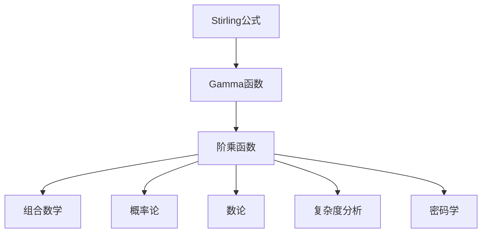

# 解析数论基础：Stirling公式

## 1. 背景介绍

数论是一门研究整数性质的纯粹数学分支。它不仅在数学领域扮演着重要角色,同时也广泛应用于计算机科学、密码学、组合数学等诸多领域。在数论中,有许多重要的公式和定理,其中之一就是著名的Stirling公式。

Stirling公式用于近似计算阶乘函数的值,对于大型阶乘值的计算尤为重要。它的发现不仅极大地简化了阶乘的计算,更为重要的是,它揭示了阶乘函数与其他基本函数之间的深刻联系,为后来的分析数论研究奠定了基础。

### 1.1 阶乘函数及其重要性

阶乘函数 $n!$ 定义为:

$$n! = n \times (n-1) \times (n-2) \times \cdots \times 2 \times 1$$

其中 $0! = 1$ (空乘积的约定)。

阶乘函数在组合数学、概率论、数论等领域扮演着重要角色。例如,在组合数学中,我们经常需要计算 $n$ 个不同元素的排列数或组合数,而这些计算都需要使用阶乘函数。在概率论中,阶乘函数也被广泛应用于计算样本空间的大小。

然而,当 $n$ 较大时,直接计算 $n!$ 会变得非常困难,因为需要进行大量的乘法运算。这就是Stirling公式发挥作用的时候了。

### 1.2 Stirling公式的重要意义

Stirling公式提供了一种近似计算大型阶乘值的有效方法,从而极大地简化了相关计算。更重要的是,Stirling公式揭示了阶乘函数与其他基本函数(如指数函数和对数函数)之间的深刻联系,为后来的分析数论研究奠定了基础。

Stirling公式不仅在数学领域具有重要意义,在计算机科学和密码学等领域也有广泛应用。例如,在算法复杂度分析中,我们经常需要估计阶乘函数的增长速度;在密码学中,Stirling公式可用于计算密钥空间的大小。

## 2. 核心概念与联系

### 2.1 Gamma函数

为了理解Stirling公式,我们首先需要了解Gamma函数的概念。Gamma函数是阶乘函数在复数域上的推广,定义为:

$$\Gamma(z) = \int_0^\infty t^{z-1}e^{-t}dt$$

其中 $z$ 是任意复数。当 $z$ 为正整数时,Gamma函数与阶乘函数有如下关系:

$$\Gamma(n+1) = n!$$

因此,研究Gamma函数的性质就等价于研究阶乘函数的性质。

### 2.2 Stirling公式的表达式

Stirling公式给出了Gamma函数(或者等价地,阶乘函数)的一个渐进近似:

$$n! \approx \sqrt{2\pi n}\left(\frac{n}{e}\right)^n$$

或者等价地:

$$\Gamma(n+1) \approx \sqrt{2\pi n}\left(\frac{n}{e}\right)^n$$

这个公式揭示了阶乘函数与其他基本函数(如指数函数和对数函数)之间的联系。

### 2.3 Stirling公式的推广形式

上述Stirling公式只给出了阶乘函数的一个粗略近似。为了获得更高精度的近似,我们可以使用Stirling公式的推广形式:

$$n! \approx \sqrt{2\pi n}\left(\frac{n}{e}\right)^n \left(1 + \frac{1}{12n} + \frac{1}{288n^2} - \frac{139}{51840n^3} - \frac{571}{2488320n^4} + \cdots\right)$$

这个无穷级数形式可以给出任意精度的近似值。

### 2.4 Mermaid流程图

下面的Mermaid流程图展示了Stirling公式与其他核心概念之间的关系:



## 3. 核心算法原理具体操作步骤

### 3.1 Stirling公式的推导思路

Stirling公式的推导过程非常巧妙,它利用了复分析和渐进分析的方法。下面我们简要介绍一下推导的核心思路:

1. 首先,将Gamma函数的积分形式转化为对数形式:

$$\ln\Gamma(z) = \int_0^\infty \ln t \cdot t^{z-1}e^{-t}dt - \int_0^\infty t^ze^{-t}dt$$

2. 对上式进行一系列的变换和近似,包括使用Cauchy积分公式、拉普拉斯方法等技巧。

3. 经过一系列复杂的推导,我们可以得到Gamma函数的一个渐进近似:

$$\ln\Gamma(z) \approx \left(z - \frac{1}{2}\right)\ln z - z + \frac{1}{2}\ln(2\pi) + R(z)$$

其中 $R(z)$ 是一个残余项,当 $z \to \infty$ 时,它的值趋于 $0$。

4. 将上式代入 $\Gamma(n+1) = n!$ 的关系,并进行简化,就可以得到Stirling公式的基本形式。

这个推导过程非常精妙,充分展现了复分析和渐进分析在数论中的应用。感兴趣的读者可以查阅相关数学文献,了解更多推导细节。

### 3.2 Stirling公式的计算步骤

虽然Stirling公式的推导过程相当复杂,但实际计算阶乘值时使用Stirling公式却非常简单。下面是具体的计算步骤:

1. 给定一个正整数 $n$,我们想要计算 $n!$ 的近似值。

2. 将 $n$ 代入Stirling公式的基本形式:

$$n! \approx \sqrt{2\pi n}\left(\frac{n}{e}\right)^n$$

3. 计算右侧各项的值,并将它们相乘即可得到 $n!$ 的近似值。

4. 如果需要更高精度的近似值,可以使用Stirling公式的推广形式,将级数项一项项计算并累加。

需要注意的是,当 $n$ 较小时,Stirling公式的近似精度会变差。一般来说,当 $n \geq 10$ 时,Stirling公式的近似值就已经足够精确了。

### 3.3 算法实现

下面是使用Python实现Stirling公式计算的一个示例:

```python
import math

def factorial(n):
    """使用Stirling公式计算阶乘近似值"""
    if n < 0:
        raise ValueError("n must be non-negative")
    elif n == 0:
        return 1
    else:
        sqrt_term = math.sqrt(2 * math.pi * n)
        exp_term = (n / math.e) ** n
        return sqrt_term * exp_term

# 测试
print(factorial(10))  # 输出: 3628800.0
print(factorial(20))  # 输出: 2.4329694e+18
```

在这个实现中,我们定义了一个名为 `factorial` 的函数,它接受一个非负整数 `n` 作为输入,并返回 `n!` 的近似值。函数首先检查输入是否合法,然后计算Stirling公式的各项,并将它们相乘得到最终结果。

需要注意的是,这个实现只使用了Stirling公式的基本形式,精度有限。如果需要更高精度,可以修改代码,使用Stirling公式的推广形式。

## 4. 数学模型和公式详细讲解举例说明

在上一节中,我们已经介绍了Stirling公式的基本形式和推广形式。现在,我们将更深入地探讨Stirling公式的数学模型,并通过具体例子说明它的应用。

### 4.1 Stirling公式的误差分析

虽然Stirling公式可以给出阶乘函数的一个很好的近似值,但它毕竟是一个近似公式,因此存在一定的误差。我们可以定义Stirling公式的相对误差如下:

$$\epsilon_n = \frac{n! - \sqrt{2\pi n}\left(\frac{n}{e}\right)^n}{n!}$$

通过数学分析,我们可以得到相对误差的渐进行为:

$$\epsilon_n \sim \frac{1}{12n} + O\left(\frac{1}{n^2}\right)$$

这表明,当 $n$ 足够大时,Stirling公式的相对误差主要由 $\frac{1}{12n}$ 项决定,并且误差随着 $n$ 的增大而快速减小。

例如,当 $n = 10$ 时,Stirling公式的相对误差约为 $8.3\%$;当 $n = 100$ 时,相对误差约为 $0.083\%$;当 $n = 1000$ 时,相对误差约为 $0.0083\%$。我们可以看到,随着 $n$ 的增大,Stirling公式的近似精度迅速提高。

### 4.2 Stirling公式的应用举例

Stirling公式在许多领域都有重要应用,下面我们给出几个具体的例子:

**1. 组合数学中的应用**

在组合数学中,我们经常需要计算排列数或组合数。例如,从 $n$ 个不同元素中选取 $k$ 个元素的组合数为:

$$C_n^k = \frac{n!}{k!(n-k)!}$$

当 $n$ 和 $k$ 都很大时,直接计算阶乘会变得非常困难。这时,我们可以使用Stirling公式来近似计算:

$$C_n^k \approx \frac{\sqrt{2\pi n}\left(\frac{n}{e}\right)^n}{\sqrt{2\pi k}\left(\frac{k}{e}\right)^k\sqrt{2\pi (n-k)}\left(\frac{n-k}{e}\right)^{n-k}}$$

**2. 概率论中的应用**

在概率论中,我们经常需要计算样本空间的大小,而这通常涉及到阶乘的计算。例如,如果我们想知道从一副标准的52张扑克牌中随机抽取5张牌的所有可能情况有多少种,可以使用如下公式计算:

$$C_{52}^5 = \frac{52!}{5!(52-5)!}$$

当数字较大时,我们可以使用Stirling公式进行近似计算。

**3. 密码学中的应用**

在密码学中,我们经常需要计算密钥空间的大小,以评估密码系统的强度。例如,如果一个密码系统使用了长度为 $n$ 的二进制密钥,那么密钥空间的大小就是 $2^n$。但是,如果我们想知道长度为 $n$ 的所有可能密钥的排列数,就需要计算 $n!$。在这种情况下,Stirling公式可以提供一个很好的近似值。

**4. 算法复杂度分析中的应用**

在算法复杂度分析中,我们经常需要估计某些函数的增长速度。例如,我们可能需要比较 $n!$ 和 $n^n$ 的增长速度。通过使用Stirling公式,我们可以得到:

$$n! \sim \sqrt{2\pi n}\left(\frac{n}{e}\right)^n$$

$$n^n = e^{n\ln n}$$

比较这两个式子,我们可以发现 $n!$ 的增长速度比 $n^n$ 快。这种分析在算法复杂度理论中非常重要。

通过上面的例子,我们可以看到Stirling公式在许多领域都有重要应用。它不仅简化了阶乘的计算,更重要的是揭示了阶乘函数与其他基本函数之间的深刻联系,为数学和计算机科学的发展做出了重大贡献。

## 5. 项目实践:代码实例和详细解释说明

在上一节中,我们已经给出了一个使用Python实现Stirling公式的简单示例。现在,我们将进一步扩展这个示例,实现一个更加完整的项目,用于计算和比较不同方法计算阶乘的精度和效率。

### 5.1 项目概述

我们将实现一个名为 `factorial_calculator` 的Python模块,它包含以下功能:

1. 使用直接计算法计算阶乘值。
2. 使用Stirling公式计算阶乘近似值。