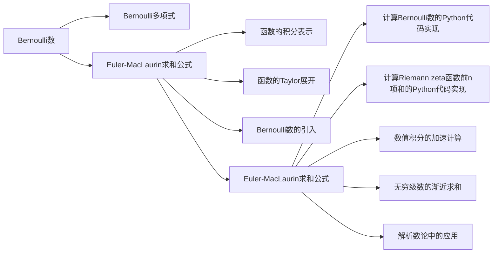

# 解析数论基础：函数方程（一）（Euler-MacLaurin求和法）

## 1. 背景介绍
### 1.1 解析数论概述
#### 1.1.1 解析数论的定义
#### 1.1.2 解析数论的发展历史
#### 1.1.3 解析数论的主要内容和分支

### 1.2 函数方程概述  
#### 1.2.1 函数方程的定义
#### 1.2.2 函数方程在解析数论中的重要性
#### 1.2.3 函数方程的应用领域

### 1.3 Euler-MacLaurin求和法概述
#### 1.3.1 Euler-MacLaurin求和法的历史渊源
#### 1.3.2 Euler-MacLaurin求和法的意义
#### 1.3.3 Euler-MacLaurin求和法与函数方程的关系

## 2. 核心概念与联系
### 2.1 Bernoulli数与Bernoulli多项式
#### 2.1.1 Bernoulli数的定义与性质
#### 2.1.2 Bernoulli多项式的定义与性质 
#### 2.1.3 Bernoulli数与Bernoulli多项式的关系

### 2.2 Euler-MacLaurin求和公式
#### 2.2.1 Euler-MacLaurin求和公式的表达形式
#### 2.2.2 Euler-MacLaurin求和公式的推导过程
#### 2.2.3 Euler-MacLaurin求和公式的收敛性分析

### 2.3 Riemann zeta函数
#### 2.3.1 Riemann zeta函数的定义
#### 2.3.2 Riemann zeta函数的解析延拓
#### 2.3.3 Riemann zeta函数与Bernoulli数的关系

## 3. 核心算法原理具体操作步骤
### 3.1 Euler-MacLaurin求和法的具体步骤
#### 3.1.1 将求和转化为定积分
#### 3.1.2 使用Taylor展开并截断
#### 3.1.3 引入Bernoulli数表示余项
#### 3.1.4 对Bernoulli数进行估计
#### 3.1.5 给出Euler-MacLaurin求和公式 

### 3.2 Euler-MacLaurin求和法的计算实例
#### 3.2.1 计算自然数前n项和
#### 3.2.2 计算调和级数部分和
#### 3.2.3 计算Riemann zeta函数特殊值

### 3.3 Euler-MacLaurin求和法的误差分析
#### 3.3.1 截断误差的来源
#### 3.3.2 余项的渐近估计
#### 3.3.3 Euler-MacLaurin求和法的精度

## 4. 数学模型和公式详细讲解举例说明
### 4.1 Bernoulli数的生成函数与递推公式
#### 4.1.1 指数型生成函数 
$$\frac{z}{e^z-1}=\sum_{n=0}^\infty B_n\frac{z^n}{n!}$$
#### 4.1.2 Bernoulli数的递推公式
$$B_0=1,\quad \sum_{k=0}^{n}\binom{n+1}{k}B_k=0 \quad(n\ge 1)$$
#### 4.1.3 前几个Bernoulli数的计算

### 4.2 Bernoulli多项式的显式表达式
#### 4.2.1 Bernoulli多项式的定义
$$B_n(x)=\sum_{k=0}^n\binom{n}{k}B_kx^{n-k}$$
#### 4.2.2 Bernoulli多项式的性质
$$B_n(x+1)-B_n(x)=nx^{n-1}$$
#### 4.2.3 Bernoulli多项式与Bernoulli数的关系
$$B_n(0)=B_n$$

### 4.3 Euler-MacLaurin求和公式的推导
#### 4.3.1 函数的积分表示
$$\int_a^b f(x)dx=F(b)-F(a)$$
#### 4.3.2 函数的Taylor展开
$$F(x)=\sum_{k=0}^{n-1}\frac{f^{(k)}(a)}{k!}(x-a)^k+\int_a^x\frac{f^{(n)}(t)}{n!}(x-t)^ndt$$
#### 4.3.3 Bernoulli数的引入
$$\int_0^1 B_n(x)dx=0 \quad(n\ge 1)$$
#### 4.3.4 Euler-MacLaurin求和公式
$$\sum_{k=a}^{b-1}f(k)=\int_a^b f(x)dx+\frac{f(a)+f(b)}{2}+\sum_{k=1}^{m-1}\frac{B_{2k}}{(2k)!}(f^{(2k-1)}(b)-f^{(2k-1)}(a))-R_m$$

## 5. 项目实践：代码实例和详细解释说明
### 5.1 计算Bernoulli数的Python代码实现
```python
def bernoulli_number(n):
    if n == 0:
        return 1
    A = [0] * (n+1)
    for m in range(n+1):
        A[m] = 1/(m+1)
        for j in range(m, 0, -1):
            A[j-1] = j*(A[j-1] - A[j])
    return A[0] 
```

### 5.2 计算Riemann zeta函数前n项和的Python代码实现
```python
from math import factorial

def zeta_partial_sum(s, n):
    result = 0
    for k in range(1, n+1):
        result += 1/k**s
    return result

def zeta_euler_maclaurin(s, n):
    result = zeta_partial_sum(s, n)
    for k in range(1, 5):
        result += bernoulli_number(2*k)/factorial(2*k) * n**(1-s-2*k) / (1-s-2*k)
    return result
```

### 5.3 代码实例的详细解释说明
- bernoulli_number函数使用了Bernoulli数的递推公式，通过动态规划的思想自底向上计算Bernoulli数。
- zeta_partial_sum函数计算Riemann zeta函数前n项的单纯和。
- zeta_euler_maclaurin函数在单纯和的基础上，使用Euler-MacLaurin公式计算Bernoulli数修正项，从而得到更精确的近似值。

## 6. 实际应用场景
### 6.1 数值积分的加速计算
#### 6.1.1 梯形法则与Euler-MacLaurin公式
#### 6.1.2 Simpson法则与Euler-MacLaurin公式
#### 6.1.3 Romberg积分法中的应用

### 6.2 无穷级数的渐近求和
#### 6.2.1 调和级数的渐近求和
#### 6.2.2 Dirichlet级数的渐近求和 
#### 6.2.3 Hurwitz zeta函数的计算

### 6.3 解析数论中的应用
#### 6.3.1 素数计数函数的渐近公式
#### 6.3.2 Dirichlet L-函数的特殊值计算
#### 6.3.3 Dedekind和的计算

## 7. 工具和资源推荐
### 7.1 数学软件工具
#### 7.1.1 Mathematica的使用
#### 7.1.2 MATLAB的使用
#### 7.1.3 SageMath的使用

### 7.2 在线计算平台
#### 7.2.1 Wolfram Alpha的使用
#### 7.2.2 SymPy Gamma的使用
#### 7.2.3 OEIS（On-Line Encyclopedia of Integer Sequences）的使用

### 7.3 相关书籍推荐
#### 7.3.1 《解析数论导引》 - Apostol 
#### 7.3.2 《初等数论及其应用》 - Niven et al.
#### 7.3.3 《Bernoulli Numbers》 - Arakawa et al.

## 8. 总结：未来发展趋势与挑战
### 8.1 Euler-MacLaurin公式的推广
#### 8.1.1 多重Euler-MacLaurin求和公式
#### 8.1.2 q-类似的Euler-MacLaurin求和公式
#### 8.1.3 Euler-MacLaurin公式与Fourier分析的结合

### 8.2 计算机辅助证明的发展
#### 8.2.1 Bernoulli数恒等式的机器证明
#### 8.2.2 Riemann假设的数值验证
#### 8.2.3 Euler-MacLaurin公式在计算机辅助证明中的应用前景

### 8.3 解析数论的新方向
#### 8.3.1 多重zeta值的研究
#### 8.3.2 模形式与解析数论的交叉
#### 8.3.3 非交换解析数论的发展

## 9. 附录：常见问题与解答
### 9.1 Bernoulli数的定义为何如此奇特？
### 9.2 Euler-MacLaurin公式是如何被发现的？
### 9.3 Riemann zeta函数的解析延拓是如何实现的？
### 9.4 Euler-MacLaurin公式在计算机科学中还有哪些应用？
### 9.5 解析数论还有哪些有趣的未解问题？

作者：禅与计算机程序设计艺术 / Zen and the Art of Computer Programming

