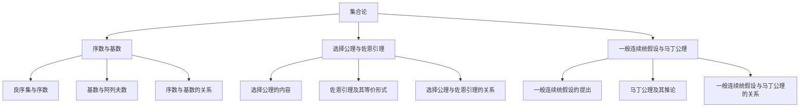

# 集合论导引：奇异基数假设分析

## 1.背景介绍
### 1.1 集合论的起源与发展
#### 1.1.1 康托尔的贡献
#### 1.1.2 罗素悖论的发现
#### 1.1.3 现代公理化集合论的建立
### 1.2 基数概念的提出
#### 1.2.1 有限集与无限集
#### 1.2.2 可数集与不可数集
#### 1.2.3 基数的定义与比较
### 1.3 连续统假设的意义
#### 1.3.1 实数系的基数
#### 1.3.2 连续统假设的提出
#### 1.3.3 连续统假设的独立性

## 2.核心概念与联系
### 2.1 序数与基数
#### 2.1.1 良序集与序数
#### 2.1.2 基数与阿列夫数
#### 2.1.3 序数与基数的关系
### 2.2 选择公理与佐恩引理
#### 2.2.1 选择公理的内容
#### 2.2.2 佐恩引理及其等价形式
#### 2.2.3 选择公理与佐恩引理的关系
### 2.3 一般连续统假设与马丁公理
#### 2.3.1 一般连续统假设的提出
#### 2.3.2 马丁公理及其推论
#### 2.3.3 一般连续统假设与马丁公理的关系

## 3.核心算法原理具体操作步骤
### 3.1 基数算术
#### 3.1.1 基数的加法与乘法
#### 3.1.2 基数的幂运算
#### 3.1.3 基数算术的性质
### 3.2 集合的构造方法
#### 3.2.1 幂集的构造
#### 3.2.2 替换公理与正则基数
#### 3.2.3 子模型与构造法
### 3.3 强制法与一致性结果
#### 3.3.1 强制法的基本思想
#### 3.3.2 Cohen强制法与连续统假设的独立性
#### 3.3.3 其他强制法及其应用

## 4.数学模型和公式详细讲解举例说明
### 4.1 序数的超限归纳法
#### 4.1.1 超限归纳法的原理
#### 4.1.2 序数归纳法的应用举例
#### 4.1.3 序数的递归定义及其性质
### 4.2 基数不等式与 König 引理
#### 4.2.1 Cantor不等式
#### 4.2.2 König无穷引理
#### 4.2.3 基数不等式的应用
### 4.3 树与 Aronszajn树
#### 4.3.1 树的定义与性质
#### 4.3.2 特殊树的构造
#### 4.3.3 Aronszajn树与Suslin连续统假设

## 5.项目实践：代码实例和详细解释说明
### 5.1 集合的表示与运算
#### 5.1.1 集合的数据结构设计
#### 5.1.2 集合运算的算法实现
#### 5.1.3 集合的应用实例
### 5.2 序数与基数的程序实现  
#### 5.2.1 序数的表示方法
#### 5.2.2 基数运算的程序实现
#### 5.2.3 超限归纳法的程序实现
### 5.3 公理系统的验证与探索
#### 5.3.1 公理系统的形式化
#### 5.3.2 公理的独立性验证
#### 5.3.3 探索新的公理与定理

## 6.实际应用场景
### 6.1 数学基础理论研究
#### 6.1.1 数学逻辑与证明论
#### 6.1.2 代数与拓扑结构
#### 6.1.3 分析与几何
### 6.2 计算机科学与工程
#### 6.2.1 算法设计与分析
#### 6.2.2 数据库理论与系统
#### 6.2.3 形式化方法与验证
### 6.3 其他学科的交叉应用
#### 6.3.1 物理学中的应用
#### 6.3.2 经济学与决策理论
#### 6.3.3 生物信息学与系统生物学

## 7.工具和资源推荐
### 7.1 数学工具软件
#### 7.1.1 数学软件Mathematica
#### 7.1.2 交互式定理证明助手Coq
#### 7.1.3 符号计算系统Maple
### 7.2 在线学习资源
#### 7.2.1 在线课程平台
#### 7.2.2 学术论文数据库
#### 7.2.3 数学百科全书与手册
### 7.3 经典著作与论文
#### 7.3.1 集合论经典教材
#### 7.3.2 奇异基数假设研究论文
#### 7.3.3 强制法专著

## 8.总结：未来发展趋势与挑战
### 8.1 奇异基数假设的地位
#### 8.1.1 作为公理的独立性
#### 8.1.2 与其他数学分支的联系
#### 8.1.3 对数学哲学的影响
### 8.2 集合论研究的前沿问题 
#### 8.2.1 大基数公理与 Woodin 基数
#### 8.2.2 Forcing公理与内模型理论
#### 8.2.3 决定性问题与证明论
### 8.3 跨学科交叉与应用拓展
#### 8.3.1 逻辑与计算复杂性
#### 8.3.2 范畴论与代数拓扑
#### 8.3.3 量子计算与量子逻辑

## 9.附录：常见问题与解答
### 9.1 什么是 ZFC 公理系统？
### 9.2 连续统假设有哪些等价表述？
### 9.3 如何理解选择公理的作用？
### 9.4 Forcing方法的基本原理是什么？
### 9.5 大基数公理研究有哪些进展？
### 9.6 集合论悖论是如何解决的？
### 9.7 如何用程序语言表示超限序数？
### 9.8 集合论在人工智能领域有哪些应用？
### 9.9 学习集合论与奇异基数的入门建议？
### 9.10 探索奇异基数假设有何意义？

作者：禅与计算机程序设计艺术 / Zen and the Art of Computer Programming

集合论是现代数学的基础，其核心内容包括序数与基数、选择公理与佐恩引理、一般连续统假设与马丁公理等。本文将从这些核心概念出发，系统阐述集合论的理论框架，重点分析奇异基数假设的内容、证明及意义。

集合论的发展始于19世纪末20世纪初，德国数学家康托尔开创了集合论研究，提出了基数和序数的概念，证明了实数集的不可数性和连续统假设。然而，罗素悖论的发现暴露了朴素集合论的逻辑缺陷，促使现代公理化集合论的建立。

ZFC公理系统是目前最为广泛接受的集合论公理系统，其中的选择公理和佐恩引理在集合构造和证明中发挥了重要作用。选择公理断言任意集族均存在一个选择函数，保证了非空集一定含有元素、笛卡尔积非空等性质。佐恩引理则刻画了集合的极大性，在分析、拓扑等领域有重要应用。

连续统假设断言实数集的基数为最小不可数基数，即 $2^{\aleph_0}=\aleph_1$。然而，哥德尔和科恩的工作证明了连续统假设在ZFC中既不可证也不可驳，因此可以作为一个独立的公理加入ZFC而不引入矛盾。一般连续统假设和马丁公理则进一步拓展和加强了连续统假设，在泛函分析、拓扑学等领域有重要应用。

基数算术刻画了无穷基数的运算法则，展现了无穷的奇特性质。通过基数算术，我们可以构造出不同大小的无穷集，探索它们之间的关系。集合的构造方法，如幂集运算、替换公理、子模型等，则为构造具有特定性质的集合提供了工具。

强制法是Cohen提出的一种基于偏序集和泛滤子的集合构造方法，通过扩充已有模型构造新的模型。Cohen利用强制法证明了连续统假设的独立性，开创了现代集合论的新纪元。此后，各种不同的强制法被发展出来，极大拓展了集合论的研究范围。

在数学建模和定理证明中，序数的超限归纳法是一个重要工具。它允许我们沿着良序集的顺序，逐步构造和验证性质，即使这个过程需要经过无限多个步骤。König引理刻画了无穷基数之间的关系，在图论、拓扑学等领域有重要应用。

集合论为数学奠定了坚实的逻辑基础，其思想和方法也深刻影响了哲学、计算机科学等领域。在数学逻辑与证明论中，集合论提供了研究对象和工具；在代数与拓扑结构的研究中，集合论描述了结构的本质特征；在算法设计与分析中，集合论为复杂性理论提供了模型。

未来，集合论研究将进一步探索奇异基数假设的地位和影响，如大基数公理、Woodin基数、Forcing公理等前沿问题。同时，集合论与其他数学分支如范畴论、代数拓扑的联系也将不断加深。在交叉学科领域，集合论的思想和方法必将焕发出更加耀眼的光芒，如在逻辑与计算复杂性、量子计算与量子逻辑等方面的应用。

总之，集合论作为现代数学的根基，其重要性不言而喻。而奇异基数假设作为集合论皇冠上的明珠，更是展现了数学的无穷魅力。通过对集合论的学习和研究，我们不仅能够理解数学的本质，更能领略数学大厦的宏伟壮丽。让我们在集合的海洋中继续探索，发现数学的奥秘！