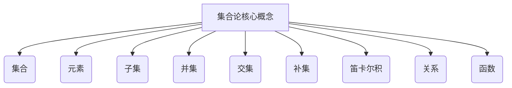
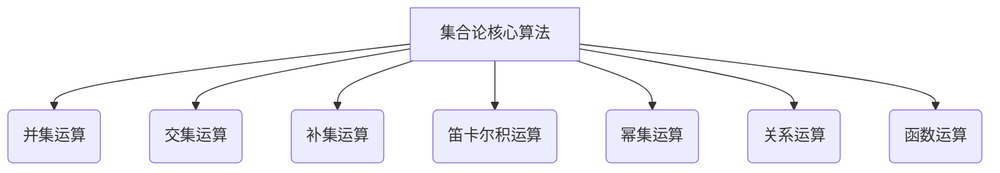
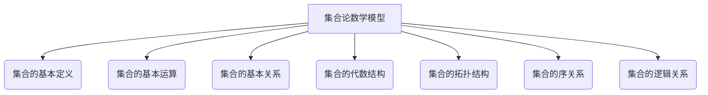

# 集合论导引：恰当力迫构思

## 1.背景介绍

集合论是数学的一个基础分支,它研究集合及其之间的关系和运算。集合论为数学奠定了一个坚实的基础,并被广泛应用于计算机科学、逻辑学、语言学等诸多领域。

集合论的概念虽然简单,但其内涵丰富,思维方式独特。它以一种抽象和形式化的方式来描述和操作对象,这种思维方式对于培养逻辑推理能力、建立严谨的数学基础以及解决复杂问题都有重要意义。

### 1.1 集合论的重要性

集合论在数学和计算机科学中扮演着基础性的角色:

- 为数学奠定坚实的基础,成为现代数学的语言
- 计算机科学中的许多概念和理论都源于集合论
- 培养抽象思维能力,有助于解决复杂问题
- 在人工智能、数据库系统等领域有广泛应用

### 1.2 集合论的发展历程

集合论的概念可以追溯到古希腊时期,但直到19世纪末期,由于遇到了一些理论困难(如康托尔反常),才引发了集合论的系统化发展。

- 1874年,德德金首次提出"集合"的概念
- 1879年,康托尔发表了开创性的集合论著作
- 20世纪初,泰勒、弗雷格等人建立了公理化集合论
- 1908年,罗素提出了著名的"罗素paradox"
- 1922年,齐尔梅洛发表了著名的公理化集合论体系

如今,集合论已成为数学和计算机科学等领域的基石。

## 2.核心概念与联系

集合论的核心概念包括集合、元素、子集、并集、交集、补集等,这些概念相互关联,构成了集合论的理论框架。

### 2.1 集合

集合是集合论的基本概念,可以形式化地定义为:

$$
A = \\{x|x满足某种性质P\\}
$$

集合用大括号表示,其中包含了满足某种性质P的所有元素。

例如,自然数集合可以表示为:

$$
\mathbb{N} = \\{1,2,3,\ldots\\}
$$

### 2.2 元素与子集

如果x属于集合A,我们记作 $x \in A$,并称x为A的元素。

如果集合B中的每个元素都属于集合A,我们记作 $B \subseteq A$,并称B是A的子集。

### 2.3 并集与交集

两个集合A和B的并集是包含这两个集合所有元素的集合,记作 $A \cup B$。

两个集合A和B的交集是同时属于这两个集合的元素所组成的集合,记作 $A \cap B$。

### 2.4 补集

集合A相对于B的补集是指属于B但不属于A的元素所组成的集合,记作 $\overline{A}$或 $B \setminus A$。

### 2.5 笛卡尔积

两个集合A和B的笛卡尔积是这两个集合中元素的所有有序对所组成的集合,记作 $A \times B$。

### 2.6 关系与函数

关系是两个集合之间的子集,函数则是一种特殊的关系,它将一个集合中的每个元素唯一映射到另一个集合中的一个元素。

这些概念相互关联、相辅相成,构成了集合论的理论框架。掌握这些核心概念是学习和应用集合论的基础。

## 3.核心算法原理具体操作步骤

集合论中有一些常用的算法和操作,这些算法体现了集合论的核心思想,并在实际应用中发挥着重要作用。

### 3.1 并集运算

并集运算是求两个或多个集合的并集,即包含这些集合所有元素的集合。

算法步骤:

1. 初始化一个空集合C
2. 遍历第一个集合A的所有元素,将它们加入C
3. 遍历第二个集合B的所有元素,如果该元素不在C中,则加入C
4. 重复步骤3,直到遍历完所有集合
5. 返回C作为并集结果

时间复杂度为O(n),其中n是所有集合元素的总数。

### 3.2 交集运算  

交集运算是求两个或多个集合的交集,即同时属于这些集合的元素所组成的集合。

算法步骤:

1. 初始化一个空集合C
2. 遍历第一个集合A的所有元素
3. 对于A中的每个元素x,检查它是否也属于其他所有集合
4. 如果x属于其他所有集合,则将x加入C
5. 重复步骤3和4,直到遍历完A中所有元素
6. 返回C作为交集结果  

时间复杂度为O(n*m),其中n是最小集合的元素个数,m是集合个数。

### 3.3 补集运算

补集运算是求一个集合相对于另一个集合的补集,即属于后者但不属于前者的元素所组成的集合。

算法步骤:

1. 初始化一个空集合C 
2. 遍历集合B的所有元素x
3. 如果x不属于集合A,则将x加入C
4. 重复步骤3,直到遍历完B中所有元素
5. 返回C作为A相对于B的补集结果

时间复杂度为O(n),其中n是集合B的元素个数。

### 3.4 笛卡尔积运算

笛卡尔积运算是求两个集合的笛卡尔积,即这两个集合中元素的所有有序对所组成的集合。  

算法步骤:

1. 初始化一个空集合C
2. 遍历集合A的每个元素x
3. 遍历集合B的每个元素y  
4. 将有序对(x,y)加入C
5. 重复步骤3和4,直到遍历完A和B中所有元素
6. 返回C作为笛卡尔积结果

时间复杂度为O(n*m),其中n和m分别是两个集合的元素个数。

### 3.5 幂集运算

幂集运算是求一个集合的幂集,即该集合的所有子集所组成的集合。

算法步骤:

1. 初始化一个空集合C,并将空集加入C
2. 遍历原集合A的每个元素x
3. 生成一个子集B,其中只包含元素x
4. 将B加入C
5. 遍历C中的每个子集S
6. 将S并上x后的集合加入C  
7. 重复步骤5和6,直到遍历完C中所有子集
8. 返回C作为A的幂集结果

时间复杂度为O(n*2^n),其中n是原集合的元素个数。

### 3.6 关系运算

关系运算包括求两个关系的并、交、补、合成等运算。

算法步骤根据具体运算的定义而有所不同,这里不再赘述。

### 3.7 函数运算  

函数运算包括函数的合成、逆函数等运算。

算法步骤也根据具体运算的定义而有所不同。

以上算法体现了集合论中一些基本的操作思想,掌握这些算法有助于理解和应用集合论。

## 4.数学模型和公式详细讲解举例说明

集合论中有许多重要的数学模型和公式,这些模型和公式描述了集合之间的关系和运算规律,是集合论理论框架的重要组成部分。

### 4.1 集合的基本定义

集合的基本定义是集合论的出发点,包括集合的形式化定义、元素的定义、子集的定义等。

$$
A = \\{x|x满足某种性质P\\}\\\\
x \in A\\\\  
B \subseteq A
$$

这些定义为集合论奠定了基础。

### 4.2 集合的基本运算

集合的基本运算包括并集、交集、补集、笛卡尔积等,这些运算描述了集合之间的基本关系。

$$
A \cup B = \\{x|x \in A 或 x \in B\\}\\\\
A \cap B = \\{x|x \in A 且 x \in B\\}\\\\
\overline{A} = \\{x|x \notin A\\}\\\\
A \times B = \\{(x,y)|x \in A, y \in B\\}
$$

掌握这些基本运算是进一步学习集合论的基础。

### 4.3 集合的基本关系

集合的基本关系描述了两个集合之间可能存在的包含、相等、不相交等关系。

$$
A \subseteq B \iff \forall x(x \in A \Rightarrow x \in B)\\\\
A = B \iff A \subseteq B 且 B \subseteq A\\\\
A \cap B = \emptyset \Rightarrow A和B是不相交的
$$

理解这些基本关系有助于把握集合之间的联系。

### 4.4 集合的代数结构

集合的代数结构赋予集合一些代数运算,使集合构成一个代数系统。

例如,对于任意集合A,并集和交集在A上定义了一个代数结构,称为布尔代数。

$$
(A, \cup, \cap, \emptyset, \overline{()}, U)
$$

其中U是一个确定的universal集合。

布尔代数满足一些代数公理,如结合律、交换律、分配律等。

$$
A \cup (B \cup C) = (A \cup B) \cup C\\\\
A \cup B = B \cup A\\\\
A \cup (B \cap C) = (A \cup B) \cap (A \cup C)
$$

代数结构为集合论提供了一种代数化的视角和方法。

### 4.5 集合的拓扑结构

集合的拓扑结构赋予集合一些拓扑学性质,使集合成为一个拓扑空间。

例如,对于任意集合X,若T是X的子集的一个集合,且满足:

1) 空集和X属于T
2) T中任意并集仍属于T 
3) T中任意有限交集仍属于T

则称(X,T)为一个拓扑空间,T称为X上的一个拓扑。

拓扑结构为研究集合的连续性、收敛性等性质提供了数学工具。

### 4.6 集合的序关系

集合的序关系赋予集合一种"大小"关系,使集合成为一个偏序集。

例如,对于集合A的幂集P(A),包含关系 $\subseteq$ 定义了一个偏序关系。

$$
\forall B,C \in P(A), B \preceq C \iff B \subseteq C
$$

偏序集满足反身性、反对称性和传递性公理。

序关系为研究集合之间的层次结构提供了理论基础。

### 4.7 集合的逻辑关系

集合的逻辑关系将集合论与逻辑学联系起来,为集合论提供了逻辑解释和应用。

例如,可以将集合A看作是一个命题,元素x属于A可以解释为命题A(x)为真。

$$
x \in A \iff A(x)为真\\\\
x \notin A \iff A(x)为假
$$

利用这种解释,我们可以将集合运算与逻辑运算联系起来:

$$
A \cup B \equiv A \vee B\\\\
A \cap B \equiv A \wedge B\\\\
\overline{A} \equiv \neg A
$$

逻辑关系为集合论提供了与逻辑学的联系,拓展了集合论的应用领域。

以上是