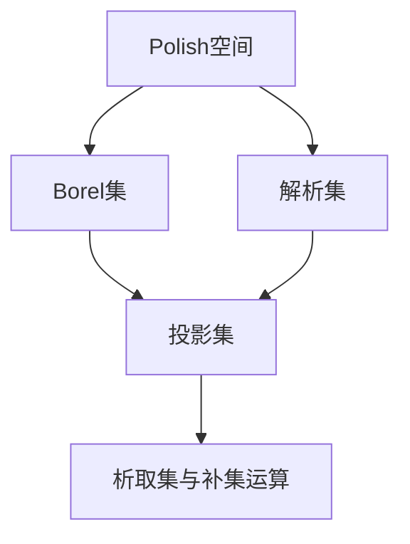

# 集合论导引：投影集层次

## 1. 背景介绍

集合论是现代数学的基础,在数学、计算机科学、哲学等领域都有广泛应用。其中,投影集层次(Projective Set Hierarchy)是集合论中一个重要而有趣的研究方向。本文将深入探讨投影集层次的基本概念、核心原理、实际应用以及未来发展趋势,帮助读者全面了解这一主题。

### 1.1 集合论简史
#### 1.1.1 康托尔的贡献
#### 1.1.2 罗素悖论的影响  
#### 1.1.3 公理化集合论的发展

### 1.2 投影集层次的起源与意义
#### 1.2.1 描述性集合论的兴起
#### 1.2.2 投影集的定义与性质
#### 1.2.3 投影集层次的重要地位

## 2. 核心概念与联系

要理解投影集层次,首先需要掌握一些基本概念。本节将介绍投影集、析取集、补集等核心概念,并阐明它们之间的逻辑联系。

### 2.1 投影集的定义
#### 2.1.1 一维投影集
#### 2.1.2 高维投影集
#### 2.1.3 投影集的等价定义

### 2.2 析取集与补集
#### 2.2.1 可数析取集
#### 2.2.2 补集的性质
#### 2.2.3 析取集与投影集的关系

### 2.3 Borel集与解析集
#### 2.3.1 Borel集的定义
#### 2.3.2 解析集的定义 
#### 2.3.3 Borel集与解析集在投影集层次中的位置

### 2.4 核心概念之间的联系



## 3. 核心算法原理具体操作步骤

为了判定一个集合在投影集层次中的位置,需要用到一些重要的算法和技巧。本节将详细介绍其中几个核心算法的原理和操作步骤。

### 3.1 Suslin操作
#### 3.1.1 Suslin操作的定义
#### 3.1.2 Suslin操作的性质
#### 3.1.3 利用Suslin操作构造集合

### 3.2 Borel码
#### 3.2.1 Borel码的定义
#### 3.2.2 利用Borel码刻画Borel集
#### 3.2.3 Borel码与投影集的关系

### 3.3 Vaught变换
#### 3.3.1 Vaught变换的定义
#### 3.3.2 Vaught变换的性质
#### 3.3.3 利用Vaught变换研究投影集

### 3.4 通用性方法
#### 3.4.1 通用性树的构造
#### 3.4.2 通用性方法的应用
#### 3.4.3 通用性方法的局限性

## 4. 数学模型和公式详细讲解举例说明

投影集层次涉及许多重要的数学模型和公式,本节将通过具体的例子对其进行详细的讲解和说明。

### 4.1 描述性函数的Baire空间模型
#### 4.1.1 Baire空间的定义
#### 4.1.2 连续函数与Baire可测函数
#### 4.1.3 投影集与Baire空间模型

### 4.2 Borel determinacy的公式化表述
#### 4.2.1 Gale-Stewart游戏
#### 4.2.2 决定性的定义
#### 4.2.3 Borel determinacy定理及其证明思路

### 4.3 Suslin集合的解析表达式
#### 4.3.1 Suslin集合的定义
#### 4.3.2 Suslin集合的解析表达式
#### 4.3.3 由解析表达式证明Suslin集合的性质

举例说明:
考虑Baire空间中的集合$A=\{x\in\omega^\omega:\exists n\ x(n)=0\}$,我们可以证明$A$是一个$\mathbf{\Sigma}^0_2$集合。
证明:
$$
\begin{aligned}
A &= \bigcup_{n\in\omega}\{x\in\omega^\omega:x(n)=0\} \\
&= \bigcup_{n\in\omega}\pi^{-1}(\{0\})
\end{aligned}
$$
其中$\pi:\omega^\omega\to\omega$为投影函数,满足$\pi(x)=x(n)$。由于$\{0\}$是一个开集,因此$\pi^{-1}(\{0\})$是Baire空间中的一个开集,从而$A$作为可数个开集的并,是一个$\mathbf{\Sigma}^0_2$集合。

## 5. 项目实践：代码实例和详细解释说明

为了加深读者对投影集层次的理解,本节将给出一些简单的代码实例,并对其进行详细的解释说明。

### 5.1 判断一个集合是否为Borel集

```python
def is_borel(A):
    # 判断A是否为开集或闭集
    if is_open(A) or is_closed(A):
        return True
    
    # 判断A是否为可数个Borel集的并或交
    if is_countable_union_of_borel_sets(A) or is_countable_intersection_of_borel_sets(A):
        return True
        
    # 判断A是否为Borel集的余集
    if is_complement_of_borel_set(A):
        return True
        
    return False
```

解释说明:
根据Borel集的定义,一个集合是Borel集当且仅当它满足以下条件之一:
1. 它是开集或闭集;
2. 它是可数个Borel集的并集或交集;
3. 它是某个Borel集的余集。
因此,上述代码通过递归地判断集合是否满足这些条件,来确定它是否为Borel集。

### 5.2 计算投影集的复杂度

```python
def projective_complexity(A):
    n = 0
    while True:
        if is_sigma_n(A):
            return f"Σ^1_{n}"
        elif is_pi_n(A):
            return f"Π^1_{n}"
        else:
            n += 1
            
def is_sigma_n(A):
    # 判断A是否为Σ^1_n集
    ...
    
def is_pi_n(A):
    # 判断A是否为Π^1_n集
    ...
```

解释说明:
投影集层次将集合划分为不同的复杂度等级,记为$\mathbf{\Sigma}^1_n$和$\mathbf{\Pi}^1_n$。一个集合$A$属于$\mathbf{\Sigma}^1_n$当且仅当它是$n$个投影集的并;而$A$属于$\mathbf{\Pi}^1_n$当且仅当它的补集属于$\mathbf{\Sigma}^1_n$。上述代码通过递归地判断集合是否属于这些复杂度等级,来计算它在投影集层次中的位置。

## 6. 实际应用场景

投影集层次不仅是集合论中一个重要的理论工具,也在实际应用中有广泛的用途。本节将介绍几个典型的应用场景。

### 6.1 计算理论中的应用
#### 6.1.1 可计算性与投影集
#### 6.1.2 相对可计算性与跳跃运算
#### 6.1.3 高阶算法的复杂性分析

### 6.2 描述性动力系统理论中的应用
#### 6.2.1 Polish空间上的连续映射
#### 6.2.2 Borel自同构与轨道等价关系
#### 6.2.3 Vaught变换与Hjorth分类法

### 6.3 无穷组合游戏中的应用
#### 6.3.1 Gale-Stewart定理的推广
#### 6.3.2 决定性原理与投影集层次
#### 6.3.3 游戏的策略与通用性方法

## 7. 工具和资源推荐

为了方便读者进一步学习和研究投影集层次,本节推荐一些常用的工具和学习资源。

### 7.1 数学软件与程序库
- Mathematica的集合论工具包
- Python的sympy库
- Coq定理证明助手

### 7.2 经典教材与专著
- Kechris的《Classical Descriptive Set Theory》
- Moschovakis的《Descriptive Set Theory》
- Jech的《Set Theory》

### 7.3 在线学习资源
- Kechris在Caltech的课程主页
- Vidnyánszky在阿尔伯特·拉斯洛大学的课程主页
- Zapletal在佛罗里达大学的课程主页

## 8. 总结：未来发展趋势与挑战

通过对投影集层次的深入探讨,我们可以看到集合论研究的广度和深度。展望未来,投影集层次还有许多值得关注的发展方向和尚待解决的难题。

### 8.1 新的投影集运算与层次结构
#### 8.1.1 更高阶的投影集运算
#### 8.1.2 精细化的层次结构

### 8.2 投影集层次与其他数学分支的交叉
#### 8.2.1 投影集与几何学
#### 8.2.2 投影集与代数学
#### 8.2.3 投影集与数论

### 8.3 悬而未决的问题与猜想
#### 8.3.1 投影确定性猜想
#### 8.3.2 Borel自同构分类问题
#### 8.3.3 Wadge层次的完备性问题

## 9. 附录：常见问题与解答

### 9.1 投影集层次的起源是什么?
投影集层次源于20世纪早期描述性集合论的发展,最初由Luzin、Suslin等数学家引入,旨在研究Borel集之上更复杂的集合。

### 9.2 投影集与Borel集有何区别?
Borel集可以由开集经过可数次并、交、余运算生成,而投影集则需要在Borel集的基础上引入投影运算。因此,投影集通常比Borel集更复杂。

### 9.3 连续函数在投影集层次中处于什么地位?
连续函数是Borel可测的,因此它们对应的集合都是Borel集。进一步,每个Borel集都可以表示为某个连续函数的原像。因此,连续函数在Borel层次中起着重要的作用。

### 9.4 Suslin集合与投影集有何联系?
Suslin集合是$\mathbf{\Sigma}^1_1$集合的一个重要子类,它们可以表示为可数个闭集的Suslin树。Suslin集合在投影集层次中占据着特殊的地位,与Borel集和解析集都有密切联系。

### 9.5 通用性方法的核心思想是什么?
通用性方法利用描述性集合论中的强大技术,如forcing和通用性树,来构造具有特定性质的集合。它的核心思想是,通过巧妙地设计forcing条件,使得generic集满足给定的性质。

作者：禅与计算机程序设计艺术 / Zen and the Art of Computer Programming