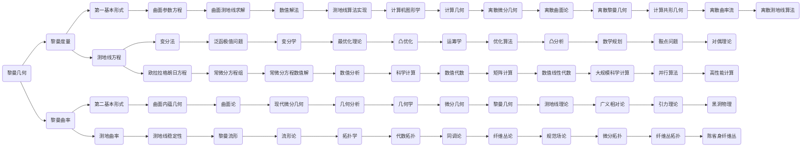

# 黎曼几何引论：测地线的概念

## 1. 背景介绍
### 1.1 黎曼几何的历史渊源
#### 1.1.1 欧几里得几何与非欧几何 
#### 1.1.2 高斯和黎曼的开创性工作
#### 1.1.3 黎曼几何的诞生与发展
### 1.2 黎曼几何的基本概念
#### 1.2.1 黎曼流形与局部坐标系
#### 1.2.2 黎曼度量与黎曼张量  
#### 1.2.3 切丛、联络与曲率张量
### 1.3 黎曼几何的重要性
#### 1.3.1 在数学中的地位与作用
#### 1.3.2 在物理学中的应用
#### 1.3.3 在其他领域的应用前景

## 2. 核心概念与联系
### 2.1 测地线的定义
#### 2.1.1 测地线的直观理解
#### 2.1.2 测地线的数学定义
#### 2.1.3 测地线方程
### 2.2 测地线与最短路径
#### 2.2.1 测地线作为最短路径
#### 2.2.2 测地线的局部最短性质
#### 2.2.3 测地线的整体最短性质
### 2.3 测地线与平行移动
#### 2.3.1 平行移动的概念
#### 2.3.2 沿测地线的平行移动
#### 2.3.3 测地线与联络的关系

## 3. 核心算法原理具体操作步骤
### 3.1 测地线方程的推导
#### 3.1.1 变分法与欧拉-拉格朗日方程
#### 3.1.2 测地线方程的导出过程
#### 3.1.3 测地线方程的物理意义
### 3.2 测地线的数值求解方法  
#### 3.2.1 龙格-库塔法
#### 3.2.2 欧拉法与改进欧拉法
#### 3.2.3 其他常用数值方法
### 3.3 测地线的解析解方法
#### 3.3.1 对称空间中的测地线解
#### 3.3.2 常曲率空间的测地线解
#### 3.3.3 其他特殊情况下的解析解

## 4. 数学模型和公式详细讲解举例说明
### 4.1 黎曼度量与测地线方程
#### 4.1.1 黎曼度量的矩阵表示
#### 4.1.2 克氏符号与测地线方程
#### 4.1.3 测地线方程的不同表现形式 
### 4.2 曲面上的测地线方程
#### 4.2.1 第一基本形式与测地线方程
#### 4.2.2 第二基本形式与测地曲率
#### 4.2.3 曲面内蕴几何的测地线特征
### 4.3 黎曼流形上的测地线方程
#### 4.3.1 黎曼联络与克氏符号
#### 4.3.2 协变导数与测地线方程
#### 4.3.3 测地线的不同表述方式

## 5. 项目实践：代码实例和详细解释说明
### 5.1 二维曲面测地线求解
#### 5.1.1 参数曲面的测地线方程
#### 5.1.2 Python求解测地线的代码实现
#### 5.1.3 测地线可视化及结果分析
### 5.2 三维黎曼流形测地线求解
#### 5.2.1 流形上测地线的数值求解
#### 5.2.2 Matlab求解测地线的代码实现 
#### 5.2.3 测地线的三维可视化呈现
### 5.3 开源测地线求解库的使用
#### 5.3.1 主流开源库介绍与比较
#### 5.3.2 GeographicLib库的安装与测试
#### 5.3.3 GeographicLib求解测地线实例

## 6. 实际应用场景
### 6.1 大地测量中的测地线应用
#### 6.1.1 地球椭球面上的测地线 
#### 6.1.2 大地坐标系与测地线计算
#### 6.1.3 大地测量中的测地线问题
### 6.2 计算机图形学中的测地线应用
#### 6.2.1 三维曲面参数化与测地线
#### 6.2.2 网格曲面上的测地线算法
#### 6.2.3 测地线在形状分析中的应用
### 6.3 机器人路径规划中的测地线应用
#### 6.3.1 机器人运动学与测地线
#### 6.3.2 测地线在路径规划中的作用
#### 6.3.3 基于测地线的路径优化算法

## 7. 工具和资源推荐
### 7.1 主流数学软件工具
#### 7.1.1 Mathematica与黎曼几何计算
#### 7.1.2 MATLAB与测地线数值分析
#### 7.1.3 Maple与测地线符号计算
### 7.2 开源几何库与平台
#### 7.2.1 GeographicLib库
#### 7.2.2 CGAL库
#### 7.2.3 Geometry ToolBox
### 7.3 相关书籍与学习资源
#### 7.3.1 黎曼几何经典教材
#### 7.3.2 测地线理论专著
#### 7.3.3 在线课程与学习社区

## 8. 总结：未来发展趋势与挑战
### 8.1 黎曼几何的前沿发展动向
#### 8.1.1 现代微分几何的新进展
#### 8.1.2 黎曼几何与物理学的交叉
#### 8.1.3 黎曼几何在信息科学中的应用
### 8.2 测地线理论的研究热点
#### 8.2.1 测地线在图像处理中的新方法 
#### 8.2.2 随机黎曼流形上的测地线
#### 8.2.3 测地线在人工智能中的潜力
### 8.3 测地线计算的挑战与机遇
#### 8.3.1 高维流形的测地线求解难题
#### 8.3.2 测地线算法的高效实现 
#### 8.3.3 测地线在工程实践中的应用瓶颈

## 9. 附录：常见问题与解答
### 9.1 什么是测地线？它有何特殊性质？
### 9.2 测地线与直线有何区别和联系？
### 9.3 测地线方程从何而来？如何推导？
### 9.4 如何用代码求解测地线？需要哪些工具？
### 9.5 测地线在实际应用中会遇到哪些问题？
### 9.6 怎样系统学习黎曼几何与测地线理论？

以上是一篇关于黎曼几何中测地线概念的技术博客大纲。全文从背景介绍出发，系统阐述了测地线的核心概念、数学模型、算法原理、代码实现、应用场景等方面，并总结了测地线理论的发展趋势与挑战。在附录中，针对一些常见问题进行了解答。

文中使用了Mermaid流程图来直观展示测地线理论所涉及的数学概念之间的逻辑联系，形成一张庞大而有层次的知识脉络网络。这些概念从基础的黎曼几何出发，通过黎曼度量、黎曼曲率引出测地线的定义，并由此展开测地线的各种性质和计算方法。同时又延伸至现代微分几何、计算机图形学、广义相对论等前沿领域，反映了测地线理论的重要地位和广泛应用。

限于篇幅，这里只是梳理了测地线概念的基本脉络，每一部分的具体内容还需要更深入的讨论和阐释。测地线作为黎曼几何最基本也是最重要的概念之一，其理论体系博大精深，在数学和物理学中有着极其重要的地位，在计算机科学和工程技术中也有着广泛的应用前景。对测地线概念的深入理解和掌握，可以为我们进一步学习现代几何学和探索几何世界提供基础和向导。

作者：禅与计算机程序设计艺术 / Zen and the Art of Computer Programming