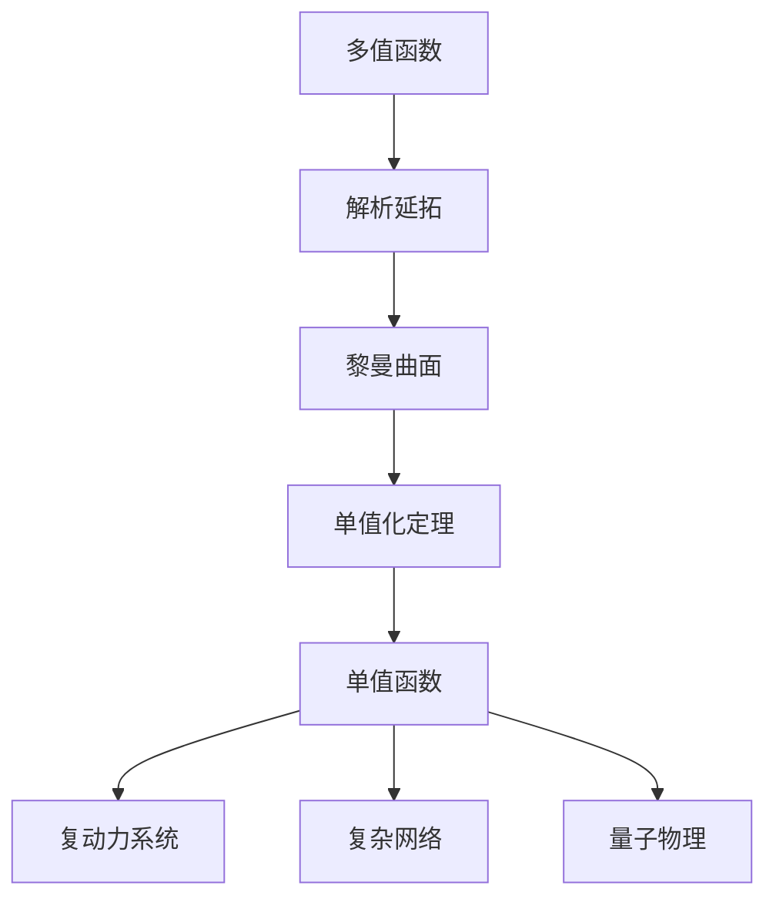

# 黎曼曲面：单值化定理及其应用

## 1. 背景介绍
### 1.1 黎曼曲面的起源与发展
#### 1.1.1 黎曼的开创性工作
#### 1.1.2 后续数学家的贡献
#### 1.1.3 黎曼曲面在现代数学中的地位
### 1.2 单值化定理的提出
#### 1.2.1 多值函数的困扰
#### 1.2.2 黎曼对单值化问题的思考
#### 1.2.3 单值化定理的诞生
### 1.3 单值化定理的意义
#### 1.3.1 解决多值函数的理论意义
#### 1.3.2 为复分析提供新的研究视角
#### 1.3.3 对其他数学分支的影响

## 2. 核心概念与联系
### 2.1 黎曼曲面的定义与性质
#### 2.1.1 黎曼曲面的形式化定义
#### 2.1.2 黎曼曲面的拓扑结构
#### 2.1.3 黎曼曲面的解析结构
### 2.2 单值化定理的内容
#### 2.2.1 定理的精确表述
#### 2.2.2 定理的几何意义
#### 2.2.3 定理的代数意义
### 2.3 黎曼曲面与单值化定理的关系
#### 2.3.1 黎曼曲面为单值化提供载体
#### 2.3.2 单值化定理刻画黎曼曲面的性质
#### 2.3.3 两者相辅相成，构成完整的理论体系

## 3. 核心算法原理具体操作步骤
### 3.1 解析延拓的构造
#### 3.1.1 解析延拓的基本思想
#### 3.1.2 解析延拓的具体步骤
#### 3.1.3 解析延拓的收敛性证明
### 3.2 黎曼曲面的构造
#### 3.2.1 局部坐标卡的引入
#### 3.2.2 解析延拓片的粘合
#### 3.2.3 黎曼曲面的单值性验证
### 3.3 单值化定理的证明
#### 3.3.1 单值化定理的必要性证明
#### 3.3.2 单值化定理的充分性证明
#### 3.3.3 单值化定理证明的关键技巧

## 4. 数学模型和公式详细讲解举例说明
### 4.1 解析函数与解析延拓
#### 4.1.1 解析函数的定义与性质
#### 4.1.2 解析函数在黎曼曲面上的延拓
#### 4.1.3 解析延拓与解析函数的关系
### 4.2 黎曼曲面的数学模型
#### 4.2.1 复解析流形的定义
#### 4.2.2 黎曼曲面作为复解析流形的实现
#### 4.2.3 黎曼曲面的示例与分类
### 4.3 单值化定理的数学表述
#### 4.3.1 单值化定理的代数版本
#### 4.3.2 单值化定理的拓扑版本
#### 4.3.3 单值化定理的解析版本

## 5. 项目实践：代码实例和详细解释说明
### 5.1 计算黎曼面的Python实现
#### 5.1.1 复平面与黎曼球面的转换
#### 5.1.2 黎曼面的数据结构设计
#### 5.1.3 黎曼面的可视化展示
### 5.2 单值化算法的C++实现
#### 5.2.1 解析延拓的数值计算
#### 5.2.2 黎曼面的构造与存储
#### 5.2.3 单值化结果的验证与应用
### 5.3 相关软件包与工具介绍
#### 5.3.1 复分析计算的Matlab工具箱
#### 5.3.2 黎曼几何的Mathematica软件包
#### 5.3.3 单值化算法的并行加速库

## 6. 实际应用场景
### 6.1 复动力系统的分析与预测
#### 6.1.1 复动力系统的数学建模
#### 6.1.2 黎曼面在复动力系统中的应用
#### 6.1.3 单值化定理对复动力系统的指导意义
### 6.2 复杂网络的拓扑结构研究
#### 6.2.1 复杂网络的黎曼面表示
#### 6.2.2 单值化定理在复杂网络中的应用
#### 6.2.3 黎曼面视角下复杂网络的新性质
### 6.3 量子物理中的黎曼面方法
#### 6.3.1 量子态的黎曼面描述
#### 6.3.2 单值化定理在量子物理中的应用
#### 6.3.3 黎曼面方法对量子物理的新认识

## 7. 工具和资源推荐
### 7.1 学习黎曼曲面的书籍
#### 7.1.1 《黎曼面》by Otto Forster
#### 7.1.2 《代数曲线与黎曼面》by Rick Miranda
#### 7.1.3 《黎曼面讲义》by 陈维桓
### 7.2 研究单值化定理的论文
#### 7.2.1 Riemann的原始论文
#### 7.2.2 单值化定理的现代处理
#### 7.2.3 单值化定理的推广与应用
### 7.3 相关的开源项目与社区
#### 7.3.1 复分析与黎曼几何的GitHub项目
#### 7.3.2 黎曼曲面的Mathoverflow问答
#### 7.3.3 单值化算法的arXiv预印本

## 8. 总结：未来发展趋势与挑战
### 8.1 黎曼曲面理论的拓展方向
#### 8.1.1 高维黎曼曲面的研究
#### 8.1.2 黎曼曲面上的几何结构
#### 8.1.3 黎曼曲面与其他数学分支的交叉
### 8.2 单值化定理的深化与推广
#### 8.2.1 单值化定理的进一步完善
#### 8.2.2 单值化定理在其他领域的应用
#### 8.2.3 单值化定理的计算挑战
### 8.3 黎曼曲面与单值化定理的展望
#### 8.3.1 黎曼曲面视角下的新问题
#### 8.3.2 单值化定理与人工智能的结合
#### 8.3.3 黎曼曲面与单值化定理的教学创新

## 9. 附录：常见问题与解答
### 9.1 黎曼曲面的直观理解
#### 问题1：黎曼曲面是如何产生的？
#### 问题2：黎曼曲面有哪些常见的例子？
#### 问题3：黎曼曲面与复平面有何区别？
### 9.2 单值化定理的本质
#### 问题1：单值化定理解决了什么问题？
#### 问题2：单值化定理的核心思想是什么？
#### 问题3：单值化定理有哪些等价表述？
### 9.3 黎曼曲面与单值化定理的计算
#### 问题1：如何用计算机构造黎曼曲面？
#### 问题2：单值化算法的复杂度如何？
#### 问题3：黎曼曲面与单值化定理的计算有哪些难点？

黎曼曲面与单值化定理是复分析中的重要内容，它们不仅具有深刻的理论意义，也在诸多领域有着广泛的应用。黎曼曲面提供了研究多值函数的合适载体，而单值化定理则刻画了黎曼曲面的本质特征。两者相互补充，构成了一个完整的理论体系。

从多值函数出发，通过解析延拓，我们可以构造出黎曼曲面。在黎曼曲面上，原本的多值函数被单值化，成为单值解析函数。单值化定理保证了这一过程的合理性，并揭示了黎曼曲面的单值性本质。

单值化后的函数在复动力系统、复杂网络、量子物理等领域大放异彩。黎曼曲面视角不仅为这些领域提供了新的研究工具，也带来了新的洞见和认识。

黎曼曲面与单值化定理的研究还在不断深化，高维黎曼曲面、黎曼曲面的几何结构、单值化定理的推广等，都是未来值得探索的方向。同时，黎曼曲面与单值化定理的计算也提出了新的挑战，需要发展高效的算法与程序实现。

总之，黎曼曲面与单值化定理是复分析的瑰宝，也是现代数学的重要组成部分。深入理解它们的内涵，掌握它们的应用，对于拓展数学视野、解决实际问题都有着重要意义。这个主题的学习和研究，必将带来丰硕的成果和更广阔的发展前景。

作者：禅与计算机程序设计艺术 / Zen and the Art of Computer Programming