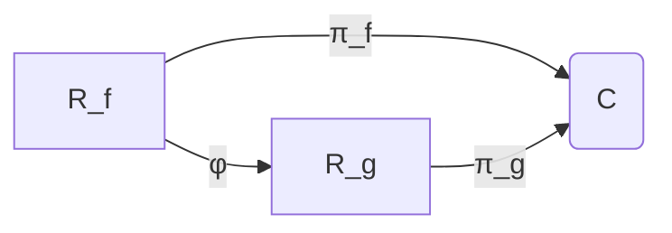

# 黎曼曲面：基本群的子群与覆盖曲面

## 1. 背景介绍

黎曼曲面是一个在代数几何和拓扑学中扮演着重要角色的概念。它是一个二维实分析流形,可以看作是复平面上的一个覆盖空间。黎曼曲面的研究源于对多值函数的研究,例如对数函数、幂函数等。这些函数在复平面上是多值的,但在黎曼曲面上就变成了单值函数。

黎曼曲面的基本群是一个重要的代数拓扑不变量,它描述了曲面的拓扑结构。基本群的子群与覆盖曲面之间存在着密切的联系,这是本文的核心主题。

### 1.1 黎曼曲面的定义

黎曼曲面是一个二维实分析流形,它是复平面 $\mathbb{C}$ 上的一个覆盖空间。更精确地说,对于一个非常数整分析函数 $f:\mathbb{C}\rightarrow\mathbb{C}$,其黎曼曲面 $\mathcal{R}_f$ 定义为:

$$\mathcal{R}_f=\{(z,w)\in\mathbb{C}^2:w^n=f(z)\}$$

其中 $n$ 是 $f$ 在 $z$ 点的分支数。

黎曼曲面可以看作是将复平面的每一点 $z$ 沿着 $f$ 的值的 $n$ 条不同的分支复制了 $n$ 次,从而得到一个新的覆盖空间。这个新的空间就是黎曼曲面 $\mathcal{R}_f$。

### 1.2 黎曼曲面的投影

黎曼曲面 $\mathcal{R}_f$ 上有一个自然的投影映射 $\pi:\mathcal{R}_f\rightarrow\mathbb{C}$,它将每一个点 $(z,w)$ 映射到它的第一个分量 $z$。这个投影映射将黎曼曲面上的点映射回复平面。

## 2. 核心概念与联系

### 2.1 基本群

在研究黎曼曲面的拓扑性质时,基本群是一个关键的代数拓扑不变量。对于一个连通的拓扑空间 $X$,它的基本群 $\pi_1(X,x_0)$ 是以 $x_0$ 为基点的环等价类的群,其中环等价关系由路等价定义。

基本群描述了空间的环绕结构,它反映了空间的"洞"的数量和类型。例如,对于一个圆环,它的基本群是一个无限循环群;而对于一个球面,它的基本群是平凡的。

### 2.2 覆盖空间与基本群的子群

覆盖空间与基本群的子群之间存在着密切的联系。给定一个连通的拓扑空间 $X$ 和它的一个覆盖空间 $\tilde{X}$,那么 $\tilde{X}$ 的基本群 $\pi_1(\tilde{X},\tilde{x}_0)$ 就是 $X$ 的基本群 $\pi_1(X,x_0)$ 的一个子群。

更精确地说,如果 $p:\tilde{X}\rightarrow X$ 是一个覆盖映射,那么对于任意 $\tilde{x}_0\in p^{-1}(x_0)$,都有一个单射同态:

$$p_*:\pi_1(\tilde{X},\tilde{x}_0)\rightarrow\pi_1(X,x_0)$$

这个同态的像就是 $\pi_1(X,x_0)$ 的一个子群。

反之,对于 $\pi_1(X,x_0)$ 的任意一个子群 $H$,都存在一个覆盖空间 $\tilde{X}_H$,使得 $\pi_1(\tilde{X}_H,\tilde{x}_0)$ 与 $H$ 同构。这种覆盖空间 $\tilde{X}_H$ 被称为由 $H$ 定义的覆盖空间。

### 2.3 黎曼曲面与基本群的子群

对于一个黎曼曲面 $\mathcal{R}_f$,它的基本群 $\pi_1(\mathcal{R}_f,\tilde{x}_0)$ 是复平面 $\mathbb{C}$ 的基本群 $\pi_1(\mathbb{C},x_0)$ 的一个子群。这是因为黎曼曲面 $\mathcal{R}_f$ 是复平面 $\mathbb{C}$ 的一个覆盖空间。

具体来说,对于任意 $\tilde{x}_0\in\pi^{-1}(x_0)$,都有一个单射同态:

$$\pi_*:\pi_1(\mathcal{R}_f,\tilde{x}_0)\rightarrow\pi_1(\mathbb{C},x_0)$$

其中 $\pi:\mathcal{R}_f\rightarrow\mathbb{C}$ 是黎曼曲面到复平面的投影映射。

由于复平面 $\mathbb{C}$ 的基本群是平凡的,所以黎曼曲面 $\mathcal{R}_f$ 的基本群就是一个无限循环群。这个无限循环群描述了黎曼曲面的环绕结构,反映了它的"洞"的数量和类型。

## 3. 核心算法原理具体操作步骤

### 3.1 构造黎曼曲面的步骤

构造一个黎曼曲面 $\mathcal{R}_f$ 的具体步骤如下:

1. 选择一个非常数整分析函数 $f:\mathbb{C}\rightarrow\mathbb{C}$,例如 $f(z)=z^n$ 或 $f(z)=e^z$。

2. 确定函数 $f$ 在每一个点 $z$ 处的分支数 $n$。

3. 在复平面 $\mathbb{C}$ 的每一个点 $z$ 处,复制 $n$ 个点 $(z,w_1)$、$(z,w_2)$、...、$(z,w_n)$,使得 $w_1^n=w_2^n=...=w_n^n=f(z)$。

4. 将所有这些复制的点 $(z,w_i)$ 连接起来,形成一个新的拓扑空间 $\mathcal{R}_f$。这个新的空间就是黎曼曲面。

5. 定义一个投影映射 $\pi:\mathcal{R}_f\rightarrow\mathbb{C}$,将每一个点 $(z,w)$ 映射到它的第一个分量 $z$。

通过这些步骤,我们就构造出了一个黎曼曲面 $\mathcal{R}_f$,它是复平面 $\mathbb{C}$ 的一个覆盖空间。

### 3.2 计算黎曼曲面的基本群

计算一个黎曼曲面 $\mathcal{R}_f$ 的基本群 $\pi_1(\mathcal{R}_f,\tilde{x}_0)$ 的步骤如下:

1. 选择一个基点 $\tilde{x}_0\in\mathcal{R}_f$,记 $\pi(\tilde{x}_0)=x_0$。

2. 利用投影映射 $\pi:\mathcal{R}_f\rightarrow\mathbb{C}$ 诱导出一个同态:

   $$\pi_*:\pi_1(\mathcal{R}_f,\tilde{x}_0)\rightarrow\pi_1(\mathbb{C},x_0)$$

3. 由于复平面 $\mathbb{C}$ 的基本群 $\pi_1(\mathbb{C},x_0)$ 是平凡的,所以 $\pi_*$ 是一个单射。

4. 因此,黎曼曲面 $\mathcal{R}_f$ 的基本群 $\pi_1(\mathcal{R}_f,\tilde{x}_0)$ 就是一个无限循环群。

这个无限循环群描述了黎曼曲面的环绕结构,反映了它的"洞"的数量和类型。

## 4. 数学模型和公式详细讲解举例说明

在研究黎曼曲面时,我们经常需要使用一些数学模型和公式。下面我们将详细讲解其中的一些核心内容,并给出具体的例子说明。

### 4.1 黎曼曲面的定义

黎曼曲面 $\mathcal{R}_f$ 是一个二维实分析流形,它是复平面 $\mathbb{C}$ 上的一个覆盖空间。对于一个非常数整分析函数 $f:\mathbb{C}\rightarrow\mathbb{C}$,其黎曼曲面 $\mathcal{R}_f$ 定义为:

$$\mathcal{R}_f=\{(z,w)\in\mathbb{C}^2:w^n=f(z)\}$$

其中 $n$ 是 $f$ 在 $z$ 点的分支数。

**例子:** 对于函数 $f(z)=z^3$,它在每一个点 $z$ 处的分支数都是 $3$。因此,它的黎曼曲面 $\mathcal{R}_{z^3}$ 可以定义为:

$$\mathcal{R}_{z^3}=\{(z,w)\in\mathbb{C}^2:w^3=z^3\}$$

这个黎曼曲面由三个复制的复平面组成,每一个复制的平面对应着 $w^3=z^3$ 的一个不同的分支。

### 4.2 基本群与覆盖空间

对于一个连通的拓扑空间 $X$ 和它的一个覆盖空间 $\tilde{X}$,如果 $p:\tilde{X}\rightarrow X$ 是一个覆盖映射,那么对于任意 $\tilde{x}_0\in p^{-1}(x_0)$,都有一个单射同态:

$$p_*:\pi_1(\tilde{X},\tilde{x}_0)\rightarrow\pi_1(X,x_0)$$

这个同态的像就是 $\pi_1(X,x_0)$ 的一个子群。

**例子:** 对于黎曼曲面 $\mathcal{R}_f$,它是复平面 $\mathbb{C}$ 的一个覆盖空间,投影映射 $\pi:\mathcal{R}_f\rightarrow\mathbb{C}$ 就是一个覆盖映射。因此,对于任意 $\tilde{x}_0\in\pi^{-1}(x_0)$,都有一个单射同态:

$$\pi_*:\pi_1(\mathcal{R}_f,\tilde{x}_0)\rightarrow\pi_1(\mathbb{C},x_0)$$

由于复平面 $\mathbb{C}$ 的基本群是平凡的,所以 $\pi_*$ 是一个单射,因此黎曼曲面 $\mathcal{R}_f$ 的基本群 $\pi_1(\mathcal{R}_f,\tilde{x}_0)$ 就是一个无限循环群。

### 4.3 黎曼曲面的同构

两个黎曼曲面 $\mathcal{R}_f$ 和 $\mathcal{R}_g$ 被称为同构,如果存在一个双射 $\phi:\mathcal{R}_f\rightarrow\mathcal{R}_g$,使得下面的交换图形成立:



其中 $\pi_f$ 和 $\pi_g$ 分别是 $\mathcal{R}_f$ 和 $\mathcal{R}_g$ 到复平面 $\mathbb{C}$ 的投影映射。

**例子:** 考虑函数 $f(z)=z^3$ 和 $g(z)=(z^3-1)^3$,它们的黎曼曲面 $\mathcal{R}_{z^3}$ 和 $\mathcal{R}_{(z^3-1)^3}$ 是同构的。这是因为存在一个双射 $\phi:\mathcal{R}_{z^3}\rightarrow\mathcal{R}_{(z^3-1)^3}$,定义为 $\phi(z,w)=(z+1,w+1)$,使得上面的交换图形成立。

## 5. 项目实践：代码实例和详细解释说明

在这一部分,我们将通过一个具体的项目实践,展示如何使用编程语言来构造和可视化黎曼曲面。我们将使用 Python 语言和 Matplotlib 库来实现这个项目。

### 5.1 构造黎曼曲面

首先,我们定义一个函数 `riemann_surface`来构造黎曼曲面:

```python
import numpy as np

def riemann_surface(f, n, x_range, y_range):
    """
    构造函数 f 的黎曼曲面
    
    参数:
    f: 函数
    n: 分支数
    x_range: x 的取值范围
    y_range: