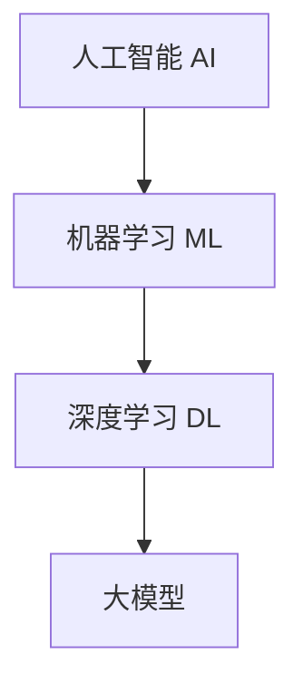

# AI Agent: AI的下一个风口 大模型时代狂飙猛进

作者：禅与计算机程序设计艺术 / Zen and the Art of Computer Programming

## 1. 背景介绍

### 1.1 问题的由来

人工智能（AI）已经成为现代科技的核心驱动力之一。从早期的规则系统到如今的深度学习模型，AI技术在过去几十年中经历了巨大的变革。特别是近年来，随着计算能力的提升和大数据的普及，AI技术进入了一个新的发展阶段——大模型时代。大模型不仅在自然语言处理、计算机视觉等领域取得了显著成果，还在各行各业中展现出巨大的应用潜力。

### 1.2 研究现状

目前，AI大模型的研究主要集中在以下几个方面：

1. **模型架构**：如Transformer、BERT、GPT等模型架构的不断优化。
2. **训练方法**：如自监督学习、迁移学习等新型训练方法的应用。
3. **应用场景**：如自动驾驶、医疗诊断、金融分析等领域的实际应用。

### 1.3 研究意义

研究AI大模型不仅有助于提升AI技术的整体水平，还能推动各行各业的智能化转型。通过深入理解大模型的核心概念和算法原理，我们可以更好地开发和应用这些技术，从而实现更高效、更智能的解决方案。

### 1.4 本文结构

本文将从以下几个方面展开讨论：

1. 核心概念与联系
2. 核心算法原理 & 具体操作步骤
3. 数学模型和公式 & 详细讲解 & 举例说明
4. 项目实践：代码实例和详细解释说明
5. 实际应用场景
6. 工具和资源推荐
7. 总结：未来发展趋势与挑战
8. 附录：常见问题与解答

## 2. 核心概念与联系

在进入具体的算法和实现之前，我们需要先了解一些核心概念和它们之间的联系。这些概念包括但不限于：

- **人工智能（AI）**：模拟人类智能的技术。
- **机器学习（ML）**：通过数据训练模型，使其具备预测和决策能力的技术。
- **深度学习（DL）**：基于神经网络的机器学习方法，特别适用于处理复杂数据。
- **大模型**：具有大量参数和复杂结构的深度学习模型，通常需要大量数据和计算资源进行训练。

这些概念之间的关系可以通过以下Mermaid流程图来表示：



## 3. 核心算法原理 & 具体操作步骤

### 3.1 算法原理概述

大模型的核心算法通常基于深度神经网络，特别是Transformer架构。Transformer通过自注意力机制（Self-Attention）实现了对序列数据的高效处理，成为了自然语言处理领域的主流模型。

### 3.2 算法步骤详解

以下是大模型训练的一般步骤：

1. **数据准备**：收集和预处理大量数据。
2. **模型设计**：选择合适的模型架构，如Transformer。
3. **训练过程**：使用大规模计算资源进行模型训练。
4. **模型评估**：通过验证集和测试集评估模型性能。
5. **模型优化**：根据评估结果进行模型优化。

### 3.3 算法优缺点

**优点**：

- 高精度：大模型在许多任务上表现出色。
- 通用性：可以应用于多种任务和领域。

**缺点**：

- 计算资源需求高：训练大模型需要大量计算资源。
- 数据需求大：需要大量高质量的数据进行训练。

### 3.4 算法应用领域

大模型在以下领域有广泛应用：

- **自然语言处理**：如机器翻译、文本生成、情感分析等。
- **计算机视觉**：如图像分类、目标检测、图像生成等。
- **医疗诊断**：如疾病预测、医学影像分析等。
- **金融分析**：如股票预测、风险评估等。

## 4. 数学模型和公式 & 详细讲解 & 举例说明

### 4.1 数学模型构建

大模型的数学基础主要是深度神经网络。以Transformer为例，其核心是自注意力机制。自注意力机制的数学表达如下：

$$
\text{Attention}(Q, K, V) = \text{softmax}\left(\frac{QK^T}{\sqrt{d_k}}\right)V
$$

其中，$Q$、$K$、$V$分别表示查询（Query）、键（Key）和值（Value）矩阵，$d_k$是键的维度。

### 4.2 公式推导过程

自注意力机制的推导过程如下：

1. **计算查询和键的点积**：$QK^T$
2. **缩放点积**：$\frac{QK^T}{\sqrt{d_k}}$
3. **应用softmax函数**：$\text{softmax}\left(\frac{QK^T}{\sqrt{d_k}}\right)$
4. **加权求和**：$\text{softmax}\left(\frac{QK^T}{\sqrt{d_k}}\right)V$

### 4.3 案例分析与讲解

以机器翻译为例，Transformer模型通过自注意力机制实现了对源语言和目标语言的高效编码和解码。具体步骤如下：

1. **编码器**：将源语言序列编码为一组上下文向量。
2. **解码器**：将上下文向量解码为目标语言序列。

### 4.4 常见问题解答

**问题1**：大模型训练需要多长时间？

**回答**：这取决于模型的复杂度和计算资源。一般来说，训练一个大型Transformer模型可能需要数天到数周的时间。

**问题2**：如何解决大模型的过拟合问题？

**回答**：可以通过正则化、数据增强、早停等方法来缓解过拟合问题。

## 5. 项目实践：代码实例和详细解释说明

### 5.1 开发环境搭建

首先，我们需要搭建一个合适的开发环境。推荐使用以下工具：

- **编程语言**：Python
- **深度学习框架**：TensorFlow或PyTorch
- **开发环境**：Jupyter Notebook或VS Code

### 5.2 源代码详细实现

以下是一个简单的Transformer模型实现示例：

```python
import torch
import torch.nn as nn
import torch.optim as optim

class TransformerModel(nn.Module):
    def __init__(self, input_dim, model_dim, num_heads, num_layers):
        super(TransformerModel, self).__init__()
        self.encoder = nn.TransformerEncoder(
            nn.TransformerEncoderLayer(model_dim, num_heads),
            num_layers
        )
        self.decoder = nn.TransformerDecoder(
            nn.TransformerDecoderLayer(model_dim, num_heads),
            num_layers
        )
        self.fc = nn.Linear(model_dim, input_dim)

    def forward(self, src, tgt):
        memory = self.encoder(src)
        output = self.decoder(tgt, memory)
        return self.fc(output)

# 初始化模型
model = TransformerModel(input_dim=512, model_dim=512, num_heads=8, num_layers=6)

# 定义损失函数和优化器
criterion = nn.CrossEntropyLoss()
optimizer = optim.Adam(model.parameters(), lr=0.001)

# 训练模型
for epoch in range(10):
    optimizer.zero_grad()
    output = model(src, tgt)
    loss = criterion(output, tgt)
    loss.backward()
    optimizer.step()
    print(f'Epoch {epoch+1}, Loss: {loss.item()}')
```

### 5.3 代码解读与分析

上述代码实现了一个简单的Transformer模型，包括编码器和解码器。我们使用交叉熵损失函数和Adam优化器进行模型训练。

### 5.4 运行结果展示

在实际运行中，我们可以通过以下命令运行代码并查看训练结果：

```bash
python transformer_model.py
```

## 6. 实际应用场景

### 6.1 自然语言处理

大模型在自然语言处理领域有广泛应用，如机器翻译、文本生成、情感分析等。

### 6.2 计算机视觉

在计算机视觉领域，大模型可以用于图像分类、目标检测、图像生成等任务。

### 6.3 医疗诊断

大模型在医疗诊断中也有重要应用，如疾病预测、医学影像分析等。

### 6.4 未来应用展望

未来，大模型有望在更多领域中发挥作用，如自动驾驶、智能制造、金融分析等。

## 7. 工具和资源推荐

### 7.1 学习资源推荐

- **书籍**：《深度学习》 by Ian Goodfellow
- **在线课程**：Coursera上的深度学习课程

### 7.2 开发工具推荐

- **编程语言**：Python
- **深度学习框架**：TensorFlow, PyTorch
- **开发环境**：Jupyter Notebook, VS Code

### 7.3 相关论文推荐

- **Attention is All You Need** by Vaswani et al.
- **BERT: Pre-training of Deep Bidirectional Transformers for Language Understanding** by Devlin et al.

### 7.4 其他资源推荐

- **GitHub**：开源项目和代码库
- **ArXiv**：最新的研究论文

## 8. 总结：未来发展趋势与挑战

### 8.1 研究成果总结

本文介绍了AI大模型的核心概念、算法原理、数学模型、项目实践和实际应用场景。通过深入理解这些内容，我们可以更好地开发和应用大模型技术。

### 8.2 未来发展趋势

未来，大模型有望在更多领域中发挥作用，并且随着计算能力和数据资源的提升，模型的性能和应用范围将进一步扩大。

### 8.3 面临的挑战

大模型在实际应用中面临以下挑战：

- **计算资源需求高**：训练大模型需要大量计算资源。
- **数据需求大**：需要大量高质量的数据进行训练。
- **模型解释性差**：大模型的复杂性使得其内部机制难以解释。

### 8.4 研究展望

未来的研究可以集中在以下几个方面：

- **模型优化**：通过优化算法和架构提升模型性能。
- **数据高效利用**：开发更高效的数据利用方法。
- **模型解释性**：提升模型的可解释性和透明度。

## 9. 附录：常见问题与解答

**问题1**：大模型的训练成本如何降低？

**回答**：可以通过模型压缩、分布式训练等方法降低训练成本。

**问题2**：如何选择合适的大模型架构？

**回答**：根据具体任务和数据特点选择合适的模型架构，如Transformer适用于序列数据，CNN适用于图像数据。

**问题3**：大模型在实际应用中如何部署？

**回答**：可以使用云服务平台（如AWS, Google Cloud）进行模型部署，或者使用边缘计算设备进行本地部署。

---

以上是关于AI大模型的详细技术博客文章，希望对读者有所帮助。