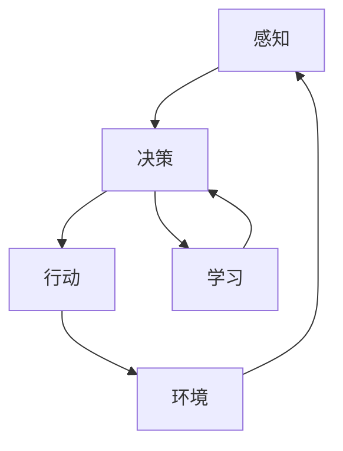

# AI人工智能 Agent：高级概念剖析

作者：禅与计算机程序设计艺术 / Zen and the Art of Computer Programming

## 1. 背景介绍

### 1.1 问题的由来

人工智能（AI）作为21世纪最具革命性的技术之一，已经在多个领域展现出其强大的潜力。从自动驾驶汽车到智能家居，从医疗诊断到金融分析，AI正在改变我们的生活方式。然而，AI的核心之一——智能代理（Agent）——却常常被忽视。智能代理是AI系统的基本构建模块，它们能够感知环境、做出决策并采取行动，以实现特定目标。

### 1.2 研究现状

目前，智能代理的研究已经取得了显著进展。多智能体系统（Multi-Agent Systems, MAS）、强化学习（Reinforcement Learning, RL）、深度学习（Deep Learning, DL）等技术的结合，使得智能代理在复杂环境中的表现越来越出色。然而，尽管有这些进展，智能代理在实际应用中仍面临许多挑战，如环境的不确定性、计算资源的限制以及多智能体之间的协调问题。

### 1.3 研究意义

深入理解智能代理的核心概念、算法原理和实际应用，不仅有助于推动AI技术的发展，还能为解决现实世界中的复杂问题提供新的思路和方法。本文将通过详细剖析智能代理的高级概念，帮助读者全面掌握这一领域的关键技术和最新进展。

### 1.4 本文结构

本文将分为以下几个部分：

1. **背景介绍**：介绍智能代理的基本概念和研究现状。
2. **核心概念与联系**：详细解释智能代理的核心概念及其相互关系。
3. **核心算法原理 & 具体操作步骤**：深入剖析智能代理的主要算法及其操作步骤。
4. **数学模型和公式 & 详细讲解 & 举例说明**：构建数学模型，推导公式，并通过案例进行详细讲解。
5. **项目实践：代码实例和详细解释说明**：提供实际代码实例，并进行详细解释和分析。
6. **实际应用场景**：探讨智能代理在不同领域的应用及其未来展望。
7. **工具和资源推荐**：推荐学习资源、开发工具及相关论文。
8. **总结：未来发展趋势与挑战**：总结研究成果，探讨未来发展趋势和面临的挑战。
9. **附录：常见问题与解答**：解答读者在学习过程中可能遇到的常见问题。

## 2. 核心概念与联系

智能代理的核心概念包括感知、决策、行动和学习。以下是这些概念的详细解释及其相互关系：

### 2.1 感知

感知是智能代理获取环境信息的过程。通过传感器，智能代理能够感知环境的状态，并将这些信息转化为内部表示。感知的准确性和及时性直接影响智能代理的决策质量。

### 2.2 决策

决策是智能代理根据感知到的信息，选择最优行动的过程。决策过程通常涉及到复杂的计算和优化算法，如动态规划、强化学习等。决策的目标是最大化某种效用函数或最小化某种损失函数。

### 2.3 行动

行动是智能代理执行决策结果的过程。通过执行器，智能代理能够对环境施加影响，从而实现预定目标。行动的效果会反过来影响环境状态，形成一个闭环系统。

### 2.4 学习

学习是智能代理通过与环境的交互，不断改进自身性能的过程。学习算法使得智能代理能够在动态和不确定的环境中表现出更高的智能水平。常见的学习方法包括监督学习、无监督学习和强化学习。

### 2.5 核心概念之间的联系

智能代理的感知、决策、行动和学习过程是相互联系、相互影响的。感知提供决策所需的信息，决策决定行动的选择，行动影响环境状态，而学习则通过不断优化感知、决策和行动过程，提高智能代理的整体性能。



## 3. 核心算法原理 & 具体操作步骤

### 3.1 算法原理概述

智能代理的核心算法主要包括强化学习、深度学习和多智能体系统。以下是这些算法的基本原理：

#### 3.1.1 强化学习

强化学习是一种通过试错法来学习最优策略的算法。智能代理在与环境的交互过程中，通过奖励和惩罚来调整其行为，以最大化累积奖励。

#### 3.1.2 深度学习

深度学习是一种基于神经网络的机器学习方法。通过多层神经网络的训练，智能代理能够从大量数据中提取特征，并进行复杂的模式识别和决策。

#### 3.1.3 多智能体系统

多智能体系统是指多个智能代理在同一环境中协同工作，以实现共同目标的系统。多智能体系统的关键问题是如何协调各个智能代理的行为，以最大化整体效用。

### 3.2 算法步骤详解

#### 3.2.1 强化学习算法步骤

1. **初始化**：初始化智能代理的状态和策略。
2. **感知环境**：通过传感器获取环境状态。
3. **选择行动**：根据当前策略选择最优行动。
4. **执行行动**：执行选择的行动，并观察环境反馈。
5. **更新策略**：根据奖励和惩罚，更新策略。
6. **重复**：重复上述步骤，直到达到预定目标。

#### 3.2.2 深度学习算法步骤

1. **数据准备**：收集并预处理训练数据。
2. **模型构建**：构建多层神经网络模型。
3. **模型训练**：使用训练数据对模型进行训练。
4. **模型评估**：使用验证数据评估模型性能。
5. **模型优化**：根据评估结果，优化模型参数。
6. **模型部署**：将训练好的模型部署到实际应用中。

#### 3.2.3 多智能体系统算法步骤

1. **智能体初始化**：初始化各个智能体的状态和策略。
2. **环境感知**：各个智能体感知环境状态。
3. **行动选择**：各个智能体根据策略选择行动。
4. **行动执行**：各个智能体执行选择的行动。
5. **智能体交互**：智能体之间进行信息交换和协调。
6. **策略更新**：各个智能体根据交互结果更新策略。
7. **重复**：重复上述步骤，直到达到预定目标。

### 3.3 算法优缺点

#### 3.3.1 强化学习

**优点**：
- 能够在动态和不确定的环境中学习最优策略。
- 不需要大量的标注数据。

**缺点**：
- 学习过程可能非常缓慢。
- 需要大量的计算资源。

#### 3.3.2 深度学习

**优点**：
- 能够处理复杂的模式识别和决策问题。
- 在大规模数据集上表现出色。

**缺点**：
- 需要大量的标注数据。
- 模型训练过程非常耗时。

#### 3.3.3 多智能体系统

**优点**：
- 能够解决单个智能代理无法解决的复杂问题。
- 提高系统的鲁棒性和灵活性。

**缺点**：
- 智能体之间的协调和通信是一个复杂问题。
- 需要大量的计算资源。

### 3.4 算法应用领域

#### 3.4.1 强化学习

- 自动驾驶
- 游戏AI
- 机器人控制

#### 3.4.2 深度学习

- 图像识别
- 自然语言处理
- 医疗诊断

#### 3.4.3 多智能体系统

- 智能交通系统
- 分布式能源管理
- 多机器人协作

## 4. 数学模型和公式 & 详细讲解 & 举例说明

### 4.1 数学模型构建

智能代理的数学模型通常包括状态空间、行动空间、奖励函数和策略函数。以下是这些概念的详细解释：

#### 4.1.1 状态空间

状态空间是指智能代理在环境中可能处于的所有状态的集合。用 $S$ 表示状态空间，$s \in S$ 表示某个具体状态。

#### 4.1.2 行动空间

行动空间是指智能代理在每个状态下可以采取的所有行动的集合。用 $A$ 表示行动空间，$a \in A$ 表示某个具体行动。

#### 4.1.3 奖励函数

奖励函数是指智能代理在某个状态下采取某个行动后，环境给予的反馈。用 $R(s, a)$ 表示在状态 $s$ 下采取行动 $a$ 的奖励。

#### 4.1.4 策略函数

策略函数是指智能代理在每个状态下选择行动的概率分布。用 $\pi(a|s)$ 表示在状态 $s$ 下选择行动 $a$ 的概率。

### 4.2 公式推导过程

#### 4.2.1 强化学习公式推导

强化学习的目标是找到最优策略 $\pi^*$，使得累积奖励最大化。累积奖励可以表示为：

$$
G_t = \sum_{k=0}^{\infty} \gamma^k R_{t+k+1}
$$

其中，$\gamma$ 是折扣因子，$R_{t+k+1}$ 是在时间步 $t+k+1$ 获得的奖励。

最优策略 $\pi^*$ 满足贝尔曼最优方程：

$$
Q^*(s, a) = \mathbb{E}[R_{t+1} + \gamma \max_{a'} Q^*(s', a') | s, a]
$$

其中，$Q^*(s, a)$ 是状态-行动值函数，表示在状态 $s$ 下采取行动 $a$ 后的累积奖励期望。

#### 4.2.2 深度学习公式推导

深度学习的目标是通过最小化损失函数来优化神经网络的参数。常见的损失函数包括均方误差（MSE）和交叉熵损失（Cross-Entropy Loss）。

均方误差损失函数表示为：

$$
L = \frac{1}{N} \sum_{i=1}^{N} (y_i - \hat{y}_i)^2
$$

其中，$N$ 是样本数量，$y_i$ 是真实值，$\hat{y}_i$ 是预测值。

交叉熵损失函数表示为：

$$
L = -\frac{1}{N} \sum_{i=1}^{N} [y_i \log(\hat{y}_i) + (1 - y_i) \log(1 - \hat{y}_i)]
$$

### 4.3 案例分析与讲解

#### 4.3.1 强化学习案例

假设一个智能代理在一个迷宫中寻找出口。迷宫的状态空间 $S$ 包括所有可能的位置，行动空间 $A$ 包括上下左右四个方向。奖励函数 $R(s, a)$ 在到达出口时为正，否则为负。智能代理通过不断试错，学习最优策略 $\pi^*$，最终找到出口。

#### 4.3.2 深度学习案例

假设一个智能代理用于图像分类任务。输入数据是图像，输出是图像的类别标签。通过构建一个卷积神经网络（CNN），并使用交叉熵损失函数进行训练，智能代理能够从大量图像数据中学习特征，并进行准确分类。

### 4.4 常见问题解答

#### 4.4.1 强化学习常见问题

**问题**：为什么强化学习的学习过程很慢？

**解答**：强化学习的学习过程依赖于试错法，需要大量的交互数据来更新策略。此外，环境的不确定性和高维状态空间也增加了学习的难度。

#### 4.4.2 深度学习常见问题

**问题**：为什么深度学习需要大量的标注数据？

**解答**：深度学习模型通常具有大量的参数，需要大量的数据来进行训练，以避免过拟合并提高模型的泛化能力。

## 5. 项目实践：代码实例和详细解释说明

### 5.1 开发环境搭建

在进行智能代理的项目实践之前，需要搭建合适的开发环境。以下是常见的开发环境配置：

#### 5.1.1 硬件要求

- CPU：Intel i5 或以上
- GPU：NVIDIA GTX 1060 或以上（用于深度学习）
- 内存：16GB 或以上
- 存储：500GB SSD 或以上

#### 5.1.2 软件要求

- 操作系统：Ubuntu 20.04 或 Windows 10
- 编程语言：Python 3.8 或以上
- 开发工具：Jupyter Notebook, PyCharm
- 依赖库：TensorFlow, PyTorch, OpenAI Gym

### 5.2 源代码详细实现

以下是一个简单的强化学习代码实例，使用 Q-learning 算法在 OpenAI Gym 的 CartPole 环境中训练智能代理：

```python
import gym
import numpy as np

# 创建环境
env = gym.make('CartPole-v1')

# 初始化 Q 表
state_space = env.observation_space.shape[0]
action_space = env.action_space.n
Q = np.zeros((state_space, action_space))

# 超参数
alpha = 0.1
gamma = 0.99
epsilon = 0.1
episodes = 1000

# Q-learning 算法
for episode in range(episodes):
    state = env.reset()
    done = False
    while not done:
        if np.random.rand() < epsilon:
            action = env.action_space.sample()
        else:
            action = np.argmax(Q[state])
        
        next_state, reward, done, _ = env.step(action)
        Q[state, action] = Q[state, action] + alpha * (reward + gamma * np.max(Q[next_state]) - Q[state, action])
        state = next_state

print("训练完成")
```

### 5.3 代码解读与分析

上述代码实现了一个简单的 Q-learning 算法，用于在 CartPole 环境中训练智能代理。以下是代码的详细解读：

1. **创建环境**：使用 `gym.make` 创建 CartPole 环境。
2. **初始化 Q 表**：根据状态空间和行动空间的大小，初始化 Q 表。
3. **设置超参数**：包括学习率（alpha）、折扣因子（gamma）、探索率（epsilon）和训练轮数（episodes）。
4. **Q-learning 算法**：在每个训练轮次中，智能代理根据 epsilon-greedy 策略选择行动，执行行动并更新 Q 表。

### 5.4 运行结果展示

运行上述代码后，智能代理将在 CartPole 环境中进行训练，并逐渐学会保持平衡。训练完成后，可以通过以下代码展示智能代理的表现：

```python
state = env.reset()
done = False
while not done:
    env.render()
    action = np.argmax(Q[state])
    state, _, done, _ = env.step(action)
env.close()
```

## 6. 实际应用场景

### 6.1 自动驾驶

智能代理在自动驾驶领域有广泛应用。通过感知环境、决策和行动，智能代理能够实现自动驾驶汽车的自主导航、避障和路径规划。

### 6.2 游戏AI

智能代理在游戏AI中表现出色。通过强化学习和深度学习，智能代理能够在复杂的游戏环境中学习最优策略，并与人类玩家进行对抗。

### 6.3 机器人控制

智能代理在机器人控制中发挥重要作用。通过感知环境、决策和行动，智能代理能够实现机器人的自主移动、抓取和操作任务。

### 6.4 未来应用展望

随着AI技术的不断发展，智能代理在未来将有更多应用场景。例如，在智能家居、医疗诊断、金融分析等领域，智能代理将发挥越来越重要的作用。

## 7. 工具和资源推荐

### 7.1 学习资源推荐

- 书籍：《强化学习：原理与实践》、《深度学习》
- 在线课程：Coursera、edX、Udacity 上的 AI 和机器学习课程
- 博客和论坛：Medium、Towards Data Science、Stack Overflow

### 7.2 开发工具推荐

- 编程语言：Python
- 开发环境：Jupyter Notebook, PyCharm
- 依赖库：TensorFlow, PyTorch, OpenAI Gym

### 7.3 相关论文推荐

- "Playing Atari with Deep Reinforcement Learning" by Mnih et al.
- "Human-level control through deep reinforcement learning" by Mnih et al.
- "Mastering Chess and Shogi by Self-Play with a General Reinforcement Learning Algorithm" by Silver et al.

### 7.4 其他资源推荐

- GitHub 代码库：OpenAI Baselines, DeepMind Lab
- 数据集：ImageNet, CIFAR-10, MNIST

## 8. 总结：未来发展趋势与挑战

### 8.1 研究成果总结

本文详细剖析了智能代理的高级概念、核心算法、数学模型和实际应用。通过理论与实践相结合，帮助读者全面掌握智能代理的关键技术。

### 8.2 未来发展趋势

未来，智能代理将在更多