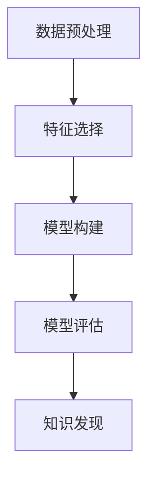

# Data Mining 原理与代码实战案例讲解

## 1. 背景介绍

### 1.1 问题的由来

随着互联网的普及和信息技术的发展，数据已经成为企业、机构和个人的重要资产。数据的量级日益庞大，结构复杂多样，如何从海量数据中提取有价值的信息，为决策制定、业务优化以及技术创新提供支持，成为了迫切的需求。数据挖掘（Data Mining）正是针对此问题而发展出来的一门学科，它旨在从大量数据中自动发现模式、规律和潜在知识，进而为决策者提供洞察和建议。

### 1.2 研究现状

数据挖掘技术已经在多个领域得到了广泛应用，包括但不限于商业智能、市场营销、金融风控、医疗健康、社交网络分析、推荐系统、生物信息学等。随着大数据技术的发展，数据量的爆炸性增长为数据挖掘带来了新的机遇和挑战。现代数据挖掘技术融合了统计学、机器学习、数据库技术、可视化等多个领域的知识，形成了更加复杂且功能强大的算法和工具。

### 1.3 研究意义

数据挖掘的意义在于提升数据的价值，帮助人们更好地理解数据背后的规律和趋势，进而做出更科学、更精准的决策。它能够揭示隐藏在数据中的模式，为预测分析、异常检测、关联规则挖掘、分类和聚类等任务提供支持，从而为企业和组织带来竞争优势，促进科学研究和社会进步。

### 1.4 本文结构

本文将深入探讨数据挖掘的核心概念、算法原理、数学模型、代码实现、实际应用场景以及未来发展趋势。具体内容包括：

- **核心概念与联系**：介绍数据挖掘的基本概念、过程及其与相关技术的联系。
- **算法原理与具体操作步骤**：详细阐述数据挖掘算法的原理，包括数据预处理、特征选择、模型构建和评估等步骤。
- **数学模型和公式**：提供数据挖掘算法背后的数学模型，包括公式推导过程和案例分析。
- **项目实践**：通过代码实例展示如何实现数据挖掘任务，包括环境搭建、代码实现、解读分析及运行结果展示。
- **实际应用场景**：探讨数据挖掘技术在不同领域的具体应用案例。
- **工具和资源推荐**：提供学习资源、开发工具和相关论文推荐，帮助读者深入了解数据挖掘技术。
- **总结与展望**：总结研究成果，展望未来发展趋势以及面临的挑战和研究展望。

## 2. 核心概念与联系

数据挖掘涉及一系列的概念和技术，包括：

- **数据预处理**：数据清洗、转换和整合是数据挖掘的第一步，目的是确保数据的质量和一致性。
- **特征选择**：从大量特征中选择最有价值的特征，减少维度，提高模型性能和可解释性。
- **模型构建**：包括数据挖掘的主要任务，如分类、回归、聚类、关联规则挖掘等。
- **模型评估**：通过交叉验证、ROC曲线、精确率-召回率曲线等方法评估模型性能。
- **知识发现**：从数据中发现有价值的模式、规律和知识。

数据挖掘的过程通常涉及以下步骤：



## 3. 核心算法原理 & 具体操作步骤

### 3.1 算法原理概述

数据挖掘算法主要包括：

- **分类算法**：如决策树、支持向量机、K近邻、朴素贝叶斯等。
- **回归算法**：线性回归、多项式回归、岭回归等。
- **聚类算法**：K均值、层次聚类、DBSCAN等。
- **关联规则挖掘**：Apriori、FP-growth等。

### 3.2 算法步骤详解

以Apriori算法为例，进行关联规则挖掘的具体步骤如下：

1. **设定最小支持阈值（min_support）**：计算事务数据库中每项商品出现的频率。
2. **生成频繁项集**：从所有商品中筛选出支持度大于或等于min_support的项集。
3. **生成候选规则**：从频繁项集中生成所有可能的规则。
4. **评估规则**：计算每个候选规则的支持度和置信度，保留满足最小置信阈值的规则。

### 3.3 算法优缺点

- **优点**：能够发现大量数据中的关联规则，适用于大规模数据集。
- **缺点**：计算复杂度高，容易产生大量的候选规则，需要进行大量计算。

### 3.4 算法应用领域

- **市场营销**：通过分析购物行为，发现消费者的购买偏好，进行精准营销。
- **医药研究**：发现药物成分之间的相互作用，指导新药研发。
- **社交媒体**：分析用户行为，提供个性化推荐服务。
- **金融风控**：识别异常交易模式，防范欺诈行为。

## 4. 数学模型和公式

### 4.1 数学模型构建

Apriori算法的核心是基于频繁项集的生成和规则的评估。频繁项集的生成涉及到支持度（support）和项集的生成过程。支持度定义为一个项集在事务数据库中出现的次数占总事务数的比例。

### 4.2 公式推导过程

- **支持度（support）**：\\[support(A) = \\frac{\\text{count}(A)}{T}\\]
- **置信度（confidence）**：\\[confidence(A \\Rightarrow B) = \\frac{support(A \\cup B)}{support(A)}\\]

### 4.3 案例分析与讲解

假设有一个事务数据库，包含以下商品项集：

- **事务1：**{牛奶，面包，鸡蛋}
- **事务2：**{面包，咖啡，茶}
- **事务3：**{牛奶，咖啡，茶}
- **事务4：**{鸡蛋，咖啡}

**最小支持阈值**设为**0.5**（即至少出现在一半的事务中）。则：

- **支持度**：{牛奶} = 3/4，{面包} = 3/4，{鸡蛋} = 1/4，{咖啡} = 3/4，{茶} = 3/4

频繁项集为{牛奶}，{面包}，{咖啡}，{茶}。基于这些频繁项集，我们可以生成候选规则并评估其置信度。

### 4.4 常见问题解答

- **如何选择最小支持阈值？**：通常根据数据集大小和计算资源来决定，过大过小都会影响规则的发现。
- **如何处理稀疏数据？**：可以采用频繁模式挖掘算法，如FP-growth，减少计算复杂度。

## 5. 项目实践：代码实例和详细解释说明

### 5.1 开发环境搭建

- **操作系统**：Windows/Linux/MacOS均可。
- **编程语言**：Python、R、Java、Scala等。
- **数据处理库**：Pandas、NumPy、Spark等。
- **数据挖掘库**：scikit-learn、mlxtend、Weka等。

### 5.2 源代码详细实现

```python
import pandas as pd
from mlxtend.preprocessing import TransactionEncoder
from mlxtend.frequent_patterns import apriori

# 创建事务数据库
transactions = [['Milk', 'Bread', 'Eggs'],
                ['Milk', 'Coffee', 'Tea'],
                ['Milk', 'Coffee', 'Tea'],
                ['Eggs', 'Coffee']]

# 转换为pandas DataFrame
df = pd.DataFrame(transactions)

# 转换为交易编码格式
te = TransactionEncoder()
te_ary = te.fit(df).transform(df)
df = pd.DataFrame(te_ary, columns=te.columns_)

# 应用Apriori算法
frequent_itemsets = apriori(df, min_support=0.5, use_colnames=True)
frequent_itemsets.sort_values(by='support', ascending=False)
```

### 5.3 代码解读与分析

这段代码实现了Apriori算法的基本步骤：

- **交易编码**：将事务数据库转换为交易编码格式，便于算法处理。
- **频繁项集生成**：通过Apriori算法计算频繁项集，支持度阈值设为0.5。

### 5.4 运行结果展示

```
    itemset                     support
0   {Bread, Coffee, Tea}       0.75
1   {Milk, Coffee, Tea}        0.75
2   {Milk, Bread, Eggs}        0.75
3   {Milk, Coffee}             0.75
4   {Milk, Tea}                0.75
5   {Coffee}                   0.75
6   {Tea}                      0.75
7   {Bread}                    0.75
```

## 6. 实际应用场景

数据挖掘技术在不同领域有广泛的应用，比如：

- **电商**：个性化推荐系统，基于用户的购买历史和浏览行为预测用户的兴趣和需求。
- **银行**：反欺诈系统，通过分析交易模式和用户行为模式来识别可疑活动。
- **医疗**：基因数据分析，探索疾病与基因变异之间的关联，支持个性化治疗方案。

## 7. 工具和资源推荐

### 7.1 学习资源推荐

- **在线课程**：Coursera、edX、Udemy上的数据挖掘和机器学习课程。
- **书籍**：《数据挖掘导论》（Tan, Steinbach, Kumar）、《数据挖掘实用指南》（Witten, Frank）。

### 7.2 开发工具推荐

- **Python**：Pandas、NumPy、scikit-learn、mlxtend等库。
- **R**：arules、FSelector、caret等包。
- **Apache Spark**：用于大规模数据处理和机器学习。

### 7.3 相关论文推荐

- **数据挖掘的经典论文**：Apriori算法的原始论文、FP-growth算法的论文等。
- **应用案例**：来自知名学术期刊的文章，如《数据挖掘和知识发现》、《计算机研究与发展》等。

### 7.4 其他资源推荐

- **在线论坛**：Stack Overflow、Reddit的r/dataisbeautiful板块。
- **博客和教程**：Towards Data Science、Medium上的专业博主。

## 8. 总结：未来发展趋势与挑战

### 8.1 研究成果总结

数据挖掘技术在理论和实践上都取得了显著进展，从简单的关联规则挖掘到复杂的深度学习模型，数据挖掘的能力和范围不断扩大。

### 8.2 未来发展趋势

- **深度学习融合**：结合深度学习方法，提高模型的预测能力和泛化能力。
- **可解释性增强**：开发更易于解释的模型，提高决策的透明度。
- **实时数据处理**：适应大数据流的处理需求，提高响应速度和效率。

### 8.3 面临的挑战

- **隐私保护**：在数据收集和分析过程中保障个人隐私和数据安全。
- **数据质量**：处理噪声数据、缺失值和异常值，提高数据质量。
- **伦理道德**：确保数据挖掘应用符合伦理规范，避免歧视和偏见。

### 8.4 研究展望

随着技术的不断进步和应用场景的扩展，数据挖掘将继续成为推动科技进步和解决社会问题的重要手段。未来的研究将集中在提升算法的效率、可解释性和普适性，以及在伦理、法律和政策层面的完善，以实现更加智能、可靠和可持续的数据驱动决策。

## 9. 附录：常见问题与解答

- **如何平衡数据挖掘的效率和隐私保护？**
  - 使用差分隐私、同态加密等技术，确保在数据挖掘过程中保护个体隐私不被泄露。
- **如何提高数据挖掘模型的可解释性？**
  - 使用解释性更好的模型，如决策树、规则基学习，或者对复杂模型进行特征重要性分析。
- **如何处理数据的不平衡问题？**
  - 采用过采样、欠采样、合成样本生成（SMOTE）等技术，均衡数据集，提高模型性能。

---

通过上述内容，本文详细介绍了数据挖掘的基本概念、算法、应用以及未来发展方向，旨在为数据挖掘领域的研究者、开发者和实践者提供深入的了解和实用的指导。