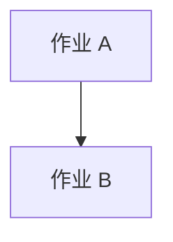

# Oozie工作流调度系统原理与代码实例讲解

## 1. 背景介绍

### 1.1 问题的由来

随着大数据和云计算技术的快速发展，数据处理需求日益增长，尤其是对大规模数据集进行实时或批量处理的需求。Apache Oozie 是 Apache Hadoop 生态系统中的一款工作流管理系统，旨在简化复杂数据处理流程的设计和执行。它提供了一种方式来编排和管理数据处理任务，包括数据收集、清洗、转换以及数据分析等步骤，使得开发者能够专注于业务逻辑，而无需关心任务之间的依赖关系和调度细节。

### 1.2 研究现状

目前，Apache Oozie 已经成为企业级大数据平台中的重要组件之一，支持多种计算框架（如 Hadoop、Spark、Flink 等）的任务调度。它不仅提供了强大的工作流执行能力，还支持动态任务调度、故障恢复以及任务监控等功能，极大地提高了数据处理的灵活性和可靠性。

### 1.3 研究意义

研究 Oozie 的原理与实践具有重要意义。一方面，它可以提升大数据处理流程的自动化程度，减少人工干预，提高工作效率。另一方面，对于理解和优化大数据处理流程中的复杂任务调度，Oozie 提供了直观且易于维护的解决方案。此外，深入理解 Oozie 还能为开发者提供更加灵活的工作流设计模式，促进大规模数据处理系统的高效部署和运行。

### 1.4 本文结构

本文将从核心概念与联系、算法原理、数学模型与公式、代码实例、实际应用场景、工具推荐、总结与展望等多个角度全面探讨 Oozie 工作流调度系统。我们将详细解释 Oozie 的工作流程、关键技术点以及其实现细节，同时提供代码实例来加深理解，并讨论其在现代大数据处理中的应用和发展趋势。

## 2. 核心概念与联系

### 2.1 Oozie 的核心概念

- **工作流（Workflow）**：由一系列任务构成的流程，每个任务可以是数据处理任务、脚本执行、文件存储操作等。
- **作业（Job）**：Oozie 中的一个任务单元，可以是任何可执行的操作，如 MapReduce、Spark 作业或外部命令。
- **依赖（Dependencies）**：任务之间的相互关系，确保某些任务在其他任务完成后才执行。
- **调度（Scheduling）**：定义作业的执行时间、频率以及执行策略。
- **监控（Monitoring）**：跟踪作业的状态，确保任务正确执行并及时发现异常。

### 2.2 Oozie 的工作流程

Oozie 通过一个中央服务节点来协调工作流的执行。开发者编写工作流描述文件（通常为 XML 文件），该文件包含了任务列表、任务之间的依赖关系、调度策略以及监控指标等信息。当工作流被提交到 Oozie 服务器时，服务器会根据描述文件的内容启动相应的作业，并根据定义的依赖关系和调度策略安排任务执行顺序。

## 3. 核心算法原理与具体操作步骤

### 3.1 算法原理概述

Oozie 的核心算法基于有向无环图（DAG，Directed Acyclic Graph）来表示工作流，其中每个节点代表一个任务，边表示任务之间的依赖关系。算法通过遍历这个图来确定任务的执行顺序，并根据调度策略安排任务执行的时间和频率。

### 3.2 算法步骤详解

1. **工作流定义**：开发者使用 XML 描述文件定义工作流，指定任务、依赖关系、调度策略等。
2. **工作流提交**：将工作流描述文件提交到 Oozie 服务器，服务器接收请求并开始处理。
3. **任务调度**：服务器根据工作流描述中的依赖关系和调度策略，计算任务执行顺序和时间安排。
4. **任务执行**：服务器启动每个任务，通常通过调用相应的作业运行器（如 Hadoop 的 JobTracker 或 Spark 的集群管理器）来执行任务。
5. **任务监控**：服务器持续监控任务状态，确保任务按计划执行，并记录任务执行结果。
6. **任务完成**：当所有任务执行完毕，工作流完成，服务器通知完成状态。

### 3.3 算法优缺点

优点：
- **简化任务调度**：自动处理任务之间的依赖关系和执行顺序，减轻开发者负担。
- **增强可维护性**：提供统一的平台来管理和监控数据处理流程，便于维护和扩展。

缺点：
- **复杂性增加**：工作流设计和管理较为复杂，需要额外的学习成本。
- **资源消耗**：服务器需要处理大量的调度和监控任务，可能导致资源消耗较高。

### 3.4 算法应用领域

Oozie 主要应用于以下领域：
- **大数据处理**：Hadoop、Spark 等分布式计算框架的任务调度。
- **机器学习**：训练和部署机器学习模型的流水线管理。
- **实时数据处理**：构建实时数据处理流程，如日志处理、监控警报等。

## 4. 数学模型和公式

### 4.1 数学模型构建

在构建 Oozie 工作流时，可以将工作流视为有向无环图（DAG），其中每个节点表示一个作业，边表示作业之间的依赖关系。可以用以下数学模型来表示工作流：

设 \\( W = (V, E) \\) 为工作流图，其中 \\( V \\) 是节点集合（代表作业），\\( E \\) 是边集合（代表依赖关系）。每个节点 \\( v_i \\) 有一个输入集合 \\( I(v_i) \\) 和一个输出集合 \\( O(v_i) \\)，表示依赖于 \\( v_i \\) 的节点集合和 \\( v_i \\) 依赖的节点集合。

### 4.2 公式推导过程

在 Oozie 中，依赖关系可以表示为：

\\[ \\forall e=(v_i, v_j) \\in E, \\text{ 且 } v_i \\in I(v_j) \\]

这意味着节点 \\( v_j \\) 依赖于节点 \\( v_i \\)，即 \\( v_i \\) 的输出是 \\( v_j \\) 的输入。

### 4.3 案例分析与讲解

考虑一个简单的 Oozie 工作流，包含两个 MapReduce 作业：作业 A 和作业 B，其中作业 A 的输出是作业 B 的输入：



在这种情况下，我们可以通过遍历 Dijkstra 算法或拓扑排序算法来确定作业执行顺序，确保作业 B 只在作业 A 完成后开始执行。

### 4.4 常见问题解答

- **如何解决并发执行的问题？**
  使用 Oozie 的并发执行功能，可以控制作业的并行度，避免资源冲突。

- **如何监控工作流状态？**
  Oozie 提供实时监控功能，可以查看每个作业的状态、执行时间和错误信息。

## 5. 项目实践：代码实例和详细解释说明

### 5.1 开发环境搭建

在开始编写 Oozie 工作流之前，确保你的开发环境中已安装 Apache Hadoop 和 Apache Oozie。你可以通过 Apache 的官方文档获取详细的安装指南。

### 5.2 源代码详细实现

创建一个新的 Oozie 工作流文件 `my_workflow.xml`，内容如下：

```xml
<?xml version=\"1.0\"?>
<workflow-app xmlns=\"uri:oozie:workflow:0.5\"
              name=\"My Workflow\">
  
  <start to=\"job1\"/>
  
  <sequential>
    <job name=\"job1\">
      <hadoop>
        <command>hadoop jar /path/to/mymapreduce.jar</command>
        <arguments>-input /input/path -output /output/path</arguments>
      </hadoop>
    </job>
    
    <on-success to=\"job2\"/>
    <on-failure to=\"failure\"/>
  </sequential>
  
  <job name=\"job2\">
    <hadoop>
      <command>hadoop jar /path/to/myothermapreduce.jar</command>
      <arguments>-input /input/path -output /output/path</arguments>
    </hadoop>
  </job>
  
  <end/>
  
</workflow-app>
```

### 5.3 代码解读与分析

这段代码定义了一个简单的 Oozie 工作流，包含两个 MapReduce 作业：job1 和 job2。job1 在成功执行后自动跳转到 job2，失败时则跳转到名为 `failure` 的状态。

### 5.4 运行结果展示

使用 Oozie 的客户端命令 `oozie run` 来提交工作流：

```bash
oozie run -name my_workflow
```

## 6. 实际应用场景

### 6.4 未来应用展望

随着大数据技术的不断进步，Oozie 的应用场景将更加广泛，特别是在实时数据分析、机器学习模型训练、数据整合与清洗等领域。未来，Oozie 可能会集成更多的计算框架支持，提升资源管理效率，以及引入更强大的监控和自动化功能，进一步提升数据处理流程的可靠性和可扩展性。

## 7. 工具和资源推荐

### 7.1 学习资源推荐

- **官方文档**：查阅 Apache Oozie 的官方文档，了解最新功能和最佳实践。
- **教程视频**：在线教程网站和社区提供的 Oozie 教程视频，帮助新手快速上手。

### 7.2 开发工具推荐

- **IDE**：IntelliJ IDEA、Eclipse、Visual Studio Code，这些 IDE 支持 Java、Hadoop 和相关框架的开发。
- **版本控制**：Git，用于管理代码版本和协作开发。

### 7.3 相关论文推荐

- **Apache Oozie 文档**：深入研究官方文档中的设计原则和技术细节。
- **学术论文**：关注数据处理领域的顶级会议，如 VLDB、ICDE、KDD，查找与 Oozie 相关的论文。

### 7.4 其他资源推荐

- **开源社区**：参与 Apache Oozie 社区论坛，获取支持和分享经验。
- **实践案例**：研究其他公司如何在生产环境中应用 Oozie，获取灵感和最佳实践。

## 8. 总结：未来发展趋势与挑战

### 8.1 研究成果总结

通过深入研究 Oozie 的原理、实践和未来发展趋势，我们可以总结出其在大数据处理中的重要地位。Oozie 提供了强大的工作流管理功能，简化了复杂任务的调度和监控，提升了数据处理流程的效率和可靠性。

### 8.2 未来发展趋势

- **集成更多计算框架**：增强与新兴计算框架的兼容性，如 Apache Beam、Apache Flink。
- **自动化与智能化**：引入机器学习技术，实现工作流的自适应调度和优化。
- **增强安全性**：加强工作流的安全管理，保护敏感数据和资源。

### 8.3 面临的挑战

- **性能优化**：提高工作流执行效率，减少资源消耗。
- **可扩展性**：适应大规模数据处理需求，提升容错能力和负载均衡能力。

### 8.4 研究展望

Oozie 的未来发展充满机遇，通过技术创新和优化，有望在大数据处理领域发挥更大的作用，推动数据驱动决策的实施，为各行各业带来更高效的数据分析解决方案。

## 9. 附录：常见问题与解答

### 9.1 如何解决 Oozie 工作流执行失败的问题？

检查工作流中的错误日志，确认失败的具体原因。可能是输入数据不正确、作业配置错误或资源不足等问题。根据错误信息调整工作流或相关作业配置。

### 9.2 如何在 Oozie 中实现作业的并行执行？

通过在工作流中使用 `parallel` 关键字或 `foreach` 关键字来定义并行执行的作业。确保并行执行的作业之间没有依赖关系。

### 9.3 如何监控 Oozie 工作流的执行状态？

使用 Oozie 的监控功能，通过命令 `oozie admin -list jobs` 查看所有工作流的状态，或者通过 Web UI 监控工作流的执行情况。

---

以上是关于 Oozie 工作流调度系统原理与代码实例讲解的详细内容，希望能帮助你深入了解 Oozie 的功能和应用，以及其在大数据处理领域的潜力和未来发展。