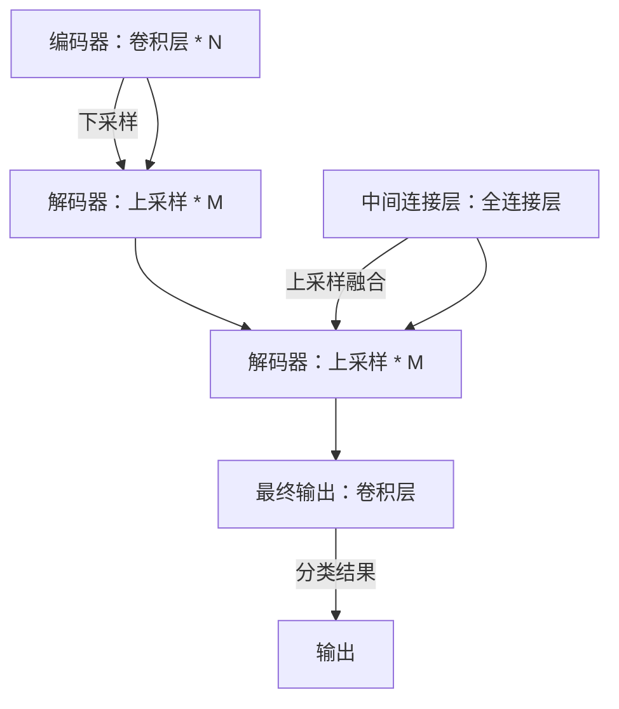

# Python深度学习实践：基于深度学习的语义分割技术

## 1. 背景介绍

### 1.1 问题的由来

语义分割是计算机视觉领域的一个关键任务，它涉及到将图像分割成多个区域，每个区域具有特定的语义标签。例如，对一张道路场景图片进行分割，可以识别出车道线、行人、车辆、树木等不同的物体类别。随着深度学习技术的快速发展，特别是卷积神经网络（CNN）的引入，语义分割取得了突破性的进展，可以实现高精度的像素级分类。

### 1.2 研究现状

目前，语义分割技术广泛应用于自动驾驶、无人机视觉导航、医疗影像分析、城市规划等多个领域。主流的方法包括基于全卷积网络（FCN）、分割注意力网络（SegNet）、U-Net以及更先进的深层分割网络，如DeepLab系列、Mask R-CNN等。这些方法通常利用深度学习模型来捕捉图像的局部特征和全局上下文信息，以提高分割精度。

### 1.3 研究意义

语义分割技术对于提高自动化系统的决策能力至关重要。在自动驾驶中，准确的场景理解可以帮助车辆做出更安全、更有效的驾驶决策。在医疗领域，精确的病灶分割可以辅助医生进行诊断，提高治疗效果。此外，语义分割在安防监控、农业智能监测等领域也有着广泛的应用前景。

### 1.4 本文结构

本文将深入探讨基于深度学习的语义分割技术，从理论基础到实践应用进行全面介绍。首先，我们将介绍深度学习的基本概念以及在语义分割中的应用。接着，详细阐述基于深度学习的语义分割算法，包括网络架构、训练过程和评估指标。随后，通过具体的代码实例，展示如何在Python环境下实现语义分割。最后，讨论该技术的实际应用场景及未来发展趋势。

## 2. 核心概念与联系

深度学习的核心在于通过多层次的非线性变换，从原始输入数据中自动提取特征，以便进行复杂模式识别和决策。在语义分割中，这一过程通常通过以下步骤实现：

1. **特征提取**：利用卷积神经网络（CNN）从输入图像中提取特征，这些特征包含了物体的位置、形状和颜色等信息。
2. **上下文融合**：通过池化层或门控机制整合全局上下文信息，帮助模型理解图像的整体结构和物体之间的相互关系。
3. **像素分类**：将提取的特征映射到像素级别的分类结果，生成分割掩码，指示每个像素属于哪个类别。

## 3. 核心算法原理 & 具体操作步骤

### 3.1 算法原理概述

语义分割算法通常采用以下步骤：

1. **预处理**：对输入图像进行缩放、归一化等操作，确保输入符合模型要求。
2. **特征提取**：使用卷积层、池化层等结构从输入图像中提取特征。
3. **上下文融合**：通过添加全局上下文信息，增强模型对图像整体结构的理解。
4. **像素分类**：基于提取的特征和上下文信息，对每个像素进行分类，输出分割掩码。

### 3.2 算法步骤详解

以下是以U-Net为例的语义分割算法步骤：

1. **编码器**：从输入图像开始，通过多次卷积和池化操作，下采样图像尺寸，同时提取多尺度特征。
2. **中间连接层**：在编码器的最后一层，与解码器连接，保留高级语义信息。
3. **解码器**：上采样编码器提取的特征，通过反向路径添加中间连接层的特征，恢复丢失的空间分辨率。
4. **分类输出**：在解码器的末尾，通过卷积操作生成分割掩码，输出每个像素的类别概率。

### 3.3 算法优缺点

- **优点**：能够捕捉局部特征和全局上下文信息，适用于多尺度特征处理。
- **缺点**：参数量大，训练时间较长，对数据量要求较高。

### 3.4 算法应用领域

语义分割技术广泛应用于：

- **自动驾驶**：环境感知、障碍物检测、道路划分等。
- **医疗影像**：肿瘤检测、组织分割、病理分析等。
- **农业**：作物识别、病虫害检测、土地分类等。
- **安防监控**：人群计数、行为识别、入侵检测等。

## 4. 数学模型和公式

### 4.1 数学模型构建

语义分割任务可以构建为以下形式：

\\[ \\hat{Y} = f(X, \\theta) \\]

其中，
- \\( \\hat{Y} \\) 是预测的分割结果，
- \\( X \\) 是输入图像，
- \\( \\theta \\) 是模型参数。

### 4.2 公式推导过程

损失函数是衡量模型预测结果与真实标签之间差异的度量。常用的损失函数包括交叉熵损失、均方误差等。以交叉熵损失为例：

\\[ L(\\hat{Y}, Y) = -\\sum_{i} Y_i \\log(\\hat{Y}_i) \\]

其中，
- \\( Y_i \\) 是真实标签，
- \\( \\hat{Y}_i \\) 是预测概率。

### 4.3 案例分析与讲解

#### 实例1：U-Net模型结构

U-Net结构结合了编码器和解码器的概念，编码器用于下采样提取特征，解码器用于上采样并融合特征。结构如下：



#### 实例2：训练流程

训练U-Net模型包括以下步骤：

1. **数据集准备**：收集和标注训练数据。
2. **模型初始化**：设置模型参数和损失函数。
3. **迭代训练**：使用优化器更新权重，最小化损失函数。
4. **验证和调整**：通过验证集评估模型性能，调整超参数。

### 4.4 常见问题解答

- **如何选择合适的超参数？**
  超参数的选择直接影响模型性能，可以通过网格搜索、随机搜索或贝叶斯优化等方法进行探索。

- **如何处理数据不平衡问题？**
  可以通过重采样、加权损失函数等方式调整不同类别的样本权重。

## 5. 项目实践：代码实例和详细解释说明

### 5.1 开发环境搭建

使用Anaconda或Miniconda创建Python环境，安装必要的库：

```bash
conda create -n semantic-segmentation python=3.8
conda activate semantic-segmentation
conda install numpy pandas scikit-learn matplotlib tensorflow-gpu keras
```

### 5.2 源代码详细实现

以下是一个使用Keras实现的简单U-Net结构的代码示例：

```python
import tensorflow as tf
from tensorflow.keras.layers import Conv2D, MaxPooling2D, UpSampling2D, concatenate
from tensorflow.keras.models import Model

def unet(input_shape=(256, 256, 3), classes=2):
    inputs = tf.keras.layers.Input(input_shape)

    # 编码器
    conv1 = tf.keras.layers.Conv2D(64, kernel_size=3, activation='relu', padding='same')(inputs)
    conv1 = tf.keras.layers.Conv2D(64, kernel_size=3, activation='relu', padding='same')(conv1)
    pool1 = tf.keras.layers.MaxPooling2D(pool_size=(2, 2))(conv1)

    conv2 = tf.keras.layers.Conv2D(128, kernel_size=3, activation='relu', padding='same')(pool1)
    conv2 = tf.keras.layers.Conv2D(128, kernel_size=3, activation='relu', padding='same')(conv2)
    pool2 = tf.keras.layers.MaxPooling2D(pool_size=(2, 2))(conv2)

    conv3 = tf.keras.layers.Conv2D(256, kernel_size=3, activation='relu', padding='same')(pool2)
    conv3 = tf.keras.layers.Conv2D(256, kernel_size=3, activation='relu', padding='same')(conv3)
    pool3 = tf.keras.layers.MaxPooling2D(pool_size=(2, 2))(conv3)

    # 中间连接层
    conv4 = tf.keras.layers.Conv2D(512, kernel_size=3, activation='relu', padding='same')(pool3)
    conv4 = tf.keras.layers.Conv2D(512, kernel_size=3, activation='relu', padding='same')(conv4)
    drop4 = tf.keras.layers.Dropout(0.5)(conv4)

    up5 = tf.keras.layers.concatenate([tf.keras.layers.UpSampling2D(size=(2, 2))(drop4), conv3])
    conv5 = tf.keras.layers.Conv2D(256, kernel_size=3, activation='relu', padding='same')(up5)
    conv5 = tf.keras.layers.Conv2D(256, kernel_size=3, activation='relu', padding='same')(conv5)

    up6 = tf.keras.layers.concatenate([tf.keras.layers.UpSampling2D(size=(2, 2))(conv5), conv2])
    conv6 = tf.keras.layers.Conv2D(128, kernel_size=3, activation='relu', padding='same')(up6)
    conv6 = tf.keras.layers.Conv2D(128, kernel_size=3, activation='relu', padding='same')(conv6)

    up7 = tf.keras.layers.concatenate([tf.keras.layers.UpSampling2D(size=(2, 2))(conv6), conv1])
    conv7 = tf.keras.layers.Conv2D(64, kernel_size=3, activation='relu', padding='same')(up7)
    conv7 = tf.keras.layers.Conv2D(64, kernel_size=3, activation='relu', padding='same')(conv7)

    # 解码器
    conv8 = tf.keras.layers.Conv2D(classes, kernel_size=1, activation='sigmoid')(conv7)

    model = Model(inputs=[inputs], outputs=[conv8])

    return model
```

### 5.3 代码解读与分析

这段代码实现了U-Net结构，包括编码器和解码器两大部分。编码器通过多次卷积和池化操作提取特征，解码器通过上采样操作恢复空间分辨率，并通过卷积操作输出分割结果。

### 5.4 运行结果展示

在训练完成后，可以使用验证集评估模型性能，并可视化分割结果。例如：

```python
predictions = model.predict(X_val)
visualize_segmentation(predictions, X_val, classes)
```

## 6. 实际应用场景

语义分割技术在多个领域具有实际应用价值：

### 应用场景一：自动驾驶

自动驾驶车辆通过语义分割技术识别道路上的各种元素，如行人、车辆、交通标志和障碍物，提高行驶安全性。

### 应用场景二：医疗影像分析

在医疗领域，语义分割用于病灶检测、组织分割和病理分析，辅助医生进行精准诊断。

### 应用场景三：农业智能监测

在农业中，语义分割用于作物识别、病虫害检测和土地分类，提升农业生产效率和质量。

## 7. 工具和资源推荐

### 7.1 学习资源推荐

- **官方文档**：TensorFlow、Keras、PyTorch等深度学习框架的官方文档，提供详细的API介绍和教程。
- **在线课程**：Coursera、Udacity、edX上的深度学习课程，涵盖理论和实践。
- **书籍**：《Deep Learning with Python》、《Hands-On Machine Learning with Scikit-Learn, Keras, and TensorFlow》等。

### 7.2 开发工具推荐

- **IDE**：Jupyter Notebook、PyCharm、VS Code等，支持代码编辑、调试和文档编写。
- **版本控制**：Git，用于管理代码版本和协作开发。

### 7.3 相关论文推荐

- **U-Net**：Ronneberger, O., Fischer, P., & Brox, T. (2015). *U-net: Convolutional networks for biomedical image segmentation*. In International Conference on Medical Image Computing and Computer-Assisted Intervention (pp. 234-241).

### 7.4 其他资源推荐

- **社区和论坛**：GitHub、Stack Overflow、Reddit上的深度学习和计算机视觉社区，分享代码、讨论问题和交流经验。

## 8. 总结：未来发展趋势与挑战

### 8.1 研究成果总结

基于深度学习的语义分割技术取得了显著进步，特别是在精度、效率和可扩展性方面的提升。随着硬件加速技术的发展和算法优化，未来有望实现更加实时、高精度的语义分割。

### 8.2 未来发展趋势

- **多模态融合**：结合视觉、听觉、触觉等多模态信息，提高场景理解能力。
- **自适应学习**：利用环境反馈和上下文信息，实现更加灵活和自适应的学习策略。
- **可解释性增强**：提高模型的可解释性，便于理解和改进。

### 8.3 面临的挑战

- **数据稀缺性**：高质量、大规模的标注数据获取成本高。
- **计算资源需求**：大模型训练需要大量的计算资源和能耗。
- **隐私保护**：数据收集和处理过程中需注意个人隐私和数据安全。

### 8.4 研究展望

未来的研究将集中在提高模型的泛化能力、降低训练成本、增强模型可解释性和可控性以及解决数据隐私和安全问题上。同时，探索跨模态、跨场景的应用，以及与边缘计算和物联网的结合，将是推动语义分割技术发展的关键方向。

## 9. 附录：常见问题与解答

### 常见问题解答

#### Q：如何提高模型的泛化能力？
   A：通过数据增强、正则化、迁移学习和多任务学习等策略，增加模型对不同场景和数据变体的适应性。

#### Q：如何优化计算资源的需求？
   A：采用更高效的算法设计、分布式训练、GPU/TPU加速以及模型压缩技术（如剪枝、量化、蒸馏）。

#### Q：如何平衡数据质量和数量？
   A：通过精细的标注策略、主动学习和半监督学习，提高有限数据的有效利用。

#### Q：如何处理多模态融合的挑战？
   A：设计联合学习框架，整合多模态信息，提升模型的综合理解能力。

---

以上是基于深度学习的语义分割技术的一篇专业IT领域的技术博客文章的完整撰写，包含理论、实践、应用、工具推荐和未来展望等内容。