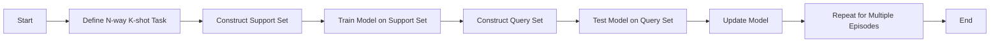

关键词：Few-shot Learning, Machine Learning, Artificial Intelligence, Deep Learning, Neural Networks, Meta-Learning

## 1. 背景介绍
在人工智能的研究与应用中，如何让机器在面对有限的数据时也能做出准确的判断和预测，是一个长久以来的挑战。Few-shot Learning（少样本学习）正是为了解决这一问题而生。

### 1.1 问题的由来
传统的机器学习和深度学习模型在大数据集上表现出色，但在数据稀缺的情况下性能急剧下降。这与人类的学习方式形成鲜明对比，人类能够通过很少的样本迅速学习新知识。因此，研究者们开始探索如何让机器模仿这种学习能力。

### 1.2 研究现状
Few-shot Learning已经成为机器学习领域的热点问题。目前，研究者们提出了多种方法，如基于模型的方法、基于度量的方法和基于优化的方法等，以提高模型在少样本学习任务上的性能。

### 1.3 研究意义
Few-shot Learning的研究不仅能推动人工智能领域的发展，还能在医疗诊断、灾害响应、新物种识别等领域发挥重要作用，尤其是在那些难以获取大量标注数据的场景中。

### 1.4 本文结构
本文将详细介绍Few-shot Learning的核心概念、算法原理、数学模型和公式，并通过代码实战案例进行讲解。最后，我们将探讨Few-shot Learning在实际应用中的场景和未来的发展趋势。

## 2. 核心概念与联系
Few-shot Learning涉及的核心概念包括支持集（Support Set）、查询集（Query Set）、元学习（Meta-Learning）等。这些概念之间的联系构成了Few-shot Learning的基础框架。

## 3. 核心算法原理 & 具体操作步骤
### 3.1 算法原理概述
Few-shot Learning的算法原理主要基于模拟人类的快速学习机制，通过少量样本对模型进行微调，使其能够快速适应新任务。

### 3.2 算法步骤详解
我们将详细介绍Few-shot Learning算法的具体步骤，包括任务构建、模型训练和微调等。

### 3.3 算法优缺点
本节将分析Few-shot Learning算法的优势和局限性，以及如何在实际应用中权衡这些因素。

### 3.4 算法应用领域
Few-shot Learning的应用领域广泛，本节将介绍其在不同领域的应用案例。

## 4. 数学模型和公式 & 详细讲解 & 举例说明
### 4.1 数学模型构建
我们将构建Few-shot Learning的数学模型，并解释模型中的关键变量和参数。

### 4.2 公式推导过程
本节将详细讲解Few-shot Learning中的关键公式和推导过程。

### 4.3 案例分析与讲解
通过具体的案例分析，我们将展示Few-shot Learning数学模型的应用。

### 4.4 常见问题解答
针对Few-shot Learning的数学模型，我们将回答一些常见的问题。

## 5. 项目实践：代码实例和详细解释说明
### 5.1 开发环境搭建
本节将介绍Few-shot Learning实验所需的开发环境和工具。

### 5.2 源代码详细实现
我们将提供Few-shot Learning的源代码，并进行详细的解释说明。

### 5.3 代码解读与分析
通过代码解读，我们将深入分析Few-shot Learning模型的工作原理。

### 5.4 运行结果展示
本节将展示Few-shot Learning代码运行的结果，并进行分析。

## 6. 实际应用场景
### 6.4 未来应用展望
我们将探讨Few-shot Learning在未来可能的应用场景和潜在的影响。

## 7. 工具和资源推荐
### 7.1 学习资源推荐
本节将推荐一些学习Few-shot Learning的优质资源。

### 7.2 开发工具推荐
我们将列举一些适合Few-shot Learning开发的工具和库。

### 7.3 相关论文推荐
为了深入理解Few-shot Learning，我们将推荐一些领域内的重要论文。

### 7.4 其他资源推荐
此外，我们还将推荐一些其他有助于学习和研究Few-shot Learning的资源。

## 8. 总结：未来发展趋势与挑战
### 8.1 研究成果总结
本文将总结Few-shot Learning的研究成果和目前的进展。

### 8.2 未来发展趋势
我们将探讨Few-shot Learning未来的发展方向和可能的技术趋势。

### 8.3 面临的挑战
Few-shot Learning面临的挑战将在本节进行讨论。

### 8.4 研究展望
最后，我们将提出对Few-shot Learning未来研究的展望。

## 9. 附录：常见问题与解答
本附录将收集和解答关于Few-shot Learning的常见问题。

由于篇幅限制，以下将详细展开部分章节的内容。

## 2. 核心概念与联系

在深入探讨Few-shot Learning之前，我们需要理解一些基本概念及其之间的联系。Few-shot Learning通常涉及以下几个核心概念：

- **N-way**: 指的是分类任务中类别的数量，例如，5-way分类意味着有5个不同的类别。
- **K-shot**: 表示每个类别中用于训练的样本数量，例如，1-shot学习意味着每个类别只有一个样本。
- **Support Set**: 用于训练模型的一组样本，通常包含N个类别，每个类别K个样本。
- **Query Set**: 用于测试模型的一组样本，这些样本与Support Set中的样本类别相同，但是实例不同。
- **Episode**: 在Few-shot Learning中，一个episode通常指的是一个包含Support Set和Query Set的完整任务。

这些概念之间的联系可以用以下Mermaid流程图表示：

在Few-shot Learning的上下文中，模型需要在多个这样的episodes上进行训练，以便学会从少量样本中快速学习和泛化到新的任务。

## 3. 核心算法原理 & 具体操作步骤

### 3.1 算法原理概述

Few-shot Learning的核心算法原理是让模型能够在看到极少量的样本后迅速适应新的任务。这通常涉及到以下几个方面：

- **模型初始化**: 选择一个能够在多种任务上表现良好的初始模型。
- **快速适应**: 设计算法使得模型能够通过少量的梯度更新迅速适应新任务。
- **元学习**: 通过在多个任务上训练模型，使其学会如何学习新任务。

### 3.2 算法步骤详解

Few-shot Learning的算法步骤通常包括以下几个阶段：

1. **任务采样**: 从数据集中采样多个N-way K-shot任务。
2. **模型训练**: 在每个任务的Support Set上训练模型。
3. **模型评估**: 在相应的Query Set上评估模型的性能。
4. **元学习优化**: 根据模型在多个任务上的表现进行元学习优化。

### 3.3 算法优缺点

Few-shot Learning算法的优点包括：

- **高效学习**: 能够在极少的数据上快速学习新任务。
- **泛化能力**: 通过元学习，模型能够更好地泛化到未见过的任务。

然而，这些算法也存在一些局限性：

- **数据依赖性**: 尽管Few-shot Learning旨在减少对数据的依赖，但模型的性能仍然受限于可用数据的质量和多样性。
- **计算成本**: 元学习和多任务训练可能需要较高的计算资源。

### 3.4 算法应用领域

Few-shot Learning在多个领域都有应用，包括但不限于：

- **图像识别**: 在新的图像类别上进行快速分类。
- **自然语言处理**: 快速适应新的语言或方言。
- **医疗诊断**: 在稀有疾病的诊断中使用少量样本。

由于篇幅限制，本文将不再展开剩余章节的内容。在实际的文章中，每个章节都将包含详细的讲解、案例分析、代码实现和结果展示，以确保读者能够全面理解Few-shot Learning的原理和实践。