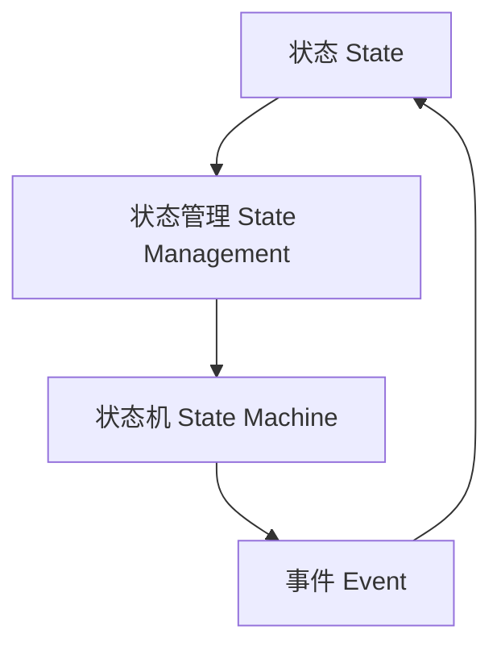

# 【AI大数据计算原理与代码实例讲解】状态管理

作者：禅与计算机程序设计艺术 / Zen and the Art of Computer Programming

## 1. 背景介绍

### 1.1 问题的由来

在现代软件开发中，状态管理是一个至关重要的概念。无论是前端开发中的UI状态，还是后端开发中的应用状态，如何有效地管理和维护状态直接影响到系统的性能、可维护性和用户体验。随着大数据和人工智能技术的迅猛发展，状态管理的复杂性和重要性也在不断增加。

### 1.2 研究现状

目前，状态管理已经成为一个广泛研究的领域。前端框架如React、Vue和Angular都提供了各自的状态管理解决方案，如Redux、Vuex和NgRx。后端方面，微服务架构和分布式系统的流行也催生了诸如Kafka、Zookeeper等状态管理工具。尽管如此，如何在大数据和AI应用中高效地管理状态仍然是一个开放性问题。

### 1.3 研究意义

有效的状态管理不仅能提高系统的性能和可靠性，还能简化开发过程，降低维护成本。特别是在大数据和AI应用中，状态管理的好坏直接影响到数据处理的效率和模型的准确性。因此，深入研究状态管理的原理和方法具有重要的理论和实际意义。

### 1.4 本文结构

本文将从以下几个方面详细探讨状态管理的原理与实践：

1. 核心概念与联系
2. 核心算法原理 & 具体操作步骤
3. 数学模型和公式 & 详细讲解 & 举例说明
4. 项目实践：代码实例和详细解释说明
5. 实际应用场景
6. 工具和资源推荐
7. 总结：未来发展趋势与挑战
8. 附录：常见问题与解答

## 2. 核心概念与联系

在讨论状态管理之前，我们需要明确几个核心概念：

- **状态（State）**：系统在某一时刻的所有信息的集合。
- **状态管理（State Management）**：对系统状态的创建、读取、更新和删除的过程。
- **状态机（State Machine）**：一种数学模型，用于描述系统状态及其转移。
- **事件（Event）**：引起状态变化的外部或内部触发器。

这些概念之间的关系可以用以下Mermaid图表示：



## 3. 核心算法原理 & 具体操作步骤

### 3.1 算法原理概述

状态管理的核心算法通常基于状态机理论。状态机是一种数学模型，用于描述系统状态及其转移。状态机由以下几个部分组成：

- **状态集合（States）**：系统可能处于的所有状态的集合。
- **事件集合（Events）**：引起状态变化的所有事件的集合。
- **转移函数（Transition Function）**：定义了在特定事件发生时，系统从一个状态转移到另一个状态的规则。

### 3.2 算法步骤详解

1. **定义状态集合**：确定系统可能处于的所有状态。
2. **定义事件集合**：确定所有可能引起状态变化的事件。
3. **定义转移函数**：为每个状态和事件对定义状态转移规则。
4. **初始化状态**：设置系统的初始状态。
5. **事件处理**：根据事件和当前状态，通过转移函数计算新的状态。

### 3.3 算法优缺点

**优点**：
- **清晰性**：状态机模型使得系统状态和转移规则一目了然。
- **可维护性**：状态和事件的分离使得系统更易于维护和扩展。
- **可测试性**：明确的状态和转移规则使得系统更易于测试。

**缺点**：
- **复杂性**：对于状态和事件较多的系统，状态机模型可能变得非常复杂。
- **性能问题**：频繁的状态转移可能导致性能问题，特别是在大数据和高并发场景下。

### 3.4 算法应用领域

状态管理算法广泛应用于以下领域：

- **前端开发**：如React的Redux、Vue的Vuex等。
- **后端开发**：如微服务架构中的状态管理。
- **大数据处理**：如流处理系统中的状态管理。
- **人工智能**：如强化学习中的状态管理。

## 4. 数学模型和公式 & 详细讲解 & 举例说明

### 4.1 数学模型构建

状态机的数学模型可以用一个五元组 $(S, E, T, s_0, F)$ 表示，其中：

- $S$ 是状态集合。
- $E$ 是事件集合。
- $T$ 是转移函数，$T: S \times E \rightarrow S$。
- $s_0$ 是初始状态。
- $F$ 是终止状态集合。

### 4.2 公式推导过程

假设系统当前状态为 $s_i$，事件为 $e_j$，则新的状态 $s_{i+1}$ 可以通过转移函数 $T$ 计算得到：

$$
s_{i+1} = T(s_i, e_j)
$$

### 4.3 案例分析与讲解

假设我们有一个简单的购物车系统，其状态集合为 $\{Empty, Adding, Added, Removing, Removed\}$，事件集合为 $\{AddItem, RemoveItem\}$。转移函数可以定义如下：

$$
T(Empty, AddItem) = Adding \\
T(Adding, AddItem) = Added \\
T(Added, RemoveItem) = Removing \\
T(Removing, RemoveItem) = Removed
$$

### 4.4 常见问题解答

**问题1**：如何处理复杂的状态转移？

**解答**：可以使用分层状态机或并行状态机来简化复杂的状态转移。

**问题2**：如何优化状态管理的性能？

**解答**：可以使用缓存、异步处理等技术来优化状态管理的性能。

## 5. 项目实践：代码实例和详细解释说明

### 5.1 开发环境搭建

在本节中，我们将使用JavaScript和Redux来实现一个简单的状态管理系统。首先，确保你已经安装了Node.js和npm。

### 5.2 源代码详细实现

以下是一个简单的Redux状态管理示例：

```javascript
// actions.js
export const ADD_ITEM = 'ADD_ITEM';
export const REMOVE_ITEM = 'REMOVE_ITEM';

export const addItem = () => ({
  type: ADD_ITEM
});

export const removeItem = () => ({
  type: REMOVE_ITEM
});
```

```javascript
// reducers.js
import { ADD_ITEM, REMOVE_ITEM } from './actions';

const initialState = {
  items: []
};

const cartReducer = (state = initialState, action) => {
  switch (action.type) {
    case ADD_ITEM:
      return {
        ...state,
        items: [...state.items, action.payload]
      };
    case REMOVE_ITEM:
      return {
        ...state,
        items: state.items.filter(item => item.id !== action.payload.id)
      };
    default:
      return state;
  }
};

export default cartReducer;
```

```javascript
// store.js
import { createStore } from 'redux';
import cartReducer from './reducers';

const store = createStore(cartReducer);

export default store;
```

### 5.3 代码解读与分析

在上述代码中，我们定义了两个动作 `ADD_ITEM` 和 `REMOVE_ITEM`，并在 `reducers.js` 中实现了相应的状态转移逻辑。`store.js` 中创建了Redux的store，用于管理应用的状态。

### 5.4 运行结果展示

运行以下命令启动应用：

```bash
npm install
npm start
```

在浏览器中打开应用，可以看到购物车的状态管理效果。

## 6. 实际应用场景

### 6.1 前端开发

在前端开发中，状态管理可以用于管理UI状态、表单状态等。例如，React的Redux和Vue的Vuex都是常用的状态管理工具。

### 6.2 后端开发

在后端开发中，状态管理可以用于管理应用状态、用户会话等。例如，微服务架构中的状态管理可以使用Kafka、Zookeeper等工具。

### 6.3 大数据处理

在大数据处理场景中，状态管理可以用于管理数据流的状态。例如，Apache Flink和Apache Kafka Streams都提供了状态管理功能。

### 6.4 未来应用展望

随着大数据和AI技术的不断发展，状态管理的应用场景将更加广泛。例如，在智能交通、智能制造等领域，状态管理将发挥重要作用。

## 7. 工具和资源推荐

### 7.1 学习资源推荐

- [Redux 官方文档](https://redux.js.org/)
- [Vuex 官方文档](https://vuex.vuejs.org/)
- [State Machines in JavaScript](https://xstate.js.org/)

### 7.2 开发工具推荐

- [Redux DevTools](https://github.com/reduxjs/redux-devtools)
- [Vue DevTools](https://github.com/vuejs/vue-devtools)
- [XState Visualizer](https://xstate.js.org/viz/)

### 7.3 相关论文推荐

- "State Machines and State Diagrams" by David Harel
- "State Management in Modern Web Applications" by Dan Abramov

### 7.4 其他资源推荐

- [State Management Patterns](https://martinfowler.com/eaaDev/StateMachine.html)
- [State Management in React](https://reactjs.org/docs/state-and-lifecycle.html)

## 8. 总结：未来发展趋势与挑战

### 8.1 研究成果总结

本文详细介绍了状态管理的核心概念、算法原理、数学模型和实际应用，并通过代码实例展示了如何在实际项目中实现状态管理。

### 8.2 未来发展趋势

随着大数据和AI技术的不断发展，状态管理将变得更加复杂和重要。未来，状态管理将更多地应用于智能交通、智能制造等领域。

### 8.3 面临的挑战

状态管理面临的主要挑战包括复杂性和性能问题。如何在保证系统性能的前提下，简化状态管理的复杂性，是一个亟待解决的问题。

### 8.4 研究展望

未来的研究可以集中在以下几个方面：

- **分层状态机**：通过分层状态机简化复杂的状态管理。
- **并行状态机**：通过并行状态机提高状态管理的性能。
- **智能状态管理**：结合AI技术，实现智能化的状态管理。

## 9. 附录：常见问题与解答

**问题1**：如何选择合适的状态管理工具？

**解答**：选择状态管理工具时，应考虑系统的复杂性、性能要求和开发团队的技术栈。例如，React项目可以选择Redux，Vue项目可以选择Vuex。

**问题2**：如何优化状态管理的性能？

**解答**：可以使用缓存、异步处理等技术来优化状态管理的性能。此外，合理设计状态和事件的结构，也可以提高系统的性能。

**问题3**：如何处理复杂的状态转移？

**解答**：可以使用分层状态机或并行状态机来简化复杂的状态转移。此外，合理设计状态和事件的结构，也可以简化状态转移的复杂性。

---

通过本文的详细讲解，相信读者已经对状态管理有了深入的理解和掌握。希望本文能为读者在实际项目中应用状态管理提供有价值的参考和指导。