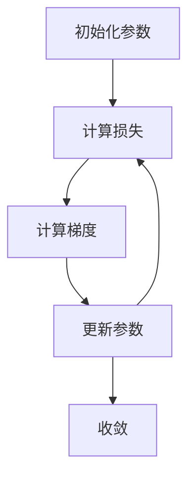

# 优化算法：梯度下降 (Gradient Descent) 原理与代码实例讲解

作者：禅与计算机程序设计艺术 / Zen and the Art of Computer Programming

## 1. 背景介绍

### 1.1 问题的由来

在机器学习和深度学习领域，优化问题是核心问题之一。无论是训练神经网络，还是进行线性回归，优化算法都扮演着至关重要的角色。梯度下降（Gradient Descent）作为一种经典的优化算法，广泛应用于各种机器学习模型的训练过程中。其基本思想是通过不断调整模型参数，使得损失函数逐步减小，从而找到最优解。

### 1.2 研究现状

梯度下降算法自提出以来，已经发展出多种变体，如随机梯度下降（SGD）、小批量梯度下降（Mini-batch Gradient Descent）、动量梯度下降（Momentum Gradient Descent）等。这些变体在不同的应用场景中展现出各自的优势和劣势。此外，近年来，结合深度学习的需求，梯度下降算法的研究也在不断深入，涌现出如Adam、RMSprop等更为复杂和高效的优化算法。

### 1.3 研究意义

理解和掌握梯度下降算法不仅有助于优化机器学习模型的性能，还能为研究和开发新的优化算法提供理论基础。通过深入探讨梯度下降的原理、数学模型和代码实现，读者可以更好地理解其在实际应用中的表现和局限性，从而在实际项目中做出更为合理的选择和调整。

### 1.4 本文结构

本文将从以下几个方面详细讲解梯度下降算法：

1. 核心概念与联系
2. 核心算法原理 & 具体操作步骤
3. 数学模型和公式 & 详细讲解 & 举例说明
4. 项目实践：代码实例和详细解释说明
5. 实际应用场景
6. 工具和资源推荐
7. 总结：未来发展趋势与挑战
8. 附录：常见问题与解答

## 2. 核心概念与联系

在深入探讨梯度下降算法之前，我们需要了解一些基本概念和它们之间的联系。

### 2.1 损失函数

损失函数（Loss Function）是衡量模型预测值与真实值之间差异的函数。常见的损失函数有均方误差（MSE）、交叉熵损失（Cross-Entropy Loss）等。梯度下降算法的目标是通过不断调整模型参数，使得损失函数的值最小化。

### 2.2 梯度

梯度（Gradient）是损失函数对模型参数的偏导数，表示损失函数在参数空间中的变化率。梯度的方向指向损失函数值增加最快的方向，因此，沿着梯度的反方向移动参数，可以使损失函数值减小。

### 2.3 学习率

学习率（Learning Rate）是控制参数更新步长的超参数。学习率过大可能导致参数更新过度，错过最优解；学习率过小则可能导致收敛速度过慢，甚至陷入局部最优解。

### 2.4 参数更新

参数更新是梯度下降算法的核心步骤。通过计算损失函数的梯度，并根据学习率调整参数，使得损失函数值逐步减小。

## 3. 核心算法原理 & 具体操作步骤

### 3.1 算法原理概述

梯度下降算法的基本思想是通过迭代地调整模型参数，使得损失函数逐步减小，最终找到最优解。其核心步骤包括计算梯度、更新参数和重复迭代，直到损失函数收敛到最小值。

### 3.2 算法步骤详解

1. 初始化参数：随机初始化模型参数。
2. 计算损失：根据当前参数计算损失函数值。
3. 计算梯度：计算损失函数对参数的梯度。
4. 更新参数：根据梯度和学习率调整参数。
5. 重复迭代：重复步骤2-4，直到损失函数收敛。



### 3.3 算法优缺点

#### 优点

1. 简单易懂，易于实现。
2. 适用于大多数机器学习模型。
3. 可扩展性强，易于结合其他优化技术。

#### 缺点

1. 依赖于学习率的选择，学习率过大或过小都会影响收敛效果。
2. 容易陷入局部最优解。
3. 对于高维数据，计算梯度的开销较大。

### 3.4 算法应用领域

梯度下降算法广泛应用于各种机器学习和深度学习模型的训练中，如线性回归、逻辑回归、神经网络等。此外，在自然语言处理、计算机视觉等领域，梯度下降算法也是常用的优化工具。

## 4. 数学模型和公式 & 详细讲解 & 举例说明

### 4.1 数学模型构建

假设我们有一个线性回归模型，其损失函数为均方误差（MSE）：

$$
J(\theta) = \frac{1}{2m} \sum_{i=1}^{m} (h_\theta(x^{(i)}) - y^{(i)})^2
$$

其中，$h_\theta(x) = \theta^T x$ 是模型的预测值，$\theta$ 是模型参数，$m$ 是样本数量。

### 4.2 公式推导过程

为了最小化损失函数，我们需要计算其梯度，并根据梯度更新参数。损失函数对参数 $\theta$ 的梯度为：

$$
\frac{\partial J(\theta)}{\partial \theta_j} = \frac{1}{m} \sum_{i=1}^{m} (h_\theta(x^{(i)}) - y^{(i)}) x_j^{(i)}
$$

根据梯度下降算法，参数更新公式为：

$$
\theta_j := \theta_j - \alpha \frac{\partial J(\theta)}{\partial \theta_j}
$$

其中，$\alpha$ 是学习率。

### 4.3 案例分析与讲解

假设我们有一个简单的线性回归问题，数据集如下：

| x | y  |
|---|----|
| 1 | 2  |
| 2 | 2.8|
| 3 | 3.6|
| 4 | 4.4|

我们希望通过梯度下降算法找到最优的线性模型参数 $\theta$。首先，初始化参数 $\theta = [0, 0]$，学习率 $\alpha = 0.01$。然后，按照梯度下降算法的步骤迭代更新参数，直到损失函数收敛。

### 4.4 常见问题解答

#### 问题1：如何选择合适的学习率？

选择合适的学习率是梯度下降算法的关键。一般来说，可以通过实验调整学习率，或者使用学习率衰减技术逐步减小学习率。此外，结合动量、Adam等优化算法也可以有效缓解学习率选择的问题。

#### 问题2：如何避免陷入局部最优解？

为了避免陷入局部最优解，可以采用多次随机初始化参数的方法，或者结合动量、RMSprop等优化算法。此外，使用更复杂的模型和更大的数据集也有助于找到全局最优解。

## 5. 项目实践：代码实例和详细解释说明

### 5.1 开发环境搭建

在进行代码实现之前，我们需要搭建开发环境。本文使用Python编程语言，并依赖于以下库：

- NumPy：用于数值计算
- Matplotlib：用于数据可视化

可以通过以下命令安装所需库：

```bash
pip install numpy matplotlib
```

### 5.2 源代码详细实现

以下是一个简单的线性回归梯度下降算法的实现：

```python
import numpy as np
import matplotlib.pyplot as plt

# 数据集
X = np.array([1, 2, 3, 4])
y = np.array([2, 2.8, 3.6, 4.4])

# 初始化参数
theta = np.zeros(2)
alpha = 0.01
iterations = 1000

# 损失函数
def compute_cost(X, y, theta):
    m = len(y)
    J = np.sum((X.dot(theta) - y) ** 2) / (2 * m)
    return J

# 梯度下降算法
def gradient_descent(X, y, theta, alpha, iterations):
    m = len(y)
    J_history = np.zeros(iterations)
    
    for i in range(iterations):
        gradient = X.T.dot(X.dot(theta) - y) / m
        theta = theta - alpha * gradient
        J_history[i] = compute_cost(X, y, theta)
    
    return theta, J_history

# 添加偏置项
X_b = np.c_[np.ones((len(X), 1)), X]

# 运行梯度下降算法
theta, J_history = gradient_descent(X_b, y, theta, alpha, iterations)

# 打印结果
print("最优参数:", theta)
print("最终损失:", J_history[-1])

# 绘制损失函数变化曲线
plt.plot(J_history)
plt.xlabel("迭代次数")
plt.ylabel("损失函数值")
plt.title("损失函数变化曲线")
plt.show()
```

### 5.3 代码解读与分析

1. 数据集：定义了一个简单的线性回归数据集。
2. 初始化参数：初始化模型参数 $\theta$ 和学习率 $\alpha$。
3. 损失函数：定义了计算损失函数的函数 `compute_cost`。
4. 梯度下降算法：定义了梯度下降算法的函数 `gradient_descent`，包括计算梯度和更新参数的步骤。
5. 添加偏置项：在数据集 `X` 中添加偏置项。
6. 运行梯度下降算法：调用 `gradient_descent` 函数，运行梯度下降算法，得到最优参数和损失函数变化曲线。
7. 打印结果：打印最优参数和最终损失函数值。
8. 绘制损失函数变化曲线：使用Matplotlib绘制损失函数值随迭代次数的变化曲线。

### 5.4 运行结果展示

运行上述代码后，可以得到最优参数和损失函数变化曲线。最优参数表示线性回归模型的最佳拟合结果，损失函数变化曲线展示了梯度下降算法的收敛过程。

## 6. 实际应用场景

### 6.1 机器学习模型训练

梯度下降算法广泛应用于各种机器学习模型的训练中，如线性回归、逻辑回归、支持向量机等。通过不断调整模型参数，使得损失函数最小化，从而找到最优解。

### 6.2 深度学习模型优化

在深度学习领域，梯度下降算法是训练神经网络的核心工具。通过反向传播算法计算梯度，并使用梯度下降算法更新参数，可以有效地训练深度神经网络。

### 6.3 自然语言处理

在自然语言处理领域，梯度下降算法用于训练各种语言模型，如词向量、序列标注模型等。通过优化模型参数，可以提高模型的预测性能和泛化能力。

### 6.4 未来应用展望

随着机器学习和深度学习技术的不断发展，梯度下降算法的应用前景也越来越广阔。未来，结合更多的优化技术和算法变体，梯度下降算法将在更多领域展现出其强大的优化能力。

## 7. 工具和资源推荐

### 7.1 学习资源推荐

1. 书籍：《深度学习》 - Ian Goodfellow, Yoshua Bengio, Aaron Courville
2. 在线课程：Coursera上的《机器学习》 - Andrew Ng
3. 博客：Towards Data Science, Medium上的机器学习专栏

### 7.2 开发工具推荐

1. 编程语言：Python
2. 数值计算库：NumPy, SciPy
3. 数据可视化库：Matplotlib, Seaborn
4. 机器学习框架：Scikit-learn, TensorFlow, PyTorch

### 7.3 相关论文推荐

1. "Gradient-Based Learning Applied to Document Recognition" - Yann LeCun, Léon Bottou, Yoshua Bengio, Patrick Haffner
2. "Adam: A Method for Stochastic Optimization" - Diederik P. Kingma, Jimmy Ba

### 7.4 其他资源推荐

1. GitHub：开源项目和代码库
2. Kaggle：数据科学竞赛平台，提供丰富的数据集和竞赛机会
3. arXiv：最新的机器学习和深度学习研究论文

## 8. 总结：未来发展趋势与挑战

### 8.1 研究成果总结

本文详细介绍了梯度下降算法的原理、数学模型、代码实现和实际应用。通过对梯度下降算法的深入探讨，读者可以更好地理解其在机器学习和深度学习中的重要性和应用场景。

### 8.2 未来发展趋势

随着机器学习和深度学习技术的不断发展，梯度下降算法也在不断演进。未来，结合更多的优化技术和算法变体，如自适应学习率、二阶优化方法等，梯度下降算法将在更多领域展现出其强大的优化能力。

### 8.3 面临的挑战

尽管梯度下降算法在优化问题中表现出色，但仍面临一些挑战，如学习率选择、局部最优解、梯度消失和梯度爆炸等问题。未来的研究将致力于解决这些问题，提高梯度下降算法的稳定性和收敛速度。

### 8.4 研究展望

未来的研究将继续探索梯度下降算法的改进和应用，结合更多的优化技术和算法变体，推动机器学习和深度学习技术的发展。同时，梯度下降算法在实际应用中的表现和优化也将成为研究的重点。

## 9. 附录：常见问题与解答

### 问题1：梯度下降算法的收敛条件是什么？

梯度下降算法的收敛条件是损失函数值逐步减小，最终达到最小值。一般来说，当损失函数值的变化小于某个阈值时，可以认为算法已经收敛。

### 问题2：如何选择合适的初始参数？

选择合适的初始参数可以通过多次随机初始化的方法，或者结合其他优化技术，如动量、RMSprop等。此外，使用更复杂的模型和更大的数据集也有助于找到全局最优解。

### 问题3：梯度下降算法的计算复杂度如何？

梯度下降算法的计算复杂度主要取决于计算梯度的开销。对于高维数据，计算梯度的开销较大，因此需要结合其他优化技术，如小批量梯度下降、动量等，以提高计算效率。

### 问题4：梯度下降算法在实际应用中有哪些注意事项？

在实际应用中，需要注意选择合适的学习率、初始参数和迭代次数。此外，结合其他优化技术，如动量、RMSprop、Adam等，可以提高梯度下降算法的稳定性和收敛速度。

通过本文的详细讲解，读者可以全面了解梯度下降算法的原理、数学模型、代码实现和实际应用，从而在实际项目中更好地应用和优化梯度下降算法。