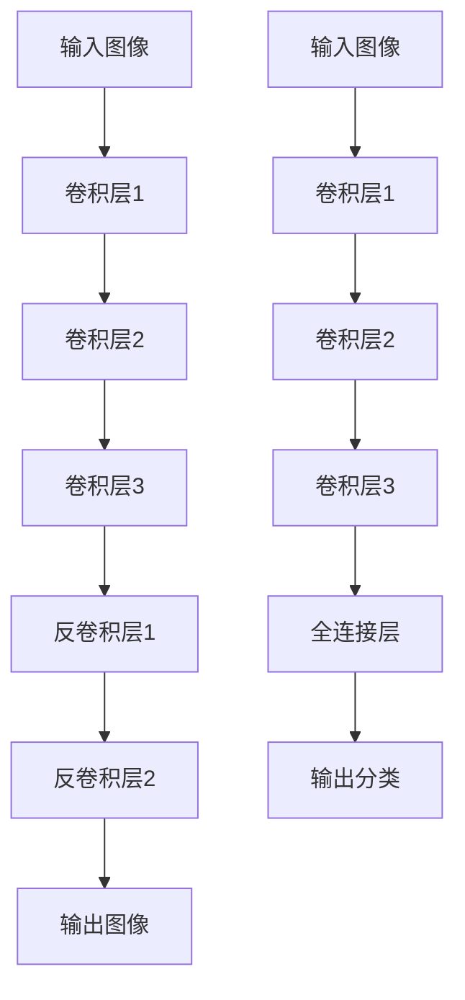

# 基于生成对抗网络的动漫人物绘画风格迁移

作者：禅与计算机程序设计艺术 / Zen and the Art of Computer Programming

## 1. 背景介绍

### 1.1 问题的由来

动漫作为一种独特的艺术形式，深受全球观众的喜爱。不同的动漫作品往往具有独特的绘画风格，这些风格不仅仅是视觉上的差异，更是文化、情感和创意的体现。然而，手工绘制不同风格的动漫人物需要大量的时间和精力，这对艺术家来说是一个巨大的挑战。如何利用人工智能技术，特别是生成对抗网络（GAN），实现动漫人物绘画风格的自动迁移，成为了一个备受关注的研究课题。

### 1.2 研究现状

近年来，生成对抗网络（GAN）在图像生成和风格迁移领域取得了显著的进展。GAN由生成器和判别器两个神经网络组成，通过相互博弈的方式进行训练，生成器生成的图像逐渐逼真，判别器则不断提高对真实图像和生成图像的辨别能力。基于GAN的风格迁移技术已经在照片风格转换、艺术风格迁移等方面取得了成功，但在动漫人物绘画风格迁移方面的研究仍处于起步阶段。

### 1.3 研究意义

通过研究基于GAN的动漫人物绘画风格迁移技术，可以大大降低艺术家在不同风格绘制上的工作量，提高创作效率。同时，这项技术还可以应用于动漫制作、游戏开发、虚拟现实等多个领域，具有广泛的应用前景。此外，深入研究GAN在风格迁移中的应用，也有助于推动人工智能在图像处理领域的发展。

### 1.4 本文结构

本文将详细介绍基于生成对抗网络的动漫人物绘画风格迁移技术，内容包括核心概念与联系、核心算法原理与具体操作步骤、数学模型和公式、项目实践、实际应用场景、工具和资源推荐、总结与未来发展趋势等。具体结构如下：

1. 背景介绍
2. 核心概念与联系
3. 核心算法原理 & 具体操作步骤
4. 数学模型和公式 & 详细讲解 & 举例说明
5. 项目实践：代码实例和详细解释说明
6. 实际应用场景
7. 工具和资源推荐
8. 总结：未来发展趋势与挑战
9. 附录：常见问题与解答

## 2. 核心概念与联系

在深入探讨基于生成对抗网络的动漫人物绘画风格迁移之前，我们需要了解一些核心概念和它们之间的联系。

### 2.1 生成对抗网络（GAN）

生成对抗网络（Generative Adversarial Network, GAN）由Ian Goodfellow等人在2014年提出。GAN由两个神经网络组成：生成器（Generator）和判别器（Discriminator）。生成器负责生成逼真的图像，而判别器则负责区分生成图像和真实图像。生成器和判别器通过相互博弈的方式进行训练，最终生成器能够生成足以欺骗判别器的高质量图像。

### 2.2 风格迁移

风格迁移（Style Transfer）是一种将一种图像的风格应用到另一种图像上的技术。传统的风格迁移方法主要基于卷积神经网络（CNN），通过提取图像的内容特征和风格特征，并将它们进行融合，生成具有目标风格的图像。基于GAN的风格迁移方法则通过生成器和判别器的博弈，实现更加逼真的风格迁移效果。

### 2.3 动漫人物绘画风格

动漫人物绘画风格是指动漫作品中人物形象的绘制风格，包括线条、色彩、阴影、细节等方面的特征。不同的动漫作品往往具有独特的绘画风格，这些风格不仅仅是视觉上的差异，更是文化、情感和创意的体现。

### 2.4 核心联系

基于GAN的动漫人物绘画风格迁移技术，核心在于利用生成对抗网络实现动漫人物图像的风格转换。生成器负责生成具有目标风格的动漫人物图像，判别器则负责区分生成图像和真实图像。通过不断优化生成器和判别器，最终实现高质量的风格迁移效果。

## 3. 核心算法原理 & 具体操作步骤

### 3.1 算法原理概述

基于生成对抗网络的动漫人物绘画风格迁移算法，主要包括以下几个步骤：

1. 数据准备：收集大量具有不同绘画风格的动漫人物图像，构建训练数据集。
2. 网络设计：设计生成器和判别器的网络结构，生成器负责生成具有目标风格的图像，判别器负责区分生成图像和真实图像。
3. 损失函数：定义生成器和判别器的损失函数，生成器的目标是最小化生成图像与目标风格图像之间的差异，判别器的目标是最大化对真实图像和生成图像的区分能力。
4. 训练过程：通过生成器和判别器的相互博弈，逐步优化生成器和判别器的参数，最终实现高质量的风格迁移效果。

### 3.2 算法步骤详解

#### 3.2.1 数据准备

数据准备是算法的基础。我们需要收集大量具有不同绘画风格的动漫人物图像，构建训练数据集。数据集应包括源风格图像和目标风格图像，确保数据的多样性和代表性。

#### 3.2.2 网络设计

生成器和判别器的网络设计是算法的核心。生成器通常采用卷积神经网络（CNN）结构，通过多层卷积和反卷积操作，生成具有目标风格的图像。判别器则采用卷积神经网络，通过多层卷积操作，提取图像特征，并进行分类。

以下是生成器和判别器的网络结构示意图：



#### 3.2.3 损失函数

损失函数的设计直接影响生成器和判别器的训练效果。生成器的损失函数通常包括内容损失和风格损失，内容损失用于衡量生成图像与源图像在内容上的相似度，风格损失用于衡量生成图像与目标风格图像在风格上的相似度。判别器的损失函数则用于衡量对真实图像和生成图像的区分能力。

生成器的损失函数可以表示为：

$$
L_G = \alpha L_{content} + \beta L_{style}
$$

其中，$L_{content}$ 表示内容损失，$L_{style}$ 表示风格损失，$\alpha$ 和 $\beta$ 为权重参数。

判别器的损失函数可以表示为：

$$
L_D = -\mathbb{E}_{x \sim p_{data}(x)}[\log D(x)] - \mathbb{E}_{z \sim p_z(z)}[\log(1 - D(G(z)))]
$$

其中，$D(x)$ 表示判别器对真实图像的输出，$D(G(z))$ 表示判别器对生成图像的输出。

#### 3.2.4 训练过程

训练过程是生成对抗网络的关键。通过生成器和判别器的相互博弈，逐步优化生成器和判别器的参数，最终实现高质量的风格迁移效果。训练过程通常包括以下步骤：

1. 初始化生成器和判别器的参数。
2. 随机采样一批源风格图像和目标风格图像。
3. 使用生成器生成具有目标风格的图像。
4. 计算生成器和判别器的损失函数。
5. 反向传播，更新生成器和判别器的参数。
6. 重复步骤2-5，直到损失函数收敛。

### 3.3 算法优缺点

#### 3.3.1 优点

1. 高质量的风格迁移效果：基于GAN的风格迁移算法能够生成逼真的目标风格图像。
2. 自动化程度高：算法能够自动实现风格迁移，减少了手工绘制的工作量。
3. 应用广泛：算法可以应用于动漫制作、游戏开发、虚拟现实等多个领域。

#### 3.3.2 缺点

1. 训练时间长：生成对抗网络的训练过程需要大量的计算资源和时间。
2. 数据依赖性强：算法的效果依赖于训练数据集的质量和多样性。
3. 模型复杂度高：生成器和判别器的网络结构复杂，参数较多，训练难度较大。

### 3.4 算法应用领域

基于生成对抗网络的动漫人物绘画风格迁移技术，具有广泛的应用前景，主要包括以下几个领域：

1. 动漫制作：通过风格迁移技术，可以快速生成不同风格的动漫人物图像，提高动漫制作效率。
2. 游戏开发：在游戏开发中，可以利用风格迁移技术生成不同风格的游戏角色和场景，丰富游戏内容。
3. 虚拟现实：在虚拟现实应用中，可以利用风格迁移技术生成逼真的虚拟人物和场景，提升用户体验。
4. 艺术创作：风格迁移技术可以帮助艺术家实现不同风格的创作，激发创意灵感。

## 4. 数学模型和公式 & 详细讲解 & 举例说明

### 4.1 数学模型构建

在基于生成对抗网络的动漫人物绘画风格迁移中，生成器和判别器的数学模型是算法的核心。生成器的目标是生成逼真的目标风格图像，判别器的目标是区分真实图像和生成图像。

生成器的数学模型可以表示为：

$$
G: z \rightarrow x
$$

其中，$z$ 表示随机噪声向量，$x$ 表示生成的目标风格图像。

判别器的数学模型可以表示为：

$$
D: x \rightarrow [0, 1]
$$

其中，$x$ 表示输入图像，$D(x)$ 表示判别器对输入图像的输出，输出值在0到1之间，表示图像为真实图像的概率。

### 4.2 公式推导过程

生成对抗网络的训练过程可以看作是一个极小极大优化问题，目标是找到生成器和判别器的最优参数，使得生成器生成的图像尽可能逼真，判别器能够准确区分真实图像和生成图像。

生成器和判别器的损失函数可以表示为：

$$
L_D = -\mathbb{E}_{x \sim p_{data}(x)}[\log D(x)] - \mathbb{E}_{z \sim p_z(z)}[\log(1 - D(G(z)))]
$$

$$
L_G = -\mathbb{E}_{z \sim p_z(z)}[\log D(G(z))]
$$

其中，$p_{data}(x)$ 表示真实图像的分布，$p_z(z)$ 表示随机噪声向量的分布。

生成对抗网络的目标是最小化生成器的损失函数，最大化判别器的损失函数，即：

$$
\min_G \max_D L_D + L_G
$$

### 4.3 案例分析与讲解

为了更好地理解基于生成对抗网络的动漫人物绘画风格迁移技术，我们以一个具体的案例进行分析和讲解。

假设我们有一组源风格的动漫人物图像和一组目标风格的动漫人物图像，我们希望通过风格迁移技术，将源风格图像转换为目标风格图像。

1. 数据准备：收集源风格和目标风格的动漫人物图像，构建训练数据集。
2. 网络设计：设计生成器和判别器的网络结构，生成器负责生成目标风格图像，判别器负责区分真实图像和生成图像。
3. 损失函数：定义生成器和判别器的损失函数，生成器的目标是最小化生成图像与目标风格图像之间的差异，判别器的目标是最大化对真实图像和生成图像的区分能力。
4. 训练过程：通过生成器和判别器的相互博弈，逐步优化生成器和判别器的参数，最终实现高质量的风格迁移效果。

### 4.4 常见问题解答

#### 问题1：为什么选择生成对抗网络进行风格迁移？

生成对抗网络通过生成器和判别器的相互博弈，能够生成逼真的目标风格图像，效果优于传统的风格迁移方法。

#### 问题2：如何选择生成器和判别器的网络结构？

生成器和判别器的网络结构可以根据具体的应用场景和数据集进行设计。通常，生成器采用卷积神经网络结构，通过多层卷积和反卷积操作生成图像；判别器采用卷积神经网络，通过多层卷积操作提取图像特征，并进行分类。

#### 问题3：如何解决生成对抗网络训练过程中的不稳定性问题？

生成对抗网络的训练过程可能会出现不稳定性问题，可以通过以下方法进行解决：
1. 使用批归一化（Batch Normalization）技术，稳定训练过程。
2. 采用渐进式训练方法，逐步增加生成器和判别器的复杂度。
3. 使用改进的损失函数，如WGAN（Wasserstein GAN）等，提升训练稳定性。

## 5. 项目实践：代码实例和详细解释说明

### 5.1 开发环境搭建

在进行基于生成对抗网络的动漫人物绘画风格迁移项目实践之前，我们需要搭建开发环境。以下是开发环境的搭建步骤：

1. 安装Python：确保系统中安装了Python 3.x版本。
2. 安装必要的库：使用pip安装所需的Python库，如TensorFlow、Keras、NumPy、Pillow等。

```bash
pip install tensorflow keras numpy pillow
```

3. 准备数据集：收集源风格和目标风格的动漫人物图像，构建训练数据集。

### 5.2 源代码详细实现

以下是基于生成对抗网络的动漫人物绘画风格迁移的源代码实现：

```python
import tensorflow as tf
from tensorflow.keras import layers
import numpy as np
from PIL import Image
import os

# 定义生成器网络
def build_generator():
    model = tf.keras.Sequential()
    model.add(layers.Dense(256, input_dim=100))
    model.add(layers.LeakyReLU(alpha=0.2))
    model.add(layers.BatchNormalization(momentum=0.8))
    model.add(layers.Dense(512))
    model.add(layers.LeakyReLU(alpha=0.2))
    model.add(layers.BatchNormalization(momentum=0.8))
    model.add(layers.Dense(1024))
    model.add(layers.LeakyReLU(alpha=0.2))
    model.add(layers.BatchNormalization(momentum=0.8))
    model.add(layers.Dense(28 * 28 * 1, activation='tanh'))
    model.add(layers.Reshape((28, 28, 1)))
    return model

# 定义判别器网络
def build_discriminator():
    model = tf.keras.Sequential()
    model.add(layers.Flatten(input_shape=(28, 28, 1)))
    model.add(layers.Dense(512))
    model.add(layers.LeakyReLU(alpha=0.2))
    model.add(layers.Dense(256))
    model.add(layers.LeakyReLU(alpha=0.2))
    model.add(layers.Dense(1, activation='sigmoid'))
    return model

# 定义GAN模型
def build_gan(generator, discriminator):
    discriminator.trainable = False
    model = tf.keras.Sequential()
    model.add(generator)
    model.add(discriminator)
    return model

# 加载数据集
def load_data():
    # 这里使用MNIST数据集作为示例，实际应用中应使用动漫人物图像数据集
    (x_train, _), (_, _) = tf.keras.datasets.mnist.load_data()
    x_train = (x_train.astype(np.float32) - 127.5) / 127.5
    x_train = np.expand_dims(x_train, axis=3)
    return x_train

# 训练GAN模型
def train_gan(generator, discriminator, gan, data, epochs=10000, batch_size=64):
    half_batch = int(batch_size / 2)
    for epoch in range(epochs):
        # 训练判别器
        idx = np.random.randint(0, data.shape[0], half_batch)
        real_imgs = data[idx]
        noise = np.random.normal(0, 1, (half_batch, 100))
        gen_imgs = generator.predict(noise)
        d_loss