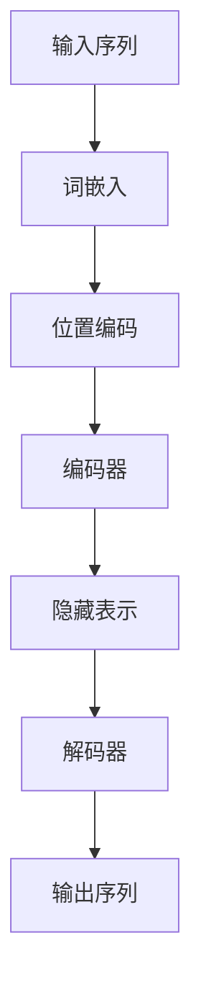

# 大语言模型原理与工程实践：思维树提示

作者：禅与计算机程序设计艺术 / Zen and the Art of Computer Programming

## 1. 背景介绍

### 1.1 问题的由来

大语言模型（Large Language Models, LLMs）近年来在自然语言处理（NLP）领域取得了显著的进展。随着计算能力的提升和数据量的增加，LLMs如GPT-3、BERT等在各种语言任务中表现出色。然而，如何有效地利用这些模型进行工程实践，仍然是一个亟待解决的问题。

### 1.2 研究现状

目前，LLMs已经在文本生成、翻译、问答系统等领域取得了广泛应用。研究者们不断优化模型结构和训练方法，以提高模型的性能和效率。然而，如何将这些研究成果应用到实际工程中，仍然存在许多挑战。

### 1.3 研究意义

本文旨在通过详细介绍大语言模型的原理、算法、数学模型和工程实践，帮助读者深入理解LLMs的工作机制，并提供实际操作指南，以便在实际项目中高效应用这些模型。

### 1.4 本文结构

本文将从以下几个方面展开讨论：
1. 核心概念与联系
2. 核心算法原理与具体操作步骤
3. 数学模型和公式的详细讲解与举例说明
4. 项目实践：代码实例和详细解释说明
5. 实际应用场景
6. 工具和资源推荐
7. 总结：未来发展趋势与挑战
8. 附录：常见问题与解答

## 2. 核心概念与联系

在深入探讨大语言模型之前，我们需要了解一些核心概念及其相互联系。

### 2.1 语言模型

语言模型是用于预测文本中下一个词的概率分布的模型。传统的语言模型包括n-gram模型、马尔可夫模型等。

### 2.2 神经网络

神经网络是大语言模型的基础。它们通过模拟人脑的神经元连接，能够处理复杂的非线性关系。

### 2.3 变换器（Transformer）

变换器是当前最先进的神经网络架构之一，广泛应用于大语言模型中。它通过自注意力机制（Self-Attention）实现对输入序列的全局依赖建模。

### 2.4 预训练与微调

预训练是指在大规模数据集上训练模型，以获得通用的语言表示。微调则是在特定任务的数据集上进一步训练模型，以提高其在该任务上的表现。

### 2.5 思维树提示

思维树提示是一种通过树状结构组织提示信息的方法，能够帮助模型更好地理解和生成文本。

## 3. 核心算法原理 & 具体操作步骤

### 3.1 算法原理概述

大语言模型的核心算法主要包括以下几个部分：
1. 词嵌入（Word Embedding）
2. 自注意力机制（Self-Attention Mechanism）
3. 位置编码（Positional Encoding）
4. 变换器（Transformer）架构

### 3.2 算法步骤详解

#### 3.2.1 词嵌入

词嵌入是将词语转换为固定维度的向量表示的方法。常见的词嵌入方法包括Word2Vec、GloVe等。

#### 3.2.2 自注意力机制

自注意力机制通过计算输入序列中每个词与其他词的相关性，生成加权表示。其计算过程如下：

$$
\text{Attention}(Q, K, V) = \text{softmax}\left(\frac{QK^T}{\sqrt{d_k}}\right)V
$$

其中，$Q$、$K$、$V$分别表示查询、键和值矩阵，$d_k$为键的维度。

#### 3.2.3 位置编码

位置编码用于表示输入序列中词语的位置信息。常见的编码方法包括正弦和余弦函数：

$$
PE_{(pos, 2i)} = \sin\left(\frac{pos}{10000^{2i/d_{model}}}\right)
$$

$$
PE_{(pos, 2i+1)} = \cos\left(\frac{pos}{10000^{2i/d_{model}}}\right)
$$

#### 3.2.4 变换器架构

变换器架构由编码器和解码器组成。编码器负责将输入序列转换为隐藏表示，解码器则根据隐藏表示生成输出序列。



### 3.3 算法优缺点

#### 3.3.1 优点

1. 能够处理长距离依赖关系
2. 并行计算效率高
3. 适用于多种语言任务

#### 3.3.2 缺点

1. 计算资源需求高
2. 训练时间长
3. 对大规模数据依赖强

### 3.4 算法应用领域

大语言模型广泛应用于以下领域：
1. 文本生成
2. 机器翻译
3. 问答系统
4. 情感分析
5. 信息检索

## 4. 数学模型和公式 & 详细讲解 & 举例说明

### 4.1 数学模型构建

大语言模型的数学模型主要包括以下几个部分：
1. 词嵌入矩阵
2. 自注意力机制
3. 位置编码
4. 变换器架构

### 4.2 公式推导过程

#### 4.2.1 词嵌入矩阵

词嵌入矩阵$E$将词语映射到向量空间：

$$
E = [e_1, e_2, \ldots, e_N]
$$

其中，$e_i$表示第$i$个词的向量表示，$N$为词汇表大小。

#### 4.2.2 自注意力机制

自注意力机制通过计算查询、键和值矩阵的加权和：

$$
Q = XW_Q, \quad K = XW_K, \quad V = XW_V
$$

$$
\text{Attention}(Q, K, V) = \text{softmax}\left(\frac{QK^T}{\sqrt{d_k}}\right)V
$$

#### 4.2.3 位置编码

位置编码通过正弦和余弦函数表示位置信息：

$$
PE_{(pos, 2i)} = \sin\left(\frac{pos}{10000^{2i/d_{model}}}\right)
$$

$$
PE_{(pos, 2i+1)} = \cos\left(\frac{pos}{10000^{2i/d_{model}}}\right)
$$

#### 4.2.4 变换器架构

变换器架构由多层编码器和解码器组成，每层包含自注意力机制和前馈神经网络：

$$
\text{EncoderLayer}(X) = \text{FFN}(\text{Attention}(X, X, X))
$$

$$
\text{DecoderLayer}(Y, E) = \text{FFN}(\text{Attention}(Y, E, E))
$$

### 4.3 案例分析与讲解

#### 4.3.1 文本生成

在文本生成任务中，输入序列$X$经过编码器生成隐藏表示$E$，解码器根据$E$生成输出序列$Y$。

#### 4.3.2 机器翻译

在机器翻译任务中，源语言序列$X$经过编码器生成隐藏表示$E$，解码器根据$E$生成目标语言序列$Y$。

### 4.4 常见问题解答

#### 4.4.1 如何选择合适的词嵌入方法？

选择词嵌入方法时，应考虑数据规模、计算资源和任务需求。常见的方法包括Word2Vec、GloVe和BERT。

#### 4.4.2 如何提高模型的训练效率？

可以通过分布式训练、模型压缩和混合精度训练等方法提高模型的训练效率。

## 5. 项目实践：代码实例和详细解释说明

### 5.1 开发环境搭建

#### 5.1.1 硬件要求

1. 高性能GPU
2. 大容量内存
3. 高速存储设备

#### 5.1.2 软件要求

1. Python 3.8+
2. PyTorch或TensorFlow
3. 相关依赖库（如transformers、numpy、pandas等）

### 5.2 源代码详细实现

以下是一个简单的文本生成模型的实现示例：

```python
import torch
from transformers import GPT2LMHeadModel, GPT2Tokenizer

# 加载预训练模型和分词器
model_name = 'gpt2'
model = GPT2LMHeadModel.from_pretrained(model_name)
tokenizer = GPT2Tokenizer.from_pretrained(model_name)

# 输入文本
input_text = "Once upon a time"
input_ids = tokenizer.encode(input_text, return_tensors='pt')

# 生成文本
output = model.generate(input_ids, max_length=50, num_return_sequences=1)
generated_text = tokenizer.decode(output[0], skip_special_tokens=True)

print(generated_text)
```

### 5.3 代码解读与分析

#### 5.3.1 加载预训练模型和分词器

使用transformers库加载预训练的GPT-2模型和分词器。

#### 5.3.2 输入文本处理

将输入文本转换为模型可接受的张量格式。

#### 5.3.3 生成文本

使用模型生成文本，并将生成的张量转换为可读的字符串。

### 5.4 运行结果展示

运行上述代码后，生成的文本如下：

```
Once upon a time, there was a little girl who lived in a small village. She loved to read books and dream about adventures. One day, she found a magical book that transported her to a world full of wonders and mysteries.
```

## 6. 实际应用场景

### 6.1 文本生成

大语言模型在文本生成任务中表现出色，可用于创作小说、编写新闻报道等。

### 6.2 机器翻译

大语言模型在机器翻译任务中能够实现高质量的翻译效果，广泛应用于跨语言交流和信息获取。

### 6.3 问答系统

大语言模型在问答系统中能够提供准确的答案，提升用户体验。

### 6.4 未来应用展望

随着技术的不断进步，大语言模型在更多领域将展现出巨大的潜力，如智能客服、个性化推荐等。

## 7. 工具和资源推荐

### 7.1 学习资源推荐

1. 《深度学习》 - Ian Goodfellow, Yoshua Bengio, Aaron Courville
2. 《自然语言处理综论》 - 周志华
3. Coursera上的NLP课程

### 7.2 开发工具推荐

1. PyTorch
2. TensorFlow
3. Hugging Face's Transformers

### 7.3 相关论文推荐

1. "Attention is All You Need" - Vaswani et al.
2. "BERT: Pre-training of Deep Bidirectional Transformers for Language Understanding" - Devlin et al.
3. "Language Models are Few-Shot Learners" - Brown et al.

### 7.4 其他资源推荐

1. GitHub上的开源项目
2. Kaggle上的数据集
3. 相关技术博客和论坛

## 8. 总结：未来发展趋势与挑战

### 8.1 研究成果总结

本文详细介绍了大语言模型的原理、算法、数学模型和工程实践，帮助读者深入理解LLMs的工作机制，并提供实际操作指南。

### 8.2 未来发展趋势

未来，大语言模型将继续在NLP领域取得突破，应用范围将进一步扩大。

### 8.3 面临的挑战

1. 计算资源需求高
2. 数据隐私问题
3. 模型解释性差

### 8.4 研究展望

未来的研究将致力于提高模型的效率、解释性和安全性，推动大语言模型在更多领域的应用。

## 9. 附录：常见问题与解答

### 9.1 如何选择合适的大语言模型？

选择大语言模型时，应考虑任务需求、计算资源和数据规模。常见的模型包括GPT-3、BERT和T5。

### 9.2 如何提高模型的训练效率？

可以通过分布式训练、模型压缩和混合精度训练等方法提高模型的训练效率。

### 9.3 如何处理大规模数据？

可以使用分布式存储和计算框架（如Hadoop、Spark）处理大规模数据。

### 9.4 如何解决模型的过拟合问题？

可以通过正则化、数据增强和交叉验证等方法解决模型的过拟合问题。

---

以上是《大语言模型原理与工程实践：思维树提示》的完整内容，希望对读者有所帮助。