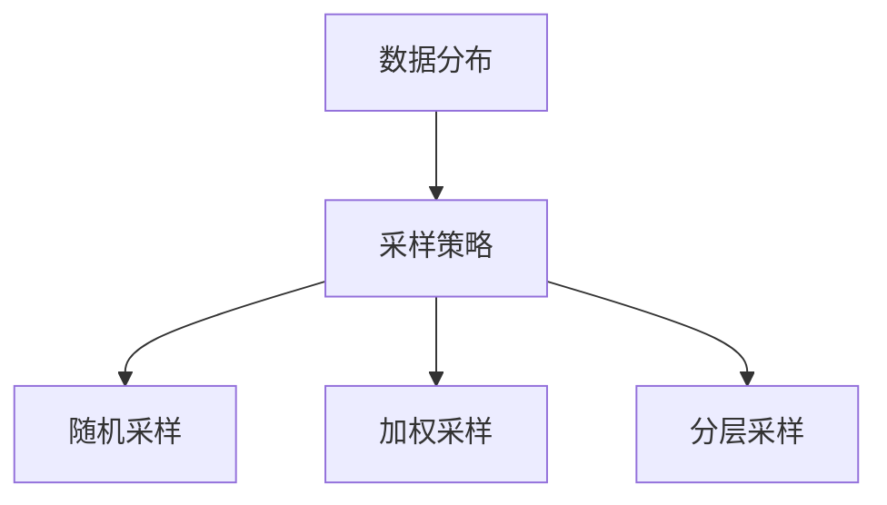

# 大语言模型原理与工程实践：数据配比

作者：禅与计算机程序设计艺术 / Zen and the Art of Computer Programming

## 1. 背景介绍

### 1.1 问题的由来

大语言模型（Large Language Models, LLMs）近年来在自然语言处理（NLP）领域取得了显著的进展。无论是文本生成、翻译还是对话系统，LLMs都展示了强大的能力。然而，构建一个高效的大语言模型并非易事，其中数据配比是一个关键问题。数据配比直接影响模型的性能、泛化能力和训练效率。

### 1.2 研究现状

目前，主流的大语言模型如GPT-3、BERT等在数据配比上都有各自的策略。研究者们通过大量实验和理论分析，提出了多种数据配比方法，如随机采样、分层采样、加权采样等。这些方法在不同的应用场景中表现各异，如何选择合适的数据配比策略仍然是一个开放性问题。

### 1.3 研究意义

数据配比不仅影响模型的训练效果，还关系到模型的公平性和可解释性。合理的数据配比可以提高模型的泛化能力，减少过拟合现象，同时也能确保模型在不同数据分布下的表现一致。因此，深入研究数据配比的原理和工程实践具有重要的理论和实际意义。

### 1.4 本文结构

本文将从以下几个方面展开讨论：

1. 核心概念与联系
2. 核心算法原理 & 具体操作步骤
3. 数学模型和公式 & 详细讲解 & 举例说明
4. 项目实践：代码实例和详细解释说明
5. 实际应用场景
6. 工具和资源推荐
7. 总结：未来发展趋势与挑战
8. 附录：常见问题与解答

## 2. 核心概念与联系

在讨论数据配比之前，我们需要明确几个核心概念：

- **数据分布**：指数据在特征空间中的分布情况。
- **采样策略**：指从数据集中选择子集的方法。
- **加权采样**：为不同数据样本分配不同的权重，从而影响其被选中的概率。
- **分层采样**：将数据集划分为若干层，然后从每一层中进行采样。

这些概念之间的联系可以通过以下Mermaid流程图表示：



## 3. 核心算法原理 & 具体操作步骤

### 3.1 算法原理概述

数据配比的核心在于如何从原始数据集中选择子集，使得模型在训练过程中能够充分学习到数据的特征。常见的算法包括随机采样、加权采样和分层采样。

### 3.2 算法步骤详解

#### 随机采样

随机采样是最简单的一种方法，直接从数据集中随机选择样本。其步骤如下：

1. 确定采样比例 $p$。
2. 从数据集中随机选择 $p \times N$ 个样本，其中 $N$ 为数据集的总样本数。

#### 加权采样

加权采样为每个样本分配一个权重，根据权重进行采样。其步骤如下：

1. 为每个样本分配权重 $w_i$。
2. 根据权重 $w_i$ 计算每个样本被选中的概率 $P_i = \frac{w_i}{\sum_{j=1}^{N} w_j}$。
3. 根据概率 $P_i$ 进行采样。

#### 分层采样

分层采样将数据集划分为若干层，然后从每一层中进行采样。其步骤如下：

1. 将数据集划分为 $k$ 个层。
2. 从每一层中随机选择样本，确保每一层的样本比例与原始数据集一致。

### 3.3 算法优缺点

#### 随机采样

优点：
- 简单易行
- 计算复杂度低

缺点：
- 可能导致数据分布不均

#### 加权采样

优点：
- 可以根据样本的重要性进行采样
- 提高模型的泛化能力

缺点：
- 计算复杂度较高
- 需要合理设置权重

#### 分层采样

优点：
- 保证数据分布的一致性
- 提高模型的稳定性

缺点：
- 需要对数据进行预处理
- 计算复杂度较高

### 3.4 算法应用领域

不同的采样策略适用于不同的应用领域：

- 随机采样：适用于数据分布均匀的场景。
- 加权采样：适用于数据分布不均且需要重点关注某些样本的场景。
- 分层采样：适用于数据分布复杂且需要保证分布一致性的场景。

## 4. 数学模型和公式 & 详细讲解 & 举例说明

### 4.1 数学模型构建

数据配比的数学模型可以表示为一个优化问题，目标是最小化模型的损失函数。假设数据集为 $D = \{(x_i, y_i)\}_{i=1}^{N}$，其中 $x_i$ 为输入，$y_i$ 为输出，损失函数为 $L(\theta)$，则优化问题可以表示为：

$$
\min_{\theta} \sum_{i=1}^{N} w_i L(f(x_i; \theta), y_i)
$$

其中，$w_i$ 为样本 $i$ 的权重，$f(x_i; \theta)$ 为模型的预测值。

### 4.2 公式推导过程

以加权采样为例，假设权重 $w_i$ 已知，优化问题可以表示为：

$$
\min_{\theta} \sum_{i=1}^{N} w_i L(f(x_i; \theta), y_i)
$$

通过梯度下降法进行优化，更新公式为：

$$
\theta_{t+1} = \theta_t - \eta \sum_{i=1}^{N} w_i \nabla_{\theta} L(f(x_i; \theta_t), y_i)
$$

其中，$\eta$ 为学习率，$\nabla_{\theta} L(f(x_i; \theta_t), y_i)$ 为损失函数的梯度。

### 4.3 案例分析与讲解

假设我们有一个二分类问题，数据集包含1000个样本，其中正样本和负样本的比例为1:9。为了提高模型对正样本的识别能力，我们可以采用加权采样策略。具体步骤如下：

1. 为正样本分配权重 $w_1 = 0.9$，为负样本分配权重 $w_2 = 0.1$。
2. 根据权重计算每个样本的采样概率。
3. 根据采样概率进行采样，构建新的训练集。

### 4.4 常见问题解答

#### 问题1：如何选择合适的采样策略？

选择采样策略需要根据具体的应用场景和数据分布情况进行。一般来说，数据分布均匀时可以选择随机采样，数据分布不均时可以选择加权采样或分层采样。

#### 问题2：如何设置加权采样的权重？

加权采样的权重可以根据样本的重要性、类别比例等因素进行设置。可以通过实验调整权重，找到最优的权重配置。

## 5. 项目实践：代码实例和详细解释说明

### 5.1 开发环境搭建

在进行项目实践之前，我们需要搭建开发环境。本文以Python为例，使用的主要库包括NumPy、Pandas和Scikit-learn。

```bash
pip install numpy pandas scikit-learn
```

### 5.2 源代码详细实现

以下是一个加权采样的代码示例：

```python
import numpy as np
import pandas as pd
from sklearn.model_selection import train_test_split

# 生成示例数据
data = pd.DataFrame({
    'feature1': np.random.randn(1000),
    'feature2': np.random.randn(1000),
    'label': np.random.choice([0, 1], size=1000, p=[0.9, 0.1])
})

# 设置权重
weights = np.where(data['label'] == 1, 0.9, 0.1)

# 根据权重进行采样
sampled_data = data.sample(n=500, weights=weights)

# 划分训练集和测试集
train_data, test_data = train_test_split(sampled_data, test_size=0.2, random_state=42)
```

### 5.3 代码解读与分析

上述代码首先生成了一个包含1000个样本的示例数据集，其中正样本和负样本的比例为1:9。然后为正样本和负样本分配权重，分别为0.9和0.1。接着根据权重进行采样，构建了一个包含500个样本的新数据集。最后将新数据集划分为训练集和测试集。

### 5.4 运行结果展示

运行上述代码后，我们可以得到一个包含500个样本的新数据集，其中正样本和负样本的比例接近1:1。通过这种方式，我们可以提高模型对正样本的识别能力。

## 6. 实际应用场景

### 6.1 自然语言处理

在自然语言处理领域，数据配比可以用于文本分类、情感分析、机器翻译等任务。例如，在情感分析任务中，正负样本的比例往往不均衡，通过加权采样可以提高模型对少数类的识别能力。

### 6.2 计算机视觉

在计算机视觉领域，数据配比可以用于图像分类、目标检测、图像分割等任务。例如，在目标检测任务中，不同类别的目标数量往往不均衡，通过分层采样可以保证每个类别的样本数量一致，从而提高模型的泛化能力。

### 6.3 医疗数据分析

在医疗数据分析领域，数据配比可以用于疾病预测、药物反应预测等任务。例如，在疾病预测任务中，患病样本和健康样本的比例往往不均衡，通过加权采样可以提高模型对患病样本的识别能力。

### 6.4 未来应用展望

随着大数据和人工智能技术的发展，数据配比在各个领域的应用将越来越广泛。未来，数据配比将不仅仅局限于传统的采样策略，还将结合深度学习、强化学习等技术，提出更加智能和高效的采样方法。

## 7. 工具和资源推荐

### 7.1 学习资源推荐

- [Coursera: Machine Learning by Andrew Ng](https://www.coursera.org/learn/machine-learning)
- [Deep Learning Specialization by Andrew Ng](https://www.coursera.org/specializations/deep-learning)
- [Fast.ai: Practical Deep Learning for Coders](https://www.fast.ai/)

### 7.2 开发工具推荐

- [Jupyter Notebook](https://jupyter.org/)
- [Google Colab](https://colab.research.google.com/)
- [PyCharm](https://www.jetbrains.com/pycharm/)

### 7.3 相关论文推荐

- [Attention is All You Need](https://arxiv.org/abs/1706.03762)
- [BERT: Pre-training of Deep Bidirectional Transformers for Language Understanding](https://arxiv.org/abs/1810.04805)
- [GPT-3: Language Models are Few-Shot Learners](https://arxiv.org/abs/2005.14165)

### 7.4 其他资源推荐

- [Kaggle](https://www.kaggle.com/)
- [UCI Machine Learning Repository](https://archive.ics.uci.edu/ml/index.php)
- [TensorFlow](https://www.tensorflow.org/)

## 8. 总结：未来发展趋势与挑战

### 8.1 研究成果总结

本文详细介绍了大语言模型中的数据配比问题，包括核心概念、算法原理、数学模型、项目实践和实际应用场景。通过对不同采样策略的分析和比较，我们可以更好地理解数据配比在模型训练中的重要性。

### 8.2 未来发展趋势

未来，数据配比将结合更多的智能技术，如深度学习、强化学习等，提出更加智能和高效的采样方法。同时，随着大数据和人工智能技术的发展，数据配比在各个领域的应用将越来越广泛。

### 8.3 面临的挑战

尽管数据配比在模型训练中具有重要作用，但仍然面临一些挑战，如如何选择合适的采样策略、如何设置加权采样的权重等。这些问题需要通过大量的实验和理论分析进行解决。

### 8.4 研究展望

未来的研究可以从以下几个方面展开：

1. 提出更加智能和高效的采样方法。
2. 结合深度学习、强化学习等技术，优化数据配比策略。
3. 在更多的实际应用场景中验证数据配比的效果。

## 9. 附录：常见问题与解答

### 问题1：如何选择合适的采样策略？

选择采样策略需要根据具体的应用场景和数据分布情况进行。一般来说，数据分布均匀时可以选择随机采样，数据分布不均时可以选择加权采样或分层采样。

### 问题2：如何设置加权采样的权重？

加权采样的权重可以根据样本的重要性、类别比例等因素进行设置。可以通过实验调整权重，找到最优的权重配置。

### 问题3：数据配比对模型训练有什么影响？

合理的数据配比可以提高模型的泛化能力，减少过拟合现象，同时也能确保模型在不同数据分布下的表现一致。

### 问题4：数据配比在实际应用中有哪些挑战？

数据配比在实际应用中面临一些挑战，如如何选择合适的采样策略、如何设置加权采样的权重等。这些问题需要通过大量的实验和理论分析进行解决。

---

以上是关于大语言模型原理与工程实践中数据配比的详细讨论。希望本文能够帮助读者更好地理解数据配比在模型训练中的重要性，并在实际应用中取得更好的效果。