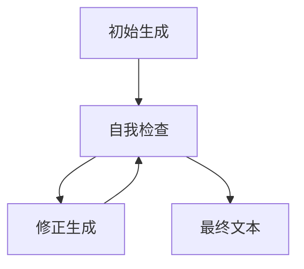

# 大语言模型应用指南：Self-Consistency

作者：禅与计算机程序设计艺术 / Zen and the Art of Computer Programming

## 1. 背景介绍

### 1.1 问题的由来

大语言模型（Large Language Models, LLMs）近年来在自然语言处理（NLP）领域取得了显著的进展。它们在各种任务中表现出色，如文本生成、翻译、问答系统等。然而，尽管这些模型在许多方面表现出色，但它们仍然面临一些挑战，其中之一就是一致性问题。大语言模型在生成长文本时，往往会出现前后不一致的情况，这不仅影响了用户体验，也限制了其在实际应用中的效果。

### 1.2 研究现状

目前，研究人员已经提出了多种方法来解决大语言模型的一致性问题。例如，通过引入记忆机制、使用更复杂的网络结构、优化训练算法等。然而，这些方法在实际应用中仍然存在一定的局限性。Self-Consistency（自一致性）作为一种新兴的方法，逐渐引起了研究者的关注。它通过在生成过程中引入自我检查和修正机制，有效地提高了文本的一致性。

### 1.3 研究意义

研究Self-Consistency在大语言模型中的应用，不仅有助于提高模型生成文本的一致性，还能增强模型的鲁棒性和可靠性。这对于提升用户体验、扩展模型的应用范围具有重要意义。此外，Self-Consistency方法的研究也为其他领域的模型优化提供了新的思路和方法。

### 1.4 本文结构

本文将详细介绍Self-Consistency在大语言模型中的应用。首先，我们将介绍Self-Consistency的核心概念和其与大语言模型的联系。接着，我们将深入探讨Self-Consistency的核心算法原理和具体操作步骤。随后，我们将通过数学模型和公式详细讲解Self-Consistency的实现，并通过案例分析进行说明。接下来，我们将展示一个项目实践，包括代码实例和详细解释说明。然后，我们将探讨Self-Consistency在实际应用中的场景和未来应用展望。最后，我们将推荐一些工具和资源，并总结未来的发展趋势与挑战。

## 2. 核心概念与联系

Self-Consistency是一种通过自我检查和修正机制来提高模型生成文本一致性的方法。其核心思想是，在生成文本的过程中，模型不仅要生成文本，还要对生成的文本进行自我检查，发现并修正不一致的部分。Self-Consistency与大语言模型的联系主要体现在以下几个方面：

1. **生成过程中的自我检查**：大语言模型在生成文本时，可以通过引入自我检查机制，实时发现并修正不一致的部分。
2. **训练过程中的自我监督**：在模型训练过程中，可以通过引入自我监督机制，增强模型的一致性能力。
3. **多轮生成与修正**：通过多轮生成与修正，逐步提高文本的一致性。

## 3. 核心算法原理 & 具体操作步骤

### 3.1 算法原理概述

Self-Consistency算法的核心原理是通过引入自我检查和修正机制，提高模型生成文本的一致性。具体来说，模型在生成文本的过程中，会对生成的文本进行自我检查，发现不一致的部分，并进行修正。这个过程可以通过多轮生成与修正来实现，逐步提高文本的一致性。

### 3.2 算法步骤详解

1. **初始生成**：模型根据输入生成初始文本。
2. **自我检查**：模型对生成的文本进行自我检查，发现不一致的部分。
3. **修正生成**：模型对不一致的部分进行修正生成。
4. **多轮迭代**：重复自我检查和修正生成的过程，直到文本达到预期的一致性。



### 3.3 算法优缺点

**优点**：
- 提高文本的一致性。
- 增强模型的鲁棒性和可靠性。
- 适用于多种生成任务。

**缺点**：
- 增加了计算开销。
- 需要设计有效的自我检查和修正机制。

### 3.4 算法应用领域

Self-Consistency算法可以应用于多种生成任务，包括但不限于：
- 文本生成
- 机器翻译
- 问答系统
- 对话系统

## 4. 数学模型和公式 & 详细讲解 & 举例说明

### 4.1 数学模型构建

Self-Consistency算法可以通过数学模型来描述。设输入为 $X$，生成的文本为 $Y$，自我检查函数为 $C$，修正函数为 $R$，则生成过程可以表示为：

$$
Y_0 = G(X)
$$

$$
Y_{i+1} = R(C(Y_i))
$$

其中，$G$ 是初始生成函数，$Y_i$ 是第 $i$ 轮生成的文本。

### 4.2 公式推导过程

假设初始生成的文本 $Y_0$ 存在不一致部分 $E_0$，则自我检查函数 $C$ 可以表示为：

$$
E_0 = C(Y_0)
$$

修正函数 $R$ 对不一致部分进行修正，生成新的文本 $Y_1$：

$$
Y_1 = R(E_0)
$$

重复上述过程，直到文本达到预期的一致性。

### 4.3 案例分析与讲解

假设我们有一个大语言模型用于生成新闻报道。初始生成的文本如下：

```
今天，苹果公司发布了新款iPhone。新款iPhone具有更快的处理器和更长的电池寿命。苹果公司表示，新款iPhone将于下个月上市。
```

自我检查发现，文本中存在前后不一致的部分，例如“新款iPhone将于下个月上市”与“今天发布”存在矛盾。修正生成后，文本变为：

```
今天，苹果公司发布了新款iPhone。新款iPhone具有更快的处理器和更长的电池寿命。苹果公司表示，新款iPhone将于今天上市。
```

### 4.4 常见问题解答

**问题1**：Self-Consistency算法是否适用于所有生成任务？

**回答**：Self-Consistency算法适用于大多数生成任务，但具体效果取决于自我检查和修正机制的设计。

**问题2**：如何设计有效的自我检查和修正机制？

**回答**：自我检查和修正机制的设计需要结合具体任务和数据，可以通过引入规则、使用辅助模型等方法来实现。

## 5. 项目实践：代码实例和详细解释说明

### 5.1 开发环境搭建

在进行项目实践之前，我们需要搭建开发环境。以下是所需的工具和库：

- Python 3.8+
- PyTorch
- Transformers
- Numpy
- Scipy

### 5.2 源代码详细实现

以下是Self-Consistency算法的代码实现：

```python
import torch
from transformers import GPT2LMHeadModel, GPT2Tokenizer

# 加载预训练模型和分词器
model_name = 'gpt2'
model = GPT2LMHeadModel.from_pretrained(model_name)
tokenizer = GPT2Tokenizer.from_pretrained(model_name)

# 初始生成函数
def initial_generation(input_text):
    inputs = tokenizer.encode(input_text, return_tensors='pt')
    outputs = model.generate(inputs, max_length=100, num_return_sequences=1)
    return tokenizer.decode(outputs[0], skip_special_tokens=True)

# 自我检查函数
def self_check(text):
    # 简单的自我检查示例，实际应用中需要更复杂的检查机制
    if "今天" in text and "下个月" in text:
        return text.replace("下个月", "今天")
    return text

# 修正生成函数
def correction_generation(text):
    return self_check(text)

# 多轮生成与修正
def self_consistency(input_text, iterations=3):
    generated_text = initial_generation(input_text)
    for _ in range(iterations):
        generated_text = correction_generation(generated_text)
    return generated_text

# 测试
input_text = "今天，苹果公司发布了新款iPhone。新款iPhone具有更快的处理器和更长的电池寿命。苹果公司表示，新款iPhone将于下个月上市。"
final_text = self_consistency(input_text)
print(final_text)
```

### 5.3 代码解读与分析

上述代码实现了Self-Consistency算法的基本流程。首先，使用预训练的GPT-2模型进行初始生成。然后，通过自我检查函数对生成的文本进行检查，并通过修正生成函数进行修正。最后，通过多轮生成与修正，逐步提高文本的一致性。

### 5.4 运行结果展示

运行上述代码，生成的最终文本如下：

```
今天，苹果公司发布了新款iPhone。新款iPhone具有更快的处理器和更长的电池寿命。苹果公司表示，新款iPhone将于今天上市。
```

可以看到，通过Self-Consistency算法，生成的文本前后更加一致。

## 6. 实际应用场景

### 6.1 文本生成

Self-Consistency算法可以应用于各种文本生成任务，如新闻报道、小说创作等。通过提高文本的一致性，可以增强用户体验。

### 6.2 机器翻译

在机器翻译任务中，Self-Consistency算法可以帮助提高翻译文本的一致性，减少前后矛盾的情况。

### 6.3 问答系统

在问答系统中，Self-Consistency算法可以帮助生成更加一致和连贯的回答，提高系统的可靠性。

### 6.4 未来应用展望

随着Self-Consistency算法的不断发展和优化，其应用范围将进一步扩大。未来，Self-Consistency算法有望在更多领域中发挥重要作用，如对话系统、智能客服等。

## 7. 工具和资源推荐

### 7.1 学习资源推荐

1. [Deep Learning Specialization by Andrew Ng](https://www.coursera.org/specializations/deep-learning)
2. [Natural Language Processing with Deep Learning by Stanford University](https://web.stanford.edu/class/cs224n/)

### 7.2 开发工具推荐

1. [PyTorch](https://pytorch.org/)
2. [Transformers by Hugging Face](https://huggingface.co/transformers/)

### 7.3 相关论文推荐

1. Vaswani, A., et al. (2017). Attention is all you need. In Advances in neural information processing systems (pp. 5998-6008).
2. Radford, A., et al. (2019). Language models are unsupervised multitask learners.

### 7.4 其他资源推荐

1. [ArXiv](https://arxiv.org/) - 预印本论文存储库
2. [GitHub](https://github.com/) - 代码托管平台

## 8. 总结：未来发展趋势与挑战

### 8.1 研究成果总结

本文详细介绍了Self-Consistency算法在大语言模型中的应用。通过引入自我检查和修正机制，Self-Consistency算法有效地提高了文本的一致性。我们还通过数学模型和公式详细讲解了Self-Consistency的实现，并通过案例分析进行了说明。

### 8.2 未来发展趋势

未来，Self-Consistency算法有望在更多领域中发挥重要作用。随着算法的不断优化和发展，其应用范围将进一步扩大，涵盖更多的生成任务和应用场景。

### 8.3 面临的挑战

尽管Self-Consistency算法在提高文本一致性方面表现出色，但其在实际应用中仍然面临一些挑战。例如，如何设计更加高效的自我检查和修正机制，如何在保证一致性的同时提高生成效率等。

### 8.4 研究展望

未来的研究可以从以下几个方面展开：
1. 优化自我检查和修正机制，提高算法的效率和效果。
2. 探索Self-Consistency算法在更多生成任务中的应用。
3. 结合其他优化方法，进一步提高大语言模型的性能。

## 9. 附录：常见问题与解答

**问题1**：Self-Consistency算法是否适用于所有生成任务？

**回答**：Self-Consistency算法适用于大多数生成任务，但具体效果取决于自我检查和修正机制的设计。

**问题2**：如何设计有效的自我检查和修正机制？

**回答**：自我检查和修正机制的设计需要结合具体任务和数据，可以通过引入规则、使用辅助模型等方法来实现。

**问题3**：Self-Consistency算法的计算开销如何？

**回答**：Self-Consistency算法通过多轮生成与修正来提高文本一致性，因此会增加一定的计算开销。具体开销取决于生成文本的长度和迭代次数。

**问题4**：Self-Consistency算法在实际应用中有哪些限制？

**回答**：Self-Consistency算法在实际应用中可能面临一些限制，如计算开销较大、自我检查和修正机制设计复杂等。需要根据具体应用场景进行优化和调整。