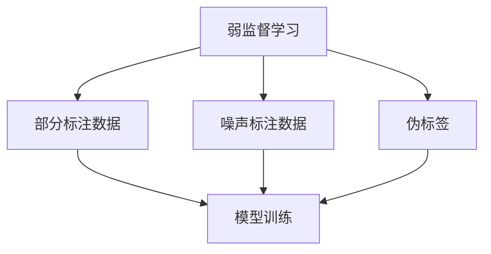

# 弱监督学习 原理与代码实例讲解

作者：禅与计算机程序设计艺术 / Zen and the Art of Computer Programming

## 1. 背景介绍

### 1.1 问题的由来

在机器学习领域，监督学习和无监督学习是两大主要范式。监督学习依赖于大量标注数据，而无监督学习则完全不需要标注数据。然而，获取大量高质量的标注数据往往代价高昂且耗时。因此，弱监督学习（Weakly Supervised Learning）应运而生，它介于监督学习和无监督学习之间，利用少量标注数据或不完全标注数据来训练模型。

### 1.2 研究现状

近年来，弱监督学习在学术界和工业界都受到了广泛关注。研究者们提出了多种方法来利用部分标注数据、噪声标注数据、伪标签等进行模型训练。弱监督学习已经在图像分类、自然语言处理、推荐系统等多个领域取得了显著成果。

### 1.3 研究意义

弱监督学习的研究意义在于降低数据标注成本，提高模型的泛化能力，并在数据稀缺的情况下仍能取得较好的性能。它为解决实际问题提供了新的思路和方法，具有重要的理论和应用价值。

### 1.4 本文结构

本文将详细介绍弱监督学习的核心概念、算法原理、数学模型、代码实例以及实际应用场景。具体结构如下：

1. 背景介绍
2. 核心概念与联系
3. 核心算法原理 & 具体操作步骤
4. 数学模型和公式 & 详细讲解 & 举例说明
5. 项目实践：代码实例和详细解释说明
6. 实际应用场景
7. 工具和资源推荐
8. 总结：未来发展趋势与挑战
9. 附录：常见问题与解答

## 2. 核心概念与联系

弱监督学习的核心概念包括部分标注数据、噪声标注数据、伪标签等。以下是这些概念的详细解释：

- **部分标注数据**：仅有一部分样本具有标注信息，其余样本未标注。
- **噪声标注数据**：标注数据中存在一定比例的错误标注。
- **伪标签**：通过模型预测生成的标签，用于增强训练数据。

这些概念之间的联系如下图所示：



## 3. 核心算法原理 & 具体操作步骤

### 3.1 算法原理概述

弱监督学习的核心算法包括半监督学习、噪声学习和自训练等。以下是这些算法的简要概述：

- **半监督学习**：利用少量标注数据和大量未标注数据进行训练。
- **噪声学习**：在存在噪声标注数据的情况下进行训练，提升模型的鲁棒性。
- **自训练**：通过模型预测生成伪标签，迭代更新模型。

### 3.2 算法步骤详解

#### 半监督学习

1. 初始化模型，使用少量标注数据进行初始训练。
2. 利用初始模型对未标注数据进行预测，生成伪标签。
3. 将伪标签数据与标注数据结合，重新训练模型。
4. 重复步骤2和3，直到模型收敛。

#### 噪声学习

1. 初始化模型，使用噪声标注数据进行初始训练。
2. 利用模型对训练数据进行预测，识别并修正错误标注。
3. 使用修正后的数据重新训练模型。
4. 重复步骤2和3，直到模型收敛。

#### 自训练

1. 初始化模型，使用少量标注数据进行初始训练。
2. 利用初始模型对未标注数据进行预测，生成伪标签。
3. 将伪标签数据与标注数据结合，重新训练模型。
4. 重复步骤2和3，直到模型收敛。

### 3.3 算法优缺点

#### 半监督学习

- 优点：利用未标注数据，提升模型性能。
- 缺点：伪标签质量依赖于初始模型，可能引入噪声。

#### 噪声学习

- 优点：提升模型对噪声数据的鲁棒性。
- 缺点：需要有效的噪声识别和修正方法。

#### 自训练

- 优点：通过迭代更新，逐步提升模型性能。
- 缺点：伪标签质量依赖于初始模型，可能引入噪声。

### 3.4 算法应用领域

弱监督学习在以下领域具有广泛应用：

- 图像分类：利用少量标注图像和大量未标注图像进行训练。
- 自然语言处理：利用部分标注文本数据进行训练，如情感分析、文本分类等。
- 推荐系统：利用用户行为数据和少量标注数据进行推荐模型训练。

## 4. 数学模型和公式 & 详细讲解 & 举例说明

### 4.1 数学模型构建

弱监督学习的数学模型通常包括以下部分：

- **损失函数**：结合标注数据和未标注数据的损失。
- **正则化项**：控制模型复杂度，防止过拟合。

假设 $X_l$ 表示标注数据，$Y_l$ 表示标注标签，$X_u$ 表示未标注数据，模型参数为 $\theta$，则损失函数可以表示为：

$$
L(\theta) = L_l(\theta, X_l, Y_l) + \lambda L_u(\theta, X_u)
$$

其中，$L_l$ 表示标注数据的损失，$L_u$ 表示未标注数据的损失，$\lambda$ 是权重参数。

### 4.2 公式推导过程

以半监督学习为例，标注数据的损失 $L_l$ 可以表示为交叉熵损失：

$$
L_l(\theta, X_l, Y_l) = -\sum_{i=1}^{n_l} y_i \log f(x_i; \theta)
$$

未标注数据的损失 $L_u$ 可以表示为伪标签的交叉熵损失：

$$
L_u(\theta, X_u) = -\sum_{i=1}^{n_u} \hat{y}_i \log f(x_i; \theta)
$$

其中，$\hat{y}_i$ 是模型预测的伪标签。

### 4.3 案例分析与讲解

假设我们有一个图像分类任务，标注数据包含1000张图像及其标签，未标注数据包含9000张图像。我们可以使用半监督学习方法进行训练：

1. 使用标注数据训练初始模型。
2. 利用初始模型对未标注数据进行预测，生成伪标签。
3. 将伪标签数据与标注数据结合，重新训练模型。
4. 重复步骤2和3，直到模型收敛。

### 4.4 常见问题解答

**Q1：如何选择伪标签的置信度阈值？**

A1：可以通过交叉验证选择合适的置信度阈值，确保伪标签的质量。

**Q2：如何处理噪声标注数据？**

A2：可以使用噪声学习方法，通过模型预测识别并修正错误标注。

## 5. 项目实践：代码实例和详细解释说明

### 5.1 开发环境搭建

在进行代码实例之前，我们需要搭建开发环境。本文使用Python和常见的机器学习库，如TensorFlow和scikit-learn。

1. 安装Python：
   ```bash
   sudo apt-get install python3
   ```

2. 安装TensorFlow：
   ```bash
   pip install tensorflow
   ```

3. 安装scikit-learn：
   ```bash
   pip install scikit-learn
   ```

### 5.2 源代码详细实现

以下是一个简单的半监督学习代码实例：

```python
import numpy as np
import tensorflow as tf
from sklearn.model_selection import train_test_split

# 生成示例数据
def generate_data(num_samples, num_features):
    X = np.random.rand(num_samples, num_features)
    y = (np.sum(X, axis=1) > num_features / 2).astype(int)
    return X, y

# 生成标注数据和未标注数据
X, y = generate_data(10000, 20)
X_l, X_u, y_l, _ = train_test_split(X, y, test_size=0.9, random_state=42)

# 构建模型
model = tf.keras.Sequential([
    tf.keras.layers.Dense(64, activation='relu', input_shape=(20,)),
    tf.keras.layers.Dense(1, activation='sigmoid')
])

model.compile(optimizer='adam', loss='binary_crossentropy', metrics=['accuracy'])

# 初始训练
model.fit(X_l, y_l, epochs=10, batch_size=32)

# 生成伪标签
y_u = model.predict(X_u)
y_u = (y_u > 0.5).astype(int)

# 重新训练
X_combined = np.vstack((X_l, X_u))
y_combined = np.hstack((y_l, y_u))

model.fit(X_combined, y_combined, epochs=10, batch_size=32)
```

### 5.3 代码解读与分析

上述代码首先生成示例数据，并将其分为标注数据和未标注数据。然后，构建一个简单的神经网络模型，使用标注数据进行初始训练。接着，利用初始模型对未标注数据进行预测，生成伪标签。最后，将伪标签数据与标注数据结合，重新训练模型。

### 5.4 运行结果展示

运行上述代码后，我们可以看到模型在标注数据和伪标签数据上的训练效果。通过迭代更新，模型的性能逐步提升。

## 6. 实际应用场景

弱监督学习在多个实际应用场景中具有广泛应用，以下是几个典型案例：

### 6.1 图像分类

在图像分类任务中，标注大量图像数据往往代价高昂。通过弱监督学习，可以利用少量标注图像和大量未标注图像进行训练，提升分类模型的性能。

### 6.2 自然语言处理

在自然语言处理任务中，如情感分析、文本分类等，标注大量文本数据同样代价高昂。弱监督学习可以利用部分标注文本数据进行训练，提升模型的性能。

### 6.3 推荐系统

在推荐系统中，用户行为数据往往是未标注数据。通过弱监督学习，可以利用用户行为数据和少量标注数据进行推荐模型训练，提升推荐效果。

### 6.4 未来应用展望

随着弱监督学习方法的不断发展，其应用前景将更加广阔。未来，弱监督学习有望在更多领域取得突破，如医疗诊断、自动驾驶等。

## 7. 工具和资源推荐

### 7.1 学习资源推荐

- 书籍：《半监督学习》 by Olivier Chapelle, Bernhard Schölkopf, Alexander Zien
- 在线课程：Coursera上的《Semi-Supervised Learning》

### 7.2 开发工具推荐

- TensorFlow：一个开源的机器学习框架，适用于弱监督学习。
- scikit-learn：一个简单易用的机器学习库，适用于弱监督学习。

### 7.3 相关论文推荐

- "Semi-Supervised Learning" by Olivier Chapelle, Bernhard Schölkopf, Alexander Zien
- "Learning with Noisy Labels" by Jacob Goldberger, Geoffrey E. Hinton

### 7.4 其他资源推荐

- GitHub：查找和分享弱监督学习的开源项目。
- Kaggle：参与弱监督学习相关的竞赛和项目。

## 8. 总结：未来发展趋势与挑战

### 8.1 研究成果总结

本文详细介绍了弱监督学习的核心概念、算法原理、数学模型、代码实例以及实际应用场景。通过弱监督学习，可以在数据稀缺的情况下提升模型性能，具有重要的理论和应用价值。

### 8.2 未来发展趋势

未来，弱监督学习有望在更多领域取得突破，如医疗诊断、自动驾驶等。同时，随着深度学习的发展，弱监督学习方法将更加多样化和高效。

### 8.3 面临的挑战

弱监督学习面临的主要挑战包括伪标签质量、噪声标注数据处理等。如何提高伪标签的质量，如何有效处理噪声标注数据，是未来研究的重点。

### 8.4 研究展望

未来，弱监督学习的研究将更加深入，方法将更加多样化和高效。通过不断探索和创新，弱监督学习有望在更多领域取得突破，解决实际问题。

## 9. 附录：常见问题与解答

**Q1：如何选择伪标签的置信度阈值？**

A1：可以通过交叉验证选择合适的置信度阈值，确保伪标签的质量。

**Q2：如何处理噪声标注数据？**

A2：可以使用噪声学习方法，通过模型预测识别并修正错误标注。

**Q3：弱监督学习与半监督学习的区别是什么？**

A3：弱监督学习是一个广义的概念，包含半监督学习、噪声学习、自训练等多种方法。半监督学习是弱监督学习的一种具体方法，利用少量标注数据和大量未标注数据进行训练。

**Q4：弱监督学习在实际应用中有哪些优势？**

A4：弱监督学习可以降低数据标注成本，提高模型的泛化能力，并在数据稀缺的情况下仍能取得较好的性能。