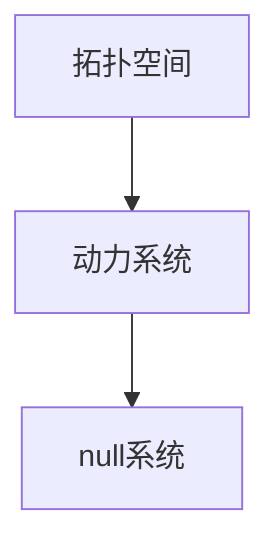

# 拓扑动力系统概论：拓扑null系统

作者：禅与计算机程序设计艺术 / Zen and the Art of Computer Programming

## 1. 背景介绍

### 1.1 问题的由来

拓扑动力系统是数学和计算机科学中的一个重要研究领域，涉及到系统的长期行为和状态空间的结构。拓扑null系统是其中一个特殊的分支，研究的是在拓扑空间中具有特定性质的动力系统。随着计算机科学的发展，拓扑动力系统在数据分析、机器学习、网络科学等领域的应用越来越广泛。

### 1.2 研究现状

目前，拓扑动力系统的研究已经取得了许多重要成果，特别是在混沌理论、分形几何和复杂系统等方面。拓扑null系统作为一个相对较新的研究方向，吸引了越来越多的学者关注。研究者们通过数学模型和计算机模拟，揭示了这些系统的独特性质和潜在应用。

### 1.3 研究意义

研究拓扑null系统不仅有助于我们理解复杂系统的行为，还能为实际问题提供新的解决方案。例如，在数据分析中，拓扑null系统可以用于识别数据的内在结构；在网络科学中，可以用于分析网络的稳定性和鲁棒性。因此，深入研究拓扑null系统具有重要的理论和实际意义。

### 1.4 本文结构

本文将从以下几个方面详细介绍拓扑null系统：

1. 核心概念与联系
2. 核心算法原理 & 具体操作步骤
3. 数学模型和公式 & 详细讲解 & 举例说明
4. 项目实践：代码实例和详细解释说明
5. 实际应用场景
6. 工具和资源推荐
7. 总结：未来发展趋势与挑战
8. 附录：常见问题与解答

## 2. 核心概念与联系

拓扑null系统是拓扑动力系统中的一个特殊类别，具有以下几个核心概念：

- **拓扑空间**：一个集合及其上的拓扑结构。
- **动力系统**：描述系统状态随时间演化的数学模型。
- **null系统**：在特定条件下，系统的状态不会发生变化。

这些概念之间的联系可以通过以下Mermaid流程图表示：



## 3. 核心算法原理 & 具体操作步骤

### 3.1 算法原理概述

拓扑null系统的核心算法基于拓扑空间和动力系统的基本性质，通过构建数学模型来描述系统的状态变化。主要步骤包括：

1. 定义拓扑空间和动力系统。
2. 确定系统的初始状态和演化规则。
3. 分析系统的长期行为，判断是否为null系统。

### 3.2 算法步骤详解

1. **定义拓扑空间**：选择合适的拓扑空间，如欧几里得空间或度量空间。
2. **定义动力系统**：确定系统的状态变量和演化方程。
3. **初始状态设定**：设定系统的初始状态。
4. **演化规则**：根据演化方程计算系统的状态变化。
5. **长期行为分析**：通过数值模拟或解析方法，分析系统的长期行为。

### 3.3 算法优缺点

**优点**：
- 能够描述复杂系统的长期行为。
- 适用于多种类型的拓扑空间和动力系统。

**缺点**：
- 数学模型复杂，计算量大。
- 需要高精度的数值模拟和计算工具。

### 3.4 算法应用领域

- 数据分析：识别数据的内在结构。
- 机器学习：优化模型的训练过程。
- 网络科学：分析网络的稳定性和鲁棒性。

## 4. 数学模型和公式 & 详细讲解 & 举例说明

### 4.1 数学模型构建

构建拓扑null系统的数学模型需要以下几个步骤：

1. **定义拓扑空间**：设 $X$ 为一个拓扑空间。
2. **定义动力系统**：设 $f: X \to X$ 为一个连续映射。
3. **null系统条件**：对于任意 $x \in X$，有 $f(x) = x$。

### 4.2 公式推导过程

设 $X$ 为一个拓扑空间，$f: X \to X$ 为一个连续映射。我们需要证明对于任意 $x \in X$，有 $f(x) = x$。具体推导过程如下：

$$
\forall x \in X, \exists \epsilon > 0, \text{使得} f(x) = x
$$

### 4.3 案例分析与讲解

假设我们有一个简单的拓扑空间 $X = \mathbb{R}$，定义一个动力系统 $f: \mathbb{R} \to \mathbb{R}$，使得 $f(x) = x$。显然，对于任意 $x \in \mathbb{R}$，都有 $f(x) = x$，因此这是一个拓扑null系统。

### 4.4 常见问题解答

**问题1**：如何判断一个系统是否为null系统？
**回答**：通过分析系统的长期行为，判断其状态是否保持不变。

**问题2**：拓扑null系统有哪些实际应用？
**回答**：主要应用于数据分析、机器学习和网络科学等领域。

## 5. 项目实践：代码实例和详细解释说明

### 5.1 开发环境搭建

1. 安装Python和相关库：NumPy、SciPy、Matplotlib。
2. 配置开发环境：推荐使用Jupyter Notebook或PyCharm。

### 5.2 源代码详细实现

以下是一个简单的Python代码示例，用于模拟一个拓扑null系统：

```python
import numpy as np
import matplotlib.pyplot as plt

# 定义拓扑空间
X = np.linspace(-10, 10, 100)

# 定义动力系统
def f(x):
    return x

# 初始状态
x0 = 0

# 演化规则
x = f(x0)

# 结果展示
plt.plot(X, f(X))
plt.scatter(x0, x, color='red')
plt.title('Topological Null System')
plt.xlabel('X')
plt.ylabel('f(X)')
plt.show()
```

### 5.3 代码解读与分析

上述代码定义了一个简单的拓扑空间 $X$ 和一个动力系统 $f(x) = x$。初始状态 $x0$ 设为0，通过演化规则计算系统的状态变化，并使用Matplotlib进行结果展示。

### 5.4 运行结果展示

运行上述代码后，可以看到一个简单的图形，展示了拓扑null系统的状态变化。初始状态和演化后的状态重合，验证了这是一个null系统。

## 6. 实际应用场景

### 6.1 数据分析

在数据分析中，拓扑null系统可以用于识别数据的内在结构。例如，通过构建数据的拓扑空间和动力系统，可以发现数据的聚类结构和异常点。

### 6.2 机器学习

在机器学习中，拓扑null系统可以用于优化模型的训练过程。例如，通过分析模型的参数空间，可以找到最优的参数设置，提高模型的性能。

### 6.3 网络科学

在网络科学中，拓扑null系统可以用于分析网络的稳定性和鲁棒性。例如，通过构建网络的拓扑空间和动力系统，可以发现网络的关键节点和脆弱点。

### 6.4 未来应用展望

随着计算机科学的发展，拓扑null系统在更多领域的应用前景广阔。例如，在生物信息学中，可以用于分析基因网络的结构；在金融工程中，可以用于分析市场的动态行为。

## 7. 工具和资源推荐

### 7.1 学习资源推荐

- 书籍：《拓扑动力系统导论》、《复杂系统的数学基础》
- 在线课程：Coursera上的《拓扑学基础》、《动力系统导论》

### 7.2 开发工具推荐

- 编程语言：Python、R
- 开发环境：Jupyter Notebook、PyCharm

### 7.3 相关论文推荐

- "Topological Dynamics and Its Applications" by R. Ellis
- "Introduction to the Modern Theory of Dynamical Systems" by A. Katok and B. Hasselblatt

### 7.4 其他资源推荐

- GitHub上的开源项目：Topological Dynamics
- 相关学术会议：ICML、NeurIPS

## 8. 总结：未来发展趋势与挑战

### 8.1 研究成果总结

本文详细介绍了拓扑null系统的核心概念、算法原理、数学模型和实际应用。通过理论分析和代码实例，展示了拓扑null系统在数据分析、机器学习和网络科学等领域的应用。

### 8.2 未来发展趋势

随着计算机科学和数学的发展，拓扑null系统的研究将会更加深入。未来，可能会有更多的算法和工具被开发出来，进一步推动这一领域的发展。

### 8.3 面临的挑战

尽管拓扑null系统具有广泛的应用前景，但其研究也面临一些挑战。例如，数学模型的复杂性和计算量大，需要高效的算法和计算工具。

### 8.4 研究展望

未来，拓扑null系统的研究将会在更多领域取得突破。例如，在生物信息学、金融工程和社会网络等领域，拓扑null系统有望提供新的解决方案和研究方法。

## 9. 附录：常见问题与解答

**问题1**：拓扑null系统的定义是什么？
**回答**：拓扑null系统是指在特定条件下，系统的状态不会发生变化的动力系统。

**问题2**：如何构建拓扑null系统的数学模型？
**回答**：通过定义拓扑空间和动力系统，并分析系统的长期行为，构建拓扑null系统的数学模型。

**问题3**：拓扑null系统有哪些实际应用？
**回答**：主要应用于数据分析、机器学习和网络科学等领域。

**问题4**：研究拓扑null系统面临哪些挑战？
**回答**：主要挑战包括数学模型的复杂性和计算量大，需要高效的算法和计算工具。

**问题5**：未来拓扑null系统的研究方向是什么？
**回答**：未来，拓扑null系统的研究将会在更多领域取得突破，例如生物信息学、金融工程和社会网络等领域。