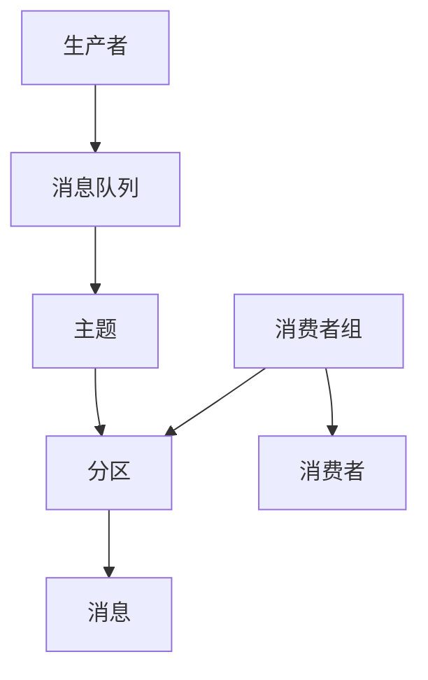

# 消费者组 原理与代码实例讲解

作者：禅与计算机程序设计艺术 / Zen and the Art of Computer Programming

## 1. 背景介绍

### 1.1 问题的由来

在分布式系统中，消息队列（Message Queue）是一个重要的组件，用于解耦生产者和消费者之间的关系。消息队列的一个关键特性是消费者组（Consumer Group），它允许多个消费者共同处理一个主题（Topic）中的消息，从而提高系统的吞吐量和可靠性。然而，消费者组的实现和管理并非易事，涉及到复杂的协调和负载均衡机制。

### 1.2 研究现状

目前，主流的消息队列系统如Apache Kafka、RabbitMQ和ActiveMQ等都支持消费者组的概念。Kafka的消费者组机制尤为成熟和广泛应用，其设计思想和实现细节也成为了研究的热点。尽管如此，消费者组的实现细节和优化策略仍然是一个复杂且不断演进的领域。

### 1.3 研究意义

深入理解消费者组的原理和实现，不仅有助于优化消息队列系统的性能，还能为分布式系统的设计提供有价值的参考。通过本文的讲解，读者将能够掌握消费者组的核心概念、算法原理、数学模型以及实际应用场景，从而在实际项目中更好地应用和优化消费者组。

### 1.4 本文结构

本文将从以下几个方面展开讨论：

1. 核心概念与联系
2. 核心算法原理 & 具体操作步骤
3. 数学模型和公式 & 详细讲解 & 举例说明
4. 项目实践：代码实例和详细解释说明
5. 实际应用场景
6. 工具和资源推荐
7. 总结：未来发展趋势与挑战
8. 附录：常见问题与解答

## 2. 核心概念与联系

在讨论消费者组之前，我们需要先了解一些基本概念：

- **消息队列（Message Queue）**：一种用于在分布式系统中传递消息的机制，生产者将消息发送到队列中，消费者从队列中读取消息。
- **主题（Topic）**：消息队列中的一个逻辑分区，用于分类和组织消息。
- **分区（Partition）**：主题的物理分区，每个分区可以独立地存储和传递消息。
- **消费者（Consumer）**：从消息队列中读取和处理消息的实体。
- **消费者组（Consumer Group）**：一组消费者共同处理一个主题中的消息，每个消息只会被组内的一个消费者处理。

这些概念之间的关系可以用以下Mermaid图表示：



## 3. 核心算法原理 & 具体操作步骤

### 3.1 算法原理概述

消费者组的核心算法包括消费者的注册、分区的分配、消息的消费和消费者的协调。其主要目标是确保每个分区的消息被组内的一个消费者处理，同时实现负载均衡和高可用性。

### 3.2 算法步骤详解

1. **消费者注册**：消费者启动时，向消息队列系统注册，加入指定的消费者组。
2. **分区分配**：消息队列系统根据当前的消费者列表和分区列表，使用特定的分配策略（如Range、RoundRobin等）将分区分配给消费者。
3. **消息消费**：消费者从分配到的分区中读取消息并进行处理。
4. **消费者协调**：当消费者加入或离开组时，触发重新分配分区的过程，确保负载均衡。

### 3.3 算法优缺点

**优点**：
- 提高系统的吞吐量和可靠性。
- 实现负载均衡，避免单点故障。

**缺点**：
- 实现复杂，涉及到消费者的协调和分区的动态分配。
- 需要处理消费者的故障和恢复，确保消息不丢失。

### 3.4 算法应用领域

消费者组广泛应用于各种分布式系统中，如日志收集、实时数据处理、事件驱动架构等。

## 4. 数学模型和公式 & 详细讲解 & 举例说明

### 4.1 数学模型构建

消费者组的数学模型可以用图论中的二分图匹配问题来描述。设 $C$ 为消费者集合，$P$ 为分区集合，$E$ 为消费者和分区之间的边集合，则消费者组的分区分配问题可以表示为一个二分图 $G = (C, P, E)$。

### 4.2 公式推导过程

假设每个消费者 $c_i \in C$ 可以处理的分区集合为 $P_i$，则分区分配的目标是找到一个最大匹配，使得每个分区 $p_j \in P$ 被唯一的消费者处理。这个问题可以用最大流算法来求解。

### 4.3 案例分析与讲解

假设有3个消费者和4个分区，分区分配的过程如下：

1. 初始状态：
   - 消费者：$C = \{c_1, c_2, c_3\}$
   - 分区：$P = \{p_1, p_2, p_3, p_4\}$

2. 分配策略：使用RoundRobin策略
   - $c_1$ 处理 $p_1$
   - $c_2$ 处理 $p_2$
   - $c_3$ 处理 $p_3$
   - $c_1$ 处理 $p_4$

### 4.4 常见问题解答

**问题1**：如何处理消费者故障？
**解答**：当消费者故障时，消息队列系统会检测到并触发重新分配分区的过程，将故障消费者的分区重新分配给其他消费者。

**问题2**：如何确保消息不丢失？
**解答**：通过消息的确认机制（ACK），确保消息在被成功处理后才从队列中删除。

## 5. 项目实践：代码实例和详细解释说明

### 5.1 开发环境搭建

在本节中，我们将使用Apache Kafka作为消息队列系统，示例代码使用Python编写。首先，确保你已经安装了Kafka和Python的Kafka客户端库`kafka-python`。

### 5.2 源代码详细实现

以下是一个简单的消费者组实现示例：

```python
from kafka import KafkaConsumer

# 创建消费者
consumer = KafkaConsumer(
    'my_topic',
    group_id='my_group',
    bootstrap_servers=['localhost:9092']
)

# 消费消息
for message in consumer:
    print(f"Received message: {message.value.decode('utf-8')}")
```

### 5.3 代码解读与分析

1. **创建消费者**：使用`KafkaConsumer`类创建一个消费者，指定主题`my_topic`和消费者组`my_group`。
2. **消费消息**：通过迭代`consumer`对象，读取并处理消息。

### 5.4 运行结果展示

运行上述代码后，消费者将从`my_topic`中读取消息并打印到控制台。

## 6. 实际应用场景

### 6.1 日志收集

在分布式系统中，日志收集是一个常见的应用场景。通过消费者组，可以将日志数据分发到多个消费者进行处理，从而提高系统的吞吐量和可靠性。

### 6.2 实时数据处理

在实时数据处理系统中，消费者组可以用于并行处理数据流，如实时分析、监控和报警等。

### 6.3 事件驱动架构

在事件驱动架构中，消费者组可以用于处理事件流，实现事件的异步处理和解耦。

### 6.4 未来应用展望

随着分布式系统的发展，消费者组的应用场景将更加广泛，如物联网、边缘计算和智能制造等领域。

## 7. 工具和资源推荐

### 7.1 学习资源推荐

- 《Kafka: The Definitive Guide》：一本全面介绍Kafka的书籍，涵盖了Kafka的核心概念、架构和应用。
- Kafka官方文档：详细介绍了Kafka的使用和配置。

### 7.2 开发工具推荐

- Kafka Tool：一款图形化的Kafka管理工具，方便查看和管理Kafka集群。
- Confluent Control Center：Confluent提供的Kafka管理和监控工具。

### 7.3 相关论文推荐

- "Kafka: a Distributed Messaging System for Log Processing"：介绍了Kafka的设计和实现。
- "The Log: What every software engineer should know about real-time data's unifying abstraction"：讨论了日志在分布式系统中的重要性。

### 7.4 其他资源推荐

- Kafka社区：活跃的Kafka社区，提供了丰富的资源和支持。
- GitHub上的Kafka项目：开源的Kafka项目，包含了大量的示例代码和工具。

## 8. 总结：未来发展趋势与挑战

### 8.1 研究成果总结

本文详细介绍了消费者组的核心概念、算法原理、数学模型和实际应用场景，并通过代码实例展示了消费者组的实现和应用。

### 8.2 未来发展趋势

随着分布式系统的不断发展，消费者组的应用将更加广泛和深入。未来的研究方向包括优化分区分配算法、提高消费者的容错性和可扩展性等。

### 8.3 面临的挑战

消费者组的实现和管理涉及到复杂的协调和负载均衡机制，面临着性能优化、故障处理和一致性保证等挑战。

### 8.4 研究展望

未来的研究可以在以下几个方面展开：
- 优化分区分配算法，提高系统的吞吐量和可靠性。
- 研究消费者的容错机制，确保系统的高可用性。
- 探索消费者组在新兴领域的应用，如物联网和边缘计算。

## 9. 附录：常见问题与解答

**问题1**：如何处理消费者的负载均衡？
**解答**：通过分区分配策略（如Range、RoundRobin等）实现负载均衡，确保每个消费者处理的分区数量大致相同。

**问题2**：如何处理消息的重复消费？
**解答**：通过消息的唯一标识和幂等性处理，确保消息的重复消费不会导致数据不一致。

**问题3**：如何监控消费者组的状态？
**解答**：使用Kafka的监控工具（如Kafka Tool、Confluent Control Center等）监控消费者组的状态，包括消费者的健康状况、分区分配情况等。

**问题4**：如何处理消费者的扩展和缩减？
**解答**：当消费者加入或离开组时，触发重新分配分区的过程，确保负载均衡和高可用性。

通过本文的讲解，读者应该能够深入理解消费者组的原理和实现，并在实际项目中应用和优化消费者组。希望本文能为读者提供有价值的参考和指导。