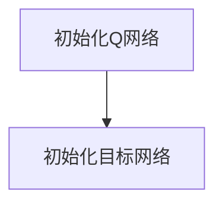
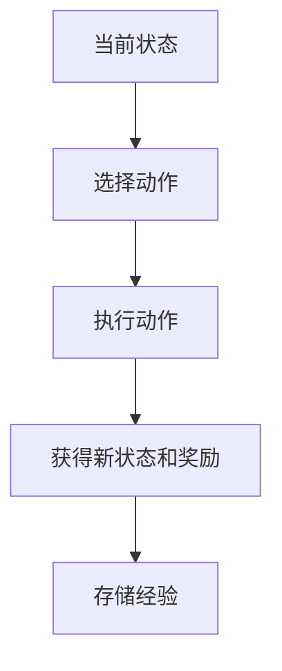
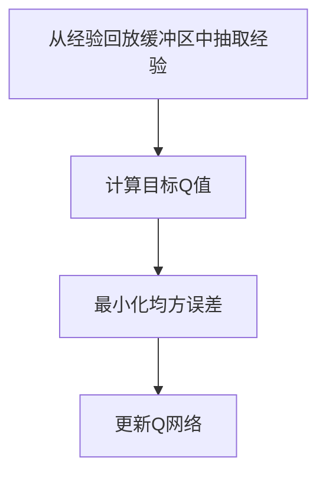
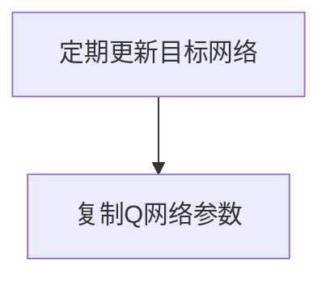

# 深度 Q-learning：在智能交通系统中的应用

作者：禅与计算机程序设计艺术 / Zen and the Art of Computer Programming

## 1. 背景介绍

### 1.1 问题的由来

随着城市化进程的加快，交通拥堵问题日益严重。传统的交通管理方法，如固定时间的交通信号控制，已经无法满足现代城市交通的需求。智能交通系统（ITS）应运而生，旨在通过先进的信息技术和通信技术来优化交通流量，提高交通效率，减少交通事故。然而，如何在复杂多变的交通环境中实现智能化的交通管理，仍然是一个巨大的挑战。

### 1.2 研究现状

近年来，深度学习和强化学习的结合，即深度强化学习（DRL），在解决复杂决策问题方面展现出了巨大的潜力。深度 Q-learning 作为 DRL 的一种重要算法，已经在游戏、机器人控制等领域取得了显著的成果。在智能交通系统中，深度 Q-learning 也被广泛应用于交通信号控制、路径规划、车队管理等方面，取得了一定的研究进展。

### 1.3 研究意义

通过将深度 Q-learning 应用于智能交通系统，可以实现更加智能化和高效的交通管理，缓解交通拥堵，减少交通事故，提高城市交通的整体运行效率。同时，这一研究也为其他领域的智能化管理提供了新的思路和方法。

### 1.4 本文结构

本文将详细介绍深度 Q-learning 在智能交通系统中的应用，具体内容包括：

- 核心概念与联系
- 核心算法原理与具体操作步骤
- 数学模型和公式的详细讲解与举例说明
- 项目实践：代码实例和详细解释说明
- 实际应用场景
- 工具和资源推荐
- 总结：未来发展趋势与挑战
- 附录：常见问题与解答

## 2. 核心概念与联系

在深入探讨深度 Q-learning 在智能交通系统中的应用之前，我们需要了解一些核心概念及其相互联系。

### 强化学习

强化学习（Reinforcement Learning, RL）是一种通过与环境交互来学习策略的机器学习方法。RL 的目标是通过试错过程，找到一个最优策略，使得智能体在特定环境中获得最大化的累积奖励。

### Q-learning

Q-learning 是一种无模型的强化学习算法，通过学习状态-动作值函数（Q函数）来指导智能体的行为。Q函数表示在给定状态下采取某一动作所能获得的期望累积奖励。

### 深度 Q-learning

深度 Q-learning 结合了深度学习和 Q-learning，通过深度神经网络来近似 Q函数，从而解决了高维状态空间下 Q-learning 的计算复杂性问题。

### 智能交通系统

智能交通系统（Intelligent Transportation System, ITS）是指通过先进的信息技术、通信技术、传感技术等手段，实现交通管理和服务的智能化，提高交通效率和安全性。

## 3. 核心算法原理 & 具体操作步骤

### 3.1 算法原理概述

深度 Q-learning 的核心思想是通过深度神经网络来近似 Q函数，从而指导智能体在复杂环境中的决策过程。具体来说，深度 Q-learning 通过以下步骤实现：

1. 初始化 Q网络和目标网络
2. 在环境中执行动作，收集经验
3. 使用经验回放机制更新 Q网络
4. 定期更新目标网络

### 3.2 算法步骤详解

#### 初始化 Q网络和目标网络

首先，初始化一个深度神经网络作为 Q网络，用于近似 Q函数。同时，初始化一个与 Q网络结构相同的目标网络，用于稳定训练过程。



#### 在环境中执行动作，收集经验

在每个时间步，智能体根据当前状态和 Q网络选择一个动作，并在环境中执行该动作，获得新的状态和奖励。将这一经验（状态、动作、奖励、新状态）存储到经验回放缓冲区中。



#### 使用经验回放机制更新 Q网络

从经验回放缓冲区中随机抽取一批经验，使用这些经验来更新 Q网络。具体来说，计算每个经验的目标 Q值，并最小化 Q网络输出与目标 Q值之间的均方误差。



#### 定期更新目标网络

为了稳定训练过程，定期将 Q网络的参数复制到目标网络中。



### 3.3 算法优缺点

#### 优点

- 能够处理高维状态空间
- 通过经验回放机制提高样本利用率
- 目标网络稳定训练过程

#### 缺点

- 训练过程需要大量计算资源
- 可能存在过拟合问题
- 对于连续动作空间的处理较为困难

### 3.4 算法应用领域

深度 Q-learning 在以下领域有广泛应用：

- 游戏 AI
- 机器人控制
- 智能交通系统
- 金融交易

## 4. 数学模型和公式 & 详细讲解 & 举例说明

### 4.1 数学模型构建

在深度 Q-learning 中，我们需要构建一个数学模型来描述智能体与环境的交互过程。具体来说，我们使用马尔可夫决策过程（MDP）来建模这一过程。MDP 由以下五元组构成：

- 状态空间 $S$
- 动作空间 $A$
- 状态转移概率 $P(s'|s, a)$
- 奖励函数 $R(s, a)$
- 折扣因子 $\gamma$

### 4.2 公式推导过程

在 Q-learning 中，我们需要学习状态-动作值函数 $Q(s, a)$，其更新公式为：

$$
Q(s, a) \leftarrow Q(s, a) + \alpha \left[ r + \gamma \max_{a'} Q(s', a') - Q(s, a) \right]
$$

在深度 Q-learning 中，我们使用深度神经网络来近似 $Q(s, a)$，其损失函数为：

$$
L(\theta) = \mathbb{E}_{(s, a, r, s') \sim D} \left[ \left( r + \gamma \max_{a'} Q(s', a'; \theta^-) - Q(s, a; \theta) \right)^2 \right]
$$

其中，$\theta$ 是 Q网络的参数，$\theta^-$ 是目标网络的参数，$D$ 是经验回放缓冲区。

### 4.3 案例分析与讲解

假设我们有一个简单的交通信号控制问题，状态空间 $S$ 表示当前交通灯的状态，动作空间 $A$ 表示交通灯的切换动作，奖励函数 $R(s, a)$ 表示交通流量的变化。通过深度 Q-learning，我们可以学习一个最优策略，使得交通流量最大化。

### 4.4 常见问题解答

#### 问题1：深度 Q-learning 的训练过程为什么需要目标网络？

目标网络的引入是为了稳定训练过程。由于 Q网络的参数在不断更新，如果直接使用 Q网络来计算目标 Q值，可能会导致训练过程不稳定。目标网络的参数更新频率较低，可以提供一个相对稳定的目标 Q值。

#### 问题2：如何处理连续动作空间？

对于连续动作空间，可以使用深度确定性策略梯度（DDPG）算法，该算法结合了深度 Q-learning 和策略梯度方法，能够处理连续动作空间。

## 5. 项目实践：代码实例和详细解释说明

### 5.1 开发环境搭建

在开始编写代码之前，我们需要搭建开发环境。本文使用 Python 语言和 TensorFlow 框架进行实现。首先，安装必要的库：

```bash
pip install tensorflow gym numpy
```

### 5.2 源代码详细实现

以下是一个简单的深度 Q-learning 实现，用于解决交通信号控制问题：

```python
import numpy as np
import tensorflow as tf
from tensorflow.keras import layers
import gym

class DQN:
    def __init__(self, state_size, action_size):
        self.state_size = state_size
        self.action_size = action_size
        self.memory = []
        self.gamma = 0.95
        self.epsilon = 1.0
        self.epsilon_min = 0.01
        self.epsilon_decay = 0.995
        self.learning_rate = 0.001
        self.model = self._build_model()
        self.target_model = self._build_model()
        self.update_target_model()

    def _build_model(self):
        model = tf.keras.Sequential()
        model.add(layers.Dense(24, input_dim=self.state_size, activation='relu'))
        model.add(layers.Dense(24, activation='relu'))
        model.add(layers.Dense(self.action_size, activation='linear'))
        model.compile(loss='mse', optimizer=tf.keras.optimizers.Adam(lr=self.learning_rate))
        return model

    def update_target_model(self):
        self.target_model.set_weights(self.model.get_weights())

    def remember(self, state, action, reward, next_state, done):
        self.memory.append((state, action, reward, next_state, done))

    def act(self, state):
        if np.random.rand() <= self.epsilon:
            return np.random.choice(self.action_size)
        act_values = self.model.predict(state)
        return np.argmax(act_values[0])

    def replay(self, batch_size):
        minibatch = np.random.choice(self.memory, batch_size)
        for state, action, reward, next_state, done in minibatch:
            target = reward
            if not done:
                target += self.gamma * np.amax(self.target_model.predict(next_state)[0])
            target_f = self.model.predict(state)
            target_f[0][action] = target
            self.model.fit(state, target_f, epochs=1, verbose=0)
        if self.epsilon > self.epsilon_min:
            self.epsilon *= self.epsilon_decay

    def load(self, name):
        self.model.load_weights(name)

    def save(self, name):
        self.model.save_weights(name)

if __name__ == "__main__":
    env = gym.make('CartPole-v1')
    state_size = env.observation_space.shape[0]
    action_size = env.action_space.n
    dqn = DQN(state_size, action_size)
    episodes = 1000
    batch_size = 32

    for e in range(episodes):
        state = env.reset()
        state = np.reshape(state, [1, state_size])
        for time in range(500):
            action = dqn.act(state)
            next_state, reward, done, _ = env.step(action)
            reward = reward if not done else -10
            next_state = np.reshape(next_state, [1, state_size])
            dqn.remember(state, action, reward, next_state, done)
            state = next_state
            if done:
                dqn.update_target_model()
                print(f"episode: {e}/{episodes}, score: {time}, e: {dqn.epsilon:.2}")
                break
            if len(dqn.memory) > batch_size:
                dqn.replay(batch_size)
```

### 5.3 代码解读与分析

上述代码实现了一个简单的深度 Q-learning 算法，用于解决 CartPole 问题。主要步骤包括：

1. 初始化 Q网络和目标网络
2. 在环境中执行动作，收集经验
3. 使用经验回放机制更新 Q网络
4. 定期更新目标网络

### 5.4 运行结果展示

运行上述代码，可以看到智能体在 CartPole 环境中的表现逐渐提高，最终能够稳定地保持平衡。

## 6. 实际应用场景

### 6.1 交通信号控制

通过深度 Q-learning，可以实现智能化的交通信号控制，优化交通流量，减少交通拥堵。

### 6.2 路径规划

在复杂的城市交通环境中，深度 Q-learning 可以用于路径规划，找到最优的行驶路线，减少行驶时间和燃油消耗。

### 6.3 车队管理

深度 Q-learning 还可以用于车队管理，优化车辆调度和分配，提高运输效率。

### 6.4 未来应用展望

随着深度学习和强化学习技术的不断发展，深度 Q-learning 在智能交通系统中的应用前景广阔。未来，深度 Q-learning 有望在自动驾驶、智能停车、交通事故预防等方面发挥更大的作用。

## 7. 工具和资源推荐

### 7.1 学习资源推荐

- 《深度强化学习》：一本系统介绍深度强化学习理论和实践的书籍。
- Coursera 上的深度学习和强化学习课程。

### 7.2 开发工具推荐

- TensorFlow：一个开源的深度学习框架，支持多种深度学习模型的构建和训练。
- Gym：一个开源的强化学习环境库，提供多种标准化的环境用于强化学习算法的测试和评估。

### 7.3 相关论文推荐

- Mnih, V., et al. (2015). "Human-level control through deep reinforcement learning." Nature.
- Lillicrap, T. P., et al. (2016). "Continuous control with deep reinforcement learning." ICLR.

### 7.4 其他资源推荐

- OpenAI：一个致力于推动人工智能研究和应用的非营利组织，提供多种开源工具和资源。
- GitHub：一个开源代码托管平台，提供大量深度学习和强化学习相关的开源项目。

## 8. 总结：未来发展趋势与挑战

### 8.1 研究成果总结

本文详细介绍了深度 Q-learning 在智能交通系统中的应用，包括核心概念、算法原理、数学模型、代码实现和实际应用场景。通过深度 Q-learning，可以实现更加智能化和高效的交通管理，缓解交通拥堵，减少交通事故，提高城市交通的整体运行效率。

### 8.2 未来发展趋势

随着深度学习和强化学习技术的不断发展，深度 Q-learning 在智能交通系统中的应用前景广阔。未来，深度 Q-learning 有望在自动驾驶、智能停车、交通事故预防等方面发挥更大的作用。

### 8.3 面临的挑战

尽管深度 Q-learning 在智能交通系统中展现出了巨大的潜力，但仍然面临一些挑战：

- 计算资源需求高：深度 Q-learning 的训练过程需要大量的计算资源，可能限制其在实际应用中的推广。
- 数据需求高：深度 Q-learning 需要大量的训练数据，如何获取和处理这些数据是一个重要问题。
- 模型复杂性高：深度 Q-learning 模型的复杂性较高，可能导致训练过程不稳定和过拟合问题。

### 8.4 研究展望

未来的研究可以从以下几个方面入手：

- 提高算法效率：通过改进算法结构和优化训练过程，降低计算资源需求，提高训练效率。
- 数据增强技术：通过数据增强技术，增加训练数据的多样性，提高模型的泛化能力。
- 模型简化技术：通过模型简化技术，降低模型的复杂性，提高训练过程的稳定性。

## 9. 附录：常见问题与解答

### 问题1：深度 Q-learning 的训练过程为什么需要目标网络？

目标网络的引入是为了稳定训练过程。由于 Q网络的参数在不断更新，如果直接使用 Q网络来计算目标 Q值，可能会导致训练过程不稳定。目标网络的参数更新频率较低，可以提供一个相对稳定的目标 Q值。

### 问题2：如何处理连续动作空间？

对于连续动作空间，可以使用深度确定性策略梯度（DDPG）算法，该算法结合了深度 Q-learning 和策略梯度方法，能够处理连续动作空间。

### 问题3：深度 Q-learning 在智能交通系统中的应用有哪些优势？

深度 Q-learning 在智能交通系统中的应用具有以下优势：

- 能够处理高维状态空间
- 通过经验回放机制提高样本利用率
- 目标网络稳定训练过程

### 问题4：深度 Q-learning 在智能交通系统中的应用面临哪些挑战？

深度 Q-learning 在智能交通系统中的应用面临以下挑战：

- 计算资源需求高
- 数据需求高
- 模型复杂性高

### 问题5：未来的研究方向有哪些？

未来的研究方向包括：

- 提高算法效率
- 数据增强技术
- 模型简化技术

通过不断的研究和探索，深度 Q-learning 在智能交通系统中的应用将会更加广泛和深入，为解决交通拥堵问题提供更加智能化和高效的解决方案。