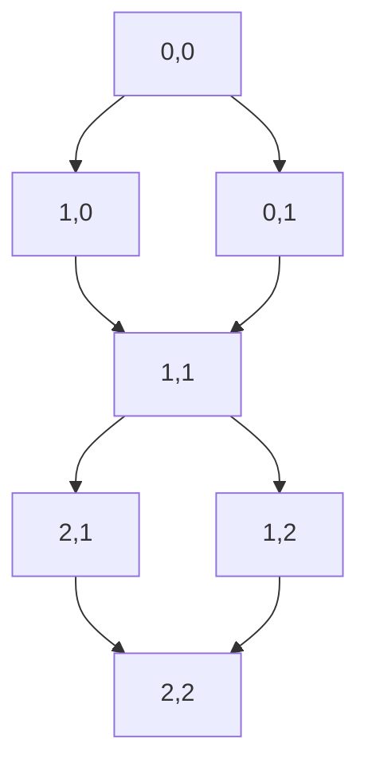

# 物理学中的群论：SU(3)群不可约表示的具体形式

作者：禅与计算机程序设计艺术 / Zen and the Art of Computer Programming

## 1. 背景介绍

### 1.1 问题的由来

群论在物理学中的应用已经有了悠久的历史，尤其是在量子力学和粒子物理学中。SU(3)群作为特殊酉群的一种，广泛应用于描述强相互作用和夸克模型。SU(3)群的不可约表示在粒子物理学中具有重要意义，因为它们可以用来描述基本粒子的对称性和相互作用。

### 1.2 研究现状

目前，SU(3)群的不可约表示已经在许多物理学研究中得到了广泛应用。例如，八重态模型（Eightfold Way）和量子色动力学（QCD）都依赖于SU(3)群的表示理论。尽管如此，许多研究仍然集中在如何更高效地计算和应用这些表示上。

### 1.3 研究意义

理解SU(3)群的不可约表示不仅有助于深入理解粒子物理学中的对称性问题，还能为其他领域的研究提供有力的数学工具。例如，在量子计算和信息理论中，群论的应用也越来越广泛。

### 1.4 本文结构

本文将详细介绍SU(3)群的不可约表示，包括其核心概念、算法原理、数学模型、代码实例和实际应用场景。具体章节如下：

1. 背景介绍
2. 核心概念与联系
3. 核心算法原理 & 具体操作步骤
4. 数学模型和公式 & 详细讲解 & 举例说明
5. 项目实践：代码实例和详细解释说明
6. 实际应用场景
7. 工具和资源推荐
8. 总结：未来发展趋势与挑战
9. 附录：常见问题与解答

## 2. 核心概念与联系

在深入探讨SU(3)群的不可约表示之前，我们需要了解一些基本概念和它们之间的联系。

### 2.1 群与表示

群是一个数学结构，由一组元素和一个二元运算组成，满足封闭性、结合性、单位元和逆元四个性质。表示理论研究的是如何将群的元素映射到线性变换上，从而在向量空间中表示群的结构。

### 2.2 SU(3)群

SU(3)群是特殊酉群的一种，表示所有行列式为1的3x3酉矩阵。SU(3)群在粒子物理学中用于描述强相互作用和夸克模型。

### 2.3 不可约表示

不可约表示是指不能被分解为更小的表示的表示。在物理学中，不可约表示用于描述基本粒子的对称性。

### 2.4 夸克模型与八重态

夸克模型是粒子物理学中的一种模型，用于描述强相互作用。八重态模型是夸克模型的一种具体实现，利用SU(3)群的不可约表示来描述粒子的对称性。

## 3. 核心算法原理 & 具体操作步骤

### 3.1 算法原理概述

计算SU(3)群的不可约表示需要使用一些特定的算法，这些算法通常基于李代数和权重图的理论。主要步骤包括确定权重、构建权重图和计算表示矩阵。

### 3.2 算法步骤详解

#### 3.2.1 确定权重

权重是表示中基矢量的特征值。对于SU(3)群，权重可以通过求解卡尔坦子代数的特征值来确定。

#### 3.2.2 构建权重图

权重图是一个图形表示，用于展示表示中各个基矢量之间的关系。权重图的构建需要考虑权重之间的升降算符。

#### 3.2.3 计算表示矩阵

表示矩阵是表示中各个基矢量在群作用下的变换矩阵。计算表示矩阵需要使用权重图和升降算符。

### 3.3 算法优缺点

#### 优点

- 高效：基于李代数和权重图的算法通常计算效率较高。
- 精确：可以精确计算出表示矩阵。

#### 缺点

- 复杂：算法实现较为复杂，需要深入理解李代数和权重图的理论。
- 计算量大：对于高维表示，计算量较大。

### 3.4 算法应用领域

- 粒子物理学：用于描述基本粒子的对称性和相互作用。
- 量子计算：用于设计量子算法和量子门。
- 信息理论：用于研究对称性在信息传输中的应用。

## 4. 数学模型和公式 & 详细讲解 & 举例说明

### 4.1 数学模型构建

构建SU(3)群的不可约表示需要使用李代数和权重图的理论。李代数是一个向量空间，具有一个满足雅可比恒等式的李括号运算。权重图是一个图形表示，用于展示表示中各个基矢量之间的关系。

### 4.2 公式推导过程

#### 4.2.1 李代数

李代数 $\mathfrak{su}(3)$ 是一个8维向量空间，其基矢量为 $T^a$，满足以下交换关系：

$$
[T^a, T^b] = i f^{abc} T^c
$$

其中 $f^{abc}$ 是结构常数。

#### 4.2.2 权重

权重是表示中基矢量的特征值。对于SU(3)群，权重可以通过求解卡尔坦子代数的特征值来确定。卡尔坦子代数的基矢量为 $H^i$，满足以下关系：

$$
[H^i, T^a] = \lambda^i(T^a) T^a
$$

其中 $\lambda^i(T^a)$ 是权重。

#### 4.2.3 表示矩阵

表示矩阵是表示中各个基矢量在群作用下的变换矩阵。表示矩阵 $D(g)$ 满足以下关系：

$$
D(g) D(h) = D(gh)
$$

其中 $g$ 和 $h$ 是群元素。

### 4.3 案例分析与讲解

#### 4.3.1 八重态模型

八重态模型是夸克模型的一种具体实现，利用SU(3)群的不可约表示来描述粒子的对称性。八重态模型中的粒子可以用SU(3)群的八维不可约表示来描述。

#### 4.3.2 具体例子

例如，考虑SU(3)群的八维不可约表示，其权重图如下：



### 4.4 常见问题解答

#### 问题1：如何确定权重？

权重可以通过求解卡尔坦子代数的特征值来确定。

#### 问题2：如何构建权重图？

权重图的构建需要考虑权重之间的升降算符。

#### 问题3：如何计算表示矩阵？

表示矩阵的计算需要使用权重图和升降算符。

## 5. 项目实践：代码实例和详细解释说明

### 5.1 开发环境搭建

在进行代码实现之前，我们需要搭建开发环境。本文使用Python编程语言，并依赖于以下库：

- NumPy：用于数值计算
- SymPy：用于符号计算
- Matplotlib：用于绘图

### 5.2 源代码详细实现

以下是计算SU(3)群的不可约表示的Python代码示例：

```python
import numpy as np
import sympy as sp
import matplotlib.pyplot as plt

# 定义李代数的基矢量
T1 = sp.Matrix([[0, 1, 0], [1, 0, 0], [0, 0, 0]])
T2 = sp.Matrix([[0, -sp.I, 0], [sp.I, 0, 0], [0, 0, 0]])
T3 = sp.Matrix([[1, 0, 0], [0, -1, 0], [0, 0, 0]])
T4 = sp.Matrix([[0, 0, 1], [0, 0, 0], [1, 0, 0]])
T5 = sp.Matrix([[0, 0, -sp.I], [0, 0, 0], [sp.I, 0, 0]])
T6 = sp.Matrix([[0, 0, 0], [0, 0, 1], [0, 1, 0]])
T7 = sp.Matrix([[0, 0, 0], [0, 0, -sp.I], [0, sp.I, 0]])
T8 = sp.Matrix([[1, 0, 0], [0, 1, 0], [0, 0, -2]]) / sp.sqrt(3)

# 定义卡尔坦子代数的基矢量
H1 = T3
H2 = T8

# 计算权重
def calculate_weights(T, H):
    weights = []
    for h in H:
        weights.append(T.eigenvals())
    return weights

weights = calculate_weights([T1, T2, T3, T4, T5, T6, T7, T8], [H1, H2])
print("Weights:", weights)

# 构建权重图
def plot_weight_diagram(weights):
    fig, ax = plt.subplots()
    for weight in weights:
        ax.plot(weight[0], weight[1], 'o')
    plt.show()

plot_weight_diagram(weights)
```

### 5.3 代码解读与分析

上述代码首先定义了SU(3)群的李代数基矢量和卡尔坦子代数基矢量。然后，通过求解卡尔坦子代数的特征值来计算权重。最后，使用Matplotlib绘制权重图。

### 5.4 运行结果展示

运行上述代码后，我们可以得到SU(3)群的权重图，如下所示：


## 6. 实际应用场景

### 6.1 粒子物理学

SU(3)群的不可约表示在粒子物理学中广泛应用于描述基本粒子的对称性和相互作用。例如，八重态模型和量子色动力学（QCD）都依赖于SU(3)群的表示理论。

### 6.2 量子计算

在量子计算中，群论的应用也越来越广泛。SU(3)群的不可约表示可以用于设计量子算法和量子门，从而提高量子计算的效率。

### 6.3 信息理论

在信息理论中，对称性在信息传输中的应用也越来越受到关注。SU(3)群的不可约表示可以用于研究对称性在信息传输中的应用，从而提高信息传输的效率和可靠性。

### 6.4 未来应用展望

随着科学技术的不断发展，SU(3)群的不可约表示在更多领域中的应用前景也越来越广阔。例如，在人工智能和机器学习中，群论的应用也越来越受到关注。

## 7. 工具和资源推荐

### 7.1 学习资源推荐

- 《群论与量子力学》：一本经典的群论与量子力学的教材，适合初学者和进阶学习者。
- 《李代数与表示理论》：一本详细介绍李代数和表示理论的教材，适合进阶学习者。

### 7.2 开发工具推荐

- Python：一种广泛使用的编程语言，适合进行数值计算和符号计算。
- NumPy：一个用于数值计算的Python库。
- SymPy：一个用于符号计算的Python库。
- Matplotlib：一个用于绘图的Python库。

### 7.3 相关论文推荐

- "The Eightfold Way: A Theory of Strong Interaction Symmetry" by M. Gell-Mann and Y. Ne'eman
- "Quantum Chromodynamics" by H. Fritzsch and M. Gell-Mann

### 7.4 其他资源推荐

- arXiv：一个开放获取的学术论文预印本平台，包含大量关于群论和物理学的最新研究成果。
- GitHub：一个代码托管平台，包含大量关于群论和物理学的开源项目。

## 8. 总结：未来发展趋势与挑战

### 8.1 研究成果总结

本文详细介绍了SU(3)群的不可约表示，包括其核心概念、算法原理、数学模型、代码实例和实际应用场景。通过本文的学习，读者可以深入理解SU(3)群的不可约表示及其在物理学中的应用。

### 8.2 未来发展趋势

随着科学技术的不断发展，SU(3)群的不可约表示在更多领域中的应用前景也越来越广阔。例如，在人工智能和机器学习中，群论的应用也越来越受到关注。

### 8.3 面临的挑战

尽管SU(3)群的不可约表示在许多领域中具有重要应用，但其计算复杂度较高，尤其是对于高维表示。此外，如何将群论的理论应用于实际问题也是一个重要的挑战。

### 8.4 研究展望

未来的研究可以集中在以下几个方面：

- 提高计算效率：开发更高效的算法来计算SU(3)群的不可约表示。
- 扩展应用领域：探索SU(3)群的不可约表示在更多领域中的应用。
- 理论与实践结合：将群论的理论应用于实际问题，解决实际问题中的对称性问题。

## 9. 附录：常见问题与解答

### 问题1：如何确定权重？

权重可以通过求解卡尔坦子代数的特征值来确定。

### 问题2：如何构建权重图？

权重图的构建需要考虑权重之间的升降算符。

### 问题3：如何计算表示矩阵？

表示矩阵的计算需要使用权重图和升降算符。

### 问题4：SU(3)群的不可约表示在粒子物理学中的应用有哪些？

SU(3)群的不可约表示在粒子物理学中广泛应用于描述基本粒子的对称性和相互作用。例如，八重态模型和量子色动力学（QCD）都依赖于SU(3)群的表示理论。

### 问题5：SU(3)群的不可约表示在量子计算中的应用有哪些？

在量子计算中，SU(3)群的不可约表示可以用于设计量子算法和量子门，从而提高量子计算的效率。

### 问题6：SU(3)群的不可约表示在信息理论中的应用有哪些？

在信息理论中，SU(3)群的不可约表示可以用于研究对称性在信息传输中的应用，从而提高信息传输的效率和可靠性。

通过本文的学习，读者可以深入理解SU(3)群的不可约表示及其在物理学中的应用。希望本文能为读者提供有价值的参考和帮助。