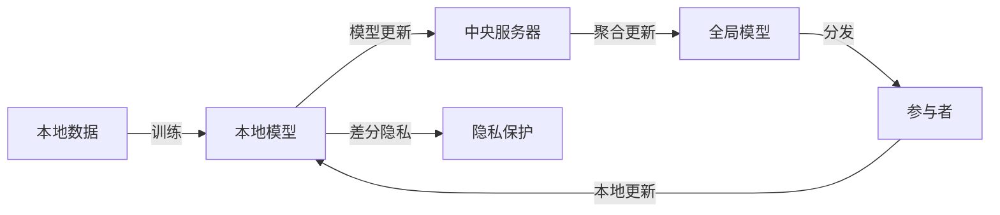

## 1. 背景介绍

随着数据隐私保护法规的日益严格，如欧盟的通用数据保护条例（GDPR），企业和研究机构面临着如何在保护用户隐私的同时，利用数据进行机器学习的巨大挑战。联邦学习作为一种新兴的分布式机器学习方法，允许多个参与者协同训练模型，而无需共享他们的数据，从而保护了数据隐私。本文将深入探讨联邦学习的原理、隐私计算的技术，以及如何在实际项目中应用这些概念。

## 2. 核心概念与联系

联邦学习涉及多个关键概念，包括本地模型训练、模型聚合、差分隐私等。在联邦学习中，每个参与者在本地数据上训练模型，然后将模型更新发送到中央服务器。服务器负责聚合这些更新，以改进全局模型。差分隐私技术可以进一步增强数据隐私，通过添加噪声来保护个体数据不被推断。



## 3. 核心算法原理具体操作步骤

联邦学习的核心算法包括本地模型训练、安全聚合以及模型更新。操作步骤如下：

1. 初始化全局模型。
2. 分发全局模型到所有参与者。
3. 每个参与者在本地数据上训练模型。
4. 参与者将模型更新发送到中央服务器。
5. 服务器使用安全聚合算法合并更新。
6. 更新全局模型。
7. 重复步骤2-6直到模型收敛。

## 4. 数学模型和公式详细讲解举例说明

联邦学习的数学模型基于优化理论。考虑一个简单的线性回归问题，我们的目标是最小化以下损失函数：

$$
L(w) = \frac{1}{n}\sum_{i=1}^{n}(y_i - w^Tx_i)^2
$$

其中，$w$ 是模型参数，$x_i$ 是特征向量，$y_i$ 是标签。在联邦学习中，损失函数变为：

$$
L(w) = \sum_{k=1}^{K}\frac{n_k}{n}L_k(w)
$$

这里，$L_k(w)$ 是第$k$个参与者的本地损失函数，$n_k$ 是其数据点的数量，$n$ 是所有参与者数据点的总数。

## 5. 项目实践：代码实例和详细解释说明

以TensorFlow Federated为例，以下是一个简单的联邦学习代码实例：

```python
import tensorflow as tf
import tensorflow_federated as tff

# 准备联邦数据
federated_train_data = ...

# 创建模型
def create_keras_model():
    return tf.keras.models.Sequential([
        tf.keras.layers.Dense(10, activation='relu', input_shape=(784,)),
        tf.keras.layers.Dense(10, activation='softmax')
    ])

# 构建联邦学习过程
def model_fn():
    keras_model = create_keras_model()
    return tff.learning.from_keras_model(
        keras_model,
        input_spec=federated_train_data[0].element_spec,
        loss=tf.keras.losses.SparseCategoricalCrossentropy(),
        metrics=[tf.keras.metrics.SparseCategoricalAccuracy()]
    )

iterative_process = tff.learning.build_federated_averaging_process(model_fn)
state = iterative_process.initialize()

# 训练模型
for round_num in range(1, num_rounds):
    state, metrics = iterative_process.next(state, federated_train_data)
    print('Round {:2d}, Metrics: {}'.format(round_num, metrics))
```

在这个例子中，我们首先准备了联邦数据集，然后创建了一个简单的Keras模型。接着，我们使用`from_keras_model`函数将Keras模型转换为联邦学习模型，并构建了联邦学习过程。最后，我们通过多轮迭代来训练全局模型。

## 6. 实际应用场景

联邦学习在多个领域都有实际应用，包括医疗健康、金融服务、物联网和移动设备等。在医疗健康领域，联邦学习可以帮助医院和研究机构在不共享患者数据的情况下，共同开发更准确的预测模型。

## 7. 工具和资源推荐

- TensorFlow Federated (TFF): 一个开源框架，用于在TensorFlow上实现联邦学习。
- PySyft: 一个Python库，用于实现安全和私密的分布式机器学习。
- OpenMined: 一个社区，致力于开发隐私保护的AI技术。

## 8. 总结：未来发展趋势与挑战

联邦学习的未来发展趋势包括更高效的算法、更强的隐私保护措施以及更广泛的应用场景。然而，这一领域也面临着诸多挑战，如如何平衡模型性能与隐私保护、如何防止恶意参与者攻击等。

## 9. 附录：常见问题与解答

- Q: 联邦学习如何保证隐私？
- A: 通过在本地训练模型并仅共享模型更新，而不是原始数据，联邦学习有助于保护用户隐私。

- Q: 联邦学习是否适用于所有类型的数据？
- A: 联邦学习最适合分布式、异构的数据场景，但对于某些特定类型的数据，如时间序列数据，可能需要特殊的处理方法。

作者：禅与计算机程序设计艺术 / Zen and the Art of Computer Programming