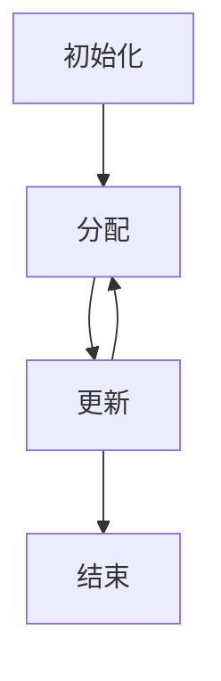
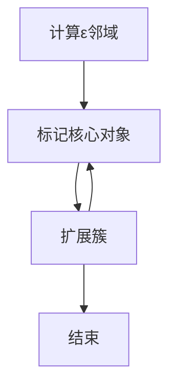
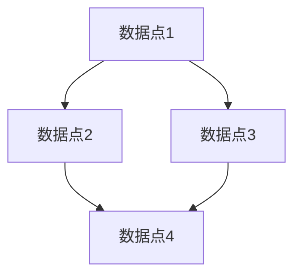

# 聚类算法(Clustering Algorithms) - 原理与代码实例讲解

作者：禅与计算机程序设计艺术 / Zen and the Art of Computer Programming

## 1. 背景介绍

### 1.1 问题的由来

在数据科学和机器学习领域，聚类算法是一种重要的无监督学习方法。它的主要目标是将一组数据对象分成多个簇，使得同一簇中的对象在某种意义上是相似的，而不同簇中的对象则是不同的。聚类算法广泛应用于图像处理、市场分析、模式识别和生物信息学等领域。

### 1.2 研究现状

目前，聚类算法已经发展出多种不同的类型，包括分层聚类、划分聚类、基于密度的聚类和基于网格的聚类等。每种算法都有其独特的优缺点和适用场景。例如，K-means算法因其简单高效而被广泛使用，但它对初始值和噪声数据较为敏感。DBSCAN算法则能够有效处理噪声数据，但在高维数据中表现不佳。

### 1.3 研究意义

研究和应用聚类算法具有重要的实际意义。通过聚类分析，可以发现数据中的潜在模式和结构，从而为决策提供依据。例如，在市场分析中，通过聚类可以将消费者分成不同的群体，从而制定有针对性的营销策略。在生物信息学中，通过聚类可以发现基因表达数据中的共表达基因群，从而揭示基因的功能关系。

### 1.4 本文结构

本文将详细介绍聚类算法的核心概念、算法原理、数学模型、代码实例和实际应用场景。具体结构如下：

1. 背景介绍
2. 核心概念与联系
3. 核心算法原理 & 具体操作步骤
4. 数学模型和公式 & 详细讲解 & 举例说明
5. 项目实践：代码实例和详细解释说明
6. 实际应用场景
7. 工具和资源推荐
8. 总结：未来发展趋势与挑战
9. 附录：常见问题与解答

## 2. 核心概念与联系

在深入探讨聚类算法之前，我们需要了解一些核心概念和它们之间的联系。

### 2.1 聚类

聚类是将数据对象分成多个簇的过程，使得同一簇中的对象在某种意义上是相似的，而不同簇中的对象则是不同的。聚类是一种无监督学习方法，因为它不需要预先标注的数据。

### 2.2 簇

簇是由一组相似的数据对象组成的集合。簇的定义可以根据不同的相似性度量来确定，例如欧氏距离、曼哈顿距离或余弦相似度。

### 2.3 相似性度量

相似性度量是用于衡量数据对象之间相似程度的指标。常见的相似性度量包括欧氏距离、曼哈顿距离、余弦相似度等。选择合适的相似性度量对于聚类算法的效果至关重要。

### 2.4 聚类中心

聚类中心是簇中所有数据对象的中心点。对于K-means算法，聚类中心是通过迭代更新的方式来确定的。聚类中心的选择对聚类结果有重要影响。

### 2.5 聚类算法的分类

聚类算法可以分为以下几类：

- 划分聚类：如K-means算法
- 分层聚类：如凝聚层次聚类和分裂层次聚类
- 基于密度的聚类：如DBSCAN算法
- 基于网格的聚类：如STING算法

## 3. 核心算法原理 & 具体操作步骤

在本节中，我们将详细介绍几种常见的聚类算法，包括它们的原理、具体操作步骤、优缺点和应用领域。

### 3.1 算法原理概述

#### 3.1.1 K-means算法

K-means算法是一种划分聚类算法，其目标是将数据对象分成K个簇，使得每个簇中的对象到簇中心的距离之和最小。算法的基本步骤如下：

1. 随机选择K个初始聚类中心。
2. 将每个数据对象分配到最近的聚类中心。
3. 重新计算每个簇的聚类中心。
4. 重复步骤2和3，直到聚类中心不再变化或达到最大迭代次数。

#### 3.1.2 DBSCAN算法

DBSCAN（Density-Based Spatial Clustering of Applications with Noise）是一种基于密度的聚类算法。其基本思想是通过密度连接的方式将数据对象分成簇。算法的基本步骤如下：

1. 对于每个数据对象，计算其ε邻域内的对象数量。
2. 如果某个对象的ε邻域内的对象数量大于等于MinPts，则将其标记为核心对象。
3. 对于每个核心对象，将其ε邻域内的所有对象标记为同一个簇。
4. 重复步骤2和3，直到所有核心对象都被处理完。

### 3.2 算法步骤详解

#### 3.2.1 K-means算法步骤详解

1. **初始化**：随机选择K个初始聚类中心。
2. **分配**：将每个数据对象分配到最近的聚类中心。计算每个数据对象到所有聚类中心的距离，并选择距离最近的聚类中心。
3. **更新**：重新计算每个簇的聚类中心。聚类中心是簇中所有数据对象的平均值。
4. **迭代**：重复分配和更新步骤，直到聚类中心不再变化或达到最大迭代次数。



#### 3.2.2 DBSCAN算法步骤详解

1. **计算ε邻域**：对于每个数据对象，计算其ε邻域内的对象数量。
2. **标记核心对象**：如果某个对象的ε邻域内的对象数量大于等于MinPts，则将其标记为核心对象。
3. **扩展簇**：对于每个核心对象，将其ε邻域内的所有对象标记为同一个簇。
4. **迭代**：重复标记核心对象和扩展簇步骤，直到所有核心对象都被处理完。



### 3.3 算法优缺点

#### 3.3.1 K-means算法优缺点

**优点**：
- 简单高效，易于实现。
- 适用于大规模数据集。

**缺点**：
- 对初始值敏感，可能陷入局部最优解。
- 对噪声数据和异常值敏感。
- 需要预先指定簇的数量K。

#### 3.3.2 DBSCAN算法优缺点

**优点**：
- 能够发现任意形状的簇。
- 对噪声数据具有鲁棒性。
- 不需要预先指定簇的数量。

**缺点**：
- 在高维数据中表现不佳。
- 对参数ε和MinPts敏感。

### 3.4 算法应用领域

#### 3.4.1 K-means算法应用领域

- 图像分割
- 文本聚类
- 市场分析
- 模式识别

#### 3.4.2 DBSCAN算法应用领域

- 空间数据分析
- 图像处理
- 生物信息学
- 异常检测

## 4. 数学模型和公式 & 详细讲解 & 举例说明

在本节中，我们将详细介绍聚类算法的数学模型和公式，并通过具体案例进行讲解。

### 4.1 数学模型构建

#### 4.1.1 K-means算法数学模型

K-means算法的目标是最小化簇内平方误差和（Within-Cluster Sum of Squares, WCSS）。其数学模型可以表示为：

$$
\text{WCSS} = \sum_{i=1}^{K} \sum_{x \in C_i} \| x - \mu_i \|^2
$$

其中，$K$是簇的数量，$C_i$是第$i$个簇，$\mu_i$是第$i$个簇的聚类中心，$\| x - \mu_i \|$是数据对象$x$到聚类中心$\mu_i$的欧氏距离。

#### 4.1.2 DBSCAN算法数学模型

DBSCAN算法的核心思想是通过密度连接的方式将数据对象分成簇。其数学模型可以表示为：

$$
N_\epsilon(x) = \{ y \in D \mid \| x - y \| \leq \epsilon \}
$$

其中，$N_\epsilon(x)$是数据对象$x$的ε邻域，$D$是数据集，$\| x - y \|$是数据对象$x$和$y$之间的距离。

### 4.2 公式推导过程

#### 4.2.1 K-means算法公式推导

K-means算法的目标是最小化簇内平方误差和。其推导过程如下：

1. 初始化K个聚类中心$\mu_1, \mu_2, \ldots, \mu_K$。
2. 对于每个数据对象$x$，计算其到所有聚类中心的距离，并选择距离最近的聚类中心$\mu_i$，将$x$分配到簇$C_i$。
3. 重新计算每个簇的聚类中心$\mu_i$，其计算公式为：

$$
\mu_i = \frac{1}{|C_i|} \sum_{x \in C_i} x
$$

4. 重复步骤2和3，直到聚类中心不再变化或达到最大迭代次数。

#### 4.2.2 DBSCAN算法公式推导

DBSCAN算法的核心思想是通过密度连接的方式将数据对象分成簇。其推导过程如下：

1. 对于每个数据对象$x$，计算其ε邻域$N_\epsilon(x)$内的对象数量。
2. 如果$|N_\epsilon(x)| \geq \text{MinPts}$，则将$x$标记为核心对象。
3. 对于每个核心对象$x$，将其ε邻域$N_\epsilon(x)$内的所有对象标记为同一个簇。
4. 重复步骤2和3，直到所有核心对象都被处理完。

### 4.3 案例分析与讲解

#### 4.3.1 K-means算法案例分析

假设我们有一个二维数据集，如下图所示：



我们希望将这些数据点分成两个簇。K-means算法的具体步骤如下：

1. 初始化两个聚类中心$\mu_1$和$\mu_2$。
2. 计算每个数据点到聚类中心的距离，并将其分配到最近的聚类中心。
3. 重新计算每个簇的聚类中心。
4. 重复步骤2和3，直到聚类中心不再变化。

#### 4.3.2 DBSCAN算法案例分析

假设我们有一个二维数据集，如下图所示：


我们希望将这些数据点分成簇。DBSCAN算法的具体步骤如下：

1. 计算每个数据点的ε邻域$N_\epsilon(x)$内的对象数量。
2. 如果$|N_\epsilon(x)| \geq \text{MinPts}$，则将$x$标记为核心对象。
3. 对于每个核心对象$x$，将其ε邻域$N_\epsilon(x)$内的所有对象标记为同一个簇。
4. 重复步骤2和3，直到所有核心对象都被处理完。

### 4.4 常见问题解答

#### 4.4.1 如何选择K-means算法的K值？

选择K值可以通过肘部法则（Elbow Method）来确定。肘部法则的基本思想是绘制簇内平方误差和（WCSS）随K值变化的曲线，当曲线出现明显的拐点时，对应的K值即为最佳选择。

#### 4.4.2 DBSCAN算法的参数ε和MinPts如何选择？

选择ε和MinPts可以通过K距离图（K-distance Graph）来确定。K距离图的基本思想是绘制每个数据点到其第K近邻的距离，当图中出现明显的拐点时，对应的距离即为最佳选择。

## 5. 项目实践：代码实例和详细解释说明

在本节中，我们将通过具体的代码实例来演示如何实现和应用聚类算法。

### 5.1 开发环境搭建

我们将使用Python编程语言和常用的数据科学库（如NumPy、Pandas和Scikit-learn）来实现聚类算法。首先，确保你的开发环境中已经安装了这些库。

```bash
pip install numpy pandas scikit-learn
```

### 5.2 源代码详细实现

#### 5.2.1 K-means算法实现

```python
import numpy as np
from sklearn.cluster import KMeans
import matplotlib.pyplot as plt

# 生成示例数据
X = np.array([[1, 2], [1, 4], [1, 0],
              [4, 2], [4, 4], [4, 0]])

# 创建K-means模型
kmeans = KMeans(n_clusters=2, random_state=0).fit(X)

# 获取聚类结果
labels = kmeans.labels_
centers = kmeans.cluster_centers_

# 可视化聚类结果
plt.scatter(X[:, 0], X[:, 1], c=labels, cmap='viridis')
plt.scatter(centers[:, 0], centers[:, 1], c='red', marker='x')
plt.show()
```

#### 5.2.2 DBSCAN算法实现

```python
import numpy as np
from sklearn.cluster import DBSCAN
import matplotlib.pyplot as plt

# 生成示例数据
X = np.array([[1, 2], [1, 4], [1, 0],
              [4, 2], [4, 4], [4, 0]])

# 创建DBSCAN模型
dbscan = DBSCAN(eps=1, min_samples=2).fit(X)

# 获取聚类结果
labels = dbscan.labels_

# 可视化聚类结果
plt.scatter(X[:, 0], X[:, 1], c=labels, cmap='viridis')
plt.show()
```

### 5.3 代码解读与分析

#### 5.3.1 K-means算法代码解读

在K-means算法的实现中，我们首先生成了一组示例数据。然后，使用Scikit-learn库中的KMeans类创建K-means模型，并对数据进行聚类。最后，我们获取聚类结果并进行可视化。

#### 5.3.2 DBSCAN算法代码解读

在DBSCAN算法的实现中，我们同样生成了一组示例数据。然后，使用Scikit-learn库中的DBSCAN类创建DBSCAN模型，并对数据进行聚类。最后，我们获取聚类结果并进行可视化。

### 5.4 运行结果展示

#### 5.4.1 K-means算法运行结果

运行K-means算法代码后，我们可以看到数据点被分成了两个簇，不同簇的数据点用不同颜色表示，聚类中心用红色叉号表示。

#### 5.4.2 DBSCAN算法运行结果

运行DBSCAN算法代码后，我们可以看到数据点被分成了若干个簇，不同簇的数据点用不同颜色表示，噪声数据点用黑色表示。

## 6. 实际应用场景

在本节中，我们将探讨聚类算法在实际应用中的一些典型场景。

### 6.1 图像分割

聚类算法可以用于图像分割，将图像中的像素分成不同的区域。例如，K-means算法可以将图像中的像素分成若干个簇，每个簇对应一个颜色区域。

### 6.2 文本聚类

聚类算法可以用于文本聚类，将相似的文本分成同一个簇。例如，K-means算法可以将新闻文章分成若干个主题，每个主题对应一个簇。

### 6.3 市场分析

聚类算法可以用于市场分析，将消费者分成不同的群体。例如，K-means算法可以将消费者分成若干个簇，每个簇对应一个消费群体。

### 6.4 生物信息学

聚类算法可以用于生物信息学，分析基因表达数据。例如，DBSCAN算法可以将基因表达数据分成若干个簇，每个簇对应一个共表达基因群。

### 6.5 未来应用展望

随着数据量的不断增加和计算能力的不断提升，聚类算法在未来将有更广泛的应用前景。例如，在智能交通、智能医疗和智能制造等领域，聚类算法可以用于数据分析