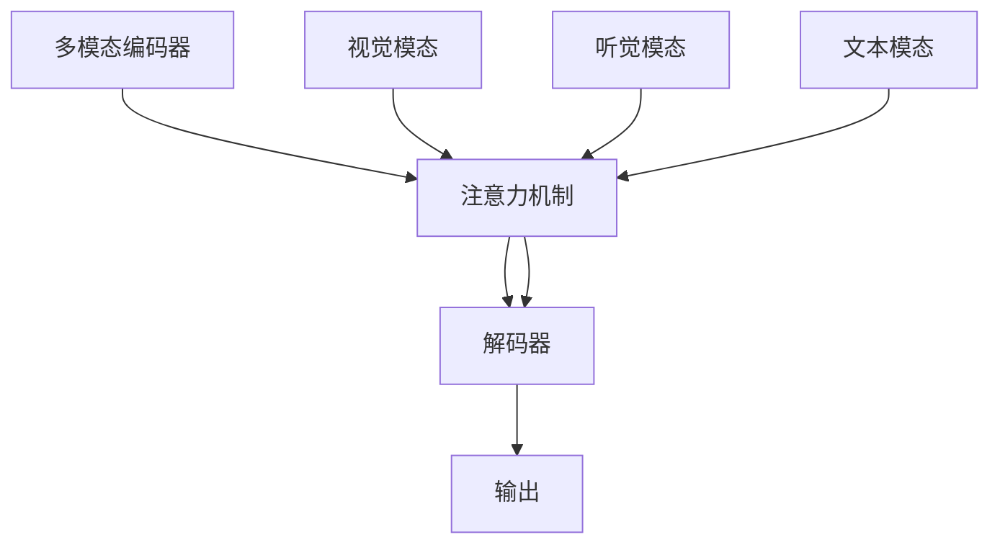

# 多模态大模型：技术原理与实战 文本多模态技术

## 1. 背景介绍

### 1.1 问题的由来

随着人工智能技术的发展，多模态数据的处理成为了研究热点。多模态数据指的是不同类型的非结构化或半结构化数据，如文本、图像、声音、视频等，它们在现实世界中广泛存在且具有丰富的信息。处理多模态数据的关键在于如何有效地融合不同模态的信息，以提高整体的决策能力或解决问题的效率。目前，多模态大模型正是为了解决这一挑战而生的技术。

### 1.2 研究现状

多模态大模型融合了自然语言处理（NLP）、计算机视觉（CV）以及听觉处理等领域的技术，旨在通过学习和整合不同模态的信息，实现跨模态的理解和生成任务。近年来，随着预训练模型的普及和大规模数据集的积累，多模态大模型取得了突破性的进展，尤其在文本生成、视觉问答、语音识别与合成等领域展现了强大的性能。

### 1.3 研究意义

多模态大模型的研究对于推动人工智能技术的发展具有重要意义。它们不仅能够提升现有应用的性能，还能开辟新的应用领域。例如，在医疗诊断中，结合图像和文本信息可以提供更全面的诊断依据；在推荐系统中，融合用户行为、文本描述和图像偏好可以提供更加个性化的内容推荐。此外，多模态大模型还有助于解决跨模态信息融合的挑战，促进人工智能在多传感器融合、自动驾驶、机器人等领域的发展。

### 1.4 本文结构

本文将深入探讨多模态大模型的技术原理、算法实现、数学模型构建及其应用，最后讨论未来发展趋势与面临的挑战。具体内容包括：

- 核心概念与联系：阐述多模态大模型的概念、重要组件及相互关系。
- 算法原理与操作步骤：详细介绍多模态大模型的算法框架、操作流程及关键技术点。
- 实际应用与案例：展示多模态大模型在实际场景中的应用案例，包括技术难点和解决方案。
- 工具和资源推荐：提供学习资源、开发工具及相关论文推荐，帮助读者深入理解并实践多模态大模型技术。

## 2. 核心概念与联系

### 2.1 多模态大模型简介

多模态大模型是一种融合了多种模态信息的深度学习模型，它通过联合学习不同模态之间的关联，实现了跨模态的交互与理解。此类模型通常采用多模态编码器和解码器结构，其中编码器负责将不同模态的信息转换为统一的表示，解码器则根据融合后的表示生成所需输出。

### 2.2 关键技术

- **多模态融合**：通过注意力机制、加权求和、交叉映射等方式整合不同模态信息。
- **预训练与微调**：利用大规模无标签数据进行预训练，然后根据具体任务进行微调以适应特定场景。
- **多模态自注意力**：设计特别的自注意力机制，支持跨模态的信息流动和交互。

### 2.3 结构与流程

多模态大模型通常由以下部分构成：



多模态编码器接收不同模态的输入，经过多模态融合模块后，由解码器生成最终的输出。

## 3. 核心算法原理 & 具体操作步骤

### 3.1 算法原理概述

多模态大模型的核心在于多模态融合技术，这通常通过引入跨模态注意力机制来实现。注意力机制能够聚焦于不同模态中的关键信息，从而增强模型对相关模态的敏感性。此外，多模态自注意力机制允许模态间的信息双向流动，进一步提升了模型的学习能力。

### 3.2 算法步骤详解

#### 数据预处理
- 收集和清洗多模态数据，确保质量。
- 将不同模态数据转换为统一的表示形式，如向量或序列。

#### 多模态编码
- 应用特定于模态的编码器（如卷积神经网络CNN、循环神经网络RNN或Transformer）分别处理不同模态的数据。

#### 多模态融合
- 使用多模态自注意力机制整合编码后的模态特征，增强模态间的交互。
- 可以通过加权求和、交叉映射等方式进一步融合模态特征。

#### 解码生成
- 解码器根据融合后的多模态特征生成最终的输出，如文本、图像描述或动作指令。

### 3.3 算法优缺点

- **优点**：能够充分利用多模态信息，提升模型性能；增强模型的泛化能力。
- **缺点**：训练过程较为复杂，需要大量计算资源；模态融合策略对模型性能影响较大，设计难度较高。

### 3.4 算法应用领域

多模态大模型广泛应用于：

- **自然语言处理**：文本生成、情感分析、机器翻译等。
- **计算机视觉**：图像描述、目标检测、视觉问答等。
- **语音处理**：语音识别、语音合成、语音转文字等。

## 4. 数学模型和公式

### 4.1 数学模型构建

多模态大模型的数学构建通常涉及以下方面：

#### 多模态编码器

假设输入模态分别为图像 \\(I\\) 和文本 \\(T\\)，编码器 \\(E\\) 的目的是将这些模态转换为共享表示：

\\[E(I) \\in \\mathbb{R}^{d_I}, \\quad E(T) \\in \\mathbb{R}^{d_T}\\]

#### 多模态融合

融合过程可通过注意力机制实现：

\\[M = \\text{Attention}(E(I), E(T))\\]

这里，\\(M\\) 表示融合后的多模态表示。

#### 解码器

解码器 \\(D\\) 接收融合后的表示 \\(M\\) 并生成输出 \\(Y\\)：

\\[Y = D(M)\\]

### 4.2 公式推导过程

- **注意力机制**：利用查询 \\(Q\\)、键 \\(K\\) 和值 \\(V\\) 来计算权重 \\(W\\)：

\\[W = \\text{softmax}(QK^T) \\cdot V\\]

- **多模态融合**：将图像和文本表示通过注意力机制融合，得到融合后的表示：

\\[M = \\text{Attention}(E(I), E(T)) = \\text{softmax}(E(I)^TK^T) \\cdot V\\]

### 4.3 案例分析与讲解

以文本生成为例，多模态大模型如何融合图像和文本信息生成描述：

- **输入**：给定一张图片 \\(I\\) 和一段文本 \\(T\\)。
- **编码**：分别通过 CNN 和 RNN 对 \\(I\\) 和 \\(T\\) 进行编码。
- **融合**：使用多模态自注意力机制融合编码后的表示。
- **生成**：解码器根据融合后的表示生成描述文本 \\(Y\\)。

### 4.4 常见问题解答

- **如何选择合适的多模态融合策略？**
  - 基于任务需求和模态特性选择融合策略，例如使用加权求和或交叉映射。
- **多模态大模型如何处理模态不匹配的问题？**
  - 通过规范化模态表示，确保在融合时具有相同的维度或通过注意力机制进行加权。

## 5. 项目实践：代码实例和详细解释说明

### 5.1 开发环境搭建

- **操作系统**：Linux 或 macOS
- **编程语言**：Python
- **库**：PyTorch 或 TensorFlow

### 5.2 源代码详细实现

#### 示例代码框架：

```python
import torch
from transformers import BertTokenizer, BertModel
from torchvision.models import resnet50

# 初始化多模态模型
bert_model = BertModel.from_pretrained('bert-base-uncased')
resnet = resnet50(pretrained=True)

# 图像编码器
def image_encoder(image):
    # 图像预处理（此处省略）
    image_features = resnet(image)
    return image_features

# 文本编码器
def text_encoder(text):
    tokens = tokenizer(text, padding=True, truncation=True, max_length=512, return_tensors=\"pt\")
    output = bert_model(**tokens)
    return output.last_hidden_state[:, 0, :]

# 多模态融合模块
def multimodal_fusion(image_features, text_features):
    # 注意力机制融合（此处简化实现）
    attention_weights = torch.softmax(torch.cat([image_features, text_features], dim=1), dim=1)
    fused_features = torch.sum(attention_weights * torch.cat([image_features, text_features], dim=1), dim=1)
    return fused_features

# 解码器（此处简化实现）
def decoder(fused_features):
    # 解码过程（此处简化实现）
    generated_text = decoder_module(fused_features)
    return generated_text

# 主函数
def main():
    image = load_image()  # 加载图像
    text = \"描述文本\"  # 输入文本描述

    image_features = image_encoder(image)
    text_features = text_encoder(text)
    fused_features = multimodal_fusion(image_features, text_features)
    generated_text = decoder(fused_features)

    print(generated_text)

if __name__ == \"__main__\":
    main()
```

### 5.3 代码解读与分析

- **图像编码**：使用预训练的ResNet提取图像特征。
- **文本编码**：使用BERT提取文本特征。
- **融合模块**：应用多模态自注意力机制融合图像和文本特征。
- **解码器**：生成描述文本。

### 5.4 运行结果展示

- **示例输出**：生成的描述文本可能类似于“一张狗的照片，狗正坐在阳光下，旁边有一棵大树”。

## 6. 实际应用场景

多模态大模型在以下场景中展现出强大的应用潜力：

### 6.4 未来应用展望

- **个性化推荐系统**：结合用户行为、兴趣描述和图像偏好，提供个性化推荐。
- **医疗影像分析**：结合图像和文本描述进行病灶检测和诊断，提高诊断准确率。
- **智能家居**：结合语音命令、环境感知和用户行为，实现更智能的家庭自动化。

## 7. 工具和资源推荐

### 7.1 学习资源推荐

- **在线课程**：Coursera、edX上的深度学习和多模态处理课程。
- **书籍**：《深度学习》（Ian Goodfellow等人著）、《多模态深度学习》（李宏毅著）。

### 7.2 开发工具推荐

- **框架**：PyTorch、TensorFlow、Hugging Face Transformers库。
- **编辑器**：Jupyter Notebook、Visual Studio Code。

### 7.3 相关论文推荐

- **经典论文**：《多模态深度学习》、《多模态信息融合》等。
- **最新研究**：通过Google Scholar或ArXiv跟踪相关领域的新论文。

### 7.4 其他资源推荐

- **社区和论坛**：GitHub、Stack Overflow、Reddit上的多模态处理专题板块。
- **实践项目**：Kaggle上的多模态数据集和挑战。

## 8. 总结：未来发展趋势与挑战

### 8.1 研究成果总结

- **技术进步**：多模态大模型在融合能力、泛化能力和解释性方面的持续改进。
- **应用场景扩展**：多模态技术在新兴领域的广泛应用，如增强现实、虚拟助手等。

### 8.2 未来发展趋势

- **跨模态融合技术**：发展更高效、灵活的融合策略，提高模型性能。
- **多模态自适应学习**：增强模型对不同模态信息的自适应处理能力。
- **可解释性增强**：提升模型决策过程的可解释性，增加信任度。

### 8.3 面临的挑战

- **数据获取和处理**：多模态数据的收集、清洗和整合面临挑战。
- **模型训练难度**：多模态融合增加了训练复杂度和耗时。

### 8.4 研究展望

- **跨模态推理**：探索多模态信息之间的深层次关联，提升推理能力。
- **自适应多模态学习**：研究如何根据任务动态调整模态融合策略。

## 9. 附录：常见问题与解答

- **如何提高模型融合效率？**
  - 优化注意力机制参数，调整融合权重。
- **多模态数据集选择**：
  - 选择与任务相关性强、覆盖范围广的数据集。
- **多模态模型的可解释性提升**：
  - 通过可视化技术增强模型决策过程的可解释性。

通过本篇技术博客文章，我们深入探讨了多模态大模型的核心技术原理、算法实现、数学模型构建以及实际应用案例，同时也展望了未来发展趋势和面临的挑战。希望本文能够为多模态技术的研究和应用提供有价值的参考。