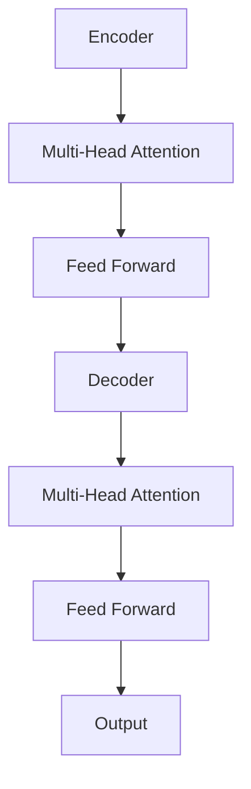

# AIGC从入门到实战：可能消失的职业和新出现的机会

## 1. 背景介绍

### 1.1 问题的由来

随着人工智能(AI)和生成式人工智能(Generative AI)技术的不断发展和应用,AIGC(AI Generated Content,人工智能生成内容)已经成为一股不可忽视的潮流。AIGC技术可以自动生成各种形式的内容,包括文本、图像、音频、视频等,其中以文本生成和图像生成最为突出。

AIGC技术的兴起,一方面为人类生产力带来了巨大提升,另一方面也对传统的一些职业和行业带来了前所未有的冲击和挑战。一些传统的内容创作型工作,如写作、设计、编程等,有可能被AIGC技术所取代或者发生深刻的变革。与此同时,AIGC技术的应用也将催生出一些全新的职业和机会。

### 1.2 研究现状

目前,AIGC技术在文本生成、图像生成等领域已经取得了长足的进步,一些成熟的商业产品也已经问世,如OpenAI的GPT-3、DALL-E、Midjourney等。不过,AIGC技术还处于初级阶段,存在一些明显的局限性,如缺乏持续的逻辑推理能力、对领域知识的理解不够深入、生成内容的一致性和多样性有待提高等。

在应用层面,AIGC技术目前主要被用于内容辅助创作、个性化推荐、智能问答等场景。一些创作型工作,如新闻写作、营销文案撰写、设计概念草图等,已经开始尝试使用AIGC技术来提高效率。不过,AIGC生成的内容还无法完全替代人工创作,主要用于辅助和加速流程。

### 1.3 研究意义

AIGC技术的发展必将深刻影响未来的就业格局和社会生产方式。了解AIGC技术的现状、优缺点和发展趋势,对于个人的职业规划和企业的战略布局都具有重要意义。

本文将全面介绍AIGC技术的核心概念、算法原理、数学模型,并通过实战项目对AIGC系统的开发流程进行详细解析。同时,本文还将探讨AIGC技术在不同领域的应用场景,以及对未来就业格局可能产生的影响,旨在为读者提供一个全景式的认知。

### 1.4 本文结构

本文共分为9个章节,主要内容安排如下:

- 第1章介绍AIGC技术的背景、现状和研究意义
- 第2章阐述AIGC技术的核心概念及其内在联系
- 第3章深入探讨AIGC系统中的核心算法原理及具体实现步骤
- 第4章重点解析AIGC技术中的数学模型及公式推导过程
- 第5章通过一个实战项目,详细讲解AIGC系统的开发环境搭建、代码实现和运行结果
- 第6章介绍AIGC技术在不同领域的实际应用场景
- 第7章为读者推荐一些有价值的学习资源、开发工具和相关论文
- 第8章总结AIGC技术的研究成果,展望未来发展趋势并分析面临的挑战
- 第9章列出一些常见问题并给出解答

## 2. 核心概念与联系

AIGC技术涉及多个核心概念,这些概念之间存在内在的联系,构成了AIGC技术的理论基础和技术支撑。本章将逐一介绍这些核心概念,并阐明它们之间的关联。

### 2.1 人工智能(AI)

人工智能(Artificial Intelligence)是一门致力于研究和开发能够模拟人类智能行为的理论、方法、技术及应用系统的学科。AI技术主要包括机器学习、自然语言处理、计算机视觉、知识图谱、规划推理等。

AIGC技术作为AI的一个重要分支,主要借助于机器学习和自然语言处理等AI技术,实现对各种形式内容的自动生成。

### 2.2 机器学习(ML)

机器学习(Machine Learning)是人工智能的一个重要分支,它赋予计算机在没有明确程序的情况下,通过利用数据或经验自动分析获得规律,并利用规律对complicated数据进行预测和决策的能力。

在AIGC系统中,机器学习算法(如深度学习)被广泛应用于从大量数据中学习内容生成的模式,从而实现自动生成各种形式内容的能力。

### 2.3 深度学习(DL)

深度学习(Deep Learning)是机器学习中的一个新的领域,它模仿人脑的机制来解释数据,如神经网络就是一种深度学习结构。深度学习能够通过建模高层数据抽象层次,发现数据的分布式特征表示,从而解决许多机器学习无法解决或解决不好的问题。

目前,深度学习是AIGC技术中应用最为广泛的机器学习算法,如Transformer、GPT、DALL-E等都是基于深度学习模型。

### 2.4 自然语言处理(NLP)

自然语言处理(Natural Language Processing)是人工智能的一个分支,它研究计算机如何理解和处理自然语言数据。NLP技术主要包括语音识别、文本挖掘、对话系统、机器翻译等。

在AIGC系统中,NLP技术被广泛应用于对自然语言文本的理解和生成,是实现自动文本创作的核心技术。

### 2.5 生成式人工智能(Generative AI)

生成式人工智能(Generative AI)是指基于现有数据训练出的人工智能模型,能够生成全新的、之前从未出现过的内容,如文本、图像、音频等。生成式AI的出现打破了传统AI只能识别已有内容的局限。

AIGC技术实际上就是生成式人工智能在内容生成领域的一个具体应用,因此也被称为生成式内容AI。

### 2.6 预训练模型

预训练模型(Pre-trained Model)是指在大规模通用数据上预先训练出的模型,这种模型掌握了一定的常识知识和语言理解能力。预训练模型可以在特定任务数据上进行进一步的微调(Fine-tuning),从而获得针对该任务的高性能模型。

目前,大多数AIGC系统都是基于预训练模型,如GPT-3、DALL-E等,通过在特定领域数据上的微调来实现内容生成。

### 2.7 注意力机制

注意力机制(Attention Mechanism)是一种用于计算机视觉和自然语言处理任务的技术,它允许模型只关注输入数据的一部分,从而提高模型的性能和计算效率。

Transformer模型中的多头注意力机制是AIGC系统中的核心技术之一,使得模型能够更好地捕捉输入序列中的长程依赖关系,从而提高生成内容的质量和一致性。

### 2.8 知识蒸馏

知识蒸馏(Knowledge Distillation)是一种模型压缩技术,通过训练一个小型的学生模型来学习一个大型的教师模型的行为,从而将教师模型的知识迁移到学生模型中。

在AIGC系统中,知识蒸馏技术可以用于压缩大型的生成模型,使其可以在移动设备或边缘设备上高效运行,从而扩展AIGC技术的应用场景。

上述这些核心概念相互关联、相辅相成,共同构筑了AIGC技术的理论基础和技术支撑。掌握这些概念有助于我们全面了解AIGC技术的本质,把握其发展趋势。

## 3. 核心算法原理及具体操作步骤

### 3.1 算法原理概述

AIGC系统的核心算法主要基于Transformer模型及其变体,如GPT、DALL-E等。Transformer模型属于序列到序列(Seq2Seq)模型的一种,它通过自注意力机制来捕捉输入和输出序列之间的长期依赖关系,从而实现高质量的序列生成。

Transformer模型的总体架构如下所示:

其中,Encoder用于编码输入序列,Decoder用于生成输出序列。Multi-Head Attention机制是模型的核心,它允许模型同时关注输入序列的不同位置,从而更好地捕捉序列之间的依赖关系。

对于文本生成任务,Transformer的输入是文本序列,输出也是文本序列;对于图像生成任务,Transformer的输入是文本提示,输出是图像像素序列。

### 3.2 算法步骤详解

以GPT(Generative Pre-trained Transformer)为例,其核心算法步骤如下:

1. **数据预处理**:将原始文本数据转换为模型可以识别的token序列,并构建词表(vocabulary)。

2. **模型初始化**:初始化Transformer模型的参数,包括embedding层、编码器层、解码器层等。

3. **预训练**:在大规模通用语料库上预训练模型,使其学习到一般的语言知识。预训练过程通常采用自监督学习的方式,即基于输入序列预测其下一个token。

4. **微调**:在特定任务的数据集上,对预训练模型进行进一步的微调,使其适应该任务的语言风格和领域知识。

5. **生成**:给定一个文本prompt(提示词),模型基于prompt生成下一个token,将其附加到prompt后,重复该过程直至生成完整的文本序列。

6. **后处理**:对生成的token序列进行解码,将其转换为可读的文本格式。

在生成过程中,GPT模型会计算每个token在给定上文的条件概率分布,并根据该分布进行随机采样,从而生成下一个token。通过不断迭代,模型最终生成出一个完整的文本序列。

值得注意的是,为了提高生成质量和多样性,GPT等模型还引入了诸如Top-K采样、Nucleus采样、无理数长度截断等策略。

### 3.3 算法优缺点

Transformer及其变体算法在AIGC任务上表现出色,但也存在一些不足:

**优点**:

- 自注意力机制有效捕捉长期依赖,生成质量高
- 并行化训练,计算效率较高
- 架构简单,易于扩展和优化

**缺点**:

- 需要大量计算资源进行预训练
- 缺乏持续的推理和reasoning能力
- 生成内容的一致性和多样性仍有待提高
- 存在安全隐患(如生成有害内容等)

### 3.4 算法应用领域

基于Transformer的AIGC算法目前主要应用于以下几个领域:

- **文本生成**:新闻写作、文案创作、对话系统、机器翻译等
- **图像生成**:设计概念草图、插画创作、图像编辑等
- **音频生成**:音乐创作、语音合成等
- **视频生成**:短视频生成、动画创作等

未来,AIGC算法还有望在代码生成、分子设计、药物研发等领域发挥重要作用。

## 4. 数学模型和公式及详细讲解

### 4.1 数学模型构建

AIGC系统中的核心数学模型是基于Transformer架构的序列到序列(Seq2Seq)模型。该模型的目标是学习一个条件概率分布 $P(Y|X)$,即给定输入序列 $X$,生成目标序列 $Y$ 的概率分布。

对于文本生成任务,输入 $X$ 和输出 $Y$ 都是文本序列;对于图像生成任务, $X$ 是文本提示,而 $Y$ 是图像像素序列。

在Transformer模型中,条件概率 $P(Y|X)$ 可以通过自注意力机制和前馈神经网络来建模,具体如下:

$$
P(Y|X) = \prod_{t=1}^{T}P(y_t|y_{<t}, X; \theta)
$$

其中, $y_t$ 是目标序列 $Y$ 的第 $t$ 个token, $y_{<t}$ 表示前 $t-1$ 个token, $\theta$ 是模型参数。

该条件概率可以通过Transformer解码器计算得到,解码器由 $N$ 个相同的层组成,每一层包含