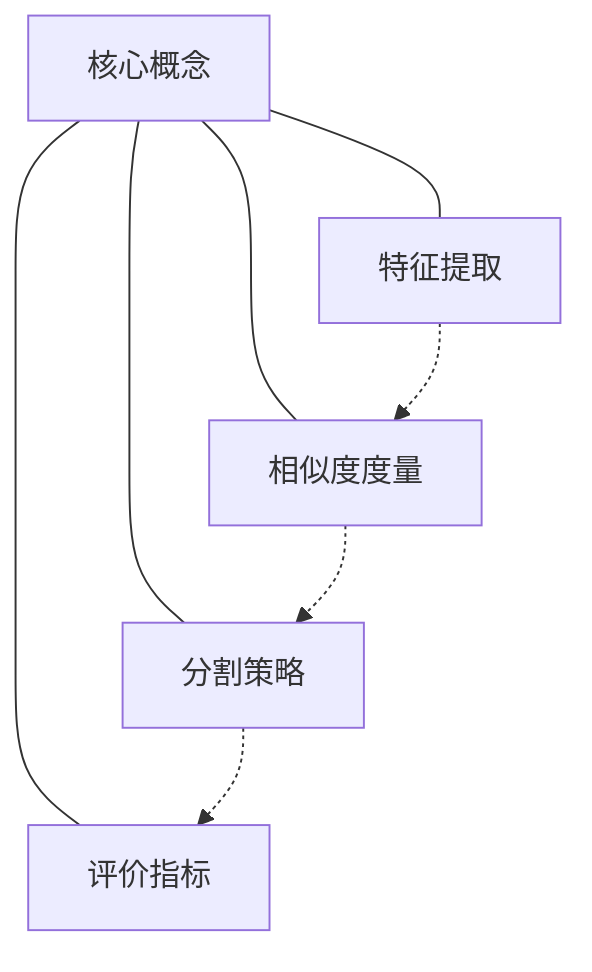

# Image Segmentation 原理与代码实战案例讲解

## 1. 背景介绍

### 1.1 问题的由来

在计算机视觉和图像处理领域中,图像分割(Image Segmentation)是一个基础且关键的任务。图像分割的目标是将一幅输入图像划分为多个独立的区域,使得每个区域内部像素具有相似的特征(如颜色、纹理等),而不同区域之间的像素特征存在明显差异。准确的图像分割结果对于后续的目标检测、图像识别、图像理解等高层次视觉任务至关重要。

### 1.2 研究现状  

图像分割一直是计算机视觉领域的一个热点和难题。早期的分割算法主要基于图像的低级特征,如灰度、颜色、纹理等,通过设定合适的相似性度量来实现分割。这些传统方法虽然直观和高效,但是对噪声、遮挡、光照变化等复杂情况缺乏鲁棒性。

近年来,随着深度学习技术的迅猛发展,基于深度卷积神经网络(CNN)的图像分割方法取得了巨大进展,显著提高了分割精度。这些方法通过大量标注数据进行训练,自动学习图像的高级语义特征,从而实现更加精确和鲁棒的分割。目前,基于全卷积网络(FCN)、U-Net、Mask R-CNN等网络架构在多个公开数据集上取得了领先的分割性能。

### 1.3 研究意义

图像分割技术在多个领域具有广泛的应用价值:

- **医疗影像分析**: 对CT、MRI等医学影像进行分割,可以准确localization病灶区域,为疾病诊断和治疗提供重要依据。
- **自动驾驶**: 对路面场景进行精细分割,识别道路、车辆、行人等目标,是实现自动驾驶的基础。
- **增强现实**: 对图像中的目标进行分割和跟踪,可以实现虚拟物体的无缝融合。
- **视频编码**: 通过对视频帧进行分割,可以实现更高效的编码和压缩。

因此,研究高性能、鲁棒的图像分割算法,对于推动相关领域的技术进步至关重要。

### 1.4 本文结构

本文将全面介绍图像分割的核心原理和实战案例。主要内容包括:

- 图像分割的核心概念及其相互联系
- 主流分割算法的原理和具体操作步骤  
- 分割算法的数学模型推导和公式分析
- 基于Python的代码实现和案例分析
- 图像分割在实际应用中的场景
- 相关工具、学习资源和发展趋势

## 2. 核心概念与联系

图像分割涉及多个核心概念,这些概念相互关联、环环相扣。我们先对这些概念进行介绍,并阐明它们之间的内在联系。

1. **特征提取**: 对图像进行分割首先需要提取有意义的特征,如颜色、纹理、形状等低级特征或基于深度学习提取的高级语义特征。不同的特征对应不同的分割任务。

2. **相似度度量**: 基于提取的特征,需要定义合适的相似度度量函数,用于量化图像区域内部像素的相似性和不同区域之间的差异性。常用的相似度度量包括欧氏距离、直方图相交等。

3. **分割策略**: 根据所选特征和相似度度量,设计合适的分割策略算法,将图像划分为若干相似的区域。主流分割策略包括阈值分割、区域生长、聚类、图割等。

4. **评价指标**: 为了评估分割结果的质量,需要定义合理的评价指标,如Precision、Recall、IoU(交并比)等,指导算法的优化和选择。

上述四个核心概念相互关联、缺一不可。特征提取为相似度度量提供基础;相似度度量为分割策略提供相似性量化;分割策略的结果需要通过评价指标来衡量质量。只有这四个环节有机结合,才能设计出高效、鲁棒的图像分割算法。

## 3. 核心算法原理 & 具体操作步骤

### 3.1 算法原理概述

图像分割算法可以分为基于特征的传统算法和基于深度学习的现代算法两大类。我们将分别介绍两种算法的核心原理。

**基于特征的传统算法**:

这类算法基于图像的低级特征(如灰度、颜色、纹理等)进行分割。主要算法包括:

- **阈值分割**: 根据像素灰度/颜色值与预设阈值的大小关系,将图像划分为不同的区域。适用于具有明显不同灰度/颜色的前景和背景分割。
- **区域生长**: 从种子点出发,将与种子点相似的邻域像素并入同一区域,直至满足终止条件。常用于具有相似特征的连通区域分割。
- **聚类分割**: 将图像中的像素按照特征相似性聚为若干簇,每个簇对应一个分割区域。常用的有K-Means、均值漂移等聚类算法。
- **图割分割**: 将图像建模为加权无向图,通过最小割集合将图割分为若干子图,每个子图对应一个分割区域。

**基于深度学习的现代算法**:

这类算法利用卷积神经网络自动从大量标注数据中学习图像的高级语义特征,从而实现更精确的分割。主要算法包括:

- **全卷积网络(FCN)**: 将传统CNN中的全连接层替换为卷积层,使网络可以接受任意尺寸输入,产生对应尺寸的分割结果。
- **U-Net**: 编码器-解码器结构,利用跳跃连接融合不同尺度特征,常用于医学图像分割等任务。
- **Mask R-CNN**: 在Faster R-CNN目标检测框架基础上,并行预测目标类别和分割掩码,实现实例分割。
- **DeepLab系列**: 引入空洞/膨胀卷积和空间金字塔池化模块,显著提高了分割边缘的精度。

上述算法各有优缺点,需要根据具体任务场景选择合适的算法。传统算法直观高效但对复杂情况缺乏鲁棒性;深度学习算法精度更高但需要大量标注数据和计算资源。

### 3.2 算法步骤详解

下面我们以K-Means聚类分割算法为例,详细介绍其具体操作步骤:

1. **特征提取**: 对于每个像素,提取其颜色或纹理等特征,构建特征向量。
2. **初始化聚类中心**: 随机选取K个特征向量作为初始聚类中心。
3. **计算相似度**: 计算每个像素特征向量与K个聚类中心之间的相似度(如欧氏距离)。
4. **像素分配**: 将每个像素分配到与之最相似的聚类中心所对应的簇。
5. **更新聚类中心**: 计算每个簇内所有像素特征向量的均值,作为新的聚类中心。
6. **迭代收敛**: 重复步骤3-5,直至聚类中心不再发生显著变化。
7. **生成分割结果**: 将具有相同聚类标记的像素合并为一个独立的分割区域。

上述算法的关键步骤是相似度计算和聚类中心更新。算法的收敛性和分割质量与初始聚类中心的选择、特征提取和相似度度量的定义密切相关。

### 3.3 算法优缺点

K-Means聚类分割算法具有以下优缺点:

**优点**:

- 原理简单,实现方便
- 无需人工设置复杂参数
- 计算高效,可处理大规模数据
- 对球形、紧凑的簇分割效果较好

**缺点**:

- 需要预先设定聚类数K,对结果影响较大
- 对非凸、非球形簇的分割效果较差
- 对噪声和异常值敏感
- 无法很好处理不同密度的簇

### 3.4 算法应用领域

K-Means聚类分割算法广泛应用于以下领域:

- **图像分割**: 对具有明显不同颜色/纹理特征的图像进行分割,如自然场景、遥感图像等。
- **数据挖掘**: 对高维数据进行聚类分析,发现潜在的数据模式和结构。
- **计算机图形学**: 对三维点云数据进行分割,用于物体重建和模型简化。
- **信号处理**: 对时间序列信号进行分割,用于特征提取和模式识别。

总的来说,K-Means算法适用于对球形、紧凑的簇进行快速划分,是一种简单高效的无监督聚类分割方法。

## 4. 数学模型和公式 & 详细讲解 & 举例说明

### 4.1 数学模型构建 

K-Means聚类分割算法的目标是将n个数据点$\{x_1,x_2,...,x_n\}$划分为K个簇$\{C_1,C_2,...,C_K\}$,使得簇内数据点之间的相似度最大化,簇间数据点之间的相似度最小化。我们定义以下优化目标函数:

$$J = \sum_{i=1}^{K}\sum_{x \in C_i} \left \| x - \mu_i \right \|^2$$

其中$\mu_i$是第i个簇的质心(均值向量),$\left \| x - \mu_i \right \|$表示数据点x与质心的欧氏距离。目标函数J实际上是所有簇内数据点到其质心的总平方误差之和。

通过优化目标函数J,我们可以找到最优的簇划分,使得簇内数据点的紧密程度最大化。

### 4.2 公式推导过程

我们利用期望最大化(EM)算法求解上述优化问题。具体步骤如下:

1. **E步(期望步)**: 对于给定的聚类中心$\mu_1,\mu_2,...,\mu_K$,计算每个数据点$x_i$属于第j个簇的概率(后验概率):

$$r_{ij} = P(z_i = j|x_i) = \frac{\pi_j \cdot \mathcal{N}(x_i|\mu_j,\Sigma_j)}{\sum_{l=1}^{K}\pi_l \cdot \mathcal{N}(x_i|\mu_l,\Sigma_l)}$$

其中$z_i$是隐变量,表示$x_i$的簇标记;$\pi_j$是第j个簇的先验概率;$\mathcal{N}(x_i|\mu_j,\Sigma_j)$是$x_i$在第j个簇的高斯分布密度。

2. **M步(最大化步)**: 更新聚类中心$\mu_j$和协方差矩阵$\Sigma_j$,使得对数似然函数$\ln P(X|\pi,\mu,\Sigma)$最大化:

$$\begin{aligned}
\mu_j &= \frac{1}{N_j}\sum_{i=1}^{n}r_{ij}x_i \\
\Sigma_j &= \frac{1}{N_j}\sum_{i=1}^{n}r_{ij}(x_i - \mu_j)(x_i - \mu_j)^T\\
\pi_j &= \frac{N_j}{n}
\end{aligned}$$

其中$N_j = \sum_{i=1}^{n}r_{ij}$是第j个簇的"有效数据点"个数。

3. **迭代收敛**: 重复E步和M步,直至对数似然函数收敛或达到最大迭代次数。

通过上述EM算法,我们可以有效求解K-Means聚类分割的优化目标,得到最终的簇划分结果。

### 4.3 案例分析与讲解

我们以一个简单的二维数据集为例,说明K-Means聚类分割的具体过程。

假设我们有如下数据点:

$$X = \begin{bmat