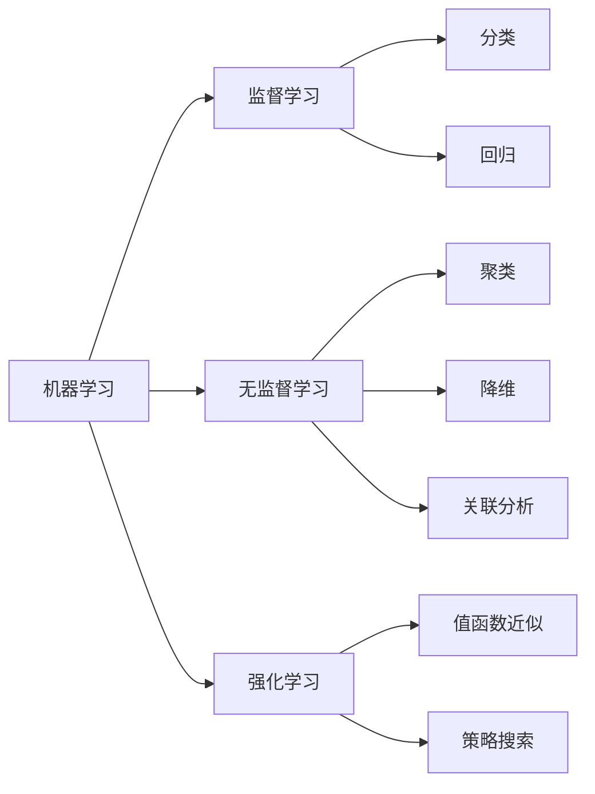

# Machine Learning (ML) 原理与代码实战案例讲解

作者：禅与计算机程序设计艺术 / Zen and the Art of Computer Programming

关键词：机器学习、监督学习、无监督学习、强化学习、数学模型、算法实现、应用场景、未来趋势

## 1. 背景介绍
### 1.1 问题的由来
随着大数据时代的到来,海量数据的产生和积累,传统的数据分析方法已经无法满足需求。如何从海量数据中挖掘出有价值的信息和知识,成为了当前亟待解决的问题。机器学习(Machine Learning, ML)作为人工智能的核心,为解决这一问题提供了新的思路和方法。

### 1.2 研究现状
目前,机器学习已经在计算机视觉、自然语言处理、语音识别、推荐系统等领域取得了广泛应用。各大科技公司如谷歌、微软、亚马逊、阿里巴巴等都在大力投入机器学习的研究。学术界方面,每年都有大量关于机器学习的论文发表。总的来说,机器学习正处于蓬勃发展的阶段。

### 1.3 研究意义
机器学习可以让计算机系统从大量历史数据中自动学习规律,并用于对未知数据进行预测。这不仅大大提高了数据处理和分析的效率,更重要的是使很多以前无法完成的智能任务成为可能。机器学习有望在智慧城市、智能医疗、金融科技等领域创造巨大价值。

### 1.4 本文结构
本文将首先介绍机器学习的核心概念,然后重点讲解几种常见的机器学习算法的原理、推导过程和代码实现。接着,本文将结合实际应用案例,演示如何使用机器学习解决实际问题。最后,本文还将介绍机器学习的一些前沿动态和未来发展趋势。

## 2. 核心概念与联系
机器学习主要分为监督学习、无监督学习和强化学习三大类:
- 监督学习:从标注数据中学习预测模型,代表算法有决策树、朴素贝叶斯、支持向量机等。
- 无监督学习:从无标注数据中发现数据的内在结构和规律,代表算法有聚类、关联、降维等。  
- 强化学习:通过与环境的交互获得反馈,不断优化策略,代表算法有Q-learning、策略梯度等。

这三类学习范式的关系如下图所示:

## 3. 核心算法原理 & 具体操作步骤
本节将详细讲解几种常见的机器学习算法,包括线性回归、逻辑回归、决策树、支持向量机、K-means聚类等。

### 3.1 算法原理概述
#### 3.1.1 线性回归
线性回归是利用数理统计中回归分析,来确定两种或两种以上变量间相互依赖的定量关系的一种统计分析方法。其基本思想是,通过回归分析确定输入和输出变量之间的某种线性关系,从而实现对输出的预测。

#### 3.1.2 逻辑回归
逻辑回归是一种常用的分类算法,它利用Sigmoid函数将线性回归的输出映射到0~1之间,得到一个概率值。当概率大于阈值(如0.5)时,则将样本预测为正类,否则预测为负类。逻辑回归的优点是模型简单、易于理解,训练速度快。

#### 3.1.3 决策树
决策树通过树形结构来进行决策,内部节点表示一个特征或属性,叶节点表示一个分类。决策树的生成是一个递归过程,通过选择最优划分特征,不断地对训练集进行划分,直到满足停止条件。决策树的优点是模型具有可解释性,分类速度快,能够处理不同类型的特征。

#### 3.1.4 支持向量机
支持向量机(Support Vector Machine, SVM)是一种二分类模型,其基本模型是定义在特征空间上的间隔最大的线性分类器。SVM还可以使用核技巧,将低维空间的非线性问题转化为高维空间的线性问题。SVM的优点是模型简洁,分类精度高,适合处理高维小样本数据。

#### 3.1.5 K-means聚类
K-means是一种常用的聚类算法,它通过最小化样本到聚类中心的距离平方和来寻找最优聚类结果。K-means的基本步骤是:随机选择K个聚类中心,根据距离将每个样本划分到最近的聚类,更新聚类中心,重复上述过程直到聚类结果不再变化。K-means的优点是原理简单,收敛速度快,但需要预先确定聚类数K。

### 3.2 算法步骤详解
下面以线性回归为例,详细讲解其算法步骤。

输入:训练集$D=\{(x_1,y_1),(x_2,y_2),...,(x_N,y_N)\},x_i \in \mathbb{R}^p, y_i \in \mathbb{R}$

输出:w,b

算法步骤:
1) 将输入特征进行归一化处理
$$x_i=\frac{x_i-\mu_i}{\sigma_i}, i=1,2,...,p$$
其中,$\mu_i$和$\sigma_i$分别是第i维特征的均值和标准差。

2) 初始化参数$w=0, b=0$

3) 设置学习率$\alpha$,迭代次数epoch

4) for iter=1,2,...,epoch:
   
   for i=1,2,...,N:
   
   计算预测值:$\hat{y}_i=w \cdot x_i+b$
   
   计算损失: $L(w,b)=\frac{1}{2}(\hat{y}_i-y_i)^2$
   
   更新参数:
   $$w=w-\alpha \frac{\partial L}{\partial w}=w+\alpha (y_i-\hat{y}_i)x_i$$
   $$b=b-\alpha \frac{\partial L}{\partial b}=b+\alpha (y_i-\hat{y}_i)$$
   
5) 返回w,b

其他算法的具体步骤这里不再赘述,感兴趣的读者可以参考相关文献。

### 3.3 算法优缺点
各种机器学习算法都有其优缺点,需要根据具体问题选择合适的算法。下表总结了上述几种算法的优缺点:

| 算法 | 优点 | 缺点 |
|:---:|:---:|:---:|
| 线性回归 | 模型简单,易于理解和实现 | 只能处理线性问题,对噪声和异常值敏感 |
| 逻辑回归 | 适合两分类问题,训练速度快 | 需要较多的样本,不适合多分类 |
| 决策树 | 可解释性强,可处理多种类型特征 | 容易过拟合,对缺失值敏感 | 
| 支持向量机 | 分类精度高,适合高维小样本 | 对参数和核函数敏感,训练速度慢 |
| K-means | 原理简单,收敛速度快 | 需要指定聚类数,容易陷入局部最优 |

### 3.4 算法应用领域
机器学习算法在多个领域得到了广泛应用,例如:
- 计算机视觉:图像分类、目标检测、语义分割等
- 自然语言处理:文本分类、情感分析、机器翻译、问答系统等  
- 语音识别:语音识别、说话人识别、语音合成等
- 推荐系统:个性化推荐、协同过滤等
- 金融科技:信用评分、反欺诈、量化交易等
- 生物医疗:辅助诊断、药物发现、基因分析等
- 工业制造:设备健康监测、工艺优化、质量预测等

随着机器学习技术的不断发展,其应用领域还将不断扩大。

## 4. 数学模型和公式 & 详细讲解 & 举例说明
本节将详细讲解机器学习中的一些常用数学模型和公式,并结合具体例子加以说明。

### 4.1 数学模型构建
以逻辑回归为例,假设输入特征为$x \in \mathbb{R}^n$,类别标签为$y \in \{0,1\}$,逻辑回归模型定义为:

$$P(Y=1|x)=\frac{1}{1+e^{-(w \cdot x+b)}}$$

其中,$w$和$b$为模型参数。上式表示给定输入$x$,类别标签为1的后验概率。

对于给定的训练集$D=\{(x_1,y_1),(x_2,y_2),...,(x_N,y_N)\}$,逻辑回归的目标是最大化似然函数:

$$L(w,b)=\prod_{i=1}^N P(y_i|x_i;w,b)$$

为了便于求解,通常对似然函数取对数,得到对数似然函数:

$$\ell(w,b)=\sum_{i=1}^N [y_i \log P(y_i|x_i;w,b)+(1-y_i) \log (1-P(y_i|x_i;w,b))]$$

### 4.2 公式推导过程
对对数似然函数求导,得到梯度:

$$\frac{\partial \ell}{\partial w}=\sum_{i=1}^N (y_i-P(y_i|x_i;w,b))x_i$$

$$\frac{\partial \ell}{\partial b}=\sum_{i=1}^N (y_i-P(y_i|x_i;w,b))$$

使用梯度上升法迭代更新参数$w$和$b$:

$$w:=w+\alpha \frac{\partial \ell}{\partial w}$$

$$b:=b+\alpha \frac{\partial \ell}{\partial b}$$

其中,$\alpha$为学习率。重复上述过程直到收敛,即可得到逻辑回归模型。

### 4.3 案例分析与讲解
下面以一个简单的二分类问题为例,演示如何使用逻辑回归进行分类。

假设有如下训练集:

| 身高(米) | 体重(斤) | 性别 |
|:---:|:---:|:---:|
| 1.80 | 160 | 男 |
| 1.62 | 110 | 女 |  
| 1.71 | 140 | 男 |
| 1.58 | 105 | 女 |
| 1.77 | 150 | 男 |
| 1.64 | 120 | 女 |

其中,身高和体重为输入特征,性别为类别标签(男为1,女为0)。

首先,对输入特征进行归一化处理:

$$x_1=\frac{height-\mu_1}{\sigma_1}, x_2=\frac{weight-\mu_2}{\sigma_2}$$

然后,初始化参数$w=[0,0]^T,b=0$,设置学习率$\alpha=0.1$,迭代次数epoch=500。

使用梯度上升法训练逻辑回归模型,得到:

$$w=[3.21, 1.84]^T, b=-7.56$$

最后,对新样本$x=[1.75, 145]^T$进行预测:

$$P(y=1|x)=\frac{1}{1+e^{-(w \cdot x+b)}}=0.92>0.5$$

因此,预测该样本的性别为男性。

### 4.4 常见问题解答
Q: 逻辑回归能否处理多分类问题?

A: 标准的二项逻辑回归只能处理二分类问题,但可以通过一对多或多对多策略将其扩展到多分类。一对多即训练K个二分类器,第k个分类器将第k类样本视为正例,其他所有类别视为负例;多对多即训练$K(K-1)/2$个分类器,每个分类器用于区分两个类别,最终结果通过投票产生。

Q: 逻辑回归对数据有哪些要求?

A: 逻辑回归虽然对数据的分布没有太多要求,但需要满足以下几点:
1) 特征之间相互独立。如果特征之间存在多重共线性,会影响模型的稳定性。可以通过正则化缓解该问题。
2) 特征与标签之间