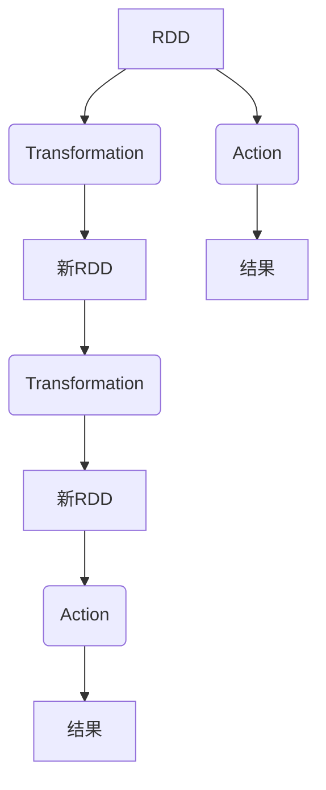
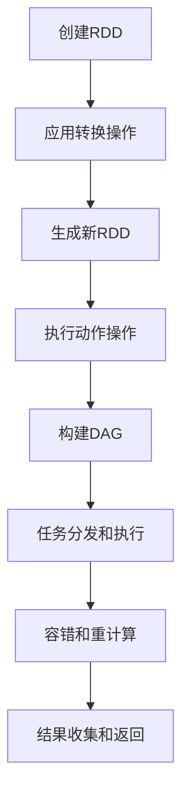

# RDD 原理与代码实例讲解

## 1. 背景介绍

### 1.1 问题的由来

在大数据时代，海量数据的存储和处理成为了一个巨大的挑战。传统的单机系统已经无法满足现代数据密集型应用的需求。为了解决这一问题,Apache Spark 应运而生。作为一种快速、通用的大规模数据处理引擎,Spark 提供了高度抽象的编程模型,使开发人员能够以简洁的方式表达复杂的数据流水线。

Spark 的核心数据结构是弹性分布式数据集(Resilient Distributed Dataset,RDD)。RDD 是一种分布式内存抽象,表示一个不可变、可分区的元素集合,可以并行操作。RDD 的设计目标是为了提供一种高度可靠且高效的数据处理方式,同时支持通过丰富的操作符进行复杂的数据转换。

### 1.2 研究现状

RDD 作为 Spark 的核心数据结构,已经受到了广泛的关注和研究。研究人员一直在探索 RDD 的性能优化、容错机制、内存管理等方面的改进。同时,也有许多工作致力于扩展 RDD 的功能,以支持更多的数据类型和操作。

尽管 RDD 已经取得了长足的进步,但仍然存在一些挑战和局限性。例如,RDD 的不可变性可能会导致内存开销较大,而且对于某些类型的工作负载,RDD 的性能可能不如其他数据结构。此外,RDD 的容错机制也可能会在某些情况下导致性能下降。

### 1.3 研究意义

深入理解 RDD 的原理和实现对于充分利用 Spark 的强大功能至关重要。通过掌握 RDD 的核心概念、算法原理和代码实现细节,开发人员可以更好地设计和优化 Spark 应用程序,提高数据处理的效率和可靠性。

此外,研究 RDD 也有助于推动大数据处理技术的发展。通过探索 RDD 的优缺点和局限性,可以为设计新的数据结构和处理模型提供宝贵的经验和启发。

### 1.4 本文结构

本文将全面介绍 RDD 的原理和实现细节。我们将首先探讨 RDD 的核心概念和与其他数据结构的联系。接下来,我们将深入剖析 RDD 的核心算法原理和具体操作步骤。然后,我们将讨论 RDD 背后的数学模型和公式,并通过案例分析加深理解。

在此基础上,我们将提供一个完整的项目实践,包括开发环境搭建、源代码实现、代码解读和运行结果展示。此外,我们还将探讨 RDD 在实际应用场景中的使用,并介绍相关的工具和学习资源。

最后,我们将总结 RDD 的研究成果,展望未来的发展趋势和面临的挑战,并对 RDD 的未来研究方向提出建议。

## 2. 核心概念与联系

RDD 是 Spark 中的核心数据结构,它是一个不可变的分布式集合,由一系列分区组成。每个分区中包含了一组记录,这些记录可以存储在内存或磁盘上。RDD 支持两种类型的操作:转换(Transformation)和动作(Action)。

转换操作会从现有的 RDD 创建一个新的 RDD,而动作操作则会对 RDD 中的数据执行计算并返回结果。转换操作是惰性的,也就是说,它们不会立即执行,而是记录下应用于基础数据的操作。只有当执行动作操作时,Spark 才会实际计算出结果。

RDD 与其他数据结构有一些相似之处,但也有一些独特的特性。与分布式共享内存系统相比,RDD 提供了更强的容错能力和更好的数据局部性。与传统的MapReduce 框架相比,RDD 支持更丰富的操作,并且可以在内存中高效地重用中间结果。

此外,RDD 还与数据流处理系统有一些联系。虽然 RDD 是一个静态的数据集,但它可以通过持续地应用增量更新来模拟流式处理。Spark Streaming 就是基于这种思想实现的。

上图展示了 RDD 的基本操作流程。RDD 可以通过转换操作生成新的 RDD,也可以通过动作操作计算出结果。这种延迟执行的设计使得 Spark 能够优化执行计划,并支持各种高级功能,如缓存和容错。

## 3. 核心算法原理 & 具体操作步骤

### 3.1 算法原理概述

RDD 的核心算法原理是基于有向无环图(DAG)的计算模型。当执行一个动作操作时,Spark 会构建一个 DAG,其中每个节点代表一个 RDD 分区,边表示转换操作。Spark 会根据这个 DAG 生成一系列任务,并将它们分发到集群中的执行器上运行。

为了提高容错能力,RDD 采用了基于lineage的容错机制。当某个分区的数据丢失时,Spark 可以根据该分区的lineage(即创建该分区的一系列转换操作)重新计算出丢失的数据。这种基于lineage的容错机制避免了昂贵的复制开销,同时也保证了数据的可靠性。

另一个重要的算法原理是基于partition的计算模型。Spark 会自动将 RDD 划分为多个分区,并在集群中的不同节点上并行处理这些分区。这种基于分区的计算模型可以充分利用集群的计算资源,提高数据处理的并行度和效率。

### 3.2 算法步骤详解

1. **创建 RDD**

   RDD 可以从各种数据源创建,如本地集合、HDFS 文件或其他 RDD。创建 RDD 时,Spark 会根据数据的大小和集群的配置自动将数据划分为多个分区。

2. **应用转换操作**

   用户可以对 RDD 应用各种转换操作,如 map、filter、flatMap 等。这些操作会生成一个新的 RDD,而不会修改原始 RDD。Spark 会记录下这些转换操作,构建一个逻辑执行计划。

3. **执行动作操作**

   当用户触发一个动作操作时,Spark 会根据逻辑执行计划构建一个物理执行计划,即 DAG。DAG 中的每个节点代表一个 RDD 分区,边表示转换操作。

4. **任务分发和执行**

   Spark 会根据 DAG 生成一系列任务,并将它们分发到集群中的执行器上运行。每个执行器会并行处理分配给它的任务。

5. **容错和重计算**

   如果某个分区的数据丢失,Spark 会根据该分区的lineage重新计算出丢失的数据。这种基于lineage的容错机制避免了昂贵的复制开销,同时也保证了数据的可靠性。

6. **结果收集和返回**

   当所有任务完成后,Spark 会收集并合并结果,最终返回给用户。

上图展示了 RDD 算法的具体操作步骤。首先创建 RDD,然后应用转换操作生成新的 RDD。当执行动作操作时,Spark 会构建 DAG,分发任务并执行计算。如果发生容错,Spark 会根据lineage重新计算丢失的数据。最后,Spark 会收集并返回计算结果。

### 3.3 算法优缺点

RDD 算法的优点包括:

- **容错性强**:基于lineage的容错机制避免了昂贵的复制开销,同时也保证了数据的可靠性。
- **并行度高**:基于分区的计算模型可以充分利用集群的计算资源,提高数据处理的并行度和效率。
- **灵活性好**:RDD 支持丰富的转换和动作操作,可以构建复杂的数据处理流水线。
- **延迟执行**:Spark 会延迟执行转换操作,直到执行动作操作时才进行实际计算。这种设计使得 Spark 能够优化执行计划,并支持各种高级功能。

RDD 算法的缺点包括:

- **不可变性**:RDD 的不可变性可能会导致内存开销较大,尤其是在需要频繁更新数据的场景下。
- **内存管理复杂**:Spark 需要在内存和磁盘之间平衡数据存储,以避免内存溢出。内存管理策略的选择对性能影响很大。
- **延迟执行开销**:由于 Spark 需要构建和优化执行计划,因此在执行动作操作时可能会引入一些开销。
- **容错机制限制**:基于lineage的容错机制对于某些类型的工作负载可能会导致性能下降,因为重新计算丢失的数据可能会很昂贵。

### 3.4 算法应用领域

RDD 算法广泛应用于各种大数据处理场景,包括但不限于:

- **批量数据处理**:RDD 可以高效地处理大规模的静态数据集,如日志分析、数据挖掘和机器学习等。
- **流式数据处理**:通过持续地应用增量更新,RDD 可以模拟流式处理,支持实时数据处理应用,如网络监控和实时推荐系统。
- **机器学习和人工智能**:RDD 提供了丰富的数据处理操作,可以用于构建机器学习和人工智能算法,如分类、聚类和深度学习等。
- **图计算**:RDD 可以表示图结构数据,并支持图算法,如PageRank、三角形计数和连通组件等。
- **科学计算**:RDD 可以用于处理科学数据,如基因组数据、天文数据和物理模拟数据等。

## 4. 数学模型和公式 & 详细讲解 & 举例说明

### 4.1 数学模型构建

为了更好地理解 RDD 的工作原理,我们可以构建一个数学模型来描述它。假设我们有一个 RDD $R$,它由 $n$ 个分区组成,每个分区包含一组记录。我们用 $R_i$ 表示第 $i$ 个分区,其中 $1 \leq i \leq n$。

我们可以将 RDD 表示为一个有向无环图 $G = (V, E)$,其中 $V$ 是节点集合,表示 RDD 的分区;$E$ 是边集合,表示转换操作。对于每个转换操作 $f$,如果存在一条从 $R_i$ 到 $R_j$ 的边 $(R_i, R_j) \in E$,那么就意味着 $R_j = f(R_i)$。

我们定义 RDD 的lineage为一个函数序列 $L = \{f_1, f_2, \ldots, f_k\}$,其中 $f_i$ 是应用于 RDD 的第 $i$ 个转换操作。根据 lineage,我们可以从初始 RDD 重新计算出任何一个分区的数据。

对于一个动作操作 $g$,我们可以将它看作是一个函数,它将 RDD 映射到一个结果值 $r$。formally,我们有:

$$r = g(R) = g(\bigcup_{i=1}^{n} R_i)$$

其中 $\bigcup$ 表示集合并操作。

在实际计算过程中,Spark 会将动作操作 $g$ 分解为一系列分区级别的任务 $\{t_1, t_2, \ldots, t_n\}$,其中每个任务 $t_i$ 负责计算 $g(R_i)$。最终结果 $r$ 是所有任务结果的组合:

$$r = g(R) = \bigoplus_{i=1}^{n} t_i(R_i)$$

其中 $\bigoplus$ 是一个合并操作,具体取决于动作操作 $g$