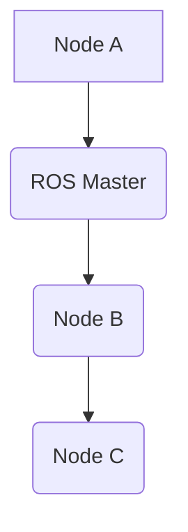
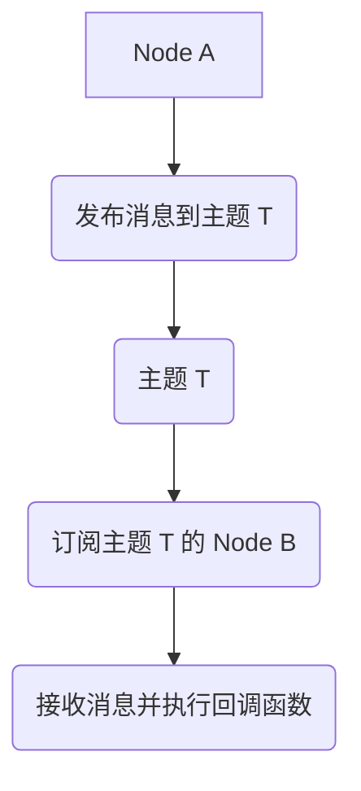
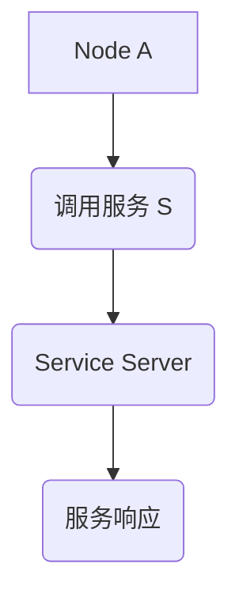

# Robot Operating System (ROS) 原理与代码实战案例讲解

## 1. 背景介绍

### 1.1 问题的由来

随着机器人技术的快速发展，特别是在移动机器人、无人机、服务机器人等领域，对操作系统的需求日益增长。现有的操作系统在处理实时性、多任务并发、硬件抽象以及与传感器和执行器的通信方面存在局限性。这些问题促使了专门针对机器人应用的实时操作系统——Robot Operating System（ROS）的诞生。

### 1.2 研究现状

ROS 是一个开源框架，旨在简化机器人开发过程中的硬件抽象、通信、消息传递、任务调度和软件包管理。它支持多平台，包括 Linux 和 Windows，并且拥有庞大的社区和丰富的软件生态系统。ROS 通过提供标准的消息传递机制、服务接口和节点交互方式，使得开发者能够更加专注于机器人应用的实现而非底层细节。

### 1.3 研究意义

ROS 的出现极大地促进了机器人开发的效率和便利性，使得更多非专业机器人开发人员能够参与到机器人项目的开发中来。它简化了硬件连接、数据流管理和软件组件间的通信，为机器人开发者提供了灵活且强大的工具集。此外，ROS 的开放性和可扩展性吸引了大量的研究机构和公司投入开发，推动了机器人技术在自动驾驶、农业、物流、医疗等多个领域的应用。

### 1.4 本文结构

本文将深入探讨 ROS 的核心概念、算法原理、数学模型以及实战案例，同时介绍如何在实际项目中部署和使用 ROS。我们将从 ROS 的基础开始，逐步了解其架构、组件以及如何编写和运行 ROS 应用程序。最后，我们将探讨 ROS 的实际应用场景、工具推荐以及未来发展趋势。

## 2. 核心概念与联系

### 2.1 ROS 的基本组件

- **Node**: 是 ROS 中的基本运行单元，可以是任何程序或功能模块。每个 Node 都有自己的唯一名称，并且可以发布、订阅消息或调用服务。
- **Topic**: ROS 中的消息交换方式之一，用于发布和订阅消息。消息通常封装在 ROS 的消息类型（msg）中。
- **Service**: 用于执行特定操作的 API，允许一个 Node 请求另一个 Node 的服务来执行特定任务。服务请求通常包含一组参数，响应则返回结果。
- **Parameter**: ROS 使用的配置参数系统，允许在运行时更改程序行为。参数通常存储在 `rosparam` 文件中。
- **ROS Master**: ROS 的中央服务，负责协调所有 Node 的运行，包括启动、停止、注册和注销 Node，以及提供参数服务器访问等服务。

### 2.2 ROS 的工作流程

- **消息发布**: Node 发布消息到特定主题，其他 Node 可以订阅该主题并接收消息。
- **消息订阅**: Node 可以订阅多个主题，接收其他 Node 发布的消息并执行相应的回调函数。
- **服务调用**: Node 可以发起服务请求，向其他 Node 提供的服务发送请求，并接收响应。

### 2.3 ROS 的架构

ROS 架构基于发布/订阅模式和回调机制，实现了高度模块化和可扩展的设计。其核心组件包括 ROS Master、ROS Core 和 ROS Tools。ROS Master 是 ROS 系统的心脏，负责协调所有 Node 的运行和管理。ROS Core 提供了基本的通信、消息传递和管理功能，而 ROS Tools 则提供了一系列工具和库，如 ROS 模拟器、图形界面工具等。

## 3. 核心算法原理 & 具体操作步骤

### 3.1 算法原理概述

ROS 的核心算法基于消息传递、事件驱动和回调机制。消息传递是 ROS 中数据交换的主要方式，允许 Node 之间高效地共享数据。事件驱动确保只有在特定事件发生时才执行代码，提高了程序的实时性和效率。回调机制允许 Node 在收到消息或服务请求时自动执行特定代码块，增强了程序的灵活性和响应能力。

### 3.2 算法步骤详解

#### 1. 注册 Node 和启动 ROS Master：



#### 2. 发布和订阅消息：



#### 3. 调用服务：



### 3.3 算法优缺点

#### 优点：
- **模块化**: ROS 支持高度模块化的设计，便于复用和扩展。
- **易于学习**: 提供了丰富的文档和教程，适合新手学习。
- **社区支持**: 拥有庞大的开发者社区，提供技术支持和资源分享。

#### 缺点：
- **性能**: 在高并发和实时任务处理上可能不如专用实时操作系统高效。
- **配置复杂**: 对于大规模系统，配置和管理可能较为复杂。

### 3.4 算法应用领域

ROS 广泛应用于机器人开发、无人机控制、自动化生产线、智能家居、医疗设备等多个领域。其强大的可扩展性和易用性使其成为机器人开发的首选平台。

## 4. 数学模型和公式

### 4.1 数学模型构建

ROS 中的消息传递和事件驱动模型可以被抽象为以下数学模型：

设 \\(N\\) 为 ROS 中的 Node 数量，\\(T\\) 为主题数量，\\(S\\) 为服务数量。假设每个 Node 发布 \\(M\\) 个消息到 \\(T\\) 个主题，订阅 \\(N'\\) 个主题和调用 \\(K\\) 个服务。那么，可以构建一个描述 ROS 系统的行为模型：

\\[ N \\times M \\times T \\]

表示消息发布率，\\[ N \\times N' \\times T \\]

表示消息订阅率，\\[ K \\times S \\]

表示服务调用率。

### 4.2 公式推导过程

在 ROS 中，消息传递的速率可以通过以下公式估计：

\\[ \\text{发布速率} = \\frac{\\text{发布消息的数量}}{\\text{时间间隔}} \\]

对于订阅和调用服务的情况，可以分别通过以下公式估算：

\\[ \\text{订阅速率} = \\frac{\\text{订阅的主题数量}}{\\text{时间间隔}} \\]

\\[ \\text{服务调用速率} = \\frac{\\text{服务请求的数量}}{\\text{时间间隔}} \\]

### 4.3 案例分析与讲解

在实际应用中，假设一个简单的机器人系统包含一个移动节点和一个视觉节点，移动节点发布位置信息到主题 `/robot_pose`，视觉节点订阅该主题并执行路径规划。当视觉节点接收到新位置信息时，会调用 `/plan_path` 服务来规划一条到达目标位置的路径。

### 4.4 常见问题解答

- **如何解决 ROS 的延迟问题？**
  - 调整 Node 的优先级或优化消息队列大小可以减少延迟。
- **ROS 是否支持多线程？**
  - ROS 自身不支持多线程，但在 Node 内部可以使用多线程处理不同的任务。

## 5. 项目实践：代码实例和详细解释说明

### 5.1 开发环境搭建

#### 必需工具：

- **Ubuntu/Linux 操作系统**
- **ROS发行版**（如 Kinetic、Melodic、Noetic）
- **编译工具**（如 catkin）

#### 安装步骤：

1. 下载并安装 ROS 发行版。
2. 配置环境变量。
3. 安装编译工具（如 `catkin`）。

### 5.2 源代码详细实现

假设我们要创建一个简单的 ROS 应用，用于控制一个模拟的机器人臂执行抓取和放置动作。

#### 示例代码：

```cpp
#include <ros/ros.h>
#include <std_msgs/String.h>

int main(int argc, char **argv) {
    ros::init(argc, argv, \"arm_controller\");
    ros::NodeHandle n;

    ros::Rate loop_rate(10);

    while (ros::ok()) {
        std_msgs::String msg;
        msg.data = \"Moving arm\";
        ros::Publisher arm_publisher = n.advertise<std_msgs::String>(\"arm_status\", 1000);
        arm_publisher.publish(msg);
        ros::spinOnce();
        loop_rate.sleep();
    }

    return 0;
}
```

### 5.3 代码解读与分析

这段代码创建了一个 ROS Node，名为 `arm_controller`，用于发布到 `/arm_status` 主题的消息。每秒发布一次消息，表示机器人臂正在移动。

### 5.4 运行结果展示

运行这段代码后，通过 ROS Master，我们可以看到 `/arm_status` 主题上的消息，表示机器人臂的动作状态。

## 6. 实际应用场景

ROS 在实际应用中的例子包括但不限于：

- **自主导航**：用于无人机和地面机器人，实现路径规划、避障和地图构建。
- **机器人协作**：多机器人系统中的任务分配、协调和通信。
- **服务机器人**：家庭清洁、医疗护理等领域，提供个性化服务。
- **工业自动化**：生产线上的机器人执行精确的装配、焊接等任务。

## 7. 工具和资源推荐

### 7.1 学习资源推荐

- **ROS 官方网站**：提供文档、教程和示例代码。
- **ROS 培训课程**：在线学习平台提供的 ROS 教程和课程。

### 7.2 开发工具推荐

- **Catkin**：用于构建和管理 ROS 项目。
- **ROSBridge**：用于 Web 应用与 ROS 的集成。

### 7.3 相关论文推荐

- **ROS 社区论坛**：查阅社区成员分享的论文和研究成果。
- **学术数据库**：如 IEEE Xplore、Google Scholar，搜索 ROS 相关的研究论文。

### 7.4 其他资源推荐

- **ROS GitHub**：获取源代码、贡献和项目跟踪。
- **ROS Slack/Slack-like**：加入 ROS 社区，参与讨论和技术支持。

## 8. 总结：未来发展趋势与挑战

### 8.1 研究成果总结

ROS 作为机器人开发的核心框架，已经取得了显著的成功，特别是在促进机器人技术的普及和应用方面。随着 AI 技术的发展，ROS 将进一步融合机器学习、深度学习等技术，提升机器人系统的智能性和适应性。

### 8.2 未来发展趋势

- **集成 AI 技术**：通过深度学习和强化学习技术，提升机器人决策和学习能力。
- **云原生架构**：利用云服务和容器化技术，实现 ROS 的云化部署和管理。
- **安全性增强**：加强 ROS 系统的安全性，防止恶意攻击和数据泄露。

### 8.3 面临的挑战

- **数据安全**：保护机器人系统中的敏感数据和隐私。
- **能源效率**：提高机器人系统的能效，减少对电池的依赖。

### 8.4 研究展望

未来，ROS 将继续发展，成为更多机器人应用的标准平台，同时与云计算、物联网等技术深度融合，推动机器人技术在更多领域的发展和应用。

## 9. 附录：常见问题与解答

- **Q:** 如何解决 ROS 中的内存泄漏问题？
  **A:** 使用工具如 Valgrind 或 LeakSanitizer 进行内存泄漏检测，及时修复代码中的内存管理错误。
  
- **Q:** ROS 是否支持多核 CPU？
  **A:** ROS 自身不支持多核并行处理，但开发者可以利用 Node 内部的多线程功能来实现并行处理。

---

通过以上内容，我们可以看到 ROS 不仅在机器人开发中扮演着至关重要的角色，而且还持续发展以满足不断进步的技术需求。从理论到实践，ROS 提供了丰富的资源和工具，使开发者能够专注于构建创新的机器人应用，同时应对未来的挑战和机遇。