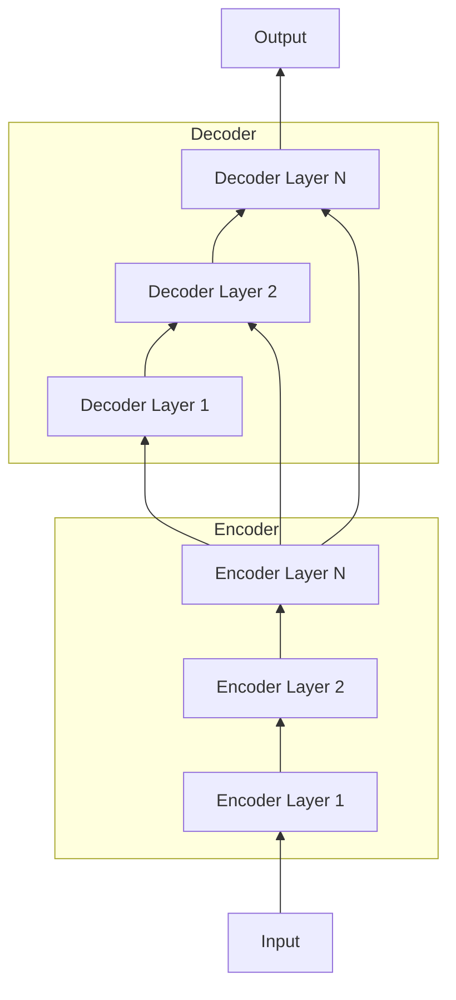

# Transformer大模型实战 整合编码器和解码器

关键词：Transformer、编码器、解码器、注意力机制、自然语言处理、深度学习

## 1. 背景介绍
### 1.1 问题的由来
自然语言处理(NLP)是人工智能领域的一个重要分支,旨在让计算机能够理解、生成和处理人类语言。传统的NLP方法主要基于规则和统计,难以有效捕捉语言的复杂性和语义信息。近年来,随着深度学习的发展,尤其是Transformer模型的出现,NLP取得了突破性进展。

### 1.2 研究现状 
Transformer最早由Google于2017年提出,通过引入自注意力机制,克服了RNN模型难以并行化、长距离依赖问题等缺陷。此后,各种基于Transformer的预训练语言模型如BERT、GPT等相继问世,在多项NLP任务上取得了SOTA成绩。然而,如何更好地整合编码器和解码器,构建更强大的端到端生成模型,仍是一个值得探索的问题。

### 1.3 研究意义
探索高效整合Transformer编码器和解码器的方法,对于构建高性能的端到端NLP模型具有重要意义。一方面,这有助于进一步提升模型在机器翻译、文本摘要、对话生成等任务上的表现;另一方面,研究成果也可为其他序列到序列学习问题提供新的思路和参考。

### 1.4 本文结构
本文将首先介绍Transformer的核心概念和原理,然后重点探讨编码器和解码器的整合方法。通过理论分析和代码实践,详细阐述模型的数学原理、训练方法和实现细节。最后,讨论模型的应用场景、未来发展趋势与挑战,为相关研究提供参考。

## 2. 核心概念与联系
Transformer的核心是自注意力机制(Self-Attention)和位置编码(Positional Encoding)。

自注意力让模型能够在处理当前词时,同时关注句子中的其他相关词。具体来说,通过将词映射为查询(Query)、键(Key)、值(Value)三个向量,然后计算它们之间的相似度,得到注意力权重,最后加权求和得到新的表示。公式如下:

$$
Attention(Q,K,V) = softmax(\frac{QK^T}{\sqrt{d_k}})V
$$

其中,$Q$,$K$,$V$分别是查询、键、值矩阵,$d_k$为键向量的维度。

位置编码用于引入词的位置信息。Transformer采用三角函数形式:

$$
PE_{(pos,2i)} = sin(pos/10000^{2i/d_{model}})
$$
$$
PE_{(pos,2i+1)} = cos(pos/10000^{2i/d_{model}})  
$$

其中,$pos$为位置,$i$为维度,$d_{model}$为词向量维度。

编码器由多个编码层堆叠而成,每层包含两个子层:多头自注意力和前馈神经网络。解码器与编码器结构类似,但在自注意力之后多了一个与编码器输出交互的注意力层。

整合编码器和解码器的关键是设计有效的交互机制,让解码器能充分利用编码器提取的特征信息,同时避免过拟合等问题。常见的方法包括:

1. 在编码器顶层加入全局图像特征
2. 在解码器的每个块中加入与编码器交互的注意力层
3. 设计特殊的损失函数以平衡两者的重要性
4. 引入正则化手段防止过拟合

下图展示了一个典型的Transformer编解码模型架构:

## 3. 核心算法原理 & 具体操作步骤
### 3.1 算法原理概述
Transformer的编码器-解码器架构可以看作一个条件语言模型。给定源语言序列$X=(x_1,…,x_n)$,通过编码器将其编码为隐向量$Z=(z_1,…,z_n)$。然后解码器根据$Z$和已生成的目标语言序列$y_{<t}=(y_1,…,y_{t-1})$,预测下一个目标词$y_t$的概率分布:

$$
P(y_t|y_{<t},X) = Decoder(y_{<t},Encoder(X))
$$

通过最大化该条件概率,可以得到最优的生成结果。

### 3.2 算法步骤详解
1. 输入编码:将离散的词转换为连续向量表示,并加上位置编码。

2. 编码器自注意力:通过缩放点积注意力,计算序列内部的相关性。
$$
MultiHead(Q,K,V) = Concat(head_1,…,head_h)W^O \\
head_i = Attention(QW_i^Q, KW_i^K, VW_i^V)
$$

3. 编码器前馈:通过两层全连接网络,增加非线性表示能力。
$$
FFN(x) = max(0, xW_1 + b_1)W_2 + b_2
$$

4. 编码器堆叠:将多个编码器层堆叠,每层之间通过残差连接和层归一化。
$$
LayerNorm(x+Sublayer(x))
$$

5. 解码器自注意力和编码器-解码器注意力:在解码时,先通过掩码自注意力机制关注已生成的词,然后与编码器输出交互,获取相关的源语言信息。

6. 解码器前馈和堆叠:与编码器类似,增加非线性和模型深度。

7. 输出:通过线性变换和softmax函数,将解码器输出转换为目标词的概率分布。

### 3.3 算法优缺点
优点:
1. 并行计算能力强,训练速度快
2. 能够捕捉长距离依赖关系
3. 模型解释性强,可解释性好
4. 适合迁移学习和少样本学习

缺点:
1. 计算复杂度随序列长度平方增长,难以处理很长的序列
2. 模型参数量大,需要大量数据训练
3. 推理速度慢,不适合实时场景
4. 语言理解能力有限,泛化能力不足

### 3.4 算法应用领域
Transformer已在以下NLP任务中取得了广泛应用和SOTA表现:
1. 机器翻译
2. 文本摘要
3. 语法纠错 
4. 问答系统
5. 情感分析
6. 文本分类
7. 命名实体识别
8. 关系抽取
...

除了NLP,Transformer在语音识别、图像字幕、视频理解、推荐系统等领域也展现出了巨大的潜力。

## 4. 数学模型和公式 & 详细讲解 & 举例说明
### 4.1 数学模型构建
Transformer的数学模型可以概括为三个部分:输入表示、编码器、解码器。

输入表示:
$$
E(x) = Embedding(x) + PositionalEncoding(x)
$$

编码器第$l$层:
$$
\tilde{z}^{(l)} = LayerNorm(z^{(l-1)} + MultiHeadAttention(z^{(l-1)})) \\
z^{(l)} = LayerNorm(\tilde{z}^{(l)} + FeedForward(\tilde{z}^{(l)}))
$$

解码器第$l$层:
$$
\tilde{y}^{(l)} = LayerNorm(y^{(l-1)} + MultiHeadAttention(y^{(l-1)})) \\
\hat{y}^{(l)} = LayerNorm(\tilde{y}^{(l)} + MultiHeadAttention(\tilde{y}^{(l)},z^{(L)})) \\  
y^{(l)} = LayerNorm(\hat{y}^{(l)} + FeedForward(\hat{y}^{(l)}))
$$

最终输出:
$$
P(y_t|y_{<t},X) = softmax(LinearProjection(y^{(L)}_t))
$$

### 4.2 公式推导过程
以编码器自注意力为例,详细推导其前向计算公式。

1. 输入向量$Z \in \mathbb{R}^{n \times d}$,其中$n$为序列长度,$d$为特征维度。

2. 将输入$Z$通过三个线性变换得到$Q$,$K$,$V$:
$$
Q = ZW^Q, K = ZW^K, V = ZW^V
$$
其中$W^Q, W^K, W^V \in \mathbb{R}^{d \times d_k}$为可学习参数矩阵。

3. 计算$Q$和$K^T$的点积注意力:
$$
A = \frac{QK^T}{\sqrt{d_k}} \in \mathbb{R}^{n \times n}
$$

4. 对$A$进行Softmax归一化,得到注意力权重矩阵$\hat{A}$:
$$
\hat{A} = softmax(A)
$$

5. 将$\hat{A}$与值矩阵$V$相乘,得到注意力输出$Head$:
$$
Head = \hat{A}V \in \mathbb{R}^{n \times d_v}  
$$

6. 将多个$Head$拼接,并通过线性变换得到最终的多头注意力输出$MultiHead$:
$$
MultiHead = Concat(Head_1, ..., Head_h)W^O \in \mathbb{R}^{n \times d}
$$
其中$h$为注意力头数,$W^O \in \mathbb{R}^{hd_v \times d}$为可学习参数矩阵。

### 4.3 案例分析与讲解
下面以一个英译汉的机器翻译任务为例,说明Transformer的工作流程。

输入:"The cat sat on the mat."

1. 将输入序列通过Embedding层和位置编码,得到词向量表示:
$$
\begin{aligned}
E(the) &= emb_{the} + PE_1 \\
E(cat) &= emb_{cat} + PE_2 \\ 
E(sat) &= emb_{sat} + PE_3 \\
... 
\end{aligned}
$$

2. 将词向量通过编码器的自注意力和前馈网络,提取源语言特征:
$$
\begin{aligned}
\tilde{z}^{(1)} &= LN(E + MultiHead(E)) \\
z^{(1)} &= LN(\tilde{z}^{(1)} + FFN(\tilde{z}^{(1)})) \\
\tilde{z}^{(2)} &= LN(z^{(1)} + MultiHead(z^{(1)})) \\
z^{(2)} &= LN(\tilde{z}^{(2)} + FFN(\tilde{z}^{(2)})) \\
...
\end{aligned}
$$

3. 解码器首先通过自注意力机制关注已生成的目标词:
$$
\begin{aligned}
\tilde{y}^{(1)} &= LN(E(BOS) + MultiHead(E(BOS))) \\  
\hat{y}^{(1)} &= LN(\tilde{y}^{(1)} + MultiHead(\tilde{y}^{(1)},z^{(L)})) \\
y^{(1)} &= LN(\hat{y}^{(1)} + FFN(\hat{y}^{(1)})) \\ 
...
\end{aligned}
$$

4. 然后通过编码-解码注意力,结合源语言信息,预测下一个目标词:
$$
P(y_1|BOS,X) = softmax(LinearProjection(y^{(L)}_1))
$$

5. 重复步骤3-4,直到生成结束符EOS,得到最终的翻译结果:
"猫 坐 在 垫子 上。"

### 4.4 常见问题解答
Q: Transformer能处理多长的序列?
A: 理论上Transformer对序列长度没有硬性限制,但由于计算复杂度为$O(n^2)$,实际应用中一般限制在512或1024以内。

Q: Transformer能否并行训练?
A: 可以。与RNN不同,Transformer通过注意力机制实现了并行计算,可以很好地利用GPU加速训练。

Q: Transformer的位置编码是否一定要用三角函数?
A: 不一定。三角函数形式的位置编码是原论文的选择,也有其他变体如可学习的位置编码等。关键是要引入位置信息。

Q: Transformer能否处理非文本数据?  
A: 可以。尽管最初是为文本数据设计,但Transformer也可用于图像、语音等其他序列数据,只需将输入适当向量化即可。