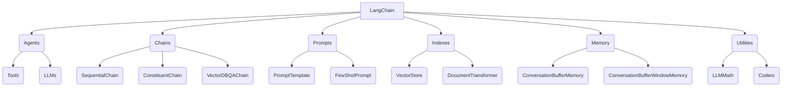

# 【LangChain编程：从入门到实践】链的基本概念

## 1. 背景介绍

### 1.1 问题的由来

在当今数据时代,我们面临着海量的异构数据源和复杂的业务逻辑。传统的编程方式往往无法高效地处理这些数据和逻辑,导致开发效率低下、代码维护困难。为了解决这一问题,LangChain应运而生。

### 1.2 研究现状

LangChain是一个新兴的Python库,旨在简化人工智能(AI)应用程序的构建过程。它提供了一种模块化的方法来组合不同的AI模型、数据源和工具,形成一个统一的工作流程。LangChain已经在多个领域得到广泛应用,如自然语言处理、知识图谱构建、问答系统等。

### 1.3 研究意义

LangChain的出现为AI应用程序的开发带来了全新的范式。它不仅提高了开发效率,还增强了代码的可维护性和可扩展性。通过LangChain,开发人员可以更加专注于业务逻辑,而不必过多关注底层实现细节。此外,LangChain还促进了AI模型和工具的复用,降低了开发成本。

### 1.4 本文结构

本文将全面介绍LangChain的基本概念和使用方法。首先,我们将探讨LangChain的核心概念和架构。接下来,将详细阐述LangChain的核心算法原理和具体操作步骤。然后,我们将介绍LangChain的数学模型和公式,并通过案例进行详细讲解。此外,还将提供一个实际项目的代码实例,并对其进行深入解释。最后,我们将讨论LangChain的应用场景、相关工具和资源,以及未来发展趋势和挑战。

## 2. 核心概念与联系



LangChain是一个用于构建AI应用程序的Python库,它提供了一组模块化的构建块。这些构建块包括:

1. **Agents**: 代理是LangChain中的一个关键概念,它将语言模型(LLM)、工具、内存等组件集成在一起,形成一个智能代理。代理可以根据给定的指令执行一系列操作,并产生最终输出。

2. **Chains**: 链是LangChain中的另一个核心概念,它将多个组件(如LLM、工具、代理等)连接在一起,形成一个有序的执行流程。LangChain提供了多种预定义的链,如`SequentialChain`、`ConstituentChain`和`VectorDBQAChain`等。

3. **Prompts**: 提示是与LLM交互的关键,它指定了LLM应该执行的任务和输入数据。LangChain提供了`PromptTemplate`和`FewShotPrompt`等工具,用于构建和管理提示。

4. **Indexes**: 索引是LangChain中用于存储和检索文本数据的组件。它包括`VectorStore`和`DocumentTransformer`等子组件,用于将文本数据转换为向量表示,并存储在向量数据库中。

5. **Memory**: 内存是LangChain中用于存储和管理上下文信息的组件。它包括`ConversationBufferMemory`和`ConversationBufferWindowMemory`等子组件,用于跟踪代理与用户之间的对话历史。

6. **Utilities**: 实用程序是LangChain中提供的一些辅助工具,如`LLMMath`用于处理数学表达式,`Coders`用于处理编码和解码操作等。

这些核心概念相互关联,共同构建了LangChain的整体架构。开发人员可以根据具体需求,灵活组合和配置这些组件,从而构建出功能强大的AI应用程序。

## 3. 核心算法原理 & 具体操作步骤

### 3.1 算法原理概述

LangChain的核心算法原理是基于**代理-工具-LLM**的交互模式。代理作为中心枢纽,根据给定的指令和上下文信息,协调工具和LLM的执行,并产生最终输出。

这个过程可以概括为以下几个步骤:

1. **指令解析**: 代理首先解析用户的指令,确定需要执行的任务。

2. **工具选择**: 代理根据任务的性质,选择合适的工具执行相应的操作。

3. **LLM交互**: 代理与LLM交互,获取任务执行所需的信息或指导。

4. **工具执行**: 代理调用选定的工具,并将LLM的输出作为参数传递给工具。

5. **结果整合**: 代理整合工具的执行结果,并根据需要与LLM进一步交互,直到完成整个任务。

6. **输出生成**: 代理将最终结果输出给用户。

在整个过程中,代理扮演着协调和控制的角色,而LLM提供了语义理解和生成的能力,工具则执行具体的任务操作。这种模块化的设计使得LangChain具有很强的灵活性和可扩展性。

### 3.2 算法步骤详解

下面我们将详细解释LangChain算法的具体执行步骤:

1. **初始化代理**

   首先,需要初始化一个代理实例,并配置相关的LLM、工具、内存等组件。例如:

   ```python
   from langchain.agents import initialize_agent
   from langchain.llms import OpenAI
   from langchain.tools import WikipediaHTTPTool

   # 初始化LLM
   llm = OpenAI(temperature=0)

   # 初始化工具列表
   tools = [WikipediaHTTPTool()]

   # 初始化代理
   agent = initialize_agent(tools, llm, agent="zero-shot-react-description", verbose=True)
   ```

2. **执行代理**

   初始化完成后,可以调用代理的`run`方法,传入用户的指令,代理将根据指令执行相应的操作。例如:

   ```python
   query = "What is the capital of France?"
   result = agent.run(query)
   print(result)
   ```

   在执行过程中,代理会按照前面介绍的步骤进行操作。具体来说:

   a. 代理解析用户的指令`"What is the capital of France?"`。

   b. 代理选择合适的工具执行任务,在这个例子中,它可能会选择`WikipediaHTTPTool`来查询法国的首都信息。

   c. 代理与LLM交互,获取执行工具所需的信息或指导。

   d. 代理调用`WikipediaHTTPTool`,并将LLM的输出作为参数传递给工具。

   e. 工具执行查询操作,并将结果返回给代理。

   f. 代理整合工具的执行结果,并根据需要与LLM进一步交互,直到完成整个任务。

   g. 代理将最终结果`"The capital of France is Paris."`输出给用户。

3. **自定义代理行为**

   LangChain还提供了多种方式来自定义代理的行为,例如:

   - 使用不同的LLM模型
   - 添加或删除工具
   - 配置内存组件
   - 修改代理的执行策略

   这些自定义选项使得开发人员可以根据具体需求,调整代理的行为和性能。

### 3.3 算法优缺点

LangChain算法的主要优点包括:

1. **模块化设计**: 代理、LLM、工具等组件的模块化设计,使得算法具有很强的灵活性和可扩展性。

2. **易于集成**: 算法可以轻松集成各种LLM模型和工具,满足不同的应用场景需求。

3. **提高开发效率**: 通过抽象和封装底层细节,算法降低了AI应用程序的开发难度,提高了开发效率。

4. **可解释性**: 代理的执行过程具有较好的可解释性,有助于调试和优化。

5. **内存管理**: 算法提供了内存组件,用于管理上下文信息和对话历史,增强了应用程序的智能性。

然而,LangChain算法也存在一些缺点和限制:

1. **依赖LLM性能**: 算法的整体性能在很大程度上依赖于所使用的LLM模型的能力。

2. **工具集成复杂度**: 集成新工具可能需要一定的开发工作,增加了复杂度。

3. **上下文管理挑战**: 在长时间的对话过程中,有效管理上下文信息仍然是一个挑战。

4. **安全性和隐私问题**: 算法可能存在一些安全性和隐私方面的风险,需要进一步加强。

5. **资源消耗**: 算法的执行可能会消耗大量的计算资源,特别是在使用大型LLM模型时。

### 3.4 算法应用领域

LangChain算法可以应用于多个领域,包括但不限于:

1. **自然语言处理(NLP)**: 算法可用于构建问答系统、文本摘要、情感分析等NLP应用。

2. **知识管理**: 算法可用于知识图谱构建、知识检索和知识推理等任务。

3. **智能助理**: 算法可用于开发具有多功能的智能助理,如个人助理、客户服务助理等。

4. **任务自动化**: 算法可用于自动化各种任务,如数据处理、报告生成、代码生成等。

5. **教育和学习**: 算法可用于开发智能教学系统、个性化学习辅助等应用。

6. **科研领域**: 算法可用于辅助科研工作,如文献检索、实验设计、数据分析等。

7. **商业智能**: 算法可用于构建商业智能系统,如市场分析、决策支持、预测建模等。

总的来说,LangChain算法为广泛的AI应用程序开发提供了强大的支持,具有巨大的应用前景。

## 4. 数学模型和公式 & 详细讲解 & 举例说明

### 4.1 数学模型构建

在LangChain中,数学模型主要用于表示和处理文本数据的向量表示。LangChain使用向量空间模型(Vector Space Model, VSM)将文本映射到高维向量空间中。

假设我们有一个文本语料库 $\mathcal{D} = \{d_1, d_2, \dots, d_n\}$,其中每个 $d_i$ 表示一个文本文档。我们可以使用词袋模型(Bag-of-Words)或 TF-IDF 等技术将每个文档表示为一个向量 $\vec{v_i} \in \mathbb{R}^m$,其中 $m$ 是词汇表的大小。

然后,我们可以使用降维技术(如PCA或t-SNE)将这些高维向量投影到低维空间中,以便可视化和计算。常用的降维方法是利用神经网络模型(如BERT或GPT)对文本进行编码,得到低维的向量表示。

对于给定的查询 $q$,我们可以将其映射到同一个向量空间中,得到向量表示 $\vec{q}$。然后,我们可以计算 $\vec{q}$ 与语料库中每个文档向量 $\vec{v_i}$ 的相似度,并返回最相关的文档。常用的相似度度量包括余弦相似度和内积相似度。

### 4.2 公式推导过程

余弦相似度是一种常用的文本相似度度量方法。给定两个向量 $\vec{a}$ 和 $\vec{b}$,它们的余弦相似度定义为:

$$\text{cosine\_similarity}(\vec{a}, \vec{b}) = \cos(\theta) = \frac{\vec{a} \cdot \vec{b}}{\|\vec{a}\| \|\vec{b}\|}$$

其中 $\theta$ 是 $\vec{a}$ 和 $\vec{b}$ 之间的夹角,符号 $\cdot$ 表示向量点积,符号 $\|\cdot\|$ 表示向量的$L_2$范数。

我们可以推导出余弦相似度的计算公式