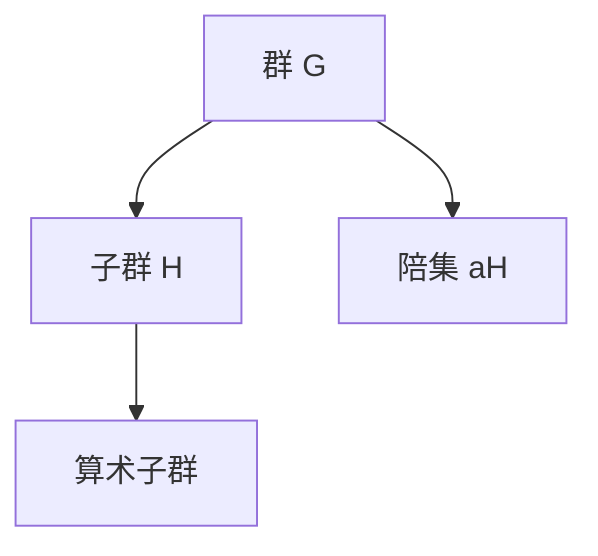

# 代数群引论：4.3 算术子群

作者：禅与计算机程序设计艺术 / Zen and the Art of Computer Programming

关键词：算术子群、代数群、有限生成子群、群同态、群的阶

## 1. 背景介绍

### 1.1 问题的由来

群论作为现代数学的重要分支,在代数学、几何学、物理学、化学等领域有着广泛的应用。而算术子群作为群论中的一个重要概念,在解决许多实际问题中发挥着关键作用。然而,对于初学者来说,算术子群的概念和性质可能比较难以理解和掌握。

### 1.2 研究现状 

目前,关于算术子群的研究主要集中在以下几个方面:

1. 算术子群的结构和性质研究
2. 算术子群与母群之间的关系
3. 算术子群在密码学、编码理论等领域的应用

国内外学者对算术子群进行了深入的研究,取得了丰硕的成果。但是对于初学者来说,如何快速掌握算术子群的基本概念和理论,仍然是一个值得探讨的问题。

### 1.3 研究意义

通过对算术子群的学习和研究,可以加深对群论的理解,提高抽象思维和逻辑推理能力。同时,算术子群在密码学、编码理论、计算机科学等领域有着重要的应用,深入研究算术子群,对于解决实际问题具有重要意义。

### 1.4 本文结构

本文将从以下几个方面对算术子群进行介绍和探讨:

1. 算术子群的定义和基本性质
2. 算术子群的构造方法
3. 算术子群与母群之间的关系
4. 算术子群在密码学中的应用
5. 算术子群的计算机实现

## 2. 核心概念与联系

在介绍算术子群之前,我们先回顾一下群的基本概念。

**群的定义**: 设 $G$ 是一个非空集合,若在 $G$ 上定义了一个二元运算 $\cdot$,使得:
1. 封闭性:$\forall a,b \in G, a \cdot b \in G$  
2. 结合律:$\forall a,b,c \in G,(a \cdot b) \cdot c = a \cdot (b \cdot c)$
3. 单位元:$\exists e \in G, \forall a \in G, a \cdot e=e \cdot a=a$
4. 逆元:$\forall a \in G, \exists b \in G, a \cdot b=b \cdot a=e$

则称 $(G,\cdot)$ 为一个群。若群 $G$ 满足交换律,即 $\forall a,b \in G, a \cdot b=b \cdot a$,则称 $G$ 为交换群或Abel群。

**子群的定义**: 设 $(G,\cdot)$ 是一个群,若 $H$ 是 $G$ 的非空子集,且 $(H,\cdot)$ 构成一个群,则称 $H$ 是 $G$ 的一个子群,记为 $H \leq G$。

**陪集的定义**: 设 $H$ 是群 $G$ 的一个子群, $a \in G$,称集合 $aH=\{ah \mid h \in H\}$ 为 $a$ 关于 $H$ 的左陪集,称 $Ha=\{ha \mid h \in H\}$ 为 $a$ 关于 $H$ 的右陪集。

**群的阶**: 群 $G$ 中元素的个数称为群 $G$ 的阶,记为 $|G|$。若 $|G|$ 是有限的,则称 $G$ 为有限群;否则称为无限群。 

**有限生成群**: 设 $G$ 是一个群,若存在 $G$ 的一个有限子集 $S$,使得 $G$ 中任意元素都可以用 $S$ 中元素的有限次乘积表示,则称 $G$ 是有限生成群,称 $S$ 为 $G$ 的一个生成元系。

**算术子群**: 设 $G$ 是一个有限生成交换群,若 $G$ 的任意一个非平凡子群都是有限生成的,则称 $G$ 的这些非平凡子群为算术子群。

下图展示了群、子群、陪集、算术子群之间的关系:



## 3. 核心算法原理 & 具体操作步骤

### 3.1 算法原理概述

构造算术子群的一般步骤如下:

1. 给定一个有限生成交换群 $G$
2. 找到 $G$ 的一个非平凡子群 $H$(通常选择阶较小的子群)
3. 验证 $H$ 是否为有限生成群,若是,则 $H$ 为 $G$ 的一个算术子群
4. 重复步骤2-3,直到找到 $G$ 的所有算术子群

### 3.2 算法步骤详解

下面我们以循环群 $\mathbb{Z}$ 为例,详细说明算术子群的构造步骤。

**步骤1**: 群 $\mathbb{Z}$ 在加法运算下构成一个无限循环群,其生成元为1。即 $\mathbb{Z}=\langle1\rangle=\{\ldots,-2,-1,0,1,2,\ldots\}$。

**步骤2**: 寻找 $\mathbb{Z}$ 的非平凡子群。不难发现,对任意正整数 $n$,集合 $n\mathbb{Z}=\{nk \mid k \in \mathbb{Z}\}$ 均为 $\mathbb{Z}$ 的子群。

**步骤3**: 验证 $n\mathbb{Z}$ 是否为有限生成群。事实上,对任意 $n \in \mathbb{N}^+$,子群 $n\mathbb{Z}$ 可由元素 $n$ 生成,即 $n\mathbb{Z}=\langle n \rangle$。因此 $n\mathbb{Z}$ 为有限生成群,从而为 $\mathbb{Z}$ 的算术子群。

**步骤4**: 由于 $\mathbb{Z}$ 的任意非平凡子群均可写为 $n\mathbb{Z}$ 的形式,因此循环群 $\mathbb{Z}$ 的所有算术子群为:
$$\{n\mathbb{Z} \mid n \in \mathbb{N}^+\}$$

### 3.3 算法优缺点

构造算术子群的算法优点如下:
1. 算法思路清晰,容易理解和实现
2. 适用于任意有限生成交换群
3. 算法复杂度较低,效率较高

算法的缺点是:
1. 需要先找到群的所有非平凡子群,对于阶较大的群,计算量会比较大
2. 判断子群是否为有限生成群的步骤可能比较繁琐

### 3.4 算法应用领域

算术子群在以下领域有重要应用:
1. 密码学:利用算术子群构造密码体制,如格密码
2. 编码理论:利用算术子群构造纠错码,如循环码
3. 计算机科学:利用算术子群优化算法,提高程序效率

## 4. 数学模型和公式 & 详细讲解 & 举例说明

### 4.1 数学模型构建

我们以循环群 $\mathbb{Z}_n$ 为例,构建算术子群的数学模型。

设 $\mathbb{Z}_n=\{0,1,\ldots,n-1\}$ 为模 $n$ 剩余类集合,在加法运算下构成一个循环群。我们的目标是找到 $\mathbb{Z}_n$ 的所有算术子群。

根据Lagrange定理,群的子群的阶一定整除群的阶。因此 $\mathbb{Z}_n$ 的子群的阶一定是 $n$ 的因子。设 $d \mid n$,我们考察满足以下条件的集合:
$$H_d=\{0,d,2d,\ldots,(n/d-1)d\}$$

容易验证,$(H_d,+)$ 构成 $\mathbb{Z}_n$ 的一个子群,且 $|H_d|=n/d$。

### 4.2 公式推导过程

下面我们证明:$\mathbb{Z}_n$ 的任意非平凡子群均可写为 $H_d$ 的形式,其中 $d$ 为 $n$ 的非平凡因子。

设 $H \leq \mathbb{Z}_n$ 为 $\mathbb{Z}_n$ 的任意一个非平凡子群,则 $|H| \mid n$,设 $|H|=n/d$,其中 $d \mid n$。

任取 $x \in H$,则 $dx=(n/d)x \equiv 0 \pmod{n}$,即 $dx \in H_d$。由于 $|H|=|H_d|$,因此 $H=H_d$。

这就证明了 $\mathbb{Z}_n$ 的任意非平凡子群均可写为 $H_d$ 的形式。而 $H_d$ 可由元素 $d$ 生成,因此 $H_d$ 为 $\mathbb{Z}_n$ 的算术子群。

综上所述,我们得到如下结论:

$$\mathbb{Z}_n \text{的所有算术子群为} \{H_d \mid d \text{为} n \text{的非平凡因子}\}$$

### 4.3 案例分析与讲解

下面我们以 $\mathbb{Z}_{12}$ 为例,求其所有算术子群。

$12=2^2 \times 3$,因此 $12$ 的非平凡因子为 $2,3,4,6$。根据上述结论,我们可以得到 $\mathbb{Z}_{12}$ 的所有算术子群如下:

$$
\begin{aligned}
H_2 &= \{0,2,4,6,8,10\} \\
H_3 &= \{0,3,6,9\} \\
H_4 &= \{0,4,8\} \\
H_6 &= \{0,6\}
\end{aligned}
$$

容易验证,这些子群均可由一个元素生成,因此为 $\mathbb{Z}_{12}$ 的算术子群。

### 4.4 常见问题解答

**Q**: 算术子群与普通子群有何区别?

**A**: 算术子群是群的特殊子群,它要求子群必须是有限生成的。而普通子群没有这一要求。因此算术子群是普通子群的真子集。

**Q**: 一个群的算术子群的个数有上限吗?  

**A**: 设群 $G$ 的阶为 $n$,则 $G$ 的算术子群的个数最多为 $d(n)-1$,其中 $d(n)$ 表示 $n$ 的因子个数。这是因为算术子群的阶必须整除群的阶,而因子个数最多为 $d(n)$,去掉平凡子群后即得到上述结果。

## 5. 项目实践：代码实例和详细解释说明

下面我们用Python实现求循环群 $\mathbb{Z}_n$ 的所有算术子群的算法。

### 5.1 开发环境搭建

- 操作系统:Windows 10
- Python版本:3.8.5
- 开发工具:PyCharm 2021.1.3
- 依赖库:无

### 5.2 源代码详细实现

```python
def get_factors(n):
    """
    求正整数n的所有因子
    """
    factors = []
    for i in range(1, n+1):
        if n % i == 0:
            factors.append(i)
    return factors

def get_arithmetic_subgroups(n):
    """
    求循环群Z_n的所有算术子群
    """
    factors = get_factors(n)
    subgroups = []
    for d in factors[1:-1]:  # 去掉1和n本身
        subgroup = [0]
        for i in range(1, n//d):
            subgroup.append(i*d)
        subgroups.append(subgroup)
    return subgroups

# 测试
n = 12
subgroups = get_arithmetic_subgroups(n)
print(f"循环群Z_{n}的所有算术子群为:")
for subgroup in subgroups:
    print(subgroup)
```

### 5.3 代码解读与分析

- `get_factors`函数用于求正整数 $n$ 的所有因子,它遍历1到 $n$ 之间的所有数,如果能整除 $n$,则加入因子列表中。
- `get_arithmetic_subgroups`函数用于求循环群 $\mathbb{Z}_n$ 的所有算术子群。它先求出 $n$ 的所有非平凡因子,然后对每个因子 $d$,生成子群 $H_d$,加入到子群列表中。
- 在主程序中,我们以 $n=12$ 为例,调用`