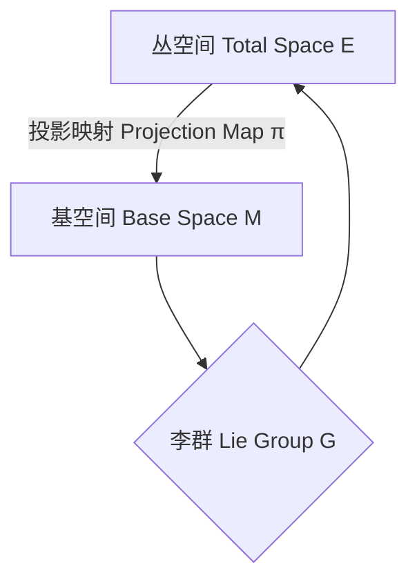
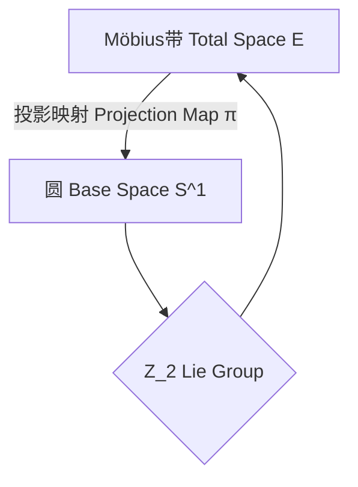

# 微分几何入门与广义相对论：主丛的定义和例子

## 1. 背景介绍

### 1.1 问题的由来

微分几何是数学的一个分支,研究流形(Manifold)及其上的微分可积结构。广义相对论是物理学中描述万有引力的理论,它将引力理解为时空的弯曲。微分几何为广义相对论提供了数学基础,因为时空被描述为一个四维流形。理解主丛(Principal Bundle)的概念对于学习广义相对论至关重要。

### 1.2 研究现状

主丛的概念源于20世纪初费马、克莱因和佩恩勒夫的工作。随后,它在数学物理学、量子场论和规范场论中发挥了重要作用。主丛为研究规范理论提供了一个自然的数学框架。近年来,随着理论物理学的发展,主丛概念在描述基本相互作用中扮演着关键角色。

### 1.3 研究意义

理解主丛对于掌握广义相对论的数学基础至关重要。主丛为引力理论提供了一个精确的数学描述,有助于更深入地理解时空的几何结构。此外,主丛概念在规范场论、量子场论和其他物理学领域也有广泛应用。

### 1.4 本文结构

本文将首先介绍主丛的基本概念,包括丛空间、基空间和投影映射。然后,我们将讨论主丛的具体例子,如李群丛和帧丛。接下来,文章将探讨主丛在广义相对论中的应用,包括规范理论和引力理论。最后,我们将总结主丛概念的重要性,并讨论未来的研究方向。

## 2. 核心概念与联系

主丛(Principal Bundle)是微分几何中的一个重要概念,它为研究规范理论和广义相对论提供了数学基础。主丛由三个组成部分构成:

1. **丛空间(Total Space)** E: 这是一个更大的空间,包含了所有可能的状态或配置。
2. **基空间(Base Space)** M: 这是一个较小的空间,代表了不同的位置或点。
3. **投影映射(Projection Map)** π: E → M,将丛空间映射到基空间。

主丛的关键特征是存在一个李群(Lie Group) G,它在丛空间E上有自由右作用。这意味着对于任意点p∈E和任意元素g∈G,存在一个新的点p·g∈E,满足以下条件:

1. 结合律: (p·g)·h = p·(gh)
2. 存在单位元: p·e = p (其中e是G的单位元)



主丛允许我们在不同点之间"平行传输"对象,同时保持它们的"内部自由度"不变。这种"内部自由度"由李群G描述。

## 3. 核心算法原理 & 具体操作步骤

### 3.1 算法原理概述

主丛的核心思想是将一个复杂的空间(丛空间E)分解为一个较简单的基空间M和一个描述"内部自由度"的结构(李群G)。这种分解使我们能够更好地理解和操作空间中的对象。

主要步骤如下:

1. 确定基空间M,它代表了我们感兴趣的位置或点。
2. 选择一个合适的李群G,它描述了我们关注的"内部自由度"。
3. 构造丛空间E,使得每个点p∈E都与一个基点x∈M和一个"内部状态"g∈G相关联。
4. 定义投影映射π:E→M,将丛空间映射到基空间。
5. 确保李群G在丛空间E上有自由右作用,满足结合律和单位元条件。

### 3.2 算法步骤详解

1. **确定基空间M**

基空间M通常代表我们感兴趣的物理空间,如时空流形或配置空间。在广义相对论中,M是一个四维时空流形。

2. **选择李群G**

李群G描述了我们关注的"内部自由度"。在规范场论中,G通常是一个规范群,如U(1)或SU(3)。在广义相对论中,G是一个矩阵李群,如GL(4,R)或Spin(3,1)。

3. **构造丛空间E**

丛空间E是一个更大的空间,每个点p∈E都与一个基点x∈M和一个"内部状态"g∈G相关联。形式上,E可以写为:

E = ⋃(x,g) | x∈M, g∈G

4. **定义投影映射π**

投影映射π:E→M将丛空间映射到基空间,忽略了"内部自由度"。对于每个点p∈E,π(p)给出了对应的基点x∈M。

5. **确保李群G的自由右作用**

我们需要确保李群G在丛空间E上有自由右作用,满足结合律和单位元条件。对于任意p∈E和g,h∈G,定义:

p·(gh) = (p·g)·h

这种作用允许我们在不同点之间"平行传输"对象,同时保持它们的"内部自由度"不变。

### 3.3 算法优缺点

**优点:**

- 提供了一种将复杂空间分解为更简单结构的方法。
- 允许我们在不同点之间"平行传输"对象,同时保持它们的"内部自由度"不变。
- 为规范场论和广义相对论提供了一个自然的数学框架。

**缺点:**

- 概念较为抽象,需要一定的数学基础。
- 构造合适的丛空间和李群可能具有挑战性。
- 在实际应用中,计算可能会变得复杂。

### 3.4 算法应用领域

主丛概念在以下领域有广泛应用:

- **规范场论:** 描述基本相互作用(如电磁力和强相互作用)的理论框架。
- **广义相对论:** 描述引力的理论,时空被看作是一个四维流形。
- **拓扑学:** 研究流形和它们之间的连续映射。
- **微分几何:** 研究流形及其上的微分可积结构。
- **量子场论:** 描述基本粒子及其相互作用的理论框架。

## 4. 数学模型和公式 & 详细讲解 & 举例说明

### 4.1 数学模型构建

为了构建主丛的数学模型,我们需要以下组成部分:

- **基空间(Base Space)** M: 一个流形,代表我们感兴趣的物理空间。
- **结构群(Structure Group)** G: 一个李群,描述我们关注的"内部自由度"。
- **丛空间(Total Space)** E: 一个更大的空间,包含了所有可能的状态或配置。
- **投影映射(Projection Map)** π: E → M,将丛空间映射到基空间。

形式上,主丛可以定义为一个四元组(E, M, G, π),其中:

- E是丛空间
- M是基空间
- G是结构群
- π是投影映射,满足以下条件:
  - 对于每个x∈M,π^-1(x)是一个G-主丛,即G在π^-1(x)上有自由右作用。
  - E是局部平凡的,即存在开覆盖{U_α}使得每个π^-1(U_α)是U_α×G的一个子集。

### 4.2 公式推导过程

我们将推导主丛上的一些重要数学对象,如联络(Connection)和曲率(Curvature)。

**联络(Connection):**

联络是一个在主丛上定义的微分几何对象,它允许我们在不同点之间"平行传输"对象,同时保持它们的"内部自由度"不变。

设v是丛空间E上的一个向量场,我们可以将其分解为水平分量v^H和垂直分量v^V:

$$v = v^H + v^V$$

联络ω是一个满足以下条件的G-值1-形式:

$$\omega(v^H) = 0$$

换言之,联络将向量场的水平分量映射为结构群G的单位元。

**曲率(Curvature):**

曲率是另一个重要的微分几何对象,它描述了主丛的"扭曲"程度。曲率的非平凡性反映了基础几何的曲率。

曲率2-形式Ω可以通过联络ω的外微分来定义:

$$\Omega = d\omega + \omega \wedge \omega$$

其中d是外微分算子,∧表示外积。

曲率2-形式Ω满足以下结构方程:

$$\Omega(X, Y) = dω(X, Y) + [ω(X), ω(Y)]$$

其中X和Y是丛空间E上的向量场,[·,·]表示结构群G的李括号。

当曲率Ω为零时,主丛是平凡的,否则它是曲率非平凡的。

### 4.3 案例分析与讲解

让我们考虑一个具体的例子:**Möbius带主丛**。

Möbius带是一个著名的拓扑对象,它是一个只有一个边界和一个面的非方向化曲面。我们可以将Möbius带看作是一个主丛,其中:

- 基空间M是一个圆S^1
- 结构群G是Z_2 = {1, -1}
- 丛空间E是Möbius带本身
- 投影映射π将Möbius带上的每个点映射到其在圆S^1上的投影



在这个例子中,结构群Z_2描述了Möbius带上的"内部自由度",即一个点是否被翻转。投影映射π忽略了这种"内部自由度",只关注点在圆S^1上的位置。

我们可以在Möbius带上定义一个联络ω,它描述了如何在不同点之间"平行传输"对象,同时保持它们的"内部自由度"不变。

此外,我们可以计算Möbius带主丛的曲率Ω。由于Möbius带是一个非平凡的拓扑对象,它的曲率Ω不为零,反映了其内在的几何曲率。

### 4.4 常见问题解答

1. **什么是主丛?**

主丛是一种将复杂空间分解为更简单结构的数学对象。它由一个丛空间、一个基空间、一个结构群和一个投影映射组成。主丛允许我们在不同点之间"平行传输"对象,同时保持它们的"内部自由度"不变。

2. **为什么主丛在物理学中很重要?**

主丛为规范场论和广义相对论提供了一个自然的数学框架。它们描述了基本相互作用和引力,都涉及到"内部自由度"的概念。主丛允许我们精确地描述和操作这些"内部自由度"。

3. **什么是联络和曲率?**

联络是一个定义在主丛上的微分几何对象,它允许我们在不同点之间"平行传输"对象,同时保持它们的"内部自由度"不变。曲率则描述了主丛的"扭曲"程度,反映了基础几何的曲率。

4. **如何构造一个主丛?**

构造一个主丛需要确定基空间、结构群、丛空间和投影映射。基空间通常代表我们感兴趣的物理空间,结构群描述了我们关注的"内部自由度"。丛空间包含了所有可能的状态或配置,投影映射将丛空间映射到基空间。

5. **主丛的应用有哪些?**

主丛概念在规范场论、广义相对论、拓扑学、微分几何和量子场论等领域都有广泛应用。它为描述基本相互作用、引力和几何结构提供了一个精确的数学框架。

## 5. 项目实践：代码实例和详细解释说明

在这一部分,我们将通过一个具体的编程项目来实现主丛的概念。我们将使用Python编程语言和一些数值计算库,如NumPy和SciPy。

### 5.1 开发环境搭建

首先,我们需要安装所需的Python库。你可以使用Python的包管理器pip来安装这些库:

```bash
pip install numpy