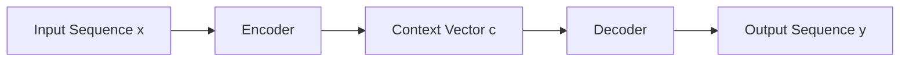

# 柳暗花明又一村：Seq2Seq编码器-解码器架构

作者：禅与计算机程序设计艺术 / Zen and the Art of Computer Programming

关键词：Seq2Seq、编码器-解码器、神经网络、机器翻译、自然语言处理

## 1. 背景介绍
### 1.1  问题的由来
自然语言处理(Natural Language Processing, NLP)是人工智能领域的一个重要分支,其目标是让计算机能够理解、生成和处理人类语言。而在NLP的众多任务中,序列到序列(Sequence-to-Sequence, Seq2Seq)的学习是一类非常重要且具有挑战性的任务,如机器翻译、对话系统、文本摘要等。传统的Seq2Seq模型通常基于循环神经网络(Recurrent Neural Network, RNN),但它们存在着难以并行化、梯度消失等问题。为了克服这些局限性,研究者们提出了基于编码器-解码器(Encoder-Decoder)架构的Seq2Seq模型。

### 1.2  研究现状
近年来,基于编码器-解码器架构的Seq2Seq模型取得了长足的进步。一个里程碑式的工作是Google在2014年提出的使用RNN Encoder-Decoder进行机器翻译的方法[1]。此后,各种改进的编码器-解码器模型如雨后春笋般涌现,如注意力机制(Attention Mechanism)[2]、Transformer[3]等,极大地推动了Seq2Seq任务的发展。目前,Seq2Seq模型已经在机器翻译、对话系统、文本摘要、语音识别、图像字幕等诸多领域取得了state-of-the-art的表现。

### 1.3  研究意义 
编码器-解码器架构是当前Seq2Seq任务的主流范式,对其进行深入研究具有重要的理论和实践意义。一方面,探索编码器-解码器架构的内在机理,有助于我们理解深度学习模型如何进行Seq2Seq学习,为构建更加强大的模型提供理论指导。另一方面,改进编码器-解码器架构,可以提升Seq2Seq任务的性能,推动NLP乃至整个人工智能领域的进步。此外,编码器-解码器架构也为其他领域提供了新的思路,如用于图像字幕、语音合成等。

### 1.4  本文结构
本文将全面介绍编码器-解码器架构及其在Seq2Seq任务中的应用。第2部分阐述编码器-解码器的核心概念与内在联系;第3部分详细讲解编码器-解码器的算法原理与具体操作步骤;第4部分给出编码器-解码器的数学模型与公式推导;第5部分通过代码实例演示如何实现一个基于编码器-解码器的机器翻译模型;第6部分讨论编码器-解码器在实际场景中的应用;第7部分推荐编码器-解码器的相关学习资源;第8部分对编码器-解码器的研究现状与未来趋势进行总结展望。

## 2. 核心概念与联系
编码器-解码器架构的核心思想是将输入序列映射为一个固定长度的向量表示,然后再将该向量解码为输出序列。其主要由编码器(Encoder)、解码器(Decoder)和二者之间的中间状态向量(Context Vector)组成。

- 编码器:编码器是一个神经网络模型,用于将变长的输入序列 $x=(x_1,x_2,...,x_T)$ 编码为一个固定长度的中间语义表示 $c$,记为 $c=Encoder(x)$。常见的编码器包括RNN、CNN、Transformer等。

- 解码器:解码器也是一个神经网络模型,用于将编码器产生的中间语义表示 $c$ 解码为目标输出序列 $y=(y_1,y_2,...,y_{T'})$,记为 $y=Decoder(c)$。解码器通常是一个自回归模型,即在预测 $y_t$ 时依赖于之前的输出 $y_1,...,y_{t-1}$。

- 中间状态向量:中间状态向量 $c$ 起到桥梁的作用,沟通了编码器和解码器。它携带了输入序列 $x$ 的语义信息,供解码器生成输出序列 $y$。

编码器和解码器通过联合训练的方式同时优化,使得编码器能够提取输入序列的语义特征,解码器能够根据语义特征生成正确的输出序列。二者相辅相成,共同完成了Seq2Seq任务从输入到输出的转换。

## 3. 核心算法原理 & 具体操作步骤
### 3.1  算法原理概述
编码器-解码器架构的训练过程可以用如下数学描述:

给定一个训练样本 $(x,y)$,其中 $x=(x_1,x_2,...,x_T)$ 为输入序列,$y=(y_1,y_2,...,y_{T'})$ 为目标输出序列。编码器-解码器模型的目标是最大化如下条件概率:

$$P(y|x)=\prod_{t=1}^{T'} P(y_t|y_1,...,y_{t-1},c)$$

其中 $c=Encoder(x)$ 为编码器对输入序列 $x$ 编码得到的中间语义表示。

为了最大化 $P(y|x)$,模型通过最小化如下交叉熵损失函数来训练:

$$Loss=-\sum_{t=1}^{T'} \log P(y_t|y_1,...,y_{t-1},c)$$

模型使用反向传播算法和梯度下降法来最小化损失函数,同时更新编码器和解码器的参数。

### 3.2  算法步骤详解
编码器-解码器架构的训练与推理可分为以下步骤:

1. 编码阶段:将输入序列 $x=(x_1,x_2,...,x_T)$ 送入编码器,编码器对每个时间步的输入进行编码,并将最后一个时间步的隐状态作为中间语义表示 $c$:

$$h_t=Encoder(x_t,h_{t-1})$$
$$c=h_T$$

其中 $h_t$ 为第 $t$ 个时间步的隐状态,$h_0$ 为初始隐状态。

2. 解码阶段:将编码器输出的中间语义表示 $c$ 送入解码器,解码器根据 $c$ 和之前的输出 $y_1,...,y_{t-1}$ 预测当前时间步的输出 $y_t$:

$$s_t=Decoder(y_{t-1},s_{t-1},c)$$
$$P(y_t|y_1,...,y_{t-1},c)=Softmax(W_o s_t)$$

其中 $s_t$ 为解码器第 $t$ 个时间步的隐状态,$s_0$ 为初始隐状态,$W_o$ 为输出层参数矩阵。解码器可以使用贪心搜索、束搜索等策略来生成输出序列。

3. 计算损失函数:根据解码器的输出概率分布和真实目标序列 $y$,计算交叉熵损失函数 $Loss$。

4. 参数更新:使用反向传播算法计算损失函数 $Loss$ 对编码器和解码器参数的梯度,然后使用梯度下降法更新参数。重复步骤1-4,直到模型收敛或达到预设的迭代次数。

5. 推理:对于一个新的输入序列 $x$,将其送入训练好的编码器-解码器模型,生成对应的输出序列 $y$。

### 3.3  算法优缺点
编码器-解码器架构具有以下优点:

- 能够处理不定长的输入和输出序列,适用于大多数Seq2Seq任务。
- 编码器可以采用RNN、CNN、Transformer等不同的结构,具有较强的特征提取能力。 
- 解码器可以灵活地集成注意力机制、Beam Search等技术,以提高输出质量。
- 端到端的训练方式,无需人工设计复杂的特征。

但编码器-解码器架构也存在一些局限性:

- 编码器将输入序列压缩为一个固定长度的向量,可能损失一些重要信息。针对此问题,研究者提出了注意力机制等改进方法。
- 解码阶段是串行的,难以并行化,生成速度较慢。Transformer等模型采用了Self-Attention机制,可以在一定程度上缓解这一问题。
- 数据集的质量和数量对模型性能影响较大,需要大规模的、高质量的数据集进行训练,这对一些任务来说难度较大。

### 3.4  算法应用领域
编码器-解码器架构被广泛应用于以下领域:

- 机器翻译:将源语言文本翻译成目标语言文本,如Google Translate等。
- 对话系统:根据上下文生成恰当的对话回复,如微软小冰、苹果Siri等。
- 文本摘要:将长文本压缩成简短的摘要,抓取文章的核心内容。
- 语音识别:将语音信号转换为文本,如DeepSpeech系统。
- 图像字幕:根据图像生成对应的文字描述,如看图说话任务。
- 代码生成:根据自然语言描述自动生成代码,如Codex模型。

除了上述经典应用,编码器-解码器架构在语音合成、视频描述、知识图谱等新兴领域也得到了探索和尝试。

## 4. 数学模型和公式 & 详细讲解 & 举例说明
### 4.1  数学模型构建
编码器-解码器架构可以用如下数学符号进行描述:

- 输入空间:$\mathcal{X}$,表示所有可能的输入序列的集合。
- 输出空间:$\mathcal{Y}$,表示所有可能的输出序列的集合。
- 编码器:$f_{enc}: \mathcal{X} \rightarrow \mathcal{H}$,将输入序列 $x$ 映射为中间语义表示 $c$。
- 解码器:$f_{dec}: \mathcal{H} \times \mathcal{Y} \rightarrow \mathcal{Y}$,根据中间语义表示 $c$ 和之前的输出 $y_1,...,y_{t-1}$ 生成下一个输出 $y_t$。

编码器-解码器模型的数学目标是学习一个条件概率分布 $P(y|x)$,即给定输入序列 $x$,生成输出序列 $y$ 的概率。模型通过最大化如下似然函数来训练:

$$\mathcal{L}=\sum_{(x,y)\in D} \log P(y|x)$$

其中 $D$ 为训练数据集。展开 $\log P(y|x)$ 可得:

$$\log P(y|x)=\sum_{t=1}^{T'} \log P(y_t|y_1,...,y_{t-1},c)$$

最小化似然函数 $\mathcal{L}$ 等价于最小化交叉熵损失函数:

$$Loss=-\frac{1}{|D|}\sum_{(x,y)\in D} \sum_{t=1}^{T'} \log P(y_t|y_1,...,y_{t-1},c)$$

其中 $|D|$ 为训练样本数。

### 4.2  公式推导过程
下面以RNN为例,推导编码器-解码器架构的前向计算公式。

假设编码器和解码器都使用基本的RNN单元,其中编码器的隐状态计算公式为:

$$h_t=\tanh(W_h h_{t-1} + W_x x_t)$$

解码器的隐状态计算公式为:

$$s_t=\tanh(W_s s_{t-1} + W_y y_{t-1} + W_c c)$$

输出概率分布的计算公式为:

$$P(y_t|y_1,...,y_{t-1},c)=Softmax(W_o s_t)$$

其中 $W_h,W_x,W_s,W_y,W_c,W_o$ 为模型参数矩阵,$\tanh$ 为双曲正切激活函数,$Softmax$ 为归一化指数函数:

$$Softmax(z_i)=\frac{e^{z_i}}{\sum_j e^{z_j}}$$

编码器最后一个时间步的隐状态 $h_T$ 即为中间语义表示 $c$:

$$c=h_T=\tanh(W_h h_{T-1} + W_x x_T