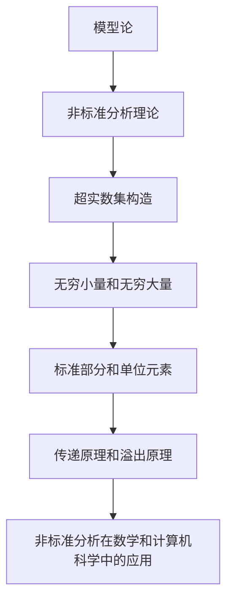

# 模型论基础：模型论应用举例——非标准分析简介

## 1. 背景介绍

### 1.1 问题的由来

在数学分析中,微积分是研究连续量变化规律的重要工具。然而,传统的微积分理论存在一些固有的缺陷和困难,例如对无穷小量和极限概念的处理存在逻辑上的困难。为了克服这些困难,20世纪60年代,数学家Abraham Robinson提出了非标准分析(Non-standard Analysis)理论。

非标准分析是建立在模型论(Model Theory)基础之上的一种新的数学分析方法。它通过扩充实数集,构造出包含无穷小量和无穷大量的非标准实数集,从而为分析中的无穷小量和极限概念提供了严格的数学定义和操作,使得分析过程更加直观和简洁。

### 1.2 研究现状

自诞生以来,非标准分析理论不断得到发展和完善,被广泛应用于多个数学领域,如微积分、常微分方程、偏微分方程、概率论等。它为解决传统分析理论中的一些棘手问题提供了新的思路和方法。

然而,由于非标准分析理论本身的抽象性和复杂性,它在教学和应用中一直存在一定的障碍。近年来,随着计算机技术的发展,非标准分析的可计算性得到了重视,人们开始探索将其应用于计算机科学领域。

### 1.3 研究意义

非标准分析理论为数学分析提供了一种新颖而富有洞见的视角,它不仅有助于深化对传统分析概念的理解,而且为解决一些棘手问题提供了新的思路。研究非标准分析理论具有重要的理论意义和应用价值。

从理论层面来看,非标准分析为数学基础研究提供了新的视角和工具,有助于探索数学概念的本质,发现新的数学结构和规律。同时,它也为计算机科学领域带来了新的机遇和挑战,如何将非标准分析的思想和方法应用于计算机程序设计和算法分析等领域,是一个值得深入探讨的课题。

从应用层面来看,非标准分析在解决一些传统分析理论难以处理的问题时表现出了独特的优势,如常微分方程的解析解、偏微分方程的数值解等。随着计算机技术的发展,非标准分析在科学计算、工程模拟等领域也展现出了广阔的应用前景。

### 1.4 本文结构

本文将从模型论的基础出发,介绍非标准分析的核心概念和基本原理,并通过具体的应用案例,阐释非标准分析在数学分析和计算机科学领域的应用。文章的主要结构如下:

1. 背景介绍
2. 核心概念与联系
3. 核心算法原理与具体操作步骤
4. 数学模型和公式详细讲解与举例说明
5. 项目实践:代码实例和详细解释说明
6. 实际应用场景
7. 工具和资源推荐
8. 总结:未来发展趋势与挑战
9. 附录:常见问题与解答

## 2. 核心概念与联系

非标准分析理论是建立在模型论基础之上的。模型论是研究形式语言的模型及其相关性质的一门数学分支。它为非标准分析理论提供了理论基础和技术支持。

非标准分析的核心概念是超实数集(Hyperreal Number System)的构造。通过将实数集扩充,构造出包含无穷小量和无穷大量的非标准实数集。这种扩充过程被称为超实数集构造。

在超实数集中,除了普通的实数外,还引入了两类新的数:无穷小量和无穷大量。无穷小量是比任何正实数都小的非零数,而无穷大量则是比任何实数都大的数。

为了操作和区分超实数集中的元素,引入了标准部分(Standard Part)和单位元素(Unit Element)的概念。标准部分是指超实数集中所有有限实数的集合,单位元素则是最小的正无穷小量。

非标准分析中还有两个重要的原理:传递原理(Transfer Principle)和溢出原理(Overflow Principle)。传递原理允许将实数集上的性质和定理转移到超实数集上,而溢出原理则提供了一种处理无穷小量和无穷大量的方法。

基于这些核心概念,非标准分析为数学分析提供了一种新的视角和工具,并在数学和计算机科学等多个领域展现出了广阔的应用前景。

## 3. 核心算法原理与具体操作步骤

### 3.1 算法原理概述

非标准分析的核心算法原理是通过构造超实数集,引入无穷小量和无穷大量,从而为分析中的无穷小量和极限概念提供严格的数学定义和操作。

算法的主要步骤如下:

1. 构造超实数集:通过某种扩充方式,将实数集扩充为包含无穷小量和无穷大量的超实数集。
2. 定义标准部分和单位元素:标准部分是指超实数集中所有有限实数的集合,单位元素是最小的正无穷小量。
3. 引入传递原理和溢出原理:传递原理允许将实数集上的性质和定理转移到超实数集上,溢出原理则提供了一种处理无穷小量和无穷大量的方法。
4. 重新定义分析概念:利用无穷小量和无穷大量,重新定义极限、连续性、导数、积分等分析概念。
5. 证明定理和推导公式:在超实数集上证明相关定理,推导分析公式。
6. 应用于具体问题:将非标准分析的思想和方法应用于解决具体的数学和计算机科学问题。

### 3.2 算法步骤详解

#### 3.2.1 构造超实数集

构造超实数集是非标准分析的基础。有多种构造方法,最著名的是Abraham Robinson提出的超限构造(Ultrapower Construction)。

超限构造的基本思想是:首先构造实数集$\mathbb{R}$上的一个非主超滤子$\mathcal{U}$,然后考虑由有界序列组成的等价类集合$\mathbb{R}^\mathbb{N}/\mathcal{U}$,并在其上定义代数运算和序关系,就可以得到一个包含$\mathbb{R}$为真子集的超实数集$^*\mathbb{R}$。

具体步骤如下:

1. 构造实数集$\mathbb{R}$上的一个非主超滤子$\mathcal{U}$。
2. 考虑由有界序列组成的等价类集合$\mathbb{R}^\mathbb{N}/\mathcal{U}$,其中两个序列$(x_n)$和$(y_n)$被视为等价,如果集合$\{n\in\mathbb{N}:x_n=y_n\}$属于$\mathcal{U}$。
3. 在$\mathbb{R}^\mathbb{N}/\mathcal{U}$上定义代数运算和序关系:
   - 加法:$[(x_n)]+[(y_n)]=[(x_n+y_n)]$
   - 乘法:$[(x_n)]\cdot[(y_n)]=[(x_n\cdot y_n)]$
   - 序关系:$[(x_n)]\leq[(y_n)]\Leftrightarrow\{n\in\mathbb{N}:x_n\leq y_n\}\in\mathcal{U}$
4. 构造的$\mathbb{R}^\mathbb{N}/\mathcal{U}$就是所需的超实数集$^*\mathbb{R}$,它包含实数集$\mathbb{R}$作为真子集。

在超实数集$^*\mathbb{R}$中,除了普通的实数外,还存在着无穷小量和无穷大量。无穷小量可以表示为$[(x_n)]$,其中$(x_n)$是一个趋于0的序列;无穷大量可以表示为$[(y_n)]$,其中$(y_n)$是一个无界增长的序列。

#### 3.2.2 定义标准部分和单位元素

在超实数集$^*\mathbb{R}$中,我们需要区分有限元素和无穷元素。标准部分和单位元素的概念就是为了实现这一目的。

标准部分$^*\mathbb{R}_{st}$是指$^*\mathbb{R}$中所有有限实数的集合,即:

$$^*\mathbb{R}_{st}=\{[(x_n)]\in^*\mathbb{R}:\exists r\in\mathbb{R},\forall n\in\mathbb{N},x_n=r\}$$

单位元素$\epsilon$是最小的正无穷小量,它可以表示为:

$$\epsilon=[(1/n)]$$

其中$(1/n)$是一个趋于0的序列。

标准部分和单位元素的引入,使我们能够在超实数集$^*\mathbb{R}$中区分有限元素和无穷元素,并对无穷小量和无穷大量进行操作和计算。

#### 3.2.3 传递原理和溢出原理

传递原理(Transfer Principle)和溢出原理(Overflow Principle)是非标准分析中的两个重要原理,它们为超实数集上的运算和推理提供了理论基础。

**传递原理**允许我们将实数集$\mathbb{R}$上的性质和定理转移到超实数集$^*\mathbb{R}$上。具体来说,如果$\varphi(x_1,x_2,\ldots,x_n)$是一个关于实数$x_1,x_2,\ldots,x_n$的句子,那么对于任意超实数$^*x_1,^*x_2,\ldots,^*x_n$,如果$\varphi(^*x_1,^*x_2,\ldots,^*x_n)$在$^*\mathbb{R}$中有意义,那么它在$^*\mathbb{R}$中的真假性与它在$\mathbb{R}$中对应的句子$\varphi(^*x_1^{st},^*x_2^{st},\ldots,^*x_n^{st})$的真假性相同。

**溢出原理**则提供了一种处理无穷小量和无穷大量的方法。对于任意无穷小量$\xi$和有限实数$r$,如果$|\xi|<r$,那么就存在一个正整数$n$,使得$|\xi|<1/n$。同样,对于任意无穷大量$\Omega$和有限实数$r$,如果$|\Omega|>r$,那么就存在一个正整数$n$,使得$|\Omega|>n$。

利用传递原理和溢出原理,我们可以在超实数集$^*\mathbb{R}$上进行各种运算和推理,从而重新定义和研究分析中的基本概念和性质。

#### 3.2.4 重新定义分析概念

有了无穷小量和无穷大量的概念,我们可以利用非标准分析的思想,重新定义极限、连续性、导数、积分等分析概念。

**极限**

在非标准分析中,一个序列$(x_n)$的极限可以定义为:

$$\lim_{n\to\infty}x_n=L\Leftrightarrow\forall\xi\in^*\mathbb{R},\xi>0,\exists N\in^*\mathbb{N},\forall n\in^*\mathbb{N},n>N\Rightarrow|x_n-L|<\xi$$

其中,$\xi$是一个正无穷小量,$^*\mathbb{N}$是整数集$\mathbb{N}$在$^*\mathbb{R}$中的等价类。

这个定义直观地捕捉了极限概念的本质:当$n$足够大时,序列项$x_n$和极限$L$之间的差值变得无穷小。

**连续性**

函数$f:A\subseteq\mathbb{R}\to\mathbb{R}$在点$x_0\in A$处连续的非标准定义为:

$$\forall\xi\in^*\mathbb{R},\xi>0,\exists\delta\in^*\mathbb{R},\delta>0,\forall x\in^*A,|x-x_0|<\delta\Rightarrow|f(x)-f(x_0)|<\xi$$

**导数**

函数$f:A\subseteq\mathbb{R}\to\mathbb{