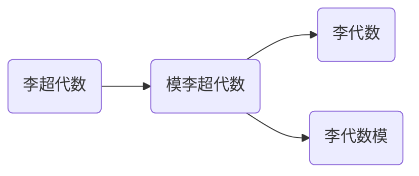

# 模李超代数：单性与导子超代数

关键词：模李超代数、单性、导子超代数、李超代数、李代数、李括号、分次李超代数、李代数扩张

## 1. 背景介绍
### 1.1  问题的由来
李代数是数学和物理学中一个重要的概念，它在描述对称性和分类问题上起着关键作用。然而，李代数理论有其局限性，无法完全刻画某些复杂系统的对称性结构。为了克服这一局限，数学家们引入了李超代数的概念，将李代数推广到了Z_2分次的情形。李超代数在物理学、几何学、表示论等领域都有广泛应用。

模李超代数是李超代数的一个重要推广，它在李超代数的基础上引入了一个额外的二元运算——模运算。模李超代数能够更好地描述某些代数结构和几何对象，如扭曲积、Courant代数、Lie 2-代数等。研究模李超代数的性质和分类问题，对于深入理解这些数学对象具有重要意义。

本文将重点研究模李超代数的单性和导子超代数。单性是指模李超代数的中心平凡，即没有非平凡的中心元。导子超代数则刻画了模李超代数的内在对称性。这两个性质在模李超代数的结构理论和分类问题中起着关键作用。

### 1.2  研究现状
目前，关于李超代数和模李超代数的研究已经取得了许多重要进展。Kac、Scheunert等人系统地研究了李超代数的结构理论和分类问题，给出了单李超代数的分类定理。Benayadi、Bordemann等人研究了模李超代数的基本性质，引入了单性和导子超代数的概念，并给出了一些结构定理。

然而，关于模李超代数单性和导子超代数的研究还不够深入。很多问题尚未得到完全解决，如任意模李超代数的导子超代数是否总是单的？单模李超代数的分类问题如何？模李超代数的中心扩张理论如何建立？这些问题的解决将有助于我们更好地理解模李超代数的结构，对推动相关领域的发展具有重要意义。

### 1.3  研究意义  
模李超代数作为李超代数的推广，在数学和物理学的许多分支中都有重要应用。深入研究模李超代数的结构理论和分类问题，对于发展李超代数理论、解决物理学和几何学中的问题都具有重要意义。

研究模李超代数的单性和导子超代数，有助于我们理解模李超代数的内在对称性和中心扩张问题。这将为进一步分类模李超代数、构造新的不变量提供重要工具。同时，单模李超代数在共形场论、顶点算子代数等物理学分支中有广泛应用，研究其分类问题对物理学的发展也有促进作用。

此外，模李超代数与微分几何中的Courant代数、高阶Lie理论中的Lie 2-代数等概念密切相关。研究模李超代数的性质，有助于加深我们对这些数学结构的认识，推动相关领域的进一步发展。

### 1.4  本文结构
本文将围绕模李超代数的单性和导子超代数展开讨论。第2节介绍模李超代数的基本概念和性质。第3节给出导子超代数的定义，并讨论其基本性质。第4节研究模李超代数的单性问题，给出一些判定单性的充要条件。第5节讨论导子超代数与模李超代数单性之间的关系。第6节通过具体的例子说明所得结果。第7节介绍一些与模李超代数相关的数学软件和计算工具。第8节总结全文，并对一些尚未解决的问题进行展望。

## 2. 核心概念与联系
本节介绍模李超代数的基本概念，回顾李超代数的定义，给出模李超代数的定义，并讨论它们之间的关系。

**定义2.1** 设 $L=L_0 \oplus L_1$ 是一个 $\mathbb{Z}_2$ 分次的线性空间，$[\cdot,\cdot]:L \times L \to L$ 是一个双线性映射，如果对任意的 $x,y,z \in L$，都有
$$
\begin{aligned}
&[x,y]=-(-1)^{|x||y|}[y,x], \\
&[x,[y,z]]=[[x,y],z]+(-1)^{|x||y|}[y,[x,z]],
\end{aligned}
$$
其中 $|x|$ 表示 $x$ 的次数，即当 $x \in L_0$ 时 $|x|=0$，当 $x \in L_1$ 时 $|x|=1$。则称 $(L,[\cdot,\cdot])$ 为一个李超代数。

**定义2.2** 设 $(L,[\cdot,\cdot])$ 是一个李超代数，$M=M_0 \oplus M_1$ 是一个 $\mathbb{Z}_2$ 分次的线性空间，如果存在双线性映射 $\triangleright: L \times M \to M$ 和 $\triangleleft: M \times L \to M$，使得对任意的 $x,y \in L, a,b \in M$，都有
$$
\begin{aligned}
&x \triangleright (a+b)=x \triangleright a + x \triangleright b, \quad (x+y) \triangleright a = x \triangleright a + y \triangleright a, \\
&(a+b) \triangleleft x = a \triangleleft x + b \triangleleft x, \quad a \triangleleft (x+y) = a \triangleleft x + a \triangleleft y,\\
&(x \triangleright a) \triangleleft y = x \triangleright (a \triangleleft y),\\
&[x,y] \triangleright a = x \triangleright (y \triangleright a) - (-1)^{|x||y|} y \triangleright (x \triangleright a),\\
&a \triangleleft [x,y] = (a \triangleleft x) \triangleleft y - (-1)^{|x||y|} (a \triangleleft y) \triangleleft x,
\end{aligned}
$$
其中 $|x|$ 表示 $x$ 的次数。则称 $(M,\triangleright,\triangleleft)$ 是李超代数 $L$ 上的一个模。

**定义2.3** 设 $(L,[\cdot,\cdot])$ 是一个李超代数，$(M,\triangleright,\triangleleft)$ 是 $L$ 上的一个模，定义 $L \oplus M$ 上的运算 $\llbracket \cdot,\cdot \rrbracket$ 如下：
$$
\llbracket x+a,y+b \rrbracket = [x,y] + (x \triangleright b - (-1)^{|a||y|} y \triangleright a) + (a \triangleleft y - (-1)^{|a||b|} b \triangleleft x),
$$
其中 $x,y \in L, a,b \in M$。则 $(L \oplus M, \llbracket \cdot,\cdot \rrbracket)$ 称为模李超代数，记为 $L \ltimes M$。

由定义可知，模李超代数是李超代数的一个推广，当模结构平凡时就退化为李超代数。模李超代数的运算 $\llbracket \cdot,\cdot \rrbracket$ 包含了李括号 $[\cdot,\cdot]$ 和模运算 $\triangleright,\triangleleft$，因此比李超代数的结构更加丰富。

## 3. 核心算法原理 & 具体操作步骤
### 3.1 算法原理概述
研究模李超代数的单性和导子超代数，主要用到以下几个算法和原理：

1. 模李超代数的中心和导子超代数的计算。通过解方程组求出满足条件的元素，得到模李超代数的中心和导子超代数。

2. 单性的判定。利用中心平凡的条件，判断一个模李超代数是否满足单性。

3. 导子超代数的性质分析。利用导子超代数的定义和性质，分析其结构和在模李超代数中的作用。

4. 模李超代数的构造。通过李超代数和其上的模构造出新的模李超代数，并分析其性质。

5. 模李超代数的同构判定。通过构造映射，判断两个模李超代数是否同构。

### 3.2 算法步骤详解
下面以计算模李超代数的中心为例，详细介绍算法步骤。

**输入：**模李超代数 $(L \ltimes M, \llbracket \cdot,\cdot \rrbracket)$。

**输出：**模李超代数的中心 $Z(L \ltimes M)$。

**步骤：**
1. 任取 $x+a \in L \ltimes M$，令 $\llbracket x+a,y+b \rrbracket=0$ 对所有 $y+b \in L \ltimes M$ 成立。

2. 展开得
   $$[x,y] + (x \triangleright b - (-1)^{|a||y|} y \triangleright a) + (a \triangleleft y - (-1)^{|a||b|} b \triangleleft x)=0.$$

3. 比较系数，得到以下方程组
   $$
   \begin{cases}
   [x,y]=0, & \forall y \in L,\\
   x \triangleright b=0, & \forall b \in M,\\
   a \triangleleft y=0, & \forall y \in L.
   \end{cases}
   $$

4. 解方程组，得到满足条件的 $x$ 和 $a$，记为 $Z_L$ 和 $Z_M$。

5. 令 $Z(L \ltimes M)=Z_L \oplus Z_M$，则 $Z(L \ltimes M)$ 就是模李超代数 $L \ltimes M$ 的中心。

类似地，可以通过解方程组得到模李超代数的导子超代数。在实际计算中，可以利用数学软件如Maple、Mathematica等进行符号运算，简化求解过程。

### 3.3 算法优缺点
上述算法的优点是原理简单，容易实现。通过解方程组，可以直接得到模李超代数的中心和导子超代数。缺点是计算量较大，对于维数高的模李超代数，求解方程组的符号运算比较复杂。

此外，该算法只能得到中心和导子超代数的一组基，要进一步分析它们的结构，还需要其他的理论工具，如同调理论、表示论等。

### 3.4 算法应用领域
计算模李超代数中心和导子超代数的算法，在以下领域有重要应用：

1. 李超代数的结构理论和分类问题。通过分析模李超代数的单性和导子超代数，可以得到李超代数的一些结构信息，为其分类提供重要工具。

2. 顶点算子代数和共形场论。许多顶点算子代数都可以看作某个李超代数上的模，其结构常常由导子超代数决定。因此研究模李超代数的导子超代数，有助于深入理解顶点算子代数的性质。

3. 微分几何和Poisson几何。Courant代数作为模李超代数的一个特例，在辛几何和Poisson几何中有重要应用。研究Courant代数的中心扩张和导子代数，对几何结构的分析至关重要。

4. 高阶Lie理论。高阶Lie代数如Lie 2-代数，常常对应于某个模李超代数。研究模李超代数的性质，可以帮助我们理解高阶Lie代数的结构。

## 4. 数学模型和公式 & 详细讲解 & 举例说明
### 4.1 数学模型构建
为了研究模李超代数的单性和导子超代数，我们需要引入一些数学模型。首先回顾一下模李超代数的定义。

设 $(L,[\cdot,\cdot])$ 是李超代数，$(M,\triangleright,\triangleleft)$ 是 $L$ 上的模，定义 $L \oplus M$ 上的运算 $\llbracket \cdot,\cdot \rrbracket$ 如下：
$$
\llbracket x+a,y+b \rrbracket = [x,y] + (x \triangleright b - (-1)^{|a||y|} y \triangleright a) + (a \triangleleft y - (-1)^{|a||b|} b \triangleleft x),
$$
其中 $x,y \in L, a,b \in M$。则 $(L \oplus M, \llbracket \cdot,\cdot \rrbracket)$ 称为模李超代数，记为 $L \ltimes M$。

模李超代数的中心定义为