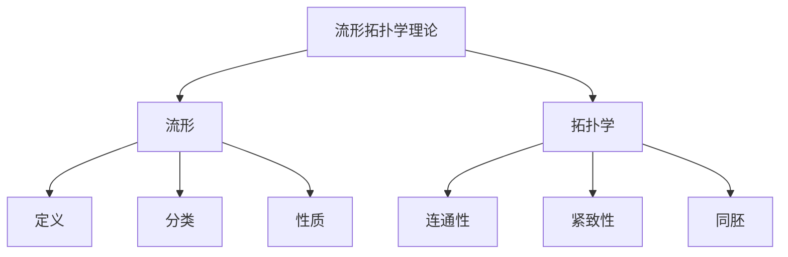

# 流形拓扑学理论与概念的实质：基本概念与框架

## 1. 背景介绍

### 1.1 问题的由来

在数学和物理学领域中,流形(manifold)是一个基本的概念。它是指在某些邻域内类似于欧几里得空间的拓扑空间。流形拓扑学的研究对于理解时空结构、相对论、量子力学等具有重要意义。然而,流形拓扑学理论涉及大量抽象概念和复杂数学,给初学者带来极大挑战。

### 1.2 研究现状

目前,流形拓扑学理论的教材和专著大多侧重于严格的数学推导,缺乏对基本概念的直观解释和实例说明。这使得初学者难以建立对流形拓扑学的直觉认识,从而影响了对高深理论的理解和应用。

### 1.3 研究意义  

本文旨在以浅显易懂的方式介绍流形拓扑学的基本概念和框架,帮助读者建立对该领域的初步认识。通过直观的解释、生动的实例和形象的比喻,读者可以更好地把握抽象概念的本质,为后续深入学习流形拓扑学奠定基础。

### 1.4 本文结构

本文首先介绍流形的基本概念,包括流形的定义、分类和基本性质。然后阐述拓扑学的核心内容,包括连通性、紧致性和同胚等概念。接下来探讨流形与拓扑学的关系,并介绍流形拓扑学的应用领域。最后总结全文,并展望该领域的未来发展趋势和挑战。

## 2. 核心概念与联系

流形(manifold)和拓扑学(topology)是流形拓扑学理论的两大核心概念。

**流形**是一种在局部领域内类似于欧几里得空间的拓扑空间。更精确地说,流形是一个拓扑空间,在该空间的每一点存在一个邻域,该邻域同胚于欧几里得空间的开子集。

**拓扑学**则研究几何对象在连续变形下保持不变的性质,例如连通性、紧致性和同胚等。它抽象出了几何对象的本质特征,摆脱了对具体形状和尺寸的依赖。



流形拓扑学将流形和拓扑学两个概念紧密结合,研究流形在拓扑变换下的不变性质。它为探索时空结构、相对论和量子力学等提供了坚实的数学基础。

## 3. 核心算法原理与具体操作步骤

### 3.1 算法原理概述

虽然流形拓扑学理论中没有典型的算法,但是同胚(homeomorphism)的概念对于理解流形的本质至关重要。同胚是指两个拓扑空间之间的一种等价关系,即存在一个双射,使得该映射及其反映射都是连续的。

判断两个流形是否同胚,需要构造出同胚映射。这通常是一个艰巨的过程,需要利用多种拓扑不变量,如欧拉示性数、同调群和基本群等。

### 3.2 算法步骤详解

判断两个流形$M$和$N$是否同胚的一般步骤如下:

1. **计算拓扑不变量**:计算流形$M$和$N$的若干个拓扑不变量,如欧拉示性数$\chi(M)$、$\chi(N)$,基本群$\pi_1(M)$、$\pi_1(N)$等。

$$\chi(M) = \sum_{i=0}^n (-1)^i \beta_i$$

其中$\beta_i$是第$i$个贝壳同调群的秩。

2. **比较拓扑不变量**:如果$M$和$N$的任一拓扑不变量不同,则它们必不同胚。

3. **构造同胚映射**:如果所有拓扑不变量相同,尝试显式构造出同胚映射$f: M \rightarrow N$。这通常需要一些创造性的思维和大量的代数、几何计算。

4. **验证同胚条件**:检验映射$f$及其逆映射$f^{-1}$是否都是连续的。如果是,则$f$为同胚映射,从而$M$与$N$同胚。

需要注意的是,即使所有已知的拓扑不变量都相同,也不能完全确定两个流形是同胚的。因为存在"外星人流形"(exotic spheres),它们的所有已知拓扑不变量都相同,但实际上并不同胚。

### 3.3 算法优缺点

**优点**:

- 利用拓扑不变量可以快速排除不同胚的情况,从而缩小搜索空间。
- 同胚映射给出了两个流形之间的等价关系,揭示了它们的本质联系。

**缺点**:  

- 构造同胚映射是一个极其困难的过程,需要大量的计算和创造性思维。
- 已知的拓扑不变量有限,无法完全确定两个流形是否同胚。

### 3.4 算法应用领域

同胚理论及其算法在以下领域有着广泛应用:

- **拓扑数据分析**:利用拓扑不变量对高维数据进行分类和簇分析。
- **计算机图形学**:通过同胚变换对3D模型进行简化和修改。
- **理论物理学**:研究时空结构、黑洞等在拓扑变换下的性质。
- **代数拓扑学**:分类不同的拓扑空间,揭示它们的本质联系。

## 4. 数学模型和公式详细讲解与举例说明

### 4.1 数学模型构建

流形拓扑学的数学模型主要包括以下几个部分:

1. **流形的定义**
2. **拓扑空间的公理系统**  
3. **同胚映射的定义**
4. **拓扑不变量的定义**

我们先来看流形的严格数学定义:

**定义4.1.1** (流形) 设$M$是一个拓扑空间,如果对于$M$中的每一点$p$,存在一个开邻域$U$和一个同胚映射$\varphi: U \rightarrow \mathbb{R}^n$,那么$M$就称为一个$n$维流形。

这个定义中的关键是"局部同胚于欧几里得空间"。我们可以将流形想象为一些局部平坦的曲面,这些曲面在局部领域内可以等同看作是欧几里得空间。

### 4.2 公式推导过程  

接下来我们推导一个重要的公式——欧拉示性数公式。

欧拉示性数$\chi(M)$是一个重要的拓扑不变量,它反映了流形的"洞的数目"。对于一个紧致的二维流形,欧拉示性数可以用下式计算:

$$\chi(M) = V - E + F$$

其中$V$、$E$、$F$分别表示流形的顶点数、边数和面数。

**推导过程**:

1) 将流形$M$三角剖分,得到一个由$V$个顶点、$E$条边和$F$个面组成的三角形网格。

2) 每个三角形有3条边和3个顶点,所以总边数$E = \frac{1}{2}\sum_{f \in F} \#边(f) = \frac{3}{2}F$。

3) 每个顶点至少被3个三角形共享,所以总顶点数$V = \frac{1}{3}\sum_{f \in F} \#顶点(f) = \frac{1}{2}F$。

4) 将上面两式代入$V - E + F$,即可得到$\chi(M) = V - E + F = 2 - 2g$,其中$g$为流形的真实"洞"数。

这个公式体现了欧拉示性数与流形"洞数"之间的拓扑关联。

### 4.3 案例分析与讲解

现在让我们通过一个具体的例子来加深对流形和同胚概念的理解。

**例4.3.1** 判断球面$S^2$和环面$T^2$是否同胚。

**解析**:

1) 计算拓扑不变量

- $S^2$的欧拉示性数$\chi(S^2) = 2$
- $T^2$的欧拉示性数$\chi(T^2) = 0$  

由于$\chi(S^2) \neq \chi(T^2)$,因此球面和环面必不同胚。

2) 计算基本群

- $\pi_1(S^2) = 0$ (平凡群)
- $\pi_1(T^2) = \mathbb{Z} \oplus \mathbb{Z}$ (无限循环群的直积)

基本群也不相同,进一步证实了球面和环面的不同胚性质。

3) 直观解释

球面$S^2$是一个紧致无洞的二维流形,而环面$T^2$则存在一个洞无法被连续缩压到一点。这使得它们在拓扑意义上是本质不同的。

通过这个例子,我们可以体会到拓扑不变量在判别流形同胚性方面的重要作用。同时,直观的几何形状也有助于理解抽象的拓扑概念。

### 4.4 常见问题解答

**Q:** 为什么要研究流形拓扑学?它有什么应用价值?

**A:** 流形拓扑学为研究时空结构、相对论、量子力学等提供了重要的数学工具。例如,广义相对论中的时空是一个4维流形,而量子场论也需要借助流形拓扑学来描述基本粒子的相互作用。此外,流形拓扑学在数据分析、计算机图形学等领域也有应用。

**Q:** 同胚映射和同构有什么区别?

**A:** 同胚映射研究的是拓扑空间之间的等价关系,着眼于连续性和维数等拓扑性质。而同构则研究代数结构(如群、环等)之间的等价关系,着眼于代数运算。两者虽然都是等价关系,但研究对象和关注点不同。

**Q:** 为什么要引入那么多抽象的概念,而不是直接研究具体的几何形状?

**A:** 抽象的概念可以揭示事物的本质特征,而不受具体形状的限制。例如,同胚概念揭示了在连续变形下保持不变的拓扑性质。这种抽象思维方式有利于发现更一般、更深层次的规律。

## 5. 项目实践:代码实例和详细解释说明

尽管流形拓扑学理论高度抽象,但我们可以通过计算机程序来可视化和模拟一些基本概念。下面是一个使用Python实现的示例项目。

### 5.1 开发环境搭建

本项目使用Python 3.8及以下第三方库:

- NumPy: 科学计算库
- Matplotlib: 数据可视化库  
- SciPy: 科学与工程计算库

你可以使用pip安装这些库:

```bash
pip install numpy matplotlib scipy
```

### 5.2 源代码详细实现

```python
import numpy as np
import matplotlib.pyplot as plt
from scipy.spatial import Delaunay

# 生成流形的点云数据
def generate_data(n_samples=1000):
    '''
    生成一个环面的点云数据
    '''
    # 均匀采样环面上的点
    t = np.linspace(0, 2*np.pi, n_samples)
    x = np.cos(t)
    y = np.sin(t)
    z = 0.2 * np.sin(5*t)
    
    points = np.column_stack((x, y, z))
    return points

# 可视化流形
def plot_manifold(points, triangles):
    fig = plt.figure(figsize=(8,6))
    ax = fig.add_subplot(111, projection='3d')
    
    # 绘制点云
    ax.scatter(points[:,0], points[:,1], points[:,2], c='b', s=2, alpha=0.5)
    
    # 绘制三角剖分
    for t in triangles:
        tri = [points[t[0]], points[t[1]], points[t[2]]]
        tri_coords = np.array([tri[0], tri[1], tri[2], tri[0]])
        ax.plot(tri_coords[:,0], tri_coords[:,1], tri_coords[:,2], c='r')
        
    ax.set_xlabel('X')
    ax.set_ylabel('Y