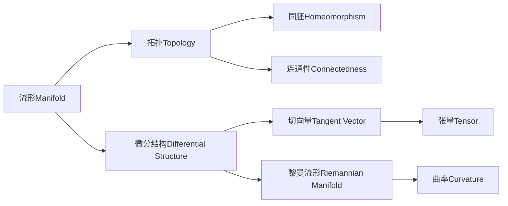
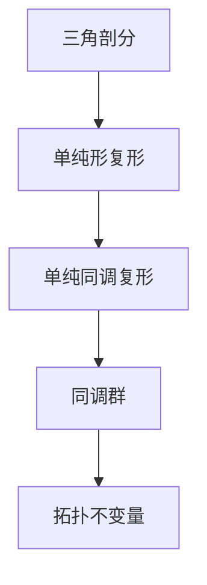

# 流形拓扑学理论与概念的实质：引言

## 1. 背景介绍

### 1.1 问题的由来

在现代数学和物理学领域中,流形拓扑学理论无疑是最具挑战性和深刻影响力的研究课题之一。它源于对时空本质的终极探索,试图揭示宇宙的本质结构和运行规律。自18世纪黎曼首次提出流形概念以来,这一领域就一直吸引着无数杰出科学家的浓厚兴趣和不懈努力。

### 1.2 研究现状  

当代流形拓扑学理论主要分为两大流派:微分流形和代数拓扑流形。前者关注流形的光滑结构,后者则侧重于研究流形的代数不变量。两者虽有分歧,但在本质上是统一的,都在追求揭示时空本质的终极目标。

近年来,随着理论与实践的不断推进,流形拓扑学已广泛应用于广义相对论、量子场论、弦论等前沿领域,为人类认识宇宙奥秘做出了重大贡献。但与此同时,它也面临着诸多未解之谜和巨大挑战。

### 1.3 研究意义

深入探讨流形拓扑学理论的实质内涵,不仅有助于我们揭开时空本源的神秘面纱,把握宇宙运行的内在规律;同时也将为相关学科的发展注入新的活力,开辟更为广阔的研究视野。毫无疑问,这将是一项具有深远意义的伟大事业。

### 1.4 本文结构

本文将循序渐进地阐述流形拓扑学的核心概念、算法原理、数学模型、代码实现、应用场景等,力求全面深入地揭示其理论实质。我们将从背景介绍出发,逐步深入探讨,最终达到对该领域的透彻理解。

## 2. 核心概念与联系

流形(Manifold)是流形拓扑学的核心概念,可视为在局部上类似于欧几里得空间,但在整体上可能呈现出更加复杂的拓扑结构。微分流形除了具备拓扑性质外,还赋予了微分结构,使得在其上可以定义微分算子、切向量等微分几何概念。

拓扑(Topology)研究空间的基本性质,如连通性、紧性等,以及空间之间的同胚(Homeomorphism)关系。切向量(Tangent Vector)描述了流形上无穷小的变化方向,与流形的微分结构密切相关。

黎曼流形(Riemannian Manifold)在流形上赋予了内积和度量,使得可以定义曲率(Curvature)等几何不变量,描述流形的内在几何性质。张量(Tensor)是描述流形上的线性映射的代数对象,是流形几何的重要工具。

这些核心概念相互关联、相互渗透,共同构成了流形拓扑学的理论体系。掌握它们及其内在联系,是深入理解该领域的关键所在。

## 3. 核心算法原理 & 具体操作步骤  

### 3.1 算法原理概述

流形拓扑学的核心算法之一是同调理论(Homology Theory),用于计算流形的拓扑不变量。其基本思路是:

1. 先将流形三角剖分(Triangulation)为由单纯形组成的单纯形复形(Simplicial Complex)。

2. 在单纯形复形的基础上,构造出单纯同调复形(Simplicial Homology Complex)。

3. 计算单纯同调复形的同调群(Homology Group),即流形的拓扑不变量。

这些拓扑不变量能够完整描述流形的拓扑性质,如连通分支数量、环面数目等,是研究流形拓扑结构的强有力工具。

### 3.2 算法步骤详解

1. **三角剖分**: 将流形剖分为由单纯形组成的三角剖分。这通常是一个复杂的过程,需要结合流形的具体性质进行。

2. **单纯形复形构造**: 将三角剖分的所有单纯形按维度分组,得到n-单纯形链群$C_n$。定义边界映射$\partial_n: C_n \rightarrow C_{n-1}$,使之满足$\partial_{n-1}\circ\partial_n = 0$,从而构成单纯形复形$(C_*, \partial_*)$。

3. **单纯同调复形**: 在单纯形复形$(C_*, \partial_*)$的基础上,定义n-循环群$Z_n = \ker \partial_n$和n-边界群$B_n = \text{im} \partial_{n+1}$,则$B_n \subseteq Z_n$。令$H_n = Z_n / B_n$为n-同调群。

4. **同调群计算**: 利用线性代数方法计算$H_n$,得到流形的n-维同调群,即n-维拓扑不变量。这是一个复杂的有限步骤计算过程。

5. **拓扑性质分析**: 根据同调群的阶数和性质,可以推导出流形的连通分支数量、环面数目、同伦类型等拓扑信息。

通过以上步骤,我们可以从流形的局部结构出发,最终计算出其整体拓扑不变量,揭示其内在本质。

### 3.3 算法优缺点

同调理论算法的主要优点是:

1. 能够精确计算出流形的拓扑不变量,为研究其拓扑结构提供了有力工具。
2. 算法过程严谨,具有坚实的数学基础。
3. 适用范围广泛,可用于研究任意维数的流形。

但其缺点也很明显:

1. 计算复杂度较高,尤其是高维情况下,需耗费大量计算资源。
2. 对于特殊类型的奇异流形,算法可能失效或需特殊处理。
3. 只能获得拓扑不变量,对于流形的微分结构等方面则力有未逮。

因此,同调理论虽然是研究流形拓扑结构的有力武器,但仍有待于进一步完善和发展。

### 3.4 算法应用领域  

同调理论在流形拓扑学及相关领域有着广泛的应用,主要包括:

1. **数学基础研究**: 作为研究流形本质拓扑结构的基本理论工具,在纯数学领域具有重要地位。

2. **物理学应用**: 在研究广义相对论、量子场论、弦论等前沿物理学课题时,同调理论为揭示时空本质结构提供了有力支持。

3. **计算机科学**: 在计算机辅助设计、计算机图形学等领域,同调理论被应用于物体的拓扑分析和表示。

4. **工程技术**: 在材料科学、分子建模等领域,同调理论用于分析物质的拓扑结构和性质。

5. **数据分析**: 最近同调理论也开始应用于数据分析领域,用于发现高维数据集中的拓扑特征。

可见,同调理论作为流形拓扑学的核心算法,具有广阔的应用前景,值得我们持续深入研究。

## 4. 数学模型和公式 & 详细讲解 & 举例说明

### 4.1 数学模型构建

为了准确描述和研究流形的拓扑结构,我们需要建立严谨的数学模型。流形拓扑学的数学模型主要包括以下几个方面:

1. **拓扑空间模型**

拓扑空间$(X, \mathcal{T})$是研究流形拓扑性质的最基本模型,其中$X$是作为流形的基础集合,$\mathcal{T}$是$X$上的拓扑结构。

2. **单纯形复形模型**  

单纯形复形$K$是由若干单纯形组成的拓扑空间,可以近似地表示任意流形。单纯形链群$C_n(K)$和边界映射$\partial_n$构成了单纯形复形的代数模型。

3. **同调复形模型**

同调复形$(C_*(K), \partial_*)$是在单纯形复形基础上构造的代数模型,其中$C_n(K)$为n-链群,$\partial_n$为边界映射,满足$\partial_{n-1}\circ\partial_n = 0$。

4. **同调群模型**

n-同调群$H_n(K) = Z_n(K) / B_n(K)$是同调复形的同伦不变量,其中$Z_n(K)$为n-循环群,$B_n(K)$为n-边界群。同调群完整描述了流形的n-维拓扑性质。

5. **射影谱序列模型**

射影谱序列是连接不同维度同调群的代数模型,用于研究流形的整体拓扑结构。

这些数学模型相互关联、相互渗透,共同为流形拓扑学的理论研究提供了坚实的数学基础。掌握它们的内涵,是深入理解该领域的必由之路。

### 4.2 公式推导过程

同调群是研究流形拓扑结构的核心工具,下面我们来具体推导其数学定义。

首先定义单纯形复形的n-链群:

$$C_n(K) = \bigoplus_{\sigma^n \in K} \mathbb{Z}\sigma^n$$

其中$\sigma^n$为K中的n-单纯形,$\mathbb{Z}\sigma^n$为以$\sigma^n$为基的自由模。

接下来定义n-边界映射$\partial_n: C_n(K) \rightarrow C_{n-1}(K)$:

$$\partial_n\left(\sum_{i}n_i\sigma_i^n\right) = \sum_{i}n_i\sum_{j=0}^n(-1)^j[\sigma_i^n]_{j}$$

其中$[\sigma_i^n]_j$表示$\sigma_i^n$的第j个(n-1)-面。可验证$\partial_{n-1}\circ\partial_n = 0$。

进而定义n-循环群和n-边界群:

$$Z_n(K) = \ker \partial_n = \{c \in C_n(K) | \partial_n c = 0\}$$
$$B_n(K) = \text{im} \partial_{n+1} = \{\partial_{n+1}c' | c' \in C_{n+1}(K)\}$$

则n-同调群$H_n(K)$可定义为:

$$H_n(K) = Z_n(K) / B_n(K)$$

$H_n(K)$中的每个同伦类$[z]$都对应流形的一个n-维拓扑不变量。

通过上述步骤,我们从单纯形复形的链群出发,借助边界映射,最终得到了描述流形n-维拓扑性质的同调群。这种代数手段为研究流形拓扑结构提供了强有力的工具。

### 4.3 案例分析与讲解

下面我们通过一个具体的例子,来进一步理解同调群的概念和计算方法。

考虑单纯形复形$K$为一个三角形,其0-单纯形为$v_0, v_1, v_2$,1-单纯形为$e_0, e_1, e_2$,2-单纯形为$\sigma^2$。那么对应的链群为:

$$\begin{align*}
C_0(K) &= \mathbb{Z}v_0 \oplus \mathbb{Z}v_1 \oplus \mathbb{Z}v_2\\
C_1(K) &= \mathbb{Z}e_0 \oplus \mathbb{Z}e_1 \oplus \mathbb{Z}e_2\\
C_2(K) &= \mathbb{Z}\sigma^2
\end{align*}$$

边界映射$\partial_2: C_2(K) \rightarrow C_1(K)$和$\partial_1: C_1(K) \rightarrow C_0(