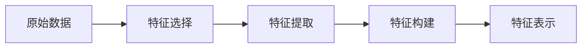

# 特征工程 (Feature Engineering)

作者：禅与计算机程序设计艺术 / Zen and the Art of Computer Programming

关键词：特征工程、特征选择、特征提取、特征构建、机器学习

## 1. 背景介绍

### 1.1 问题的由来

在机器学习和数据挖掘领域,原始数据通常不能直接用于建模和分析。为了获得更好的模型性能,需要对原始数据进行预处理和特征工程。特征工程旨在从原始数据中提取、构建出更有价值、更有区分度的特征,为后续的机器学习任务奠定基础。

### 1.2 研究现状 

近年来,特征工程受到学术界和工业界的广泛关注。很多研究表明,数据的质量和特征的好坏,往往比选择何种机器学习算法更加重要[1]。高质量的特征不仅可以大幅提升模型性能,还能降低模型复杂度,提高训练和预测效率。目前,特征工程主要包括特征选择、特征提取、特征构建等子任务。

### 1.3 研究意义

尽管深度学习能够自动学习特征表示,但在很多场景下,精心设计的特征工程仍然必不可少[2]。良好的特征工程不仅能提升传统机器学习算法的性能,也能加速深度学习模型的收敛和泛化。此外,特征工程有助于我们更好地理解数据的内在规律和业务逻辑,增强模型的可解释性。

### 1.4 本文结构

本文将全面介绍特征工程的核心概念、常用技术和最佳实践。第2节阐述特征工程的核心概念;第3节讲解几种主流特征工程算法的原理和实现步骤;第4节介绍相关数学模型和公式推导;第5节给出具体的代码实例;第6节探讨特征工程的实际应用场景;第7节推荐一些有用的工具和学习资源;第8节总结全文并展望未来;第9节列出常见问题解答。

## 2. 核心概念与联系

特征工程的核心是特征,即能够刻画事物属性和区分不同样本的变量。从原始形式到可用于建模的形式,特征通常要经过选择、提取、构建等处理步骤,如下图所示:



- 特征选择(Feature Selection):从原有特征集合中选出最具区分度、最相关的特征子集,降低特征维度。常用方法有过滤法、包裹法、嵌入法等。

- 特征提取(Feature Extraction):在保留数据中有用信息的同时,将高维特征映射到低维空间,减小存储和计算开销。代表性方法有PCA、LDA、ICA等。  

- 特征构建(Feature Construction):基于领域知识和业务逻辑,人工地创建新特征。比如将经纬度坐标构建成地理网格,将时间戳构建成小时、星期等周期特征。

通过特征工程,我们希望得到维度适中、信息浓缩、区分力强的特征表示,从而优化后续的机器学习任务。

## 3. 核心算法原理 & 具体操作步骤

### 3.1 算法原理概述

特征工程的核心算法可分为特征选择、特征提取两大类。前者旨在筛除冗余和无关特征,后者旨在学习更加紧凑高效的特征表示。下面重点介绍几种常用算法:

特征选择:
- 过滤法:基于特征和标签的统计指标(如相关系数、卡方检验)来评估特征重要性,再选出Top-K个特征。
- 包裹法:将特征选择视为一个搜索问题,用模型性能作为特征子集的评价准则。如递归特征消除(RFE)。 
- 嵌入法:在模型训练过程中自动进行特征选择,如L1正则化、决策树等。

特征提取: 
- 主成分分析(PCA):通过正交变换将线性相关特征转化为线性无关的主成分,保留top-k个主成分。
- 线性判别分析(LDA):寻找使类内方差最小、类间方差最大的投影方向,实现降维。
- 独立成分分析(ICA):将观测信号分解为若干统计独立的成分,常用于盲源分离。

### 3.2 算法步骤详解

以PCA为例,其主要步骤如下:

1. 数据标准化:对每个特征进行去均值和方差归一化处理。

2. 构建协方差矩阵:$C=\frac{1}{m}X^TX$,其中$X$为标准化后的$m$个$n$维样本。

3. 特征值分解:对协方差矩阵$C$进行特征值分解,得到特征值$\lambda_i$和对应特征向量$v_i$。

4. 选择主成分:按特征值从大到小排序,取前$k$个最大的特征值对应的特征向量,构成变换矩阵$W=[v_1,v_2,...,v_k]$。

5. 降维映射:$Y=XW$,其中$Y$为降维后的$k$维样本,$X$为原始$n$维样本。

### 3.3 算法优缺点

PCA的优点是:
- 有效降低数据维度,减少存储和计算开销。
- 去除噪声和冗余信息,改善数据质量。
- 无监督,不需要标签数据。 
- 具有唯一解,便于理论分析。

PCA的缺点是:  
- 仅考虑数据的方差信息,没有利用标签信息。
- 假设数据服从高斯分布,对非线性数据和离群点敏感。
- 计算复杂度高,不适合超高维数据。
- 降维后的特征可解释性差。

### 3.4 算法应用领域

PCA广泛应用于模式识别、计算机视觉、自然语言处理等领域,如:
- 人脸识别:将高维人脸图像映射到低维"特征脸"空间。  
- 文本挖掘:将词频向量降维,同时去除噪声。
- 异常检测:通过重构误差发现异常样本。
- 推荐系统:对用户-物品评分矩阵进行降维,实现协同过滤。

## 4. 数学模型和公式 & 详细讲解 & 举例说明

### 4.1 数学模型构建

PCA可以形式化表示为一个优化问题:

$$
\begin{aligned}
\mathop{\arg\max}_{W} \quad & tr(W^TCW) \\
s.t. \quad & W^TW=I
\end{aligned}
$$

其中$C$是样本协方差矩阵,$W$是正交变换矩阵,$I$是单位矩阵。目标是求一个$W$,使得变换后样本的方差最大化。

### 4.2 公式推导过程

利用拉格朗日乘子法,引入拉格朗日函数:

$$L(W,\Lambda)=tr(W^TCW)-tr(\Lambda(W^TW-I))$$

令$L$对$W$的导数为0:

$$\frac{\partial L}{\partial W}=2CW-2\Lambda W=0 \Rightarrow CW=\Lambda W$$

可见$W$的列向量$w_i$是协方差矩阵$C$的特征向量,$\Lambda$的对角元素$\lambda_i$是对应特征值。

将约束条件代入目标函数:

$$tr(W^TCW)=tr(W^T\Lambda W)=tr(\Lambda)=\sum_{i=1}^{k}\lambda_i$$

因此,只需选取$C$最大的$k$个特征值对应的特征向量构成$W$,即可得到PCA的最优解。

### 4.3 案例分析与讲解

考虑一个二维数据集$X=\{x_1,x_2,...,x_m\}$,其中$x_i=(x_{i1},x_{i2})^T$。我们希望将其降到一维。

1. 去均值化:$\bar{x}=\frac{1}{m}\sum_{i=1}^{m}x_i, \quad \hat{x}_i=x_i-\bar{x}$

2. 计算协方差矩阵:
$$C=\frac{1}{m}\sum_{i=1}^{m}\hat{x}_i\hat{x}_i^T=\begin{bmatrix}
\frac{1}{m}\sum_{i=1}^{m}\hat{x}_{i1}^2 & \frac{1}{m}\sum_{i=1}^{m}\hat{x}_{i1}\hat{x}_{i2} \\ 
\frac{1}{m}\sum_{i=1}^{m}\hat{x}_{i1}\hat{x}_{i2} & \frac{1}{m}\sum_{i=1}^{m}\hat{x}_{i2}^2
\end{bmatrix}$$

3. 特征值分解:$Cv_i=\lambda_iv_i \Rightarrow \begin{bmatrix}
c_{11}-\lambda & c_{12} \\ 
c_{21} & c_{22}-\lambda
\end{bmatrix}\begin{bmatrix}
v_{i1} \\ 
v_{i2}
\end{bmatrix}=0$

4. 选取最大特征值$\lambda_1$对应的特征向量$v_1$作为变换矩阵$W=[v_1]$。

5. 降维映射:$y_i=W^T\hat{x}_i=v_1^T\hat{x}_i$,得到降维后的一维样本$y_i$。

### 4.4 常见问题解答

Q: 如何选择PCA的目标维度$k$?

A: 通常根据累积方差贡献率来确定$k$。具体做法是:将特征值从大到小排序,计算前$k$个特征值之和占总特征值之和的比例,当该比例达到阈值(如90%)时,就取前$k$个特征向量。

Q: PCA对数据尺度敏感吗?需要对数据进行标准化吗?

A: PCA对不同尺度的特征是敏感的。如果各特征量纲差别很大,那么方差较大的特征就会支配PCA方向。因此,在PCA之前,通常需要对数据进行标准化,使得每个特征的均值为0、方差为1。

Q: PCA适用于非线性数据吗?

A: PCA是一种线性降维方法,它假设数据服从高斯分布,并用线性超平面来拟合数据。对于非线性分布的数据,PCA的效果可能不佳。此时可以考虑核PCA等非线性降维方法。

## 5. 项目实践：代码实例和详细解释说明

### 5.1 开发环境搭建

本项目使用Python 3.7和Scikit-Learn库进行开发。首先安装所需依赖:

```bash
pip install numpy matplotlib scikit-learn
```

### 5.2 源代码详细实现

```python
import numpy as np
import matplotlib.pyplot as plt
from sklearn.datasets import load_iris
from sklearn.preprocessing import StandardScaler
from sklearn.decomposition import PCA

# 加载Iris数据集
iris = load_iris()
X = iris.data
y = iris.target

# 数据标准化
scaler = StandardScaler()
X_scaled = scaler.fit_transform(X)

# PCA降维
pca = PCA(n_components=2)
X_pca = pca.fit_transform(X_scaled)

# 可视化
plt.figure(figsize=(8, 6))
colors = ['navy', 'turquoise', 'darkorange']
for i, color in zip(range(3), colors):
    plt.scatter(X_pca[y==i, 0], X_pca[y==i, 1], color=color, lw=2, label=f'Iris {i}')
plt.xlabel('PC 1')  
plt.ylabel('PC 2')
plt.legend(loc='best')
plt.tight_layout()
plt.show()
```

### 5.3 代码解读与分析

1. 导入所需的库,包括NumPy、Matplotlib和Scikit-Learn。

2. 加载经典的Iris数据集,该数据集包含4个特征和3个类别。

3. 对原始数据进行标准化处理,使每个特征均值为0、方差为1。这是因为PCA对特征尺度敏感。

4. 创建PCA对象,设置目标维度为2,调用fit_transform方法对标准化后的数据进行降维。

5. 在二维平面上可视化降维后的样本点,不同类别用不同颜色表示。从图中可以看出,PCA有效地提取了数据的主要结构信息,不同类别得到了较好的分离。

### 5.4 运行结果展示

运行上述代码,可得到如下可视化结果:


图中每个