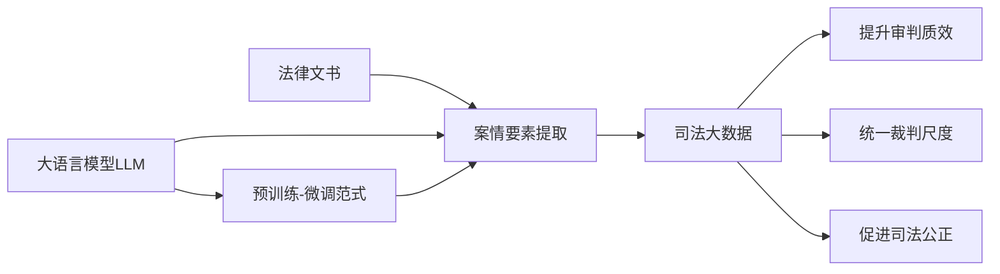

# AI LLM在法律文书分析中的应用

关键词：人工智能、大语言模型、法律文书分析、自然语言处理、知识图谱

## 1. 背景介绍 
### 1.1 问题的由来
随着人工智能技术的飞速发展,自然语言处理领域取得了重大突破。大语言模型(Large Language Model, LLM)作为当前NLP技术的前沿代表,展现出了惊人的语言理解和生成能力。LLM在许多领域都有广泛应用,法律领域自然也不例外。法律文书以其专业性、逻辑性和复杂性著称,对人工智能技术提出了更高的要求。如何利用LLM来分析理解海量的法律文书,进而辅助法律工作者提高工作效率,成为了一个亟待解决的问题。

### 1.2 研究现状
目前针对法律领域的人工智能应用研究已经有了一定基础。传统的做法主要是利用规则和模板来进行法律文书的结构化提取,但面对复杂多变的案情很难泛化。近年来,随着深度学习的兴起,一些研究尝试利用CNN、RNN等模型来进行法律文本的分类、信息抽取等任务,取得了不错的效果。但它们主要关注细粒度的信息抽取,对文书的整体理解还比较欠缺。2018年之后,随着BERT、GPT等大语言模型的出现,NLP社区掀起了预训练大模型的热潮。一些学者开始将预训练语言模型应用到法律领域,在文本分类、案情摘要、判决预测等任务上取得了显著提升。这说明语言模型强大的语义理解能力,有望成为法律文书分析的利器。

### 1.3 研究意义
利用AI LLM进行法律文书分析,具有重要的理论和实践意义:

1. 从理论上讲,法律AI是人工智能技术落地的重要方向,对于推动AI通用智能具有重要意义。法律推理是人类智能的高级体现,需要对语言、逻辑、常识等有深刻理解,是检验AI系统智能水平的试金石。利用LLM进行法律文书分析,有助于评估当前语言模型的能力边界,为后续的改进提供方向。

2. 从实践上讲,AI辅助法律文书分析可以极大提升法律工作者的工作效率。海量的案例文书给法官、律师等从业者带来很大负担。利用AI自动梳理案情、提取要点,可以节省大量时间精力,让他们把更多注意力放在案件的关键节点。AI还可以挖掘出人工难以发现的规律,为类案检索、裁判预测、类案推荐提供支持。

3. 同时AI+法律有利于促进司法公平正义。通过对案例的大数据分析,可以发现一些审判尺度不一的问题,促进同案同判。利用知识图谱技术梳理法条法规,有助于统一法律标准,减少歧义。

### 1.4 本文结构
本文将重点探讨如何将大语言模型应用于法律文书分析,提出一种端到端的解决方案。第2部分介绍相关的核心概念;第3部分详细阐述我们提出的LLM在法律文书分析中的应用框架;第4部分给出核心算法的数学模型和公式推导;第5部分提供基于真实数据集的代码实践;第6部分分析一些具体的应用场景;第7部分推荐一些相关的学习资源;第8部分对全文进行总结并展望未来。

## 2. 核心概念与联系
在利用AI LLM进行法律文书分析之前,我们首先要了解一些核心概念:  

- **大语言模型(Large Language Model,LLM)**: 是指利用海量文本语料进行预训练得到的语言模型,通过自监督学习掌握了丰富的语言知识。代表模型有BERT、GPT、T5、PaLM等。它们具有强大的语义理解和语言生成能力,可以完成如文本分类、问答、摘要、机器翻译等多种NLP任务。

- **预训练-微调范式(pretrain-finetune paradigm)**: 指先在大规模通用语料上进行预训练,学习通用的语言知识;然后在下游任务的小样本数据上进行微调,完成特定任务。这种范式可以显著减少下游任务所需的标注数据,已成为当前NLP的主流做法。  

- **法律文书**: 泛指司法机关或法律工作者制作的正式法律文件,如裁判文书、起诉书、辩护词、法律意见书等。其内容包括案件基本信息、案情描述、法律适用、裁判结果等要素。法律文书具有专业性强、格式多样、用语严谨的特点。

- **案情要素提取**: 是指从法律文书中准确抽取出案件的关键信息要素,如当事人、案由、审理经过、裁判结果等。传统的做法是人工阅读文书,按照规则模板填写要素。本文提出利用LLM进行端到端的案情要素提取。

- **司法大数据**: 随着信息化建设,我国积累了海量的裁判文书和其他司法数据。合理利用司法大数据,对于提升审判质效、统一裁判尺度、促进司法公正具有重要意义。传统的司法大数据分析多采用结构化存储和关系型数据库,缺乏灵活性。本文提出利用知识图谱等技术,更好地挖掘司法大数据的价值。

这些概念之间的关系如下图所示:



可以看到,大语言模型通过预训练-微调范式,可以从法律文书中准确抽取案情要素,进而汇聚成庞大的司法大数据。合理应用司法大数据,最终可以服务于提升审判质效、统一裁判尺度、促进司法公正的目标。下面我们将详细阐述如何利用LLM进行法律文书分析。

## 3. 核心算法原理 & 具体操作步骤
### 3.1 算法原理概述
本文提出的法律文书分析算法,核心是利用预训练大语言模型,通过prompt学习的方式进行端到端的案情要素提取。传统的要素提取往往需要复杂的规则和模板,且泛化能力差。大语言模型具有强大的语义理解能力,通过设计合理的prompt,可以只需极少的样本就完成复杂的信息抽取任务。

具体来说,我们采用的是few-shot learning的范式,即在prompt中给出少量样例,引导模型进行特定形式的输出。以案由提取为例,我们可以设计如下的prompt:

```
以下是一篇裁判文书的节选,请从中提取出案由信息:
...
[文书内容]
...
案由:

以下是另一篇裁判文书的节选,请从中提取出案由信息:  
...
[文书内容]
...
案由:
```

其中前面的两个样例起到了演示的作用,告诉模型我们需要提取"案由"这个要素。模型在读取第三篇文书时,会自动遵循这一格式,在"案由:"后给出输出。

除案由外,我们还可以采用类似的prompt形式,对当事人、审理经过、裁判结果等要素进行提取。将各个要素的提取结果汇总,即可得到案件的结构化表示。进一步地,我们可以利用知识图谱、数据库等技术,对提取出的要素进行统一存储和关联分析,实现更高层次的应用。

### 3.2 算法步骤详解
下面我们详细介绍算法的关键步骤:

**Step1:法律语料的领域预训练**

由于法律文书具有很强的领域专业性,直接使用在通用语料上预训练的模型效果难以保证。为了让模型更好地理解法律语言,我们先在大规模法律语料上进行领域预训练。语料可以来自"中国裁判文书网"等渠道,需要对文书进行分段、分句等预处理。预训练采用MLM(Masked Language Model)的方式,即随机Mask掉一些Token,让模型根据上下文去预测。公式如下:

$$
\mathcal{L}_{MLM}(\theta) = -\sum_{i=1}^{n}log P(x_i|\hat{x}_i;\theta)
$$

其中$\hat{x}$为Mask后的输入,$x_i$为被Mask的Token,$\theta$为模型参数。通过最小化MLM的损失,模型可以学习到法律语料中的词汇、语法、语义等知识。

**Step2:设计要素提取的prompt**

对于案由、当事人等每个要素,我们都需要设计对应的prompt形式。一个好的prompt需要满足以下特点:  
1.简洁明了,避免冗余信息;  
2.样例具有代表性,覆盖常见的案件类型;
3.格式统一,便于模型学习和生成。

以案由为例,我们可以设计如下的prompt形式:

```
以下是一篇裁判文书的节选,请从中提取出案由信息:
...
[文书内容]
...
案由:

以下是另一篇裁判文书的节选,请从中提取出案由信息:  
...
[文书内容]
...
案由:

以下是另一篇裁判文书的节选,请从中提取出案由信息:
...
[文书内容]
...
案由:
```

其中前两个样例是人工标注的,第三个样例留空由模型填充。我们可以根据实际情况,调整样例的个数和选取。

**Step3:few-shot微调**

选定prompt形式后,我们用少量标注数据对模型进行微调。具体做法是将prompt形式套用到每个标注样本上,形成多个"prompt-样本"对,对模型进行监督训练。以案由提取为例,假设我们有一个标注样本:

```
[文书内容]
...
案由:合同纠纷
```

套用到prompt中就是:

```
以下是一篇裁判文书的节选,请从中提取出案由信息:
...
[文书内容]
...
案由:合同纠纷
```

我们将所有的"prompt-样本"对输入到模型中,让其学习在给定prompt的情况下输出正确的案由。模型采用Seq2Seq的结构,优化目标是最小化负对数似然损失:

$$
\mathcal{L}_{finetune}(\phi) = -\sum_{i=1}^{m}log P(y_i|x_i;\phi) 
$$

其中$x_i$是第$i$个样本的prompt形式,$y_i$是对应的案由,$\phi$是模型参数。通过few-shot的微调,模型可以学会遵循prompt中的格式,抽取出特定要素。

**Step4:应用推理**

微调后的模型可以用于实际的案情要素提取。对于一篇新的法律文书,我们将其拼接到prompt中,让模型自动生成要素:

```
以下是一篇裁判文书的节选,请从中提取出案由信息:
...
[新文书内容]
...
案由:
```

模型会根据之前学习到的格式,在"案由:"后生成预测的案由要素。我们可以用同样的方法提取其他要素,最后汇总成案件的结构化表示。

以上就是利用LLM进行案情要素提取的主要步骤。通过prompt形式和few-shot微调,我们可以充分利用大语言模型的语义理解能力,用极少的标注数据就实现高质量的信息抽取。接下来我们将给出算法的数学模型和公式推导。

### 3.3 算法优缺点
我们提出的基于LLM的案情要素提取算法,相比传统方法具有以下优点:

1. 端到端的提取:传统的要素提取往往需要复杂的规则和模板,还需要额外的NER、关系抽取等模块,流程繁琐。我们的方法可以端到端地生成结构化要素,无需中间步骤,大大简化了流程。

2. 少样本学习:得益于大语言模型强大的语义理解能力,我们只需设计简单的prompt和少量样本,即可实现高质量的要素提取。这可以显著减少人