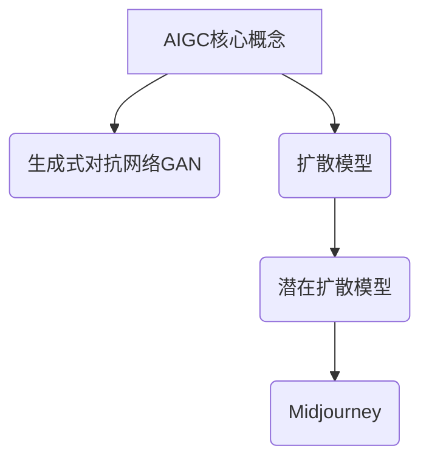
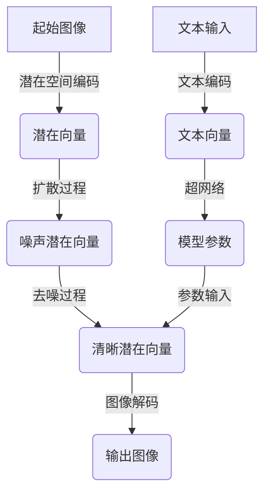

# AIGC从入门到实战：云想衣裳花想容：Midjourney 助你成为画中仙

## 1. 背景介绍

### 1.1 问题的由来

在过去的几年里,人工智能生成内容(AIGC)技术取得了长足的进步,尤其是在视觉创作领域。传统的图像生成方式需要专业的绘画技能和大量的时间投入,这对于普通用户来说是一个巨大的挑战。然而,AIGC技术的出现为普通用户打开了一扇通往视觉创作的大门。

Midjourney就是这一领域的佼佼者,它是一款基于人工智能的文本到图像生成工具,可以根据用户输入的文本描述生成逼真的图像。无需任何绘画技能,只需输入一些描述性文字,Midjourney就能将你的想象化作精美的画作。这种创新的方式极大地降低了视觉创作的门槛,让普通用户也能尽情发挥创意,成为"画中仙"。

### 1.2 研究现状

目前,AIGC技术主要分为两大类:生成式对抗网络(GAN)和扩散模型。GAN通过生成器和判别器的对抗训练来生成图像,而扩散模型则是通过学习图像的噪声分布,再逆向推导出清晰图像。

Midjourney采用了扩散模型的方法,并在此基础上进行了多项创新。它使用了一种名为"潜在扩散"(Latent Diffusion)的模型,能够生成更加细腻、富有细节的图像。此外,Midjourney还引入了一种名为"超网络"(Hypernetwork)的技术,可以根据输入的文本描述动态调整模型参数,从而生成更加贴合描述的图像。

### 1.3 研究意义

AIGC技术的兴起不仅为普通用户带来了全新的视觉创作体验,也为艺术家和设计师提供了强大的辅助工具。通过Midjourney这样的工具,他们可以快速实现构思,节省大量的时间和精力。同时,AIGC技术也为教育、娱乐、广告等多个领域带来了新的可能性。

然而,AIGC技术也面临着一些挑战,比如版权问题、伦理道德问题等。因此,我们需要深入探讨AIGC技术的原理和应用,以便更好地利用它的优势,同时规避潜在的风险。

### 1.4 本文结构

本文将全面介绍Midjourney的工作原理、使用方法和实践案例。我们将从AIGC技术的核心概念出发,深入探讨扩散模型和潜在扩散模型的原理,并详细解释Midjourney是如何实现文本到图像的生成。此外,我们还将介绍Midjourney的具体使用方法,包括提示词的撰写技巧、参数调整等。最后,我们将分享一些实践案例,展示Midjourney在不同领域的应用,并探讨AIGC技术的未来发展趋势和挑战。

## 2. 核心概念与联系

在深入探讨Midjourney的工作原理之前,我们需要先了解一些核心概念,如生成式对抗网络(GAN)、扩散模型、潜在扩散模型等。

### 2.1 生成式对抗网络(GAN)

生成式对抗网络(Generative Adversarial Networks, GAN)是一种用于生成式建模的深度学习架构。它由两个神经网络组成:生成器(Generator)和判别器(Discriminator)。

生成器的目标是从随机噪声中生成逼真的数据样本,例如图像或音频。判别器则负责区分生成器生成的样本和真实的训练数据。生成器和判别器相互对抗,生成器试图欺骗判别器,而判别器则努力区分真伪。通过这种对抗训练,生成器最终能够生成与真实数据无法区分的样本。

GAN在图像生成、语音合成等领域有着广泛的应用,但它也存在一些缺陷,如训练不稳定、模式崩溃等。

### 2.2 扩散模型

扩散模型(Diffusion Models)是一种基于马尔可夫链的生成模型,它通过学习数据的噪声分布,再逆向推导出清晰的数据样本。

扩散过程是一个将数据逐步添加噪声的过程,直到数据完全被噪声掩盖。而生成过程则是一个逆向的去噪过程,模型通过学习噪声分布,从纯噪声开始,逐步去除噪声,最终生成清晰的数据样本。

相比于GAN,扩散模型具有更好的稳定性和样本多样性,但它也存在一些缺点,如计算成本高、生成速度慢等。

### 2.3 潜在扩散模型

潜在扩散模型(Latent Diffusion Models)是扩散模型的一种变体,它在潜在空间而非像素空间进行扩散和去噪过程。

在潜在扩散模型中,首先将输入数据(如图像)编码为一个潜在向量,然后在这个潜在空间进行扩散和去噪过程。由于潜在空间的维度通常远小于像素空间,因此潜在扩散模型的计算成本更低,生成速度也更快。

潜在扩散模型还具有更好的样本质量和多样性,因为它可以更好地捕捉数据的语义信息。Midjourney就是基于潜在扩散模型实现的。

### 2.4 Midjourney中的超网络

除了潜在扩散模型之外,Midjourney还引入了一种名为"超网络"(Hypernetwork)的技术,用于根据输入的文本描述动态调整模型参数。

超网络是一种元学习模型,它可以根据输入的任务描述生成适当的神经网络权重,从而实现对不同任务的快速适应。在Midjourney中,超网络会根据输入的文本描述生成相应的模型参数,使得生成的图像更加贴合描述。

通过超网络技术,Midjourney可以生成多样化、高质量的图像,并且能够灵活地满足不同用户的需求。

## 3. 核心算法原理 & 具体操作步骤

### 3.1 算法原理概述

Midjourney的核心算法原理可以概括为以下几个步骤:

1. **文本编码**:首先,将用户输入的文本描述编码为一个向量表示。
2. **超网络参数生成**:使用超网络根据文本向量生成相应的模型参数。
3. **潜在空间编码**:将输入的起始图像(如纯噪声图像)编码为一个潜在向量。
4. **扩散过程**:在潜在空间进行扩散过程,逐步添加噪声到潜在向量。
5. **去噪过程**:使用生成的模型参数,在潜在空间进行去噪过程,逐步去除噪声。
6. **图像解码**:将去噪后的潜在向量解码为最终的图像输出。

### 3.2 算法步骤详解

#### 3.2.1 文本编码

Midjourney使用一种名为CLIP(Contrastive Language-Image Pre-training)的模型来编码文本描述。CLIP是一种双编码器模型,它包含一个文本编码器和一个图像编码器,分别用于编码文本和图像。

在Midjourney中,文本编码器会将输入的文本描述编码为一个向量表示,这个向量将被用于后续的超网络参数生成和图像生成过程。

#### 3.2.2 超网络参数生成

超网络是Midjourney中一个关键的创新技术。它是一种元学习模型,可以根据输入的任务描述(在这里是文本向量)生成适当的神经网络权重。

在Midjourney中,超网络会根据文本向量生成相应的模型参数,这些参数将被用于后续的去噪过程。通过动态调整模型参数,Midjourney可以生成更加贴合文本描述的图像。

#### 3.2.3 潜在空间编码

为了降低计算复杂度,Midjourney在潜在空间而非像素空间进行扩散和去噪过程。首先,它会将输入的起始图像(如纯噪声图像)编码为一个潜在向量。

潜在向量的维度通常远小于像素空间的维度,因此在潜在空间进行操作可以大大降低计算成本。

#### 3.2.4 扩散过程

扩散过程是将潜在向量逐步添加噪声的过程,直到它完全被噪声掩盖。这个过程可以用一个马尔可夫链来建模,每一步都会根据一个固定的方程添加一定量的噪声。

扩散过程的目标是学习噪声的分布,以便在后续的去噪过程中能够准确地去除噪声。

#### 3.2.5 去噪过程

去噪过程是扩散过程的逆过程,它从纯噪声开始,逐步去除噪声,最终生成清晰的潜在向量。

在这个过程中,Midjourney会使用之前生成的模型参数,根据当前的噪声潜在向量和文本向量,预测下一步去噪后的潜在向量。这个预测过程是通过一个称为U-Net的卷积神经网络来实现的。

#### 3.2.6 图像解码

最后,Midjourney会将去噪后的清晰潜在向量解码为最终的图像输出。这个解码过程与编码过程相反,它将潜在向量映射回像素空间,生成实际的图像数据。

### 3.3 算法优缺点

#### 3.3.1 优点

1. **高质量图像生成**:潜在扩散模型能够生成细腻、富有细节的高质量图像。
2. **多样性**:通过调整文本描述和模型参数,Midjourney可以生成多样化的图像。
3. **灵活性**:超网络技术使Midjourney能够根据不同的文本描述动态调整模型参数,从而生成更加贴合描述的图像。
4. **稳定性**:相比于GAN,扩散模型具有更好的训练稳定性。

#### 3.3.2 缺点

1. **计算成本高**:尽管潜在扩散模型比像素空间扩散模型计算成本低,但整体计算成本仍然较高。
2. **生成速度慢**:由于需要多次迭代的去噪过程,图像生成速度相对较慢。
3. **文本描述依赖**:生成的图像质量高度依赖于输入的文本描述,描述不当可能导致生成失败或低质量图像。
4. **版权和伦理问题**:AIGC技术可能会引发版权和伦理方面的争议。

### 3.4 算法应用领域

Midjourney及其核心算法可以应用于多个领域,包括但不限于:

1. **视觉艺术创作**:Midjourney为普通用户提供了一种全新的视觉创作方式,可以用于绘画、插画、概念艺术等。
2. **设计领域**:设计师可以使用Midjourney快速实现构思,生成各种设计素材,如产品设计草图、UI界面等。
3. **娱乐和游戏**:Midjourney可以生成各种虚拟场景、角色和道具,为游戏和动画制作提供支持。
4. **科研和教育**:Midjourney可以用于生成各种科学插图、可视化数据等,为科研和教学提供辅助。
5. **广告和营销**:Midjourney可以快速生成各种广告素材,如海报、Banner等。

## 4. 数学模型和公式 & 详细讲解 & 举例说明

### 4.1 数学模型构建

Midjourney的核心算法是基于扩散模型的,因此我们需要先了解扩