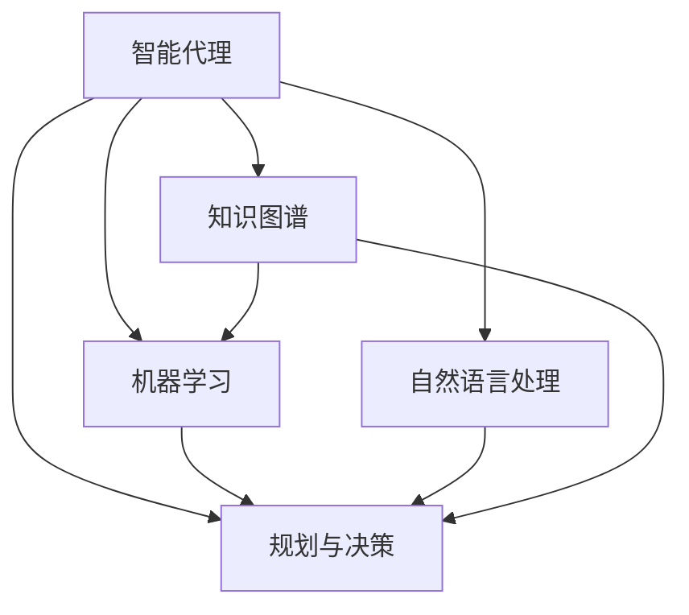

# AI人工智能 Agent：在公益事业中的应用

## 1. 背景介绍

### 1.1 问题的由来

在当今社会中,公益事业扮演着至关重要的角色,旨在解决各种社会问题,改善人们的生活质量。然而,由于资源有限、需求多样化以及协调管理的复杂性,公益组织往往面临着巨大的挑战。传统的人工方式难以高效地满足日益增长的需求,因此迫切需要创新的解决方案来优化公益事业的运作。

### 1.2 研究现状

近年来,人工智能(AI)技术在各个领域的应用日益广泛,展现出巨大的潜力。在公益事业中,AI技术也逐渐被引入,以期提高效率、降低成本并扩大影响力。一些公益组织已经开始探索利用AI代理(Agent)来协助管理资源、规划活动、分析数据等工作。然而,AI在公益领域的应用仍处于初级阶段,存在诸多挑战亟待解决。

### 1.3 研究意义

本文旨在深入探讨AI代理在公益事业中的应用,并提出一种创新的解决方案。通过整合最新的AI技术,包括机器学习、自然语言处理、规划与决策等,我们设计了一种智能代理系统,能够高效地管理公益资源、协调志愿者、规划活动并提供决策支持。该系统不仅能够提高公益事业的运营效率,还可以扩大公益项目的覆盖范围和影响力。

### 1.4 本文结构

本文首先介绍AI代理在公益事业中应用的背景和意义,然后详细阐述系统的核心概念、算法原理和数学模型。接下来,我们将通过实际项目案例,展示系统的具体实现和运行效果。最后,我们讨论该系统在实际应用中的场景,分享相关工具和资源,并总结未来的发展趋势和挑战。

## 2. 核心概念与联系

在设计AI代理系统之前,我们需要明确几个核心概念及其相互关系。

1. **智能代理(Intelligent Agent)**: 一种自主的软件实体,能够感知环境、处理信息、做出决策并采取行动,以实现预定目标。在公益场景中,智能代理需要管理资源、协调志愿者、规划活动等。

2. **机器学习(Machine Learning)**: 赋予系统从数据中自动学习和改进的能力。在公益领域,机器学习可用于预测需求、分析趋势、个性化服务等。

3. **自然语言处理(Natural Language Processing, NLP)**: 使计算机能够理解和生成人类语言。NLP在公益系统中可用于处理用户查询、生成报告等。

4. **规划与决策(Planning and Decision Making)**: 根据目标和约束,生成行动计划并做出最优决策。在公益场景中,需要规划活动、分配资源等。

5. **知识图谱(Knowledge Graph)**: 以图形化的方式表示实体及其关系的知识库。在公益领域,知识图谱可用于管理和查询相关信息。

这些概念相互关联、互为支撑,共同构建了一个智能化的公益管理和决策支持系统。下面是这些概念之间的关系示意图:

## 3. 核心算法原理 & 具体操作步骤

### 3.1 算法原理概述

本系统的核心算法基于强化学习(Reinforcement Learning)和多智能体系统(Multi-Agent System)。

**强化学习**允许智能代理通过与环境的交互,学习如何在给定情况下采取最佳行动,以最大化预期回报。这种方法特别适用于公益场景,因为代理需要根据不断变化的环境做出决策。

**多智能体系统**包含多个相互协作的智能代理。在公益领域,不同的代理可以负责不同的任务,如资源管理、活动规划、志愿者协调等,并通过协作实现整体目标。

此外,我们还融合了其他技术,如自然语言处理(用于人机交互)、知识图谱(管理结构化信息)、规划算法(生成行动计划)等。

### 3.2 算法步骤详解

1. **环境建模**: 首先,我们需要对公益场景进行形式化建模,将其表示为马尔可夫决策过程(Markov Decision Process, MDP)。该模型包括:
   - 状态(State):描述当前的环境状态,如可用资源、活动进度等。
   - 行动(Action):代理可执行的操作,如分配资源、安排活动等。
   - 奖励(Reward):对代理行为的反馈,如活动效果、资源利用率等。
   - 转移概率(Transition Probability):执行某个行动后,环境转移到新状态的概率。

2. **代理初始化**: 初始化多个智能代理,每个代理负责特定的任务,如资源管理代理、活动规划代理等。每个代理都有自己的策略网络(Policy Network),用于选择行动。

3. **交互循环**:
   - 代理观测当前环境状态
   - 根据策略网络,代理选择行动
   - 代理执行选择的行动,环境转移到新状态
   - 代理获得奖励反馈,并更新策略网络
   - 代理之间协调并共享经验

4. **策略更新**: 使用策略梯度(Policy Gradient)方法,根据获得的奖励,更新代理的策略网络参数,使其可以学习到更好的策略。

5. **协作与信息共享**: 不同代理通过信息共享和协调机制进行协作,以实现整体目标。例如,资源管理代理可以将资源分配信息共享给活动规划代理。

通过上述步骤,智能代理可以逐步学习并优化其策略,从而更好地管理公益资源、规划活动并做出明智决策。

### 3.3 算法优缺点

**优点**:

- 能够通过与环境交互自主学习,无需人工设计复杂的规则
- 多智能体系统支持任务分工和协作,提高效率和鲁棒性
- 融合多种技术(NLP、知识图谱等),提供全面的解决方案
- 可根据环境变化动态调整策略,具有良好的适应性

**缺点**:

- 需要大量的训练数据和计算资源
- 决策过程的可解释性较差,存在"黑箱"问题
- 多智能体协作机制的设计复杂,需要权衡效率和一致性
- 存在潜在的安全和伦理风险,需要谨慎设计和监控

### 3.4 算法应用领域

除了公益事业外,该算法还可应用于其他需要智能决策和资源管理的领域,如:

- 智能城市管理:管理城市资源(能源、交通等),规划城市活动
- 应急救援:协调救援资源,制定救援计划
- 供应链优化:管理物流资源,优化运输路线
- 智能制造:管理生产资源,优化制造流程

总的来说,该算法为解决复杂的资源管理和决策问题提供了一种通用的智能化方法。

## 4. 数学模型和公式 & 详细讲解 & 举例说明

### 4.1 数学模型构建

我们将公益场景建模为一个马尔可夫决策过程(Markov Decision Process, MDP),用元组 $\langle \mathcal{S}, \mathcal{A}, \mathcal{P}, \mathcal{R} \rangle$ 表示:

- $\mathcal{S}$ 是状态空间集合
- $\mathcal{A}$ 是行动空间集合
- $\mathcal{P}$ 是状态转移概率函数,定义为 $\mathcal{P}(s, a, s'): \mathcal{S} \times \mathcal{A} \times \mathcal{S} \rightarrow [0, 1]$,表示在状态 $s$ 执行行动 $a$ 后,转移到状态 $s'$ 的概率
- $\mathcal{R}$ 是奖励函数,定义为 $\mathcal{R}(s, a, s'): \mathcal{S} \times \mathcal{A} \times \mathcal{S} \rightarrow \mathbb{R}$,表示在状态 $s$ 执行行动 $a$ 后,转移到状态 $s'$ 获得的奖励

代理的目标是学习一个策略 $\pi: \mathcal{S} \rightarrow \mathcal{A}$,使得在遵循该策略时,可获得最大化的预期回报:

$$J(\pi) = \mathbb{E}_{\pi}\left[ \sum_{t=0}^{\infty} \gamma^t r_t \right]$$

其中 $\gamma \in [0, 1]$ 是折扣因子,用于权衡即时回报和长期回报。

### 4.2 公式推导过程

在强化学习中,我们使用策略梯度(Policy Gradient)方法来优化策略 $\pi_\theta$,其中 $\theta$ 表示策略网络的参数。

根据策略梯度定理,我们有:

$$\nabla_\theta J(\pi_\theta) = \mathbb{E}_{\pi_\theta}\left[ \sum_{t=0}^{\infty} \nabla_\theta \log \pi_\theta(a_t|s_t) Q^{\pi_\theta}(s_t, a_t) \right]$$

其中 $Q^{\pi_\theta}(s_t, a_t)$ 是在状态 $s_t$ 执行行动 $a_t$ 后,按照策略 $\pi_\theta$ 可获得的预期回报。

为了估计 $Q^{\pi_\theta}(s_t, a_t)$,我们可以使用基于时序差分(Temporal Difference, TD)的方法,如 Q-Learning 或者 Actor-Critic 算法。

在 Actor-Critic 算法中,我们维护一个值函数 $V_\phi(s)$ 来估计状态 $s$ 的值,其中 $\phi$ 是值函数网络的参数。同时,我们也维护一个策略函数 $\pi_\theta(a|s)$,即策略网络。

值函数 $V_\phi(s)$ 和策略函数 $\pi_\theta(a|s)$ 通过时序差分误差(Temporal Difference Error, TD Error)进行更新:

$$\delta_t = r_t + \gamma V_\phi(s_{t+1}) - V_\phi(s_t)$$

$$\phi \leftarrow \phi + \alpha_\phi \delta_t \nabla_\phi V_\phi(s_t)$$

$$\theta \leftarrow \theta + \alpha_\theta \delta_t \nabla_\theta \log \pi_\theta(a_t|s_t)$$

其中 $\alpha_\phi$ 和 $\alpha_\theta$ 分别是值函数和策略函数的学习率。

通过不断地与环境交互、获取奖励反馈并更新网络参数,智能代理可以逐步学习到最优策略。

### 4.3 案例分析与讲解

为了更好地理解上述数学模型和公式,我们将以一个具体的公益场景为例进行分析。

假设我们需要规划一个为期一周的募捐活动,目标是最大化所筹集的捐款金额。我们将该场景建模为一个 MDP:

- 状态 $s$:包括当前日期、可用志愿者人数、剩余活动预算等
- 行动 $a$:安排志愿者、分配活动预算等
- 奖励 $r$:根据当日筹款金额计算得到
- 转移概率 $\mathcal{P}(s, a, s')$:执行行动 $a$ 后,环境转移到新状态 $s'$ 的概率

我们初始化一个资源管理代理和一个活动规划代理,分别负责志愿者和预算的分配。

在每一个时间步,代理观测当前状态 $s_t$,并根据各自的策略网络 $\pi_\theta(a|s)$ 选择行动 $a_t$。例如,资源管理代理可能会决定在当天安排 10 名志愿者,而活动规划代理则决定将 20% 的预算用于宣传。

代理执行选择的行动,环境转移到新状态 $s_{t+1}$,并获得相应的奖励 $r_t$(即当天的筹款金额)。代理根据 TD 误差更新策略网络和值函数网络的参数。

通过不断的交互和学习,代理