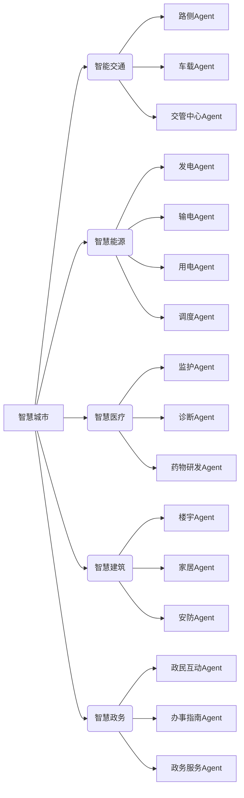

# AI人工智能 Agent：在智慧城市中的应用

作者：禅与计算机程序设计艺术 / Zen and the Art of Computer Programming 

关键词：人工智能、智能Agent、智慧城市、多Agent系统、强化学习

## 1. 背景介绍
### 1.1 问题的由来
随着城市化进程的不断加快，城市面临的问题也日益复杂化，如交通拥堵、环境污染、能源紧缺等。传统的城市管理模式已经无法有效应对这些挑战。近年来，智慧城市的概念应运而生，旨在利用先进的信息和通信技术，提高城市管理和服务的智能化水平，改善市民的生活质量。而人工智能技术，尤其是智能Agent技术，为实现智慧城市提供了新的途径和可能。

### 1.2 研究现状
目前，国内外学者已经开展了大量关于将人工智能Agent应用于智慧城市的研究。比如，麻省理工学院的研究者提出了一种基于多Agent系统的智能交通管理方法，通过对车辆和道路的实时感知和协同控制，有效缓解了城市交通拥堵问题。而斯坦福大学的学者则探索了将强化学习算法用于城市能源管理的方案，使得能源系统能够根据需求和环境的变化自主优化调度策略。国内清华大学、上海交通大学等高校也在智慧城市领域开展了卓有成效的研究。

### 1.3 研究意义
将人工智能Agent技术应用于智慧城市建设，具有重要的理论和实践意义。一方面，它为解决城市发展面临的各种复杂问题提供了新的思路和方法，有望显著提升城市管理和服务的智能化、精细化水平。另一方面，智慧城市也为人工智能技术的发展提供了广阔的应用场景和实践平台，推动人工智能从实验室走向现实世界，造福人类社会。

### 1.4 本文结构
本文将重点探讨人工智能Agent技术在智慧城市中的应用。第2部分介绍相关的核心概念；第3部分讨论智能Agent的核心算法原理；第4部分建立Agent在智慧城市中的数学模型；第5部分通过代码实例演示具体的实现过程；第6部分分析Agent在智慧城市各领域的应用场景；第7部分推荐相关的学习资源；第8部分总结全文并展望未来。

## 2. 核心概念与联系
智慧城市是一个多学科交叉的复杂系统，涉及人工智能、大数据、云计算、物联网等诸多前沿技术。其中，人工智能Agent技术是实现城市智能化管理和运行的关键。

智能Agent是一种能够感知环境并做出自主决策和行动的计算机程序。它具有自主性、社会性、反应性、主动性等特点。在智慧城市中，大量的智能Agent通过分布式部署，协同工作，可以有效处理海量异构数据，优化城市系统的实时运行。

例如，在智能交通领域，路侧摄像头、车载传感器等物联网设备实时采集道路和车辆数据，并将这些数据传输给后台的智能Agent。Agent利用机器学习算法对数据进行分析，评估当前交通状况，预测未来一段时间的交通走势，并据此调整信号灯时长、诱导车辆行驶路线等，从而缓解拥堵、提高通行效率。

多个智能Agent还可以组成多Agent系统，通过分工协作完成更加复杂的任务。比如在智慧电网中，不同区域、不同类型的用电设备都由专门的Agent负责监控和管理。这些Agent既可以根据本地情况自主做出控制决策，又能够与其他Agent保持通信，协调制定全局优化策略，从而保障电网安全稳定和效率最大化。

下图展示了智能Agent在智慧城市不同领域的应用以及它们之间的关联。

可以看到，在智慧城市的方方面面，智能Agent作为"最小执行单元"发挥着关键作用，使得城市系统能够灵活应对多变的外部环境，高效协同完成各项任务。

## 3. 核心算法原理 & 具体操作步骤
### 3.1  算法原理概述
智能Agent的核心是其内部的决策算法，使其能够根据自身知识和感知数据，自主地做出行动决策。目前应用最广泛的是基于强化学习的算法。

强化学习是一种无需人工标注数据的机器学习范式。在强化学习中，Agent通过与环境的交互，根据环境反馈的奖励或惩罚，不断优化自身的决策策略，最终学习到一个能够获得最大累积奖励的最优策略。

常见的强化学习算法包括Q学习、策略梯度、Actor-Critic等。以Q学习为例，其核心思想是：利用值函数 $Q(s,a)$ 来评估在某一状态s下采取行动a的长期收益，并据此选择最优行动。Q函数可以通过Bellman方程迭代更新：

$$Q(s,a) \leftarrow Q(s,a) + \alpha [r + \gamma \max_{a'} Q(s',a') - Q(s,a)]$$

其中，$\alpha$ 是学习率，$\gamma$ 是折扣因子，$r$ 是采取行动 $a$ 后环境返回的即时奖励，$s'$ 是执行 $a$ 后转移到的下一状态。

### 3.2 算法步骤详解
Q学习算法的具体步骤如下：

1. 初始化Q表 $Q(s,a)$，对于所有的状态-行动对，初始值可以随机设置或置零。
2. 重复以下步骤，直到Q表收敛或达到预设的训练轮数：
   1) Agent根据当前状态 $s$，采用 $\epsilon$-贪婪策略选择一个行动 $a$。即以 $\epsilon$ 的概率随机探索，否则选择Q值最大的行动。
   2) 执行行动 $a$，观察环境反馈的奖励 $r$ 和新状态 $s'$。 
   3) 根据Bellman方程更新 $Q(s,a)$。
   4) 将当前状态更新为 $s'$。
3. 训练结束后，Agent的决策策略为：对于任意状态s，选择Q表中Q值最大的行动。

### 3.3 算法优缺点
Q学习的优点是：
- 模型无关，不需要预先知道环境的转移概率和奖励函数，适用范围广。
- 通过不断探索和利用，能够收敛到最优策略。
- 计算效率高，存储空间小，适合大规模应用。

缺点包括：
- 难以处理连续状态和行动空间。
- 容易陷入局部最优。
- 收敛速度慢，需要大量的训练数据和时间。

### 3.4 算法应用领域
Q学习及其变种被广泛应用于智能Agent的多个领域，例如：
- 自动驾驶：Agent通过深度强化学习，掌握车辆的转向和速度控制策略。
- 智能调度：Agent学习如何调配车辆、能源等资源，优化系统效率。  
- 智能助理：Agent通过与用户交互的奖励反馈，学习对话策略，提供个性化服务。
- 智能金融：Agent用强化学习算法优化金融投资组合，控制风险，创造收益。

## 4. 数学模型和公式 & 详细讲解 & 举例说明
### 4.1 数学模型构建
以智能交通中的信号灯控制为例，我们可以建立如下的马尔可夫决策过程(MDP)模型：
- 状态空间 $\mathcal{S}$：每个交叉路口的车流量、排队长度、平均速度等交通状态。
- 行动空间 $\mathcal{A}$：每个信号灯的红绿灯时长配置。
- 状态转移概率 $\mathcal{P}(s'|s,a)$：在状态 $s$ 下采取行动 $a$ 后，转移到状态 $s'$ 的概率。这反映了交通流的动态变化规律。
- 奖励函数 $\mathcal{R}(s,a)$：Agent在状态 $s$ 下采取行动 $a$ 后，环境给出的奖励值。奖励可以是车辆通行效率提升、平均等待时间减少等。
- 折扣因子 $\gamma \in [0,1]$：未来奖励的衰减率。$\gamma$ 越大，Agent越重视长期收益。

Agent的目标是找到一个最优策略 $\pi^*(s)$，使得在任意状态 $s$ 下，采取该策略行动能够获得最大的期望累积奖励：

$$\pi^*(s) = \arg\max_{\pi} \mathbb{E}\left[\sum_{t=0}^{\infty} \gamma^t \mathcal{R}(s_t,\pi(s_t))\right]$$

其中，$s_t$ 表示第 $t$ 步的状态，$\pi(s_t)$ 是在状态 $s_t$ 下采取的行动。

### 4.2 公式推导过程
为了求解最优策略，我们引入状态值函数 $V^{\pi}(s)$ 和行动值函数 $Q^{\pi}(s,a)$：

$$V^{\pi}(s) = \mathbb{E}\left[\sum_{t=0}^{\infty} \gamma^t \mathcal{R}(s_t,\pi(s_t))|s_0=s\right]$$

$$Q^{\pi}(s,a) = \mathbb{E}\left[\sum_{t=0}^{\infty} \gamma^t \mathcal{R}(s_t,\pi(s_t))|s_0=s,a_0=a\right]$$

它们分别表示从状态 $s$ 开始，或从状态 $s$ 开始并采取行动 $a$，之后一直执行策略 $\pi$ 能够获得的期望累积奖励。

根据Bellman期望方程，我们可以得到最优值函数 $V^*(s)$ 和 $Q^*(s,a)$ 满足的迭代式：

$$V^*(s) = \max_a \mathcal{R}(s,a) + \gamma \sum_{s' \in \mathcal{S}} \mathcal{P}(s'|s,a)V^*(s')$$

$$Q^*(s,a) = \mathcal{R}(s,a) + \gamma \sum_{s' \in \mathcal{S}} \mathcal{P}(s'|s,a) \max_{a'} Q^*(s',a')$$

这启发了值迭代和策略迭代等动态规划算法，以及Q学习等无模型强化学习算法，用于逼近最优值函数，进而得到最优策略。

### 4.3 案例分析与讲解
还是以信号灯控制为例。假设某个十字路口东西方向和南北方向的车流量分别为 $x$ 和 $y$（辆/分钟），排队长度为 $q_x$ 和 $q_y$（米）。我们可以定义状态为 $s=(x,y,q_x,q_y)$，行动 $a=(t_g^x,t_g^y)$ 为两个方向的绿灯时长。

奖励函数可以定义为排队长度的负值：$\mathcal{R}(s,a)=-(\beta_1 q_x+\beta_2 q_y)$，其中 $\beta_1,\beta_2$ 为权重系数，反映两个方向的重要程度。

那么根据Q学习算法，信号灯Agent的策略迭代过程为：

1. 在当前状态 $s$ 下，探索或利用地选择一个绿灯时长配置 $a$。
2. 执行 $a$，观察新的交通状态 $s'$ 和排队长度奖励 $r$。
3. 更新Q表：
$$Q(s,a) \leftarrow Q(s