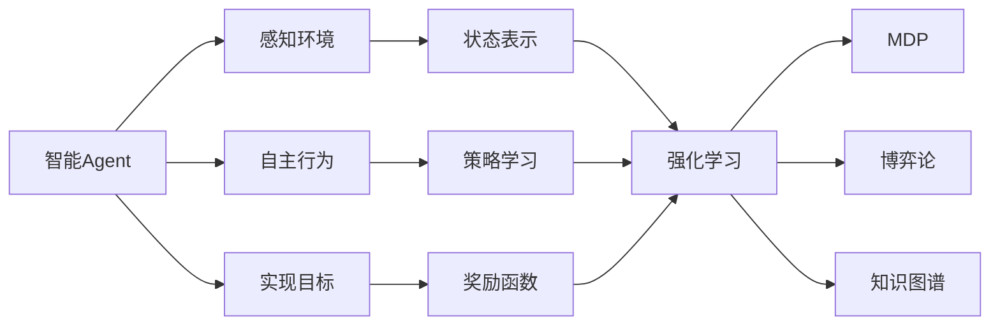

# AI人工智能 Agent：零售业中智能体的应用

作者：禅与计算机程序设计艺术 / Zen and the Art of Computer Programming 

关键词：人工智能、智能Agent、零售业、应用场景、算法原理、数学模型、代码实现

## 1. 背景介绍
### 1.1 问题的由来
在当今快速发展的零售业中，企业面临着日益激烈的市场竞争和不断变化的消费者需求。为了在竞争中保持优势，零售企业需要利用先进的技术手段来优化运营效率，提升客户体验。人工智能(Artificial Intelligence, AI)技术的兴起为零售业带来了新的机遇，其中智能Agent作为AI的重要分支，在零售场景中展现出广阔的应用前景。
### 1.2 研究现状
近年来，学术界和工业界都在积极探索将AI技术应用于零售领域的可能性。一些研究者提出了基于强化学习的智能Agent模型，用于解决零售业中的动态定价[1]、库存管理[2]等问题。此外，一些零售巨头如亚马逊、沃尔玛等也开始尝试将智能Agent技术应用于其业务系统中，如亚马逊的智能助理Alexa[3]。尽管取得了一定进展，但如何在复杂多变的零售场景中设计和实现高效的智能Agent仍面临诸多挑战。
### 1.3 研究意义 
智能Agent技术在零售业中的应用研究具有重要意义：
1. 提升运营效率：通过智能Agent优化业务流程，零售企业可以降低人力成本，提高自动化水平和决策效率。
2. 增强客户体验：利用智能Agent为客户提供个性化服务和交互，提升客户满意度和忠诚度。
3. 把握市场趋势：智能Agent可实时分析海量数据，洞察市场动向，为企业的营销策略提供决策支持。
4. 推动技术创新：将AI前沿技术引入零售领域，促进零售业数字化、智能化转型升级。
### 1.4 本文结构
本文将围绕AI智能Agent在零售业中的应用展开深入探讨。第2部分介绍相关的核心概念；第3部分阐述智能Agent的核心算法原理；第4部分建立数学模型并给出详细推导；第5部分通过代码实例演示具体实现；第6部分分析智能Agent在零售场景中的应用；第7部分推荐相关工具和资源；第8部分总结全文并展望未来；第9部分列举常见问题解答。

## 2. 核心概念与联系
在零售业中应用智能Agent，需要理解以下几个核心概念：
- 智能Agent：能够感知环境并做出自主行为以实现特定目标的计算机程序[4]。它具有自主性、社会性、反应性、主动性等特点。
- 强化学习(Reinforcement Learning)：一种机器学习范式，智能Agent通过与环境的交互来学习最优策略，以最大化长期累积奖励[5]。马尔可夫决策过程(MDP)是强化学习的理论基础。
- 博弈论(Game Theory)：研究理性个体在相互作用下的策略选择，在多Agent系统中有重要应用[6]。
- 知识图谱(Knowledge Graph)：以图的形式表示实体及其关系的语义网络，可增强Agent的知识理解和推理能力[7]。

下图展示了这些概念之间的联系：



智能Agent通过感知环境状态，根据当前策略做出行为决策，并获得环境反馈的奖励。Agent利用强化学习算法不断优化策略，以实现特定目标。在多Agent场景下还需考虑博弈论的策略选择。知识图谱可为Agent提供丰富的领域知识。理解这些概念的内在联系，有助于设计高效的零售智能Agent系统。

## 3. 核心算法原理 & 具体操作步骤
### 3.1 算法原理概述
智能Agent的核心算法主要基于强化学习范式。Q-learning作为一种经典的无模型强化学习算法，可用于求解MDP问题[8]。它通过值函数逼近的方式，评估在某状态下采取特定行为的长期效用，并据此选择最优策略。深度强化学习将深度神经网络引入Q-learning，以处理大规模复杂的状态空间[9]。
### 3.2 算法步骤详解
Q-learning的具体步骤如下：
1. 初始化Q值表$Q(s,a)$
2. 重复循环直到收敛：
   - 根据$\epsilon-greedy$策略选择动作$a_t$
   - 执行动作$a_t$，观察奖励$r_{t+1}$和新状态$s_{t+1}$ 
   - 更新Q值：
    $$Q(s_t,a_t) \leftarrow Q(s_t,a_t)+\alpha[r_{t+1}+\gamma \max_{a}Q(s_{t+1},a)-Q(s_t,a_t)]$$
   - $s_t \leftarrow s_{t+1}$
3. 输出最优策略$\pi^*(s)=\arg\max_{a}Q(s,a)$

其中，$\alpha \in (0,1]$为学习率，$\gamma \in [0,1]$为折扣因子。$\epsilon-greedy$策略在探索和利用之间权衡，以$\epsilon$的概率随机选择动作，否则选择当前Q值最大的动作。

深度Q网络(DQN)用神经网络$Q(s,a;\theta)$来逼近Q值函数，其损失函数为：

$$L(\theta)=\mathbb{E}_{(s,a,r,s')\sim D}[(r+\gamma \max_{a'}Q(s',a';\theta^{-})-Q(s,a;\theta))^2]$$

$\theta^{-}$为目标网络参数，$D$为经验回放缓冲区。DQN的训练过程通过最小化损失函数来更新$\theta$，并定期将其复制给$\theta^{-}$。
### 3.3 算法优缺点
Q-learning的优点在于简单易实现，适用于小规模离散状态空间。但其存在收敛速度慢、难以处理连续状态等局限性。DQN利用深度学习的强大表示能力，在一定程度上克服了这些问题，但也引入了算法不稳定、样本效率低等新的挑战。
### 3.4 算法应用领域
强化学习智能体已在游戏、机器人、自动驾驶、推荐系统等领域取得了广泛应用[10]。在零售场景中，可利用强化学习来优化定价、库存管理、促销策略、客户互动等决策问题。

## 4. 数学模型和公式 & 详细讲解 & 举例说明
### 4.1 数学模型构建
MDP为序贯决策问题提供了规范的数学模型。一个MDP由四元组$\langle S,A,P,R \rangle$定义：
- 状态空间$S$：Agent所处环境的有限状态集合。
- 行为空间$A$：Agent在每个状态下可执行的有限行为集合。
- 状态转移概率$P$：$P(s'|s,a)$表示在状态$s$下执行行为$a$后转移到状态$s'$的概率。
- 奖励函数$R$：$R(s,a)$表示在状态$s$下执行行为$a$获得的即时奖励值。

Agent的目标是寻找一个最优策略$\pi^*:S \rightarrow A$，使得长期累积奖励最大化：

$$\pi^*=\arg\max_{\pi}\mathbb{E}[\sum_{t=0}^{\infty}\gamma^t R(s_t,\pi(s_t))]$$

### 4.2 公式推导过程
Q-learning的核心是值函数逼近。定义状态-行为值函数$Q^{\pi}(s,a)$为在策略$\pi$下，从状态$s$开始执行行为$a$能获得的长期累积奖励的期望：

$$Q^{\pi}(s,a)=\mathbb{E}_{\pi}[\sum_{k=0}^{\infty}\gamma^k R(s_{t+k},a_{t+k})|s_t=s,a_t=a]$$

最优值函数$Q^*(s,a)$满足Bellman最优方程：

$$Q^*(s,a)=R(s,a)+\gamma \sum_{s'\in S}P(s'|s,a)\max_{a'}Q^*(s',a')$$

Q-learning通过贪婪策略迭代来逼近$Q^*$：

$$Q(s_t,a_t) \leftarrow Q(s_t,a_t)+\alpha[r_{t+1}+\gamma \max_{a}Q(s_{t+1},a)-Q(s_t,a_t)]$$

可证明，在适当条件下，Q-learning能收敛到最优值函数$Q^*$[11]。
### 4.3 案例分析与讲解
考虑一个简化的零售定价问题。假设某商品有两种定价策略：高价($a_1$)和低价($a_2$)，环境有三种状态：需求高($s_1$)、需求中($s_2$)、需求低($s_3$)。状态转移概率和奖励函数如下表所示：

| $(s,a)$    | $P(s_1|s,a)$ | $P(s_2|s,a)$ | $P(s_3|s,a)$ | $R(s,a)$ |
|------------|--------------|--------------|--------------|----------|
| $(s_1,a_1)$| 0.6          | 0.3          | 0.1          | 10       |
| $(s_1,a_2)$| 0.2          | 0.7          | 0.1          | 8        |
| $(s_2,a_1)$| 0.3          | 0.4          | 0.3          | 6        |
| $(s_2,a_2)$| 0.1          | 0.6          | 0.3          | 5        |
| $(s_3,a_1)$| 0.1          | 0.2          | 0.7          | 2        |
| $(s_3,a_2)$| 0.05         | 0.15         | 0.8          | 1        |

设置折扣因子$\gamma=0.9$，学习率$\alpha=0.1$，初始Q值为0。应用Q-learning算法迭代10000次，得到近似最优Q值和策略：

$$Q_{10000}=\begin{bmatrix}
 84.45 & 82.21\\
 70.12 & 66.88\\
 39.58 & 35.08
\end{bmatrix}, \quad 
\pi_{10000}^*=\begin{bmatrix}
a_1\\
a_1\\
a_1
\end{bmatrix}$$

结果表明，在需求高和中等时选择高价策略$a_1$，在需求低时也选择$a_1$。这是因为高价虽然销量低，但利润更高，从长期来看更优。这个简单例子展示了如何用强化学习求解零售定价策略优化问题。
### 4.4 常见问题解答
- Q：Q-learning能否处理连续状态空间？
- A：传统Q-learning通过查表的方式存储和更新Q值，难以应用于连续状态。一种解决方案是使用函数逼近器如神经网络来拟合Q函数，即DQN算法。
- Q：Q-learning收敛的理论保证是什么？
- A：在适当的探索策略和学习率调度下，Q-learning能以概率1收敛到最优值函数。但实践中受有限样本、函数逼近误差等影响，往往难以达到理论结果。
- Q：Q-learning能否应用于部分可观测MDP？
- A：部分可观测MDP中，Agent无法直接感知完整的环境状态。针对这类问题，可使用基于RNN的DQN变体，将状态估计与策略优化集成到端到端的学习框架中。

## 5. 项目实践：代码实例和详细解释说明
### 5.1 开发环境搭建
本项目使用Python3和PyTorch实现DQN算法。首先安装依赖库：

```
pip install torch numpy matplotlib
```

### 5.2 源代码详细实现
下面给出DQN核心代码，包括Q网络、经验回放、$\epsilon-greedy$探索等组件：

```python
import torch
import torch.nn as nn
import torch.optim as optim
import numpy as np
import random

class QNet(nn.Module):
    def __init__(self, state_dim, action_dim, hidden_dim=128