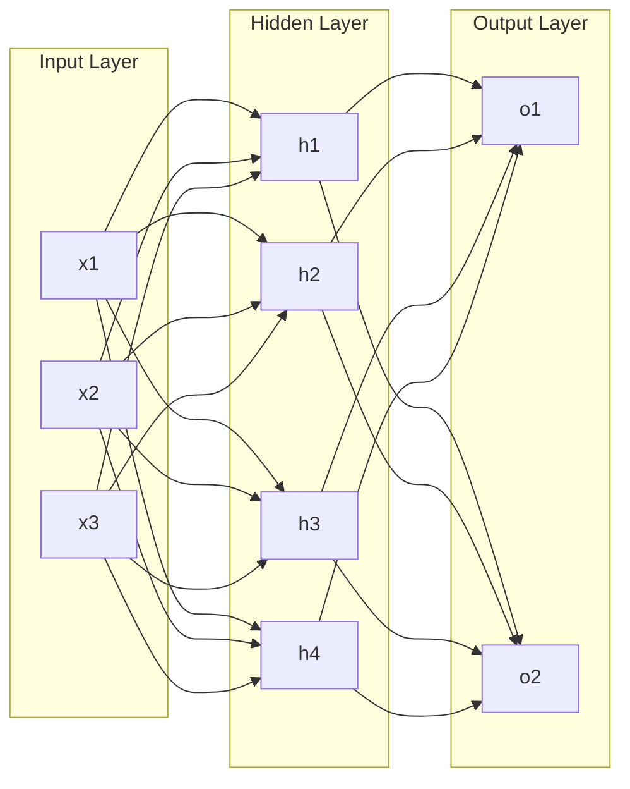

# AI人工智能核心算法原理与代码实例讲解：算法实现

作者：禅与计算机程序设计艺术 / Zen and the Art of Computer Programming

关键词：人工智能, 机器学习, 深度学习, 神经网络, 卷积神经网络, 循环神经网络, 强化学习, 迁移学习, TensorFlow, PyTorch

## 1. 背景介绍

### 1.1 问题的由来

人工智能(Artificial Intelligence, AI)是计算机科学领域最具挑战性和前景的分支之一。它致力于创造能够模仿人类智能行为的机器，如学习、推理、解决问题等。近年来，随着计算能力的提升和大数据时代的到来，AI技术取得了突飞猛进的发展，在图像识别、自然语言处理、自动驾驶等领域展现出了巨大的应用前景。

### 1.2 研究现状

当前，机器学习尤其是深度学习已经成为AI领域的研究热点。各种新的神经网络模型和学习算法不断涌现，如卷积神经网络(CNN)、循环神经网络(RNN)、生成对抗网络(GAN)、强化学习(RL)、迁移学习等。这些技术极大地提升了AI系统的性能，使得计算机在某些特定任务上的表现已经可以媲美甚至超越人类专家。

### 1.3 研究意义

尽管AI技术取得了长足进步，但对于普通开发者来说，AI算法的原理和实现细节仍然是一个黑箱。很多人只是调用现成的AI框架和模型，而缺乏对其内部机制的深入理解。因此，有必要对AI的核心算法进行系统性梳理和讲解，提供详尽的数学推导和代码实例，帮助读者真正掌握AI技术的精髓。

### 1.4 本文结构

本文将重点介绍几种最主流的AI算法，包括前馈神经网络(FNN)、卷积神经网络(CNN)、循环神经网络(RNN)和强化学习(RL)。对于每种算法，我们将从数学原理入手，详细推导其关键公式，并给出完整的Python代码实现。同时，我们还将讨论这些算法的优缺点、适用场景以及在实际项目中的最佳实践。

## 2. 核心概念与联系

在正式讨论AI算法之前，我们需要先了解几个核心概念：
- 人工神经元：模仿生物神经元，接收一组输入信号，通过非线性变换产生输出。通常使用Sigmoid、tanh、ReLU等激活函数。
- 神经网络：由大量人工神经元按一定拓扑结构连接而成。每条连接都有一个权重，神经元的输出又作为下一层的输入。通过调整权重，网络可以学习拟合任意复杂的函数。
- 损失函数：衡量网络预测值与真实值之间的差异。常见的有均方误差、交叉熵等。网络训练的目标就是最小化损失函数。
- 梯度下降：通过计算损失函数对权重的梯度，不断沿梯度反方向更新权重，最终收敛到损失最小点。分为批量梯度下降(BGD)、随机梯度下降(SGD)和小批量梯度下降(MBGD)。
- 反向传播：一种高效计算梯度的算法。先前向计算出损失，再逐层反向传播梯度。利用链式法则递归计算，避免了逐个权重求偏导的巨大开销。

下图展示了一个简单的三层全连接神经网络结构：

输入层接收外界信号，隐藏层对信号进行非线性变换，输出层给出最终预测。每两层之间都是全连接的。

## 3. 核心算法原理 & 具体操作步骤

### 3.1 算法原理概述

接下来，我们对几种主要的神经网络模型逐一进行讲解。

#### 3.1.1 前馈神经网络(FNN)

FNN是最基础的神经网络，信息沿一个方向层层传递。上面展示的三层全连接网络就是一个典型的FNN。尽管结构简单，FNN理论上可以拟合任意连续函数，是许多复杂模型的基础。

#### 3.1.2 卷积神经网络(CNN)

CNN在图像识别等领域取得了惊人的成功。它的核心是卷积层和池化层：
- 卷积层使用一组可学习的过滤器在输入图像上滑动，以提取局部特征。
- 池化层对卷积结果进行降采样，既减少了参数数量，又提供了一定的平移不变性。

CNN的这种层次结构使其能够自动学习到图像的多尺度特征表示，避免了手工设计特征的繁琐。

#### 3.1.3 循环神经网络(RNN)

RNN引入了时间维度，适合处理序列数据。它在每个时间步都有一个隐藏状态，既接收当前时刻的输入，又接收上一时刻的隐藏状态，从而具备了记忆能力。理论上，RNN可以处理任意长度的序列，但实际上常出现梯度消失问题。LSTM和GRU是两种改进的RNN变体，通过门控机制缓解了这一问题。

#### 3.1.4 强化学习(RL)

与监督学习不同，RL并不直接给出标签，而是让智能体在环境中不断尝试，根据反馈的奖励调整策略，最终学会执行特定任务。RL的核心要素包括：
- 状态：智能体所处的环境状态
- 动作：智能体可以采取的行为
- 奖励：环境对智能体动作的即时反馈
- 策略：将状态映射为动作的函数，可以是确定性策略或随机性策略
- 值函数：衡量每个状态或状态-动作对的长期累积奖励

RL算法大致可分为值函数方法(如Q学习)、策略梯度方法(如REINFORCE)和演员-评论家方法(如DDPG)。

### 3.2 算法步骤详解

下面，我们对每种算法的训练步骤进行详细讲解。

#### 3.2.1 FNN & CNN训练流程

1. 定义网络结构，即各层的类型、大小、激活函数、连接方式等。
2. 初始化模型参数，一般使用较小的随机值。
3. 读取一批训练数据，前向传播计算出预测值。
4. 将预测值与真实标签比较，通过损失函数计算出误差。
5. 反向传播计算损失函数对每个参数的梯度。
6. 用梯度下降等优化算法更新参数，以最小化损失函数。
7. 重复步骤3-6，直到损失收敛或达到预设的迭代次数。
8. 在测试集上评估模型性能，进行超参数调优。

#### 3.2.2 RNN训练流程

RNN的训练与FNN类似，但有几点不同：
1. 时间步展开。将RNN在时间维度展开，变成一个超长的FNN。
2. 共享参数。所有时间步的RNN单元共享参数，不像FNN各层独立。
3. 序列数据。每个样本是一个时间序列，需要按时间步依次输入RNN。
4. 梯度裁剪。在反向传播时，需要裁剪梯度防止其过大导致训练不稳定。

此外，还需注意RNN的状态初始化问题。可以将初始状态学习成模型参数，也可以直接置零。

#### 3.2.3 RL训练流程

RL没有显式的训练集，而是通过不断与环境交互来更新策略或值函数。以Q学习为例：
1. 初始化Q值表格Q(s,a)，用随机值填充。
2. 智能体处于某一状态s，根据ε-贪婪策略选择动作a。
3. 执行动作a，环境反馈奖励r，同时智能体进入新状态s'。
4. 根据Q学习公式更新Q(s,a)：
$$Q(s,a) \leftarrow Q(s,a) + \alpha [r + \gamma \max_{a'} Q(s',a') - Q(s,a)]$$
其中，α是学习率，γ是折扣因子。
5. 重复步骤2-4，直到Q值收敛或达到预设的交互次数。

实际应用中，Q值表可以用神经网络拟合，即DQN算法。这需要引入经验回放等技巧，以解决数据相关性和非平稳分布问题。

### 3.3 算法优缺点

- FNN：结构简单，易于实现和训练。但缺乏对空间、时间结构的建模能力。
- CNN：善于提取局部特征，具有平移不变性。但需要大量标注数据，且不适合非网格式数据。
- RNN：能够处理时序信息，具有记忆力。但训练不稳定，难以捕捉长期依赖。
- RL：不需要标注数据，通过自主学习掌握策略。但样本效率低，难以应对高维状态和连续动作。

### 3.4 算法应用领域

- FNN：数值预测、数据分类等
- CNN：图像识别、语义分割、目标检测等
- RNN：机器翻译、语音识别、情感分析等 
- RL：智能游戏、机器人控制、自动驾驶等

## 4. 数学模型和公式 & 详细讲解 & 举例说明

本节我们将详细推导几种神经网络的关键公式，并给出具体的数值例子加以说明。

### 4.1 数学模型构建

#### 4.1.1 FNN前向传播

考虑一个L层的FNN。记第l层第i个神经元的输出为$a_i^{(l)}$，它和上一层的关系为：

$$
a_i^{(l)} = \sigma(\sum_j w_{ij}^{(l)} a_j^{(l-1)} + b_i^{(l)})
$$

其中，$w_{ij}^{(l)}$是第l-1层第j个神经元到第l层第i个神经元的连接权重，$b_i^{(l)}$是第l层第i个神经元的偏置项，$\sigma$是激活函数，如Sigmoid：

$$
\sigma(x) = \frac{1}{1+e^{-x}}
$$

设输入层为第0层，令$a_i^{(0)} = x_i$，则FNN的前向传播过程可以表示为：

$$
\begin{aligned}
a_i^{(1)} &= \sigma(\sum_j w_{ij}^{(1)} x_j + b_i^{(1)}) \\
a_i^{(2)} &= \sigma(\sum_j w_{ij}^{(2)} a_j^{(1)} + b_i^{(2)}) \\
&... \\
\hat{y}_i = a_i^{(L)} &= \sigma(\sum_j w_{ij}^{(L)} a_j^{(L-1)} + b_i^{(L)}) \\
\end{aligned}
$$

这里$\hat{y}_i$是FNN对第i个输出的预测值。

#### 4.1.2 FNN反向传播

定义损失函数为预测值与真实值的均方误差：

$$
J(W,b) = \frac{1}{2} \sum_i (\hat{y}_i - y_i)^2
$$

反向传播的目标是计算损失函数对每个权重的梯度$\frac{\partial J}{\partial w_{ij}^{(l)}}$和$\frac{\partial J}{\partial b_{i}^{(l)}}$。利用链式法则，可以得到：

$$
\begin{aligned}
\frac{\partial J}{\partial w_{ij}^{(l)}} &= \frac{\partial J}{\partial a_i^{(l)}} \frac{\partial a_i^{(l)}}{\partial z_i^{(l)}} \frac{\partial z_i^{(l)}}{\