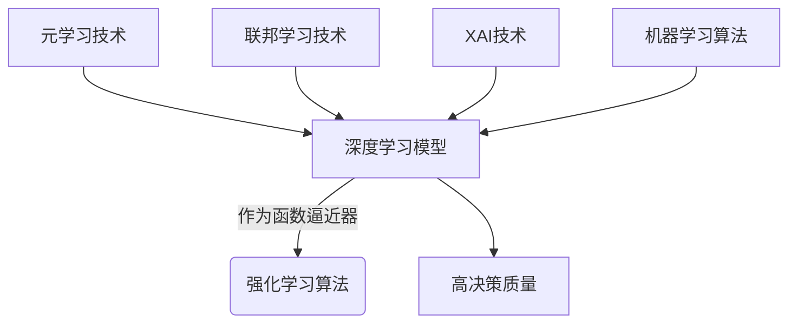

# AI人工智能深度学习算法：利用机器学习提升深度学习模型的决策质量

## 1. 背景介绍

### 1.1 问题的由来

在当今数据爆炸的时代,机器学习和深度学习技术已经广泛应用于各个领域,包括计算机视觉、自然语言处理、推荐系统等。然而,传统的深度学习模型往往存在一些固有缺陷,例如:

1. **黑盒操作**:深度神经网络的内部机理往往是一个黑盒,很难解释其决策过程,这在一些对可解释性要求较高的领域(如医疗、金融等)可能会造成隐患。

2. **数据质量依赖**:深度学习模型的性能很大程度上依赖于训练数据的质量和数量。如果训练数据存在噪声、偏差或不平衡等问题,模型的泛化能力可能会受到影响。

3. **可解释性差**:深度学习模型通常难以解释其决策的原因,这可能会导致用户对模型的决策缺乏信任。

为了解决这些问题,研究人员提出了将机器学习技术与深度学习相结合的思路,旨在提高深度学习模型的可解释性、鲁棒性和决策质量。

### 1.2 研究现状

目前,已有多项研究探索了将机器学习技术与深度学习相结合的方法,主要包括:

1. **注意力机制(Attention Mechanism)**:通过引入注意力机制,模型可以自动学习输入数据中哪些部分对预测目标更加重要,从而提高模型的可解释性。

2. **可解释的人工智能(Explainable AI, XAI)**:XAI技术旨在提高人工智能系统的可解释性,例如LIME、SHAP等方法可以解释深度学习模型的决策过程。

3. **元学习(Meta-Learning)**:元学习技术可以帮助模型从少量数据中快速学习,提高模型在小样本场景下的泛化能力。

4. **联邦学习(Federated Learning)**:联邦学习技术可以在保护数据隐私的前提下,利用分散的数据源训练深度学习模型,提高模型的鲁棒性。

5. **强化学习(Reinforcement Learning)**:将强化学习与深度学习相结合,可以使模型在与环境交互的过程中不断学习和优化决策,提高决策质量。

### 1.3 研究意义

将机器学习技术与深度学习相结合,可以有效提高深度学习模型的可解释性、鲁棒性和决策质量,具有重要的理论意义和应用价值:

1. **理论意义**:深入探索机器学习与深度学习的融合,有助于推动人工智能理论的发展,揭示更多认知智能的奥秘。

2. **应用价值**:提高深度学习模型的决策质量,可以促进其在医疗诊断、金融风险管理、自动驾驶等领域的应用,为人类社会创造巨大价值。

3. **伦理意义**:增强人工智能系统的可解释性和可信度,有助于构建更加透明、公平和可控的人工智能系统,促进人工智能的健康发展。

### 1.4 本文结构

本文将从以下几个方面阐述如何利用机器学习技术提升深度学习模型的决策质量:

1. 介绍相关的核心概念和技术原理。

2. 详细解析核心算法的原理和具体操作步骤。 

3. 构建数学模型,推导公式,并通过案例分析进行讲解。

4. 提供代码实例,并对实现细节进行解读和分析。

5. 探讨实际应用场景,并展望未来发展趋势和挑战。

6. 推荐相关的工具、资源和学习材料。

## 2. 核心概念与联系

在探讨如何利用机器学习技术提升深度学习模型的决策质量之前,我们需要先了解一些核心概念及它们之间的联系。

### 2.1 深度学习(Deep Learning)

深度学习是机器学习的一个子领域,它基于具有多层非线性变换的人工神经网络,通过对大量数据进行训练,自动学习数据的特征表示和模式,并用于执行各种任务,如图像识别、语音识别、自然语言处理等。

深度学习模型通常由多个层次组成,每一层对输入数据进行非线性变换,并将变换后的结果传递给下一层。通过这种层层传递和变换,模型可以自动学习数据的高级特征表示,并基于这些特征进行决策或预测。

常见的深度学习模型包括卷积神经网络(CNN)、循环神经网络(RNN)、长短期记忆网络(LSTM)、transformer等。这些模型在计算机视觉、自然语言处理、语音识别等领域取得了卓越的成绩。

### 2.2 机器学习(Machine Learning)

机器学习是人工智能的一个重要分支,它赋予计算机在没有明确程序的情况下,通过利用数据或经验自动分析并"学习",从而获取新的知识或技能,并用于执行特定任务的能力。

机器学习算法可以分为三大类:

1. **监督学习(Supervised Learning)**:利用带有标签的训练数据,学习映射关系,用于执行分类或回归任务。

2. **无监督学习(Unsupervised Learning)**:仅利用未标记的训练数据,自动发现数据的内在模式和结构。

3. **强化学习(Reinforcement Learning)**:通过与环境交互并获得反馈,不断优化决策策略,以获得最大化的长期回报。

常见的机器学习算法包括决策树、支持向量机(SVM)、朴素贝叶斯、K-近邻(KNN)、逻辑回归等。这些算法在推荐系统、异常检测、金融风险管理等领域有广泛应用。

### 2.3 可解释的人工智能(Explainable AI, XAI)

可解释的人工智能(XAI)旨在提高人工智能系统的透明度和可解释性,使其决策过程对人类更加可解释和可理解。XAI技术可以应用于深度学习模型,帮助解释模型的内部机理和决策原因。

常见的XAI技术包括:

1. **LIME(Local Interpretable Model-Agnostic Explanations)**:通过训练一个局部可解释的代理模型,来解释黑盒模型在特定实例上的决策。

2. **SHAP(SHapley Additive exPlanations)**:基于协作游戏理论中的夏普利值,计算每个特征对模型预测结果的贡献,从而解释模型的决策。

3. **注意力机制(Attention Mechanism)**:通过引入注意力机制,模型可以自动学习输入数据中哪些部分对预测目标更加重要,提高模型的可解释性。

4. **概念激活向量(Concept Activation Vectors, CAVs)**:通过将人类可理解的概念嵌入到神经网络中,从而解释模型的决策过程。

通过应用XAI技术,我们可以更好地理解深度学习模型的内部工作机制,提高模型的可信度和可解释性,从而提升其决策质量。

### 2.4 元学习(Meta-Learning)

元学习是一种机器学习范式,旨在使模型能够从少量数据或任务中快速学习,并将所学习的知识泛化到新的任务或环境中。它模仿人类学习和推理的元认知过程,通过学习如何学习,提高模型的泛化能力和适应性。

常见的元学习方法包括:

1. **优化器学习(Optimizer Learning)**:学习一个优化器,使其能够快速找到新任务的最优解。

2. **度量学习(Metric Learning)**:学习一个合适的相似性度量,用于衡量新任务中的数据之间的关系。

3. **记忆增强学习(Memory-Augmented Learning)**:通过增加外部记忆模块,帮助模型记住和整合之前学习到的知识。

4. **快速权重调整(Rapid Weight Adjustment)**:在新任务上快速调整模型权重,使其能够快速适应新任务。

5. **多任务学习(Multi-Task Learning)**:同时学习多个相关任务,提高模型对新任务的泛化能力。

通过元学习技术,我们可以提高深度学习模型在小样本场景下的泛化能力,从而提升其决策质量。

### 2.5 联邦学习(Federated Learning)

联邦学习是一种分布式机器学习范式,它允许在保护数据隐私的前提下,利用分散在不同设备或组织中的数据,共同训练一个统一的模型。这种方法避免了将敏感数据集中在一个中心服务器上,从而降低了数据泄露的风险。

在联邦学习中,每个参与方(如智能手机、医院等)都在本地训练一个模型,然后将模型的更新(如梯度或模型参数)上传到一个中央服务器。服务器聚合所有参与方的更新,并将聚合后的模型更新分发回每个参与方,用于下一轮的本地训练。这个过程反复进行,直到模型收敛。

联邦学习技术可以应用于深度学习模型的训练,提高模型的隐私保护能力和鲁棒性,从而提升其决策质量。它在医疗健康、金融、物联网等领域有广泛的应用前景。

### 2.6 强化学习(Reinforcement Learning)

强化学习是机器学习的一个重要分支,它通过与环境交互并获得反馈(奖励或惩罚),不断优化决策策略,以获得最大化的长期回报。强化学习算法可以应用于决策过程,帮助深度学习模型做出更好的决策。

在强化学习中,智能体(Agent)与环境(Environment)进行交互。智能体根据当前状态选择一个行动,环境根据这个行动转移到新的状态,并给出相应的奖励或惩罚。智能体的目标是学习一个最优策略,使得在长期内获得的累积奖励最大化。

常见的强化学习算法包括Q-Learning、Deep Q-Network(DQN)、策略梯度(Policy Gradient)、Actor-Critic等。这些算法可以与深度学习模型相结合,提高模型在复杂决策过程中的表现。

通过将强化学习与深度学习相结合,我们可以使模型在与环境交互的过程中不断学习和优化决策,从而提高其决策质量。

### 2.7 核心概念之间的联系

上述核心概念之间存在着紧密的联系,它们可以相互结合,共同提升深度学习模型的决策质量:

1. 深度学习模型可以作为强化学习算法的函数逼近器,用于估计状态-行动值函数或策略函数。

2. 元学习技术可以应用于深度学习模型,提高其在小样本场景下的泛化能力。

3. 联邦学习技术可以用于训练隐私保护的深度学习模型,提高模型的鲁棒性。

4. XAI技术可以解释深度学习模型的决策过程,提高模型的可解释性和可信度。

5. 机器学习算法可以与深度学习模型相结合,提高模型的决策质量。例如,支持向量机可以用于特征选择,决策树可以用于解释模型的决策过程。

通过有机结合这些技术,我们可以构建出具有高可解释性、高鲁棒性和高决策质量的人工智能系统,为各个领域的应用带来巨大价值。

## 3. 核心算法原理 & 具体操作步骤

在利用机器学习技术提升深度学习模型的决策质量时,我们需要关注一些核心算法的原理和具体操作步骤。本节将重点介绍两种广泛应用的算法:注意力机制(Attention Mechanism)和SHAP(SHapley Additive exPlanations)。

### 3.1 算法原理概述

#### 3.1.1 注意力机制(Attention Mechanism)

注意力机制是一种广泛应用于深度学习模型的技术,它允许模型自动学习输入数据中